[TOC]

# 一、Acrobat Pro DC 安装与激活

## 1.下载软件

需要下载如下图所示三个软件：

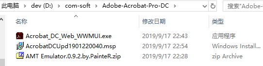

（1）去官网下载 Acrobat Pro DC 

> https://helpx.adobe.com/cn/acrobat/kb/acrobat-dc-downloads.html

（2）下载 Adobe Acrobat 升级包

> ftp://ftp.adobe.com/pub/adobe/acrobat/win/AcrobatDC/1901220040/AcrobatDCUpd1901220040.msp

（3）下载 Adobe 通用授权破解补丁 AMT Emulator

> [Adobe全系列破解工具 AMT Emulator v0.9.2](https://www.nocmd.com/889.html)

## 2.安装 Acrobat Pro DC 官方程序

运行 `Acrobat_DC_Web_WWMUI.exe`，来安装 Acrobat Pro DC 

### 2.1 文件夹位置

这一步是将下载的文件解压到此目录中，并不是真正的安装，只是解压

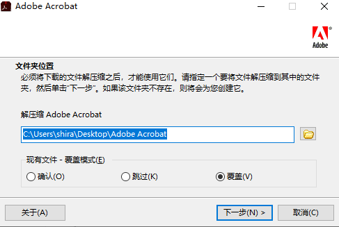

可更改其路径，然后选择覆盖模式，点击下一步，即可开始解压缩

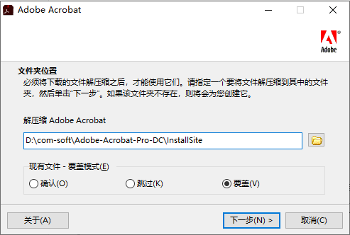

### 2.2 文件已就绪

文件解压缩完成后，出现下图，不要勾选`启动 Adobe Acrobat`，然后点击完成即可。

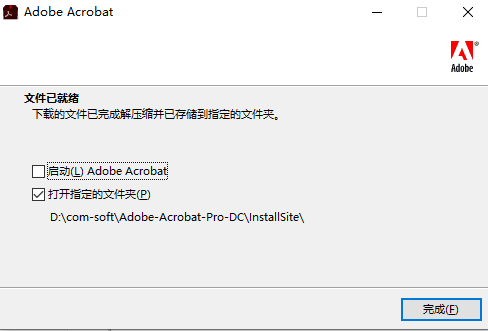

### 2.3 安装

在`InstallSite\Adobe Acrobat`目录下找到安装程序`Setup.exe`

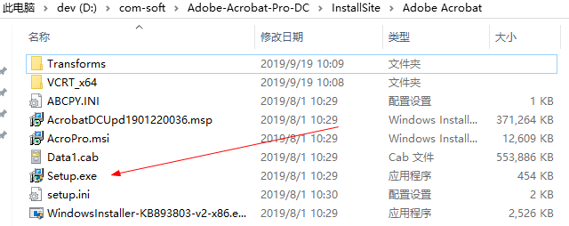

运行`Setup.exe`，即可开始安装，这里可以自定义安装目录，与前面`文件夹位置`保持一致即可

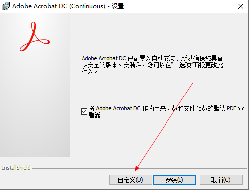

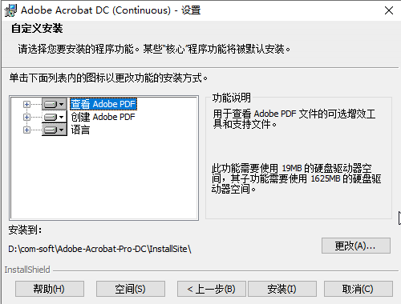

然后安装，等待安装完成

## 3.更新 Acrobat Pro DC 版本

运行 `AcrobatDCUpd1901220040.msp` 来进行 Acrobat Pro DC 的更新检查

若前面安装的 `Acrobat Pro DC` 不是从官网下载的最新版本，而是之前的老版本，则可以通过这里的更新程序来进行更新。

若是最新的，则忽略此步骤。

## 4.激活

（1）将`amtemu.v0.9.2.win-painter.rar`解压，然后将`AMT Emulate 0.9.2.exe`复制到 Acrobat 安装目录（即InstallSite目录）

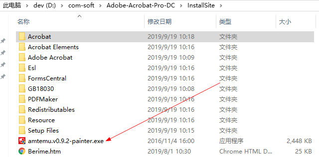

（2）运行`AMT Emulate 0.9.2.exe`软件，点击 `Advanced`

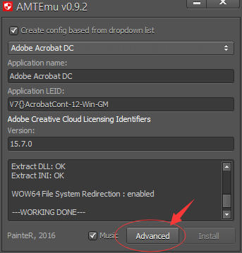

然后选择 `Force lang for apps `

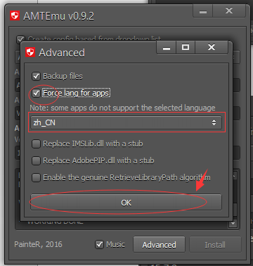

（3）点击`Install`进行安装，会弹出文件选择窗口，在`InstallSite\Acrobat`目录下可找到【amtlib.dll】文件，然后点击【打开】

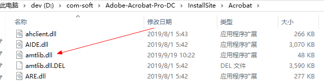

（4）然后会在注册机AMTEmu v0.9.2 输出日志中看到 WORKING DONE，说明已经激活完成

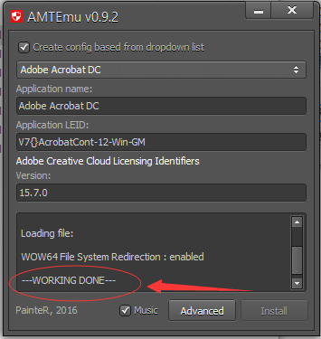

# 参考资料

1. [Adobe Acrobat Pro DC 2019 英/中文破解流程](https://blog.51cto.com/felixgzf/2311242)
2. [Adobe Acrobat Pro DC v2019.012.20040 中文版+破解补丁](https://www.nocmd.com/1697.html)
3. [Adobe Acrobat Pro 破解教程详解](https://blog.csdn.net/xiaomengzi_16/article/details/90174126)
4. [**Adobe Acrobat Pro 2017破解教程**](https://blog.csdn.net/xintingandzhouyang/article/details/82558235)
5. 

