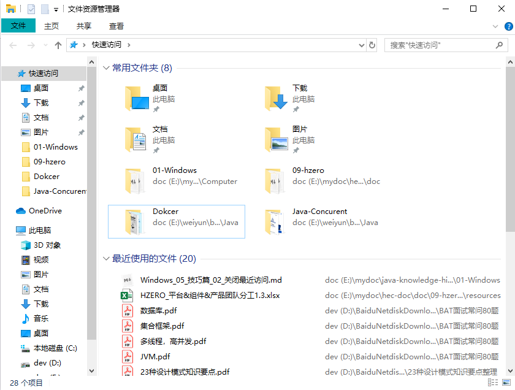
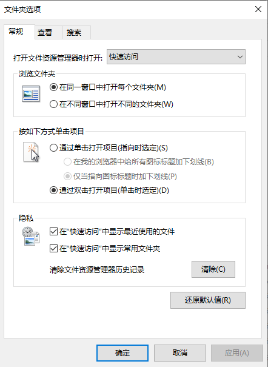
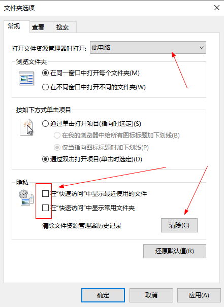

[TOC]

# 一、win10关闭常用文件夹和最近使用的文件

如下图，打开资源管理器时，会出现`常用文件夹`和`最近使用的文件`

想将这两个文件夹关闭，操作如下：

（1）打开资源管理器 -> 查看 -> 选项 -> 文件夹选项 -> 常规

（2）将 `打开文件资源管理器时打开` 设置为 `此电脑`，然后在隐私中去掉下图的两个选项的勾选，接着点击 `清除文件资源管理器历史记录`的`清除`按钮

