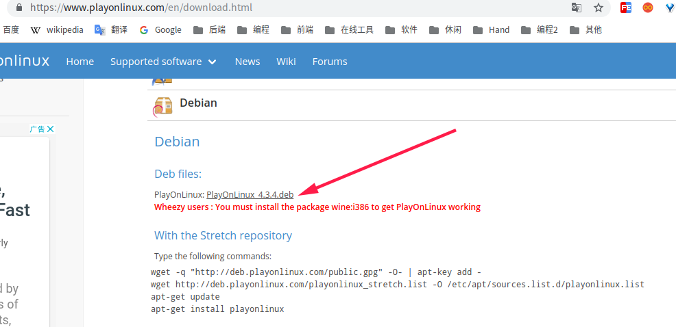

[TOC]


# 前言

我的Deepin版本为15.11，待安装软件

> - typora
> - 微信
> - mpv
> - 百度网盘
> - 福昕阅读器(官网下载)


# 一、Deepin下常用软件的常规安装

常规安装：

> - 有Linux版，则直接安装
> - 没有Linux版，则通过深度应用商店安装

## 1.Typora

> 参考： 
>
> - [Typora官方文档]
> - [最好用的 Markdown 编辑器 Typora【Window 、Linux 下的安装教程】](https://www.jianshu.com/p/52255115ad63)


（1）添加key

```
wget -qO - https://typora.io/linux/public-key.asc | sudo apt-key add -
```


（2）添加Typora的软件源

```
sudo add-apt-repository 'deb https://typora.io/linux ./'
```

如果会报 add-apt-repository 命令找不到,执行如下命令来安装命令

```
sudo apt-get install python-software-properties
sudo apt-get install software-properties-common
```

然后再添加软件源，发现报如下错误

```
aptsources.distro.NoDistroTemplateException: Error: could not find a distribution template for Deepin/stable
```

那么就只能通过如下编写配置文件的方式添加软件源了：

```
# 创建 typora 软件源文件
sudo vim /etc/apt/sources.list.d/typora.list
# 文件内键入以下内容，保存退出即可
deb https://typora.io/linux ./
```


(3)添加完软件源之后，就可以更新缓存再去安装 typora

```
sudo apt-get update
sudo apt install typora
```


## 2.微信

> 参考：
>
> - [已搜索，就我碰到微信版本过低不让登录的情况吗？](https://bbs.deepin.org/forum.php?mod=viewthread&tid=181711&extra=page%3D1%26filter%3Dlastpost%26orderby%3Dlastpost)


一开始会提示微信版本过低不让登录，不过更新系统后，再更新微信就没这个问题了。

若还是有这个问题，可以使用如下命令更新下微信版本

```bash
mkdir /tmp/wechat
cd /tmp/wechat
wget https://dldir1.qq.com/weixin/Windows/WeChatSetup.exe
env WINEPREFIX=~/.deepinwine/Deepin-WeChat deepin-wine WeChatSetup.exe
```


## 3.mpv

推荐安装mpv，支持倍速播放

相关快捷键：

```
[ ]  减少倍速，增加倍速
```


## 4.sublime

### 4.1 安装

> 参见： [官方文档](http://www.sublimetext.com/docs/3/linux_repositories.html)


（1）安装 GPG key

```bash
wget -qO - https://download.sublimetext.com/sublimehq-pub.gpg | sudo apt-key add -
```

确保apt设置为使用https源

```bash
sudo apt-get install apt-transport-https
```


（2）添加软件源

方式一：

```
# 创建 typora 软件源文件
sudo vim /etc/apt/sources.list.d/sublime-text.list
# 文件内键入以下内容，保存退出即可
deb https://download.sublimetext.com/ apt/stable/
```


方式二：

```bash
echo "deb https://download.sublimetext.com/ apt/stable/" | sudo tee /etc/apt/sources.list.d/sublime-text.list
```


(3)添加完软件源之后，就可以更新缓存再去安装 sublime-text

```
sudo apt-get update
sudo apt-get install sublime-text
```


### 4.2 激活

参见：[Sublime text3 Version 3.2.1 3207 激活码许可证(2019-05-11亲测有效)](https://blog.csdn.net/x550392236/article/details/89712736)


# 二、通过 wine 安装

## 1.更新 wine

> 参考：
>
> - [在Deepin 15.9/Debian 9 Stretch下安装Wine 4.0](https://ywnz.com/linuxjc/4152.html)


Deepin 15.11 版已经默认安装了 wine，不过版本很低

```bash
ray@ray:~$ wine --version
wine-1.8.7 (Debian 1.8.7-2)
```

我们需要更新一下 wine 


（1）下载并安装存储库密钥

```
wget -nc https://dl.winehq.org/wine-builds/winehq.key
sudo apt-key add winehq.key
```


（2）添加wine的软件源

```
# 创建 wine 软件源文件
sudo vim /etc/apt/sources.list.d/winehq.list
# 文件内键入以下内容，保存退出即可
deb https://dl.winehq.org/wine-builds/debian/ stretch main
```


（3）添加完软件源之后，就可以更新缓存再去安装 wine


```
sudo apt update
sudo apt install --install-recommends winehq-stable
```


（4）查看wine 版本

```bash
ray@ray:~$ wine --version
wine-4.0.2
```


## 2.使用wine

直接通过wine运行下载好的exe程序，即可安装相关软件

```bash
wine  xxx.exe
```

不过第一次执行时，会下载`wine Mono`和`wine_`


# 三、通过PlayOnLinux安装

## 1.更新PlayOnLinux

> 参考：
>
> - [如何更新PlayOnLinux？](http://www.kbase101.com/question/7372.html)
> - http://www.playonlinux.com/en/download.html


方式一：下载deb包安装





方式二：通过软件源安装

```bash
sudo wget -q "http://deb.playonlinux.com/public.gpg" -O- | apt-key add -
sudo wget http://deb.playonlinux.com/playonlinux_stretch.list -O /etc/apt/sources.list.d/playonlinux.list
sudo apt-get update
sudo apt-get install playonlinux
```


