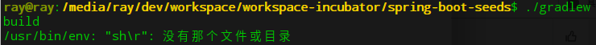

[TOC]


# 一、常

## 1.异常现象

在 deepin下执行如下命令，使用 `gradle wrapper`构建项目，结果却抛出异常




```bash
/usr/bin/env: "sh\r": 没有那个文件或目录
```


## 2.异常原因

参考：[Linux下运行bash脚本显示“: /usr/bin/env: "bash\r": 没有那个文件或目录](https://blog.csdn.net/xiongchun11/article/details/78832947)


> 这主要是因为bash后面多了\r这个字符的原因。在linux终端下，输出\r会什么都不显示，只是把光标移到行首。于是终端虽然输出了/usr/bin/env bash，但是碰到\r后，光标会被移到行首，接着输出了:No such file or directory把前面的覆盖掉了。于是出现了那个莫名其妙的出错信息了


其实就是文件格式问题

## 3.异常解决

 用vim打开sh脚本文件， 重新设置文件的格式即可


```vim
：set ff 然后回车  再重新设置下文件格式：

：set ff=unix 然后保存退出

：wq! 回车
```


