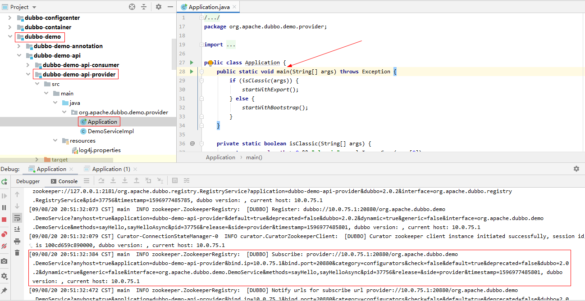

# 源码调试环境搭建

[toc]

## 推荐阅读

> - [Dubbo源码——源码阅读环境搭建](https://blog.csdn.net/bskfnvjtlyzmv867/article/details/105251862)
> - [基于Docker安装zookeeper](https://blog.csdn.net/myNameIssls/article/details/81561975)
> - 


## 一、环境准备


## 二、Idea导入Dubbo源码

### 1.获取Dubbo源码

（1）fork一份Dubbo源码

> https://github.com/apache/dubbo


（2）clone 到本地，并基于最新稳定版本切出源码分析分支

```bash
git clone https://gitee.com/study-source-code-analysis/dubbo.git

git checkout 2.7.8-release

git checkout -b dubbo-sourcecode-analysis
```


### 2.导入Idea

Idea中依次选择 `File -> Open...`，然后选择 dubbo，点击ok，

然后在项目根目录下执行如下命令来编译安装项目

```bash
# 有运行失败的测试用例，故先跳过测试
mvn clean install -DskipTests
```


## 三、Dubbo 入门示例

### 1.启动注册中心

dubbo 官方推荐使用 zookeeper 作为注册中心

执行如下代码，使用 docker 安装并启动 zookeeper

```bash
# 拉取zookeeper 镜像
docker pull zookeeper
# 从镜像创建并运行容器
docker run -d  -p 2181:2181  --name zk zookeeper
```


然后容器启停命令:

```bash
docker stop zk
docker start zk
```


### 2.启动Provider

找到 `dubbo-demo`模块下的 `dubbo-demo-api-provider` 工程，启动服务提供者




### 3.启动 consumer

找到 `dubbo-demo`模块下的 `dubbo-demo-api-consumer` 工程，启动服务消费者并进行 RPC 调用


至此，基本的源码调试环境搭建成功。


