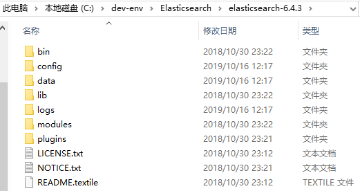

[toc]

# 一、Elasticsearch安装及配置

## 1.安装Elasticsearch

> springboot-2.1.4.REALESE 版本用的是6.4.3版本的ES客户端，因此ES服务端需要 [下载6.4.3版本](https://www.elastic.co/cn/downloads/past-releases/elasticsearch-6-4-3 )

Elasticsearch 的安装很简单，直接前往官网 [下载6.4.3版本](https://www.elastic.co/cn/downloads/past-releases/elasticsearch-6-4-3 )下载相应系统 二进制压缩包，然后解压即可





## 2.配置

 config目录下的文件即为 Elasticsearch 的相关配置文件，基本配置文件为 `elasticsearch.yml`，基本的内容解读如下

```yaml
# ======================== Elasticsearch Configuration =========================
#
# NOTE: Elasticsearch comes with reasonable defaults for most settings.
#       Before you set out to tweak and tune the configuration, make sure you
#       understand what are you trying to accomplish and the consequences.
#
# The primary way of configuring a node is via this file. This template lists
# the most important settings you may want to configure for a production cluster.
#
# Please consult the documentation for further information on configuration options:
# https://www.elastic.co/guide/en/elasticsearch/reference/index.html
#
# ---------------------------------- Cluster : 集群配置 -----------------------------------
#
# Use a descriptive name for your cluster:
# 配置集群名称，默认名称为elasticsearch，启动elasticsearch后，浏览器访问http://localhost:9200，在返回的数据中，就有集群名字
#
cluster.name: cluster-1
#
# ------------------------------------ Node : 节点配置------------------------------------
#
# Use a descriptive name for the node:
# 配置节点名称,默认名称为 $hostname
node.name: node-1
#
# Add custom attributes to the node:
# 给节点添加自定义属性
#node.attr.rack: r1
#
# ----------------------------------- Paths : 路径配置------------------------------------
#
# Path to directory where to store the data (separate multiple locations by comma):
# 数据存放目录，默认是elasticsearch下的data目录，
# 可以指定多个目录，用,隔开，如:path.data:/path/data1,/path/data2
#path.data: /path/to/data
#
# Path to log files:
# 日志存放目录，默认为elasticsearch下的logs目录
#path.logs: /path/to/logs
#
# ----------------------------------- Memory : 内存配置 -----------------------------------
#
# Lock the memory on startup:
# 配置是否锁住内存。当jvm开始swapping时，elasticsearch的效率降低，为了避免这种情况，可以设置为true。
#bootstrap.memory_lock: true
#
# Make sure that the heap size is set to about half the memory available
# on the system and that the owner of the process is allowed to use this
# limit.
#
# Elasticsearch performs poorly when the system is swapping the memory.
#
# ---------------------------------- Network : 网络配置-----------------------------------
#
# Set the bind address to a specific IP (IPv4 or IPv6):
# 设置绑定的ip地址
#network.host: 192.168.0.1
network.host: 0.0.0.0
#
# Set a custom port for HTTP:
# 配置对外提供服务的http端口号
#http.port: 9200
#
# For more information, consult the network module documentation.
#
# --------------------------------- Discovery : 集群节点发现----------------------------------
#
# Pass an initial list of hosts to perform discovery when this node is started:
# The default list of hosts is ["127.0.0.1", "[::1]"]
# 设置集群中master节点的初始列表，通过这个配置可以发现新加入的集群的节点。  
#discovery.seed_hosts: ["host1", "host2"]
#
# Bootstrap the cluster using an initial set of master-eligible nodes:
#
#cluster.initial_master_nodes: ["node-1", "node-2"]
#
# For more information, consult the discovery and cluster formation module documentation.
#
# ---------------------------------- Gateway -----------------------------------
#
# Block initial recovery after a full cluster restart until N nodes are started:
# 当n个节点启动后，再开始集群的恢复
#gateway.recover_after_nodes: 3
#
# For more information, consult the gateway module documentation.
#
# ---------------------------------- Various -----------------------------------
#
# Require explicit names when deleting indices:
#
#action.destructive_requires_name: true


# 追加如下配置
http.cors.enabled: true 
http.cors.allow-origin: "*"
node.master: true
node.data: true
```


## 3.运行

windows用户直接双击bin目录下的`elasticsearch.bat`，即可启动Elasticsearch。


启动成功后，浏览器访问   http://localhost:9200/   ，即可返回es信息

```
{
  "name": "node-1",
  "cluster_name": "cluster-1",
  "cluster_uuid": "nImijtKJSY6m4i1AY6TbmA",
  "version": {
    "number": "7.4.0",
    "build_flavor": "default",
    "build_type": "zip",
    "build_hash": "22e1767283e61a198cb4db791ea66e3f11ab9910",
    "build_date": "2019-09-27T08:36:48.569419Z",
    "build_snapshot": false,
    "lucene_version": "8.2.0",
    "minimum_wire_compatibility_version": "6.8.0",
    "minimum_index_compatibility_version": "6.0.0-beta1"
  },
  "tagline": "You Know, for Search"
}
```


# 二、安装 Elasticsearch Head插件

> 参考：[windows环境下ElasticSearch6 安装head插件]( https://blog.csdn.net/camelcanoe/article/details/79528265 )


Head 插件 Elasticsearch 的图形化界面管理工具，通过它可以方便的进行Elasticsearch的管理。

 Elasticsearch 5.x  以上版本需要通过如下方式安装


## 1.安装NodeJS


## 2.安装 grunt


```
npm install -g grunt-cli
```


## 3.修改 **elasticsearch.yml** 

```yml
# 增加新的参数，这样head插件可以访问es
http.cors.enabled: true
http.cors.allow-origin: "*"
```

'


## 3.运行 elasticsearch-head

>  github地址：https://github.com/mobz/elasticsearch-head 

参照官方文档，可通过如下方式运行 elasticsearch-head

（1）获取 elasticsearch-head

```
git clone git://github.com/mobz/elasticsearch-head.git
```


（2）运行 elasticsearch-head

```
cd elasticsearch-head
npm install
npm run start
```


# 参考资料

1. [elasticsearch安装与配置]( https://blog.csdn.net/u012702547/article/details/83116699 )
2. [Elasticsearch 安装和配置]( https://www.jianshu.com/p/f283d876b1cb )
3. [ElasticSearch安装和配置]( https://blog.csdn.net/liberalliushahe/article/details/79092313 )
4. 

