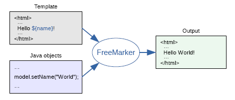

[TOC]


# 一、FreeMarker简介

## 1. 什么是 FreeMarker




FreeMarker 是一款用 Java 开发的 *模板引擎*：

>  即一种**基于模板**和要改变的**数据**， 并用来生成**输出文本**(HTML网页，电子邮件，配置文件，源代码等)的通用工具。 


FreeMarker 模板使用 `FreeMarker Template Language (FTL)`编写：

> - 在模板中，主要关注于如何展现数据
> - 在模板外，主要关注于要展示什么数据


## 2. 模板 + 数据模型 = 输出

FreeMarker 根据模板内容，将数据模型渲染到模板上，并输出最终显示的文件（跟文件类型无关，可以是 html、xml、Java等）


（1）模板

```html
<html>
<head>
  <title>Welcome!</title>
</head>
<body>
  <h1>Welcome ${user}!</h1>
  <p>Our latest product:
  <a href="${latestProduct.url}">${latestProduct.name}</a>!
</body>
</html>
```


（2）数据模型

为模板准备的数据整体被称作为 **数据模型**

数据模型是树形结构(就像硬盘上的文件夹和文件)，在视觉效果上， 数据模型可以是：

```properties
(root)
  |
  +- user = "Big Joe"
  |
  +- latestProduct
      |
      +- url = "products/greenmouse.html"
      |
      +- name = "green mouse"
```


（3）输出

FreeMarker 会将数据模型渲染到模板上，并输出最终显示的文件

```html
<html>
<head>
  <title>Welcome!</title>
</head>
<body>
  <h1>Welcome Big Joe!</h1>
  <p>Our latest product:
  <a href="products/greenmouse.html">green mouse</a>!
</body>
</html>
```


# 二、数据模型一览

数据模型的基本结构是树状的。 这棵树可以很复杂，并且可以有很大的深度

```properties
(root)
  |
  +- animals
  |   |
  |   +- (1st)
  |   |   |
  |   |   +- name = "mouse"
  |   |   |
  |   |   +- size = "small"
  |   |   |
  |   |   +- price = 50
  |   |
  |   +- (2nd)
  |   |   |
  |   |   +- name = "elephant"
  |   |   |
  |   |   +- size = "large"
  |   |   |
  |   |   +- price = 5000
  |   |
  |   +- (3rd)
  |       |
  |       +- name = "python"
  |       |
  |       +- size = "medium"
  |       |
  |       +- price = 4999
  |
  +- misc
  |   |
  |   +- fruits
  |       |
  |       +- (1st) = "orange"
  |       |
  |       +- (2nd) = "banana"
  |
  +- message = "It is a test"
  
```


如果要在模板中使用子变量，

（1）非 List 变量

对于有名字的子变量，则从根root开始指定它的路径，每级之间用点来分隔开，如：

```properties
animals.name.mouse
animals[0].name   # 对于Map也是有索引的
```


（2）List 变量

对于 List 变量，可以使用方括号形式的数字索引下标

```properties
misc.fruits[1]
animals[0].name   # 对于Map也是有索引的
```


# 三、模板一览

##  1.模板组成

模板主由以下部分组成

> - 注释			           ：    即 `<#‐‐ and ‐‐>`，介于其之间的内容会被freemarker忽略 
> - 插值（Interpolation）：    即`${..}`部分，freemarker会用真实的值代替`${..} `
> - FTL指令                        ：    和HTML标记类似，以`#`开头，Freemarker会解析指令中的表达式或逻辑 
> - 文本：仅文本信息，这些不是freemarker的注释、插值、FTL指令的内容会被freemarker忽略解析，直接输出内
>     容。 


## 2.常用FTL指令

FTL标签也被称为 FTL 指令


### 2.1 if 指令

```xml
<#if animals.python.price < animals.elephant.price>
  Pythons are cheaper than elephants today.
<#elseif animals.elephant.price < animals.python.price>
  Elephants are cheaper than pythons today.
<#else>
  Elephants and pythons cost the same today.
</#if>
```


### 2.2 list 指令

`list` 指令的一般格式为： 

```
<#list sequence as loopVariable>
	repeatThis
</#list>
```


`repeatThis` 部分将会在给定的 `sequence` 遍历时在每一项中重复， 从第一项开始，一个接着一个。

在所有的重复中， `loopVariable` 将持有当前遍历项的值。 这个变量仅存在于 `<#list *...*>` 和 `</#list>` 标签内。


示例：

```html
<#list misc.fruits>
  <ul>
    <#items as fruit>
      <li>${fruit}
    </#items>
  </ul>
</#list>
```


分隔符示例：

```html
<p>Fruits: <#list misc.fruits as fruit>${fruit}<#sep>, </#list>
```

显示结果如下：

```html
<p>Fruits: orange, banana
```

> 被 `sep` 覆盖的部分(我们也可以这么来写： `*...*<#sep>, </#sep></#list>`) 只有当还有下一项时才会被执行。 因此最后一个水果后面不会有逗号。


### 2.3 include 指令

使用 `include` 指令， 我们可以在模板中插入其他文件的内容。


假设要在一些页面中显示版权声明的信息。那么可以创建一个文件来单独包含这些版权声明， 之后在需要它的地方插入即可。比方说，我们可以将版权信息单独存放在页面文件 `copyright_footer.html` 中：

```html
<hr>
<i>
Copyright (c) 2000 <a href="http://www.acmee.com">Acmee Inc</a>,
<br>
All Rights Reserved.
</i>
```

当需要用到这个文件时，可以使用 `include` 指令来插入：

```html
<html>
<head>
  <title>Test page</title>
</head>
<body>
  <h1>Test page</h1>
  <p>Blah blah...
  <#include "/copyright_footer.html">
</body>
</html>
```

此时，输出的内容为：

```html
<html>
<head>
  <title>Test page</title>
</head>
<body>
  <h1>Test page</h1>
  <p>Blah blah...
<hr>
<i>
Copyright (c) 2000 <a href="http://www.acmee.com">Acmee Inc</a>,
<br>
All Rights Reserved.
</i>
</body>
</html>
```


