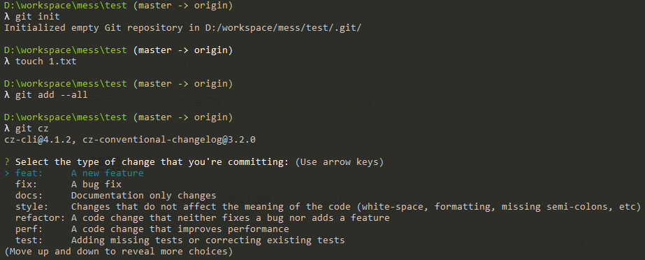

[toc]


# 前言

## 推荐阅读

> - [Java项目如何使用commitizen插件](https://www.jianshu.com/p/dc3581887cbb)
> - [优雅的提交你的 Git Commit Message](https://juejin.im/post/5afc5242f265da0b7f44bee4#heading-3)
> - [git commit 规范指南](https://segmentfault.com/a/1190000009048911)


# 一、使用 Commitizen 规范提交信息

## 1.安装

需要安装如下两个工具：

> - [commitizen/cz-cli](https://link.zhihu.com/?target=https%3A//github.com/commitizen/cz-cli) ：借助它提供的 `git cz` 命令替代 `git commit` 命令, 可以帮我们生成符合规范的 commit message.
> - [cz-conventional-changelog](https://link.zhihu.com/?target=https%3A//github.com/commitizen/cz-conventional-changelog)：它是 commitizen 的一个支持 Angular 的 Commit message 格式  Adapter。


### 1.1 全局安装

```bash
npm install -g commitizen cz-conventional-changelog
```


### 1.2 配置 `~/.czrc`

创建文件 `~/.czrc`，内容如下：

```json
{
   "path": "cz-conventional-changelog"
}
```

表示指定 `commitizen` 使用全局包下的 `cz-conventional-changelog`


## 2.使用

当需要用到`git commit`命令时，一律改为使用`git cz`，这时会出现以下选项：




