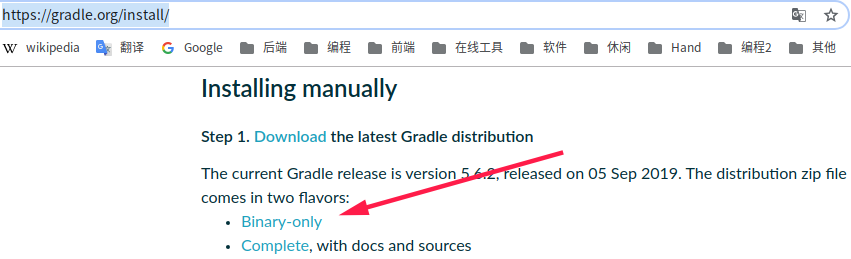

[TOC]

# 前言

本文参考自官方文档：[Installing Gradle](https://docs.gradle.org/current/userguide/installation.html#installing_gradle)


# 一、Windows下安装及配置

## 1.安装

（1）前往[发布页](https://gradle.org/releases/)，下载 Binary-only 版

> - Binary-only：只包含二进制文件
> - Complete： 除了二进制文件，还包含 docs 和 sources


（2）解压到自定义目录，如


## 2.配置环境变量


```properties
GRADLE_HOME = C:\dev-env\gradle\gradle-5.3.1
path = %GRADLE_HOME%\bin  # 追加
```


# 二、Linux下安装及配置

## 1.下载解压

前往[官方](https://gradle.org/install/)下载二进制压缩包





然后解压

```bash
# 创建安装目录
sudo mkdir /usr/local/gradle/

# 解压至安装目录
sudo unzip gradle-5.6-bin.zip -d /usr/local/gradle/
```


## 2.添加软链接

添加软链接，方便后续版本升级

```bash
cd /usr/local/gradle
sudo ln -s /usr/local/gradle/gradle-5.6  gradle
```


## 3.配置环境变量

编辑文件`/etc/profile`

```bash
sudo vim /etc/profile
```

添加文件末尾追加 JDK环境变量

```properties
export GRADLE_HOME=/usr/local/gradle/gradle
export PATH=$GRADLE_HOME/bin:$PATH
```

使环境变量生效

```
source /etc/profile
```


## 4.验证

```bash
gradle --version
```


# 参考资料

1. [Installing Gradle](https://docs.gradle.org/current/userguide/installation.html#installing_gradle)

    


