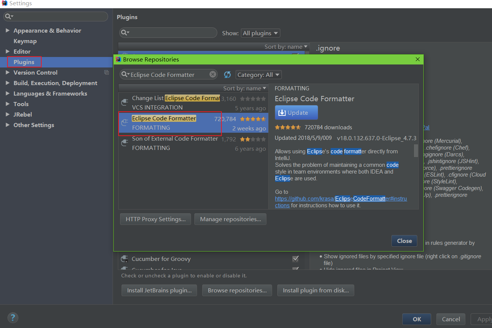
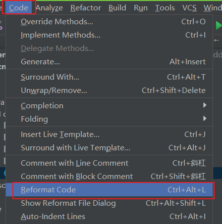
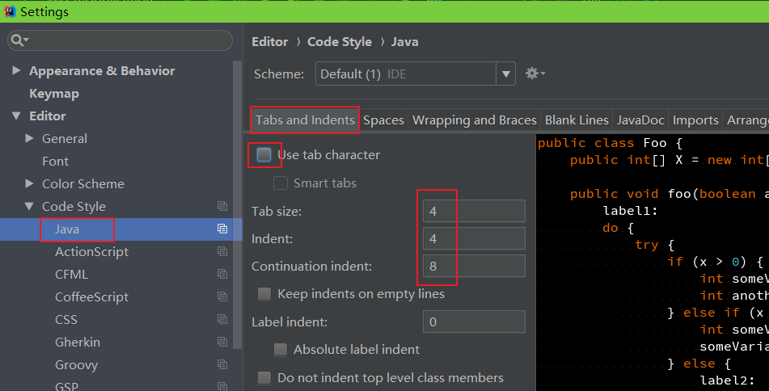
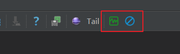
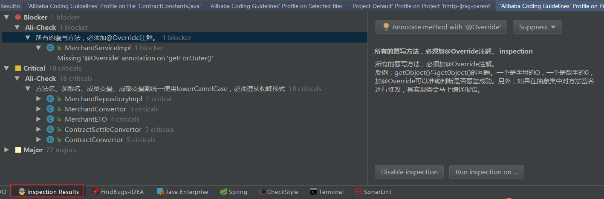

# 	一、前言
在上一节，我们安装并激活了IDEA，这一节我们来设置下Idea的常用配置：
> - 项目相关配置
> - Idea常用配置


# 二、项目相关配置
运行Idea，出现下图


## 1.配置默认JDK
### 1.1 添加 SDKs
>（1）依次选择 Configure->Project Default ->Project Structrue ->PlatForm Settings
>
>

>（2）添加JDK
>  点击“+”，选择JDK


> 选择JDK安装目录，点击ok，然后点击 apply ，ok，即可
>
> 

###  1.2  配置 Project SDK


## 2.配置默认tomcat
（1）依次选择 Configure->Project Default ->Run Configurations


（2）依次选择 “+”->Tomcat Server->Local

（3）按下图所示配置好tomcat信息，点击apply ,ok


## 3.配置默认Maven
（1）依次选择 Configure->Project Default ->Settings
（2）配置maven的安装目录，以及Setting.xml


## 4.配置 Java Compiler
（1）依次选择 Configure->Project Default ->Settings
（2）给 Additional command line parameters添加-parameters参数


## 5.配置字符编码
（1）依次选择 Configure->Project Default ->Settings


## 6.配置新建文件文件头

通过此配置可以在每次新建类时，在文件开始处插入以下注释：

```
/**
 * @desc hello
 *
 * @author rui.shi@hand-china.com
 * @date 2018/10/8
 */
```

对应配置如下：
```
/**
 * @desc:
 * 
 * @author: rui.shi@hand-china.com
 * @date: ${DATE}
 */
```


# 三、Idea常用配置
## 1.修改主题
可能大家会觉得软件的界面不太好看，我们可以换一下主题。选择菜单栏“File--settings--apperance--theme”，主题选择Darcula：


## 2.导入第三方主题
系统提供的两种主题可能都不太好看，可访问如下网站获取第三方主题：
> - [http://www.riaway.com/](http://www.riaway.com/)
>
> 

## 3.修改字体
### 3.1 修改代码字体
选择菜单栏“File--settings--Editor--Font”：


### 3.2 修改控制台字体


## 4.修改默认快捷键
如果想修改成Eclipse的快捷键，可以选择菜单栏"file--Settings--Keymap"：


## 5.配置代码的自动提示
### 5.1 配置自动提示
新版的Idea默认具有代码自动补齐的功能（老版本的Idea是没有的），自动补齐的设置如下：


### 5.2 配置代码提示的大小写区分
Idea默认的代码提示是大小写敏感的，通过如下设置可使其对大小写不敏感：


## 6.设置自动导包


## 7.显示代码行数


## 8.禁止自动打开上次的工程


## 9.禁止代码折叠
IDEA默认有很多地方的代码都会自动折叠，如果不习惯，可以取消掉。


## 10.修改注释位置，禁用“语句堆一行”


## 11.设置多Tab页


# 四、开发规约配置

## 1.代码格式化

1、安装`Eclipse Code Formatter`格式化插件



2、设置格式化配置文件

GoogleStyle：[eclipse-java-google-style.xml](http://hzerodoc.saas.hand-china.com/files/docs/development-specification/backend-development-specification/basic/eclipse-java-google-style.xml)


3、使用快捷键`Ctrl+Alt+L`格式化代码




## 2.换行设置

统一120个字符换行（默认就是120）


## 3.tab设置

统一使用默认的`4`个空格为一个Tab




## 4.开启阿里巴巴规范检查

1、 安装插件`Alibaba Java Coding Guidelines`


2、使用插件分析代码


3、工具类绿色按钮扫描代码，蓝色按钮开启/关闭实时检测


4、扫描之后可以看到对应的分析结果以及对应的说明




## 5.IntelliJ IDEA 注释模板

IntelliJ IDEA 只能通过设置注释模板来实现，请先导入[IDEA注释模板](http://hzerodoc.saas.hand-china.com/files/docs/development-specification/backend-development-specification/basic/comment/FileTemplate.jar)。*File -> Import Settings*

该模板内置了几种常用注释：

- 创建类时默认生成标准的Javadoc注释
- 使用 `cc + Enter` 生成类注释
- 使用 `mc + Enter` 生成方法注释，这个需要在方法内部生成，然后剪贴到方法上。
- 使用 `hc + Enter` / `dc + Enter` 生成区块注释


# 三、参考资料

1. [Android Studio 入门级教程（一）](http://www.cnblogs.com/abao0/p/6934023.html)