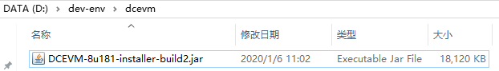
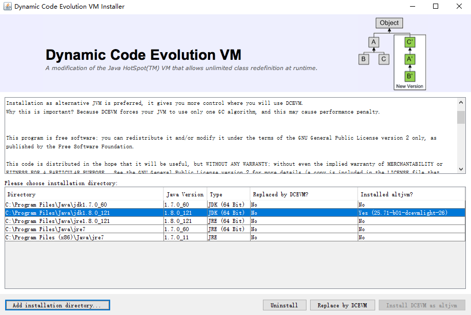
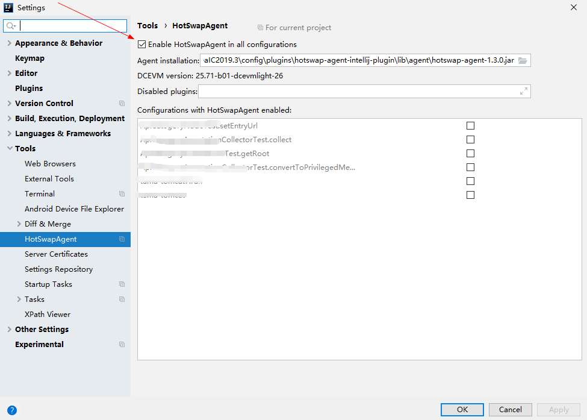

[toc]


# 前言


# 一、DCEVM

参考： 

> - [玩转 DCEVM + HotwapAgent 热加载，免费、开源！](https://www.codercto.com/a/45548.html)
> - [如何用HotSwapAgent和DCEVM让java开发像js开发一样高效（JRebel的替代方案）](https://blog.csdn.net/u013613428/article/details/51499911)
> - [DCEVM+HotSwapAgent实现java类热加载](http://www.renhl.com/java/2017/08/16/dcevm-hotswapagent-idea)


## 1.安装DCEVM

（1）前往 dcevm 的github 仓库下载最新版本的jar

> https://github.com/dcevm/dcevm/releases



（2）然后运行安装jar

```bash
 java -jar DCEVM-8u181-installer-build2.jar
```


（3）接着选择`Install DCEVM as altjvm` 来进行安装

> 注意：若没有自动列出已安装的JDK，则需要点击`Add installation directory`，来手动选择JDK安装目录





（5）Idea插件市场搜索并安装 `HotSwapAgent `，然后将其启用




