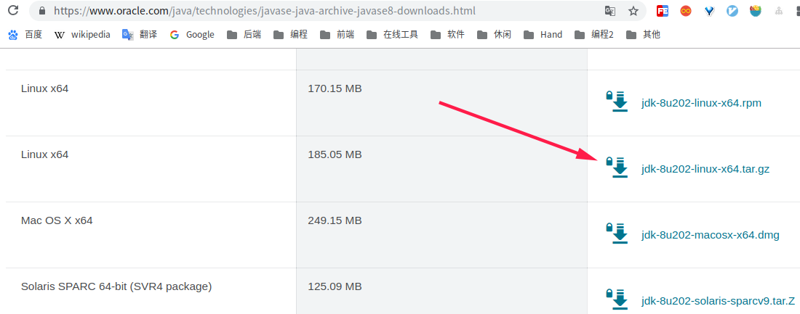

[TOC]


# 前言


# 一、Linux 安装Java 8

## 1.下载

前往[官网](https://www.oracle.com/java/technologies/javase-java-archive-javase8-downloads.html)下载 Linux 版本，需要根据自己的操作系统来选择，我是deepin系统，基于debian的，因此下载tar包





国内镜像：

> - 华为云1：https://repo.huaweicloud.com/java/jdk/
> - 华为云2：https://mirrors.huaweicloud.com/java/jdk/
> - https://github.com/frekele/oracle-java/releases
> - 


## 2.解压

```bash
# 创建安装目录
sudo mkdir /usr/local/java/

# 解压至安装目录
sudo tar -zxvf jdk-8u202-linux-x64.tar.gz -C /usr/local/java/
```


## 3.设置环境变量

编辑文件`/etc/profile`

```bash
sudo vim /etc/profile
```

添加文件末尾追加 JDK环境变量

```properties
export JAVA_HOME=/usr/local/java/jdk1.8.0_202
export CLASSPATH=.:$JAVA_HOME/jre/lib/rt.jar:$JAVA_HOME/lib/dt.jar:$JAVA_HOME/lib/tools.jar
export PATH=$JAVA_HOME/bin:$PATH
```

使环境变量生效

```
source /etc/profile
```


## 4.添加软链接

```
sudo ln -s /usr/local/java/jdk1.8.0_202/bin/java /usr/bin/java
```


## 5.检查

```
java -version
```


# 二、 Windows 安装 Jdk

```
JAVA_HOME=jdk安装目录
Path=%JAVA_HOME%\bin;%JAVA_HOME%\jre\bin;
ClassPath=.;%JAVA_HOME%\bin;%JAVA_HOME%\lib\dt.jar;%JAVA_HOME%\lib\tools.jar
```


# 参考资料

1. [Linux 软件安装到哪里合适，目录详解](https://blog.csdn.net/qq_15766181/article/details/80755786)
2. [CentOS 7 安装 JAVA环境（JDK 1.8）](https://www.cnblogs.com/stulzq/p/9286878.html)
3. 

