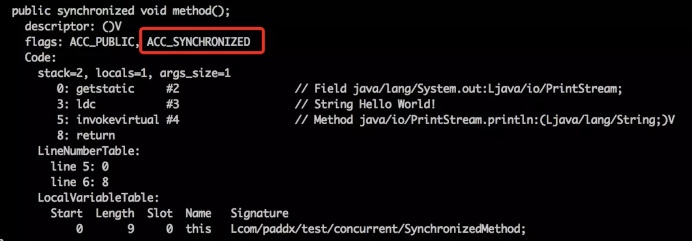

[toc]


# 一、volatile


# 二、synchronized

synchronized 作用于实例方法时，是锁对象

synchronized 作用于静态方法时，是锁Class


## 1.同步原理

（1）访问同步代码块时，synchronized 会被编译为  **monitorenter** 、 **monitorexit** 指令

 ```java
package com.paddx.test.concurrent;

public class SynchronizedDemo {
    public void method() {
        synchronized (this) {
            System.out.println("Method 1 start");
        }
    }
}
 ```


（2）访问同步方法时， synchronized 会被翻译成  **ACC_SYNCHRONIZED**  标志

```java
package com.paddx.test.concurrent;

public class SynchronizedMethod {
    public synchronized void method() {
        System.out.println("Hello World!");
    }
}
```

  


## 2.锁升级过程

最开始锁时无锁状态，这时一个线程进入同步块，将其线程ID写入锁对象头，升级为偏向锁。

偏向锁时，只要一有竞争，就会升级为轻量级锁。也就是说只要这时有另一个线程尝试进入同步块，就会升级为轻量级锁。

轻量级锁时，如果一个线程自旋次数达到阈值（默认10次），线程就会挂起，也就升级为重量级锁。


## 3.锁存储

偏向锁:

> - 栈帧中的锁记录：存储线程ID
>
> - 对象头的MarkWord：存储线程ID


轻量级锁：

加锁：

> （1）创建栈帧中锁记录（Displaced Mark Word）空间
>
> （2）将对象头MarkWord复制到锁记录
>
> （3）线程 CAS 将对象头的MarkWord替换为指向锁记录的指针


# 参考资料

> - [啃碎并发（七）：深入分析Synchronized原理](https://www.jianshu.com/p/e62fa839aa41)


