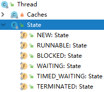

[TOC]


# 前言


# 一、线程的基本概念

## 1.线程与进程

进程：运行中的应用程序称为进程

线程：现代操作系统调度的最小单元是线程，也叫轻量级进程。

进程是一组线程的集合，其中每一个线程都是一个顺序执行流。


## 2.线程的状态


Java线程的状态有6种，被**明确地**定义在Thread类的一个内部枚举类Thread.State中：




（1）`NEW` (**新建**)  

> 一个尚未启动的线程处于这一状态。(Thread state for a thread which has not yet started.)


（2）`RUNNABLE` (**可运行**) 

> 一个正在 Java 虚拟机中执行的线程处于这一状态，但是它可能正在等待操作系统的其他资源。（也就是说包括就绪-ready和运行-running）(Thread state for a runnable thread.  A thread in the runnable state is executing in the Java virtual machine but it may be waiting for other resources from the operating system such as processor.)


（3）`BLOCKED` (**阻塞**)       

> 一个正在阻塞等待一个监视器锁的线程处于这一状态。(A thread that is blocked waiting for a monitor lock is in this state.)


（4）`WAITING` (**等待**)       

> 一个正在无限期等待另一个线程执行一个特别的动作的线程处于这一状态。(A  thread that is waiting indefinitely for another thread to perform a  particular action is in this state.)


（5）`TIMED_WAITING` (**计时等待**)       

> 一个正在限时等待另一个线程执行一个动作的线程处于这一状态。(A  thread that is waiting for another thread to perform an action for up  to a specified waiting time is in this state.)


（6）`TERMINATED` (**终止**)       

> 一个已经退出的线程处于这一状态。(A thread that has exited is in this state.)


例如：

```
package com.ray.study.concurrency.thread.terminal;


/**
 * 当线程阻塞状态时，使用interrupt()方法终止线程，会先将该线程的中断标志清除，然后抛出 InterruptException 异常
 *  此时调用isInterrupted()会返回false
 *
 * @author shira 2019/07/29 10:01
 */
public class ThreadTerminal2 {
    public static void main(String[] args) throws InterruptedException {
        // 新建“线程t1”
        Thread t1 = new MyThread("t1");
        System.out.println(t1.getName() +" ("+t1.getState()+") is new.");

        // 启动“线程t1”
        t1.start();
        System.out.println(t1.getName() +" ("+t1.getState()+") is started.");

        // 主线程休眠300ms，然后主线程给t1发“中断”指令。
        Thread.sleep(4000);
        t1.interrupt();
        System.out.println(t1.getName() +" ("+t1.getState()+") is interrupted.");

        // 主线程休眠300ms，然后查看t1的状态。
        Thread.sleep(4000);
        System.out.println(t1.getName() +" ("+t1.getState()+") is interrupted now.");
    }
}


class MyThread extends Thread {

    public MyThread(String name) {
        super(name);
    }

    @Override
    public void run() {
        int i=0;
        while (!isInterrupted()) {
            try {
                Thread.sleep(2000); // 休眠100ms
            } catch (InterruptedException ie) {
                System.out.println(Thread.currentThread().getName() +" ("+this.getState()+") catch InterruptedException.");
                break;
            }

            i++;
            System.out.println(Thread.currentThread().getName()+" ("+this.getState()+") loop " + i);
        }
    }
}

```

输出为：

```
t1 (NEW) is new.
t1 (RUNNABLE) is started.
t1 (RUNNABLE) loop 1
t1 (TIMED_WAITING) is interrupted.
t1 (RUNNABLE) catch InterruptedException.
t1 (TERMINATED) is interrupted now.
```


## 3.线程优先级

在 java 中，线程优先级的范围是1～10，默认的优先级是5。优先级高的线程分配时间片的数量要多于优先级低的线程。

```java
    /**
     * The minimum priority that a thread can have.
     */
    public final static int MIN_PRIORITY = 1;

   /**
     * The default priority that is assigned to a thread.
     */
    public final static int NORM_PRIORITY = 5;

    /**
     * The maximum priority that a thread can have.
     */
    public final static int MAX_PRIORITY = 10;
```


示例：

```java
package com.ray.study.concurrency.thread;

import java.util.ArrayList;
import java.util.List;

/**
 * description
 *
 * @author shira 2019/07/29 16:03
 */
public class PriorityDemo {

    public static void main(String[] args) {
        List<Thread> jobs = new ArrayList<Thread>();

        for(int i = 1; i<10 ; i++){
            Thread t1 = new Thread(()-> {
                System.out.println(Thread.currentThread().getName()+" "+Thread.currentThread().getPriority());
            },"Tread-"+i);
            t1.setPriority(i);
            jobs.add(t1);
        }

        for(Thread thread : jobs){
            thread.start();
        }


    }

}
```


输出结果如下：

```
Tread-7 7
Tread-8 8
Tread-9 9
Tread-5 5
Tread-6 6
Tread-4 4
Tread-3 3
Tread-1 1
Tread-2 2
```


可以看到优先级高的线程不一定先于优先级低的线程执行

在不同JVM和操作系统上，线程规划会存在差异。


## 4.守护线程

守护（daemon）线程，是后台线程，主要为用户线程提供服务，在没有用户线程可服务时会自动退出。


# 二、线程的创建与终止

## 1.线程的创建方式

### 1.1 继承Thread类


```java
package com.ray.study.concurrency.thread.creation;

/**
 * 通过继承Thread来创建线程
 */
public class ThreadCreation1 {

    /**
     *  通过继承Thread来创建线程
     */
    void inheritThread(){
        MyThread t1 = new MyThread("first-thread");
        MyThread t2 = new MyThread("second-thread");

        t1.start();
        t2.start();
    }

    /**
     * 通过匿名内部类的方式创建线程
     */
    void anonymousClass(){
        new Thread("third-thread"){
            @Override
            public void run() {
                for(int i = 0; i < 100; i++) {
                    System.out.println(getName()+"执行了，i="+i);
                }
            }
        }.start();

        new Thread("fourth-thread"){
            @Override
            public void run() {
                for(int i = 0; i < 100; i++) {
                    System.out.println(getName()+"执行了，i="+i);
                }
            }
        }.start();


    }

    public static void main(String[] args) {
        ThreadCreation1 threadCreation1 = new ThreadCreation1();
        //threadCreation1.inheritThread();
        threadCreation1.anonymousClass();
    }

}


class MyThread extends Thread {

    public MyThread(String name) {
        super(name);
    }

    @Override
    public void run() {
        for(int i = 0; i < 100; i++) {
            System.out.println(getName()+"执行了，i="+i);
        }
    }

}
```


### 1.2 实现Runnable接口


```java
package com.ray.study.concurrency.thread.creation;

/**
 * 通过实现Runnable来创建线程
 */
public class ThreadCreation2 {

    /**
     * 通过实现Runnable来创建线程
     */
    void implementRunnable() {
        Thread t1 = new Thread(new MyRunnable(), "first-thread");
        Thread t2 = new Thread(new MyRunnable(), "second-thread");

        t1.start();
        t2.start();
    }

    /**
     * lambda表达式
     */
    void lambdaWay() {
        new Thread(() -> {
            for (int i = 0; i < 100; i++) {
                System.out.println(Thread.currentThread().getName() + "执行了，i=" + i);
            }
        }, "first-thread").start();

        new Thread(() -> {
            for (int i = 0; i < 100; i++) {
                System.out.println(Thread.currentThread().getName() + "执行了，i=" + i);
            }
        }, "second-thread").start();

    }

    public static void main(String[] args) {
        ThreadCreation2 threadCreation2 = new ThreadCreation2();
        //threadCreation2.implementRunnable();
        threadCreation2.lambdaWay();
    }

}

class MyRunnable implements Runnable {

    @Override
    public void run() {
        for (int i = 0; i < 100; i++) {
            System.out.println(Thread.currentThread().getName() + "执行了，i=" + i);
        }
    }

}
```


### 1.3 基于Callable和Future 创建线程


```java
package com.ray.study.concurrency.thread.creation;

import java.util.concurrent.Callable;
import java.util.concurrent.ExecutionException;
import java.util.concurrent.FutureTask;

/**
 * 基于Callable和Future 创建线程
 */
public class ThreadCreation3 {

    public static void main(String[] args) throws ExecutionException, InterruptedException {

        Callable<Integer> callable = new MyCallable(100);
        FutureTask<Integer> futureTask = new FutureTask<>(callable);

        Thread t1 = new Thread(futureTask);
        t1.start();

        System.out.println("主线程阻塞在futureTask.get()");

        //取得新创建的新线程中的call()方法返回的结果
        int sum = futureTask.get();
        System.out.println("sum = " + sum);
    }
}


class MyCallable implements Callable<Integer> {
    private int count;

    public MyCallable(int count) {
        this.count = count;
    }

    /**
     * 与run()方法不同的是，call()方法具有返回值
     */
    @Override
    public Integer call() {
        int sum = 0;
        for (int i = 0; i < count; i++) {
            System.out.println(Thread.currentThread().getName() + "执行了, i=" + i + ", sum=" + sum);
            sum += i;
        }
        return sum;
    }

}
```


### 1.4 基于线程池创建线程


```java
package com.ray.study.concurrency.thread.creation;

import java.util.concurrent.ExecutorService;
import java.util.concurrent.Executors;

/**
 *  基于线程池创建线程
 */
public class ThreadCreation4 {

    public static void main(String[] args) {

        ExecutorService threadPool = Executors.newCachedThreadPool();

        for (int i = 0; i < 1000; i++) {
            threadPool.execute(() -> System.out.println(Thread.currentThread().getName()));
        }

        threadPool.shutdown();
    }
}
```


### 1.5 TimerTask、Lambda、SpringTask

- TimerTask

```
package com.ray.study.concurrency.thread.creation;

import java.util.Timer;
import java.util.TimerTask;

/**
 * 通过TimerTask和Timer创建线程
 */
public class ThreadCreation5 {

    public static void main(String[] args) {

        MyTimerTask timerTask = new MyTimerTask();

        Timer timer = new Timer();
        timer.schedule(timerTask, 0, 1000);

        System.out.println("主线程退出...");
    }
}


class MyTimerTask extends TimerTask {

    @Override
    public void run() {
        // 定时任务
        System.out.println(Thread.currentThread().getName() + System.currentTimeMillis());
    }

}
```


- lambda

  ```java
  package com.ray.study.concurrency.thread.creation;
  
  import java.util.Arrays;
  import java.util.List;
  
  /**
   * 通过Java8的流来并行执行
   */
  public class ThreadCreation6 {
      public static void main(String[] args) {
          List<Integer> values = Arrays.asList(10, 20, 30, 40);
          int res = new ThreadCreation6().add(values);
          System.out.println("计算的结果为：" + res);
      }
  
      int add(List<Integer> values) {
          return values.parallelStream().mapToInt(i -> i * 2).sum();
      }
  }
  ```

  


## 2.线程的终止

### 2.1 使用退出标志退出线程

```java
package com.ray.study.concurrency.thread.terminal;


/**
 * 使用退出标志终止线程（若线程处于阻塞状态，则不会立即退出线程，此时可结合interrupt来使线程立即退出。）
 * 
 * @author shira 2019/07/29 10:01
 */
public class ThreadTerminal1 {

    public static void main(String[] args) throws InterruptedException {
        MyRunnable runnable = new MyRunnable();
        Thread t1 = new Thread(runnable, "first-thread");
        t1.start();

        Thread.sleep(9000);

        // 结束线程
        runnable.setExit(true);
    }
}


class MyRunnable implements Runnable {

    private volatile boolean exit = false;

    public void setExit(boolean exit) {
        this.exit = exit;
    }

    @Override
    public void run() {
        while(!exit){

            try {
                Thread.sleep(3000);
            } catch (InterruptedException e) {
                e.printStackTrace();
            }

            System.out.println(Thread.currentThread().getName()+" is running...");
        }

        System.out.println(Thread.currentThread().getName()+" is terminal...");
    }

}
```


### 2.2 使用interrupt()方法终止线程

使用interrupt()方法来中断线程有两种情况：

（1）线程处于阻塞状态：

> 如使用了sleep,同步锁的wait,socket 中的receiver,accept 等方法时，会使线程处于阻塞状态。当调用线程的interrupt()方法时，会抛出InterruptException 异常。阻塞中的那个方法抛出这个异常，通过代码捕获该异常，然后break 跳出循环状态，从而让我们有机会结束这个线程的执行。**通常很多人认为只要调用interrupt 方法线程就会结束，实际上是错的， 一定要先捕获InterruptedException异常之后通过break 来跳出循环，才能正常结束run 方法**。


示例：

```java
package com.ray.study.concurrency.thread.terminal;


/**
 * 当线程阻塞状态时，使用interrupt()方法终止线程，会先将该线程的中断标志清除，然后抛出 InterruptException 异常
 *  此时调用isInterrupted()会返回false
 *
 * @author shira 2019/07/29 10:01
 */
public class ThreadTerminal2 {
    public static void main(String[] args) throws InterruptedException {
        // 新建“线程t1”
        Thread t1 = new MyThread("t1");
        System.out.println(t1.getName() +" ("+t1.getState()+") is new.");

        // 启动“线程t1”
        t1.start();
        System.out.println(t1.getName() +" ("+t1.getState()+") is started.");

        // 主线程休眠300ms，然后主线程给t1发“中断”指令。
        Thread.sleep(4000);
        t1.interrupt();
        System.out.println(t1.getName() +" ("+t1.getState()+") is interrupted.");

        // 主线程休眠300ms，然后查看t1的状态。
        Thread.sleep(4000);
        System.out.println(t1.getName() +" ("+t1.getState()+") is interrupted now.");
    }
}


class MyThread extends Thread {

    public MyThread(String name) {
        super(name);
    }

    @Override
    public void run() {
        int i=0;
        while (!isInterrupted()) {
            try {
                Thread.sleep(2000); // 休眠100ms
            } catch (InterruptedException ie) {
                System.out.println(Thread.currentThread().getName() +" ("+this.getState()+") catch InterruptedException.");
                break;
            }

            i++;
            System.out.println(Thread.currentThread().getName()+" ("+this.getState()+") loop " + i);
        }
    }
}

```


输出:

```
t1 (NEW) is new.
t1 (RUNNABLE) is started.
t1 (RUNNABLE) loop 1
t1 (TIMED_WAITING) is interrupted.
t1 (RUNNABLE) catch InterruptedException.
t1 (TERMINATED) is interrupted now.
```


（2）线程未处于阻塞状态：

使用 isInterrupted() 判断线程的中断标志来退出循环。当使用 interrupt()方法时，中断标志就会置true，和使用自定义的标志来控制循环是一样的道理

```java
package com.ray.study.concurrency.thread.terminal;


/**
 * 当线程未处于阻塞状态，使用 isInterrupted() 判断线程的中断标志来退出循环
 *
 * @author shira 2019/07/29 10:01
 */
public class ThreadTerminal3 {
    public static void main(String[] args) throws InterruptedException {
        // 新建“线程t1”
        MyThread3 t1 = new MyThread3("t1");
        System.out.println(t1.getName() +" ("+t1.getState()+") is new.");

        // 启动“线程t1”
        t1.start();
        System.out.println(t1.getName() +" ("+t1.getState()+") is started.");

        // 主线程休眠300ms，然后主线程给t1发“中断”指令。
        Thread.sleep(4000);
        t1.interrupt();
        System.out.println(t1.getName() +" ("+t1.getState()+") is interrupted.");

        // 主线程休眠300ms，然后查看t1的状态。
        Thread.sleep(4000);
        System.out.println(t1.getName() +" ("+t1.getState()+") is interrupted now.");
    }
}


class MyThread3 extends Thread {

    public MyThread3(String name) {
        super(name);
    }

    @Override
    public void run() {
        int i=0;
        while (!isInterrupted()) {  // 非阻塞过程中通过判断终端标志来退出
            i++;
            System.out.println(Thread.currentThread().getName()+" ("+this.getState()+") loop " + i);
        }
    }
}

```


### 2.3 安全的终止线程

使用退出标志终止线程时，若线程处于阻塞状态，则不会立即退出线程，此时可结合interrupt来使线程立即退出。

通过结合 退出标志 和 interrupt方法来安全的终止线程。


# 三、线程的基本方法

## 1.线程等待（wait）

调用该方法的线程进入`WAITING `状态，只有等待另外线程的通知或被中断才会返回，需要注意的是调用wait()方法后，**会释放对象的锁**。因此，wait 方法一般用在同步方法或同步代码块中。


## 2.线程睡眠（sleep）

sleep 导致当前线程休眠，与wait 方法不同的是 **sleep 不会释放当前占有的锁**, sleep(long)会导致线程进入`TIMED-WATING `状态，而wait()方法会导致当前线程进入WATING 状态


## 3.线程让步（yield）

yield 会使当前线程让出CPU 执行时间片，与其他线程一起重新竞争CPU 时间片。一般情况下，优先级高的线程有更大的可能性成功竞争得到CPU 时间片，但这又不是绝对的，有的操作系统对线程优先级并不敏感。


## 4.线程中断(interrupt)

中断一个线程，其本意是给这个线程一个通知信号，会影响这个线程内部的一个中断标识位。这个线程本身并不会因此而改变状态(如阻塞，终止等)。
> 1. 调用interrupt()方法并不会中断一个正在运行的线程。也就是说处于Running 状态的线程并不会因为被中断而被终止，仅仅改变了内部维护的中断标识位而已。
> 2. 若调用sleep()而使线程处于TIMED-WATING 状态，这时调用interrupt()方法，会抛出InterruptedException,从而使线程提前结束TIMED-WATING 状态。
> 3. 许多声明抛出InterruptedException 的方法(如Thread.sleep(long mills 方法))，抛出异常前，都会清除中断标识位，所以抛出异常后，调用isInterrupted()方法将会返回false。
> 4. 中断状态是线程固有的一个标识位，可以通过此标识位安全的终止线程。比如,你想终止一个线程thread 的时候，可以调用thread.interrupt()方法，在线程的run 方法内部可以根据thread.isInterrupted()的值来优雅的终止线程。


## 5.Join等待其他线程终止

join() 方法，等待其他线程终止，在当前线程中调用一个线程的 join() 方法，则当前线程转为阻塞状态，回到另一个线程结束，当前线程再由阻塞状态变为就绪状态，等待 cpu 的宠幸。


为什么要用join()方法

> 很多情况下，主线程生成并启动了子线程，需要用到子线程返回的结果，也就是需要主线程需要在子线程结束后再结束，这时候就要用到 join() 方法。


## 6.线程唤醒

Object 类中的 notify() 方法，**唤醒在此对象监视器上等待的单个线程**，如果所有线程都在此对象上等待，则会选择唤醒其中一个线程，选择是任意的，并在对实现做出决定时发生，线程通过调用其中一个 wait() 方法，在对象的监视器上等待，直到当前的线程放弃此对象上的锁定，才能继续执行被唤醒的线程，被唤醒的线程将以常规方式与在该对象上主动同步的其他所有线程进行竞争。类似的方法还有 notifyAll() ，唤醒再次监视器上等待的所有线程。


