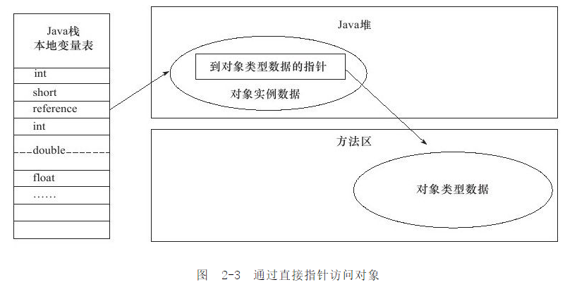

[TOC]

# 一、前言

介绍完Java虚拟机的运行时数据区之后，我们大致知道了虚拟机内存的概况，读者了解了内存中放了些什么后，也许就会想更进一步了解这些虚拟机内存中的数据的其他细节，譬如它们是如何创建、如何布局以及如何访问的。

**对于这样涉及细节的问题，必须把讨论范围限定在具体的虚拟机和集中在某一个内存区域上才有意义。**

基于实用优先的原则，笔者以常用的虚拟机HotSpot和常用的内存区域Java堆为例，深入探讨HotSpot虚拟机在Java堆中对象分配、布局和访问的全过程。

# 二、对象创建

## 1.创建流程

### 1.1 类加载检查

- 虚拟机遇到一条new指令时

- 首先将去检查这个指令的参数是否能在常量池中定位到一个类的符号引用

- 并且检查这个符号引用代表的类是否已被加载、解析和初始化过。如果没有，那必须先执行相应的类加载过程。

### 1.2 为新生对象分配内存

对象所需内存的大小在类加载完成后便可完全确定，为对象分配空间的任务等同于把一块确定大小的内存从Java堆中划分出来。

有两种内存分配方式：

- 指针碰撞
- 空闲列表

### 1.3 将分配到的内存空间初始化为零值

内存分配完成后，虚拟机需要将分配到的内存空间都初始化为零值（不包括对象头）。

### 1.4 设置对象头

接下来，虚拟机要对对象进行必要的设置，例如这个对象是哪个类的实例、如何才能找到类的元数据信息、对象的哈希码、对象的GC分代年龄等信息。这些信息存放在对象的对象头（ObjectHeader）之中。

根据虚拟机当前的运行状态的不同，如是否启用偏向锁等，对象头会有不同的设置方式。

### 1.5 调用对象的`<init>`方法

包括构造函数，静态语句块等。

## 2.内存分配方式

两种内存分配方式：

（1）**指针碰撞**

假设Java堆中内存是绝对规整的，所有用过的内存都放在一边，空闲的内存放在另一边，中间放着一个指针作为分界点的指示器，那所分配内存就仅仅是把那个指针向空闲空间那边挪动一段与对象大小相等的距离，这种分配方式称为“指针碰撞”（BumpthePointer）。

（2）**空闲列表**

如果Java堆中的内存并不是规整的，已使用的内存和空闲的内存相互交错，那就没有办法简单地进行指针碰撞了，虚拟机就必须维护一个列表，记录上哪些内存块是可用的，在分配的时候从列表中找到一块足够大的空间划分给对象实例，并更新列表上的记录，这种分配方式称为“空闲列表”（FreeList）。

**选择哪种分配方式由Java堆是否规整决定，而Java堆是否规整又由所采用的垃圾收集器是否带有压缩整理功能决定**。因此，在使用Serial、ParNew等带Compact过程的收集器时，系统采用的分配算法是指针碰撞，而使用CMS这种基于Mark-Sweep算法的收集器时，通常采用空闲列表。

## 3.线程安全问题解决

指针碰撞和空闲列表都存在线程安全问题

如何解决：

（1）同步（加锁）

对分配内存空间的动作进行同步处理——实际上虚拟机采用CAS配上失败重试的方式保证更新操作的原子性

（2）本地线程分配缓冲（延迟加锁）

把内存分配的动作按照线程划分在不同的空间之中进行，即每个线程在Java堆中预先分配一小块内存，称为本地线程分配缓冲（ThreadLocalAllocationBuffer,TLAB）。

哪个线程要分配内存，就在哪个线程的TLAB上分配，只有TLAB用完并分配新的TLAB时，才需要同步锁定。虚拟机是否使用TLAB，可以通过-XX:+/-UseTLAB参数来设定。

# 三、对象内存布局

对象的内存布局分为三块：

> - 对象头（Header）
> - 实例数据（InstanceData）
> - 对齐填充（Padding）。

## 1. 对象头

包括两部分信息：

### 1.1 MarkWord——自身运行时数据

哈希码（HashCode）、GC分代年龄、锁状态标志、线程持有的锁、偏向线程ID、偏向时间戳

> 这部分数据的长度在32位和64位的虚拟机（未开启压缩指针）中分别为32bit和64bit，官方称它为"MarkWord"。

### 1.2 类型指针

对象指向它的类元数据的指针，虚拟机通过这个指针来确定这个对象是哪个类的实例。

### 1.3 数组长度

如果对象是一个Java数组，那在对象头中还必须有一块用于记录数组长度的数据，因为虚拟机可以通过普通Java对象的元数据信息确定Java对象的大小，但是从数组的元数据中却无法确定数组的大小。

## 2. 实例数据

是对象真正存储的有效信息

> HotSpot虚拟机默认的分配策略为longs/doubles、ints、shorts/chars、bytes/booleans、oops（OrdinaryObjectPointers），从分配策略中可以看出，相同宽度的字段总是被分配到一起。在满足这个前提条件的情况下，在父类中定义的变量会出现在子类之前。

## 3.对齐填充

占位符

> 并不是必然存在，也没有特别的含义。
>
> 由于HotSpotVM的自动内存管理系统要求对象起始地址必须是8字节的整数倍，换句话说，就是对象的大小必须是8字节的整数倍。而对象头部分正好是8字节的倍数（1倍或者2倍），因此，当对象实例数据部分没有对齐时，就需要通过对齐填充来补全。

# 四、对象访问定位

建立对象是为了使用对象，我们的Java程序需要通过**栈上的reference**数据来操作堆上的具体对象。由于reference类型在Java虚拟机规范中只规定了一个**指向对象的引用**，并没有定义这个引用应该通过何种方式去定位、访问堆中的对象的具体位置，所以对象访问方式也是取决于虚拟机实现而定的。目前主流的访问方式有使用句柄和直接指针两种。

## 1.使用句柄

如果使用句柄访问的话，那么Java堆中将会划分出一块内存来作为句柄池，reference中存储的就是对象的句柄地址，而句柄中包含了对象实例数据与类型数据各自的具体地址信息，如下图

## 2.直接指针

如果使用直接指针访问，那么Java堆对象的布局中就必须考虑如何放置访问类型数据的相关信息，而reference中存储的直接就是对象地址

## 3.优点

- 使用句柄：更稳定

- 直接指针：速度更快。

HotSpot虚拟机采用的就是直接指针

