[TOC]


# 一、前言

 本文主要记录VMware 14 安装 CentOS7的过程


# 二、准备材料

## 1.版本信息

VMware ：14

CentOS : 7.x


## 2.linux下载

去官网下载

```
https://www.centos.org/download/
```

在此页面下，选择 Minimal ISO 进行下载。

 

# 三、VMWare中新建虚拟机

## 1.新建虚拟机

依次选择 文件 -> 新建虚拟机


 

 

## 2.新建虚拟机向导

选择 自定义安装


 

## 3.选择虚拟机硬件兼容性

默认即可

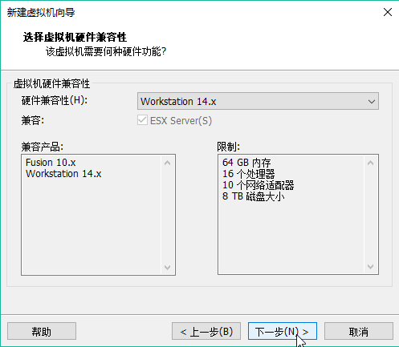

 

## 4.安装客户机操作系统

选择 稍后安装操作系统

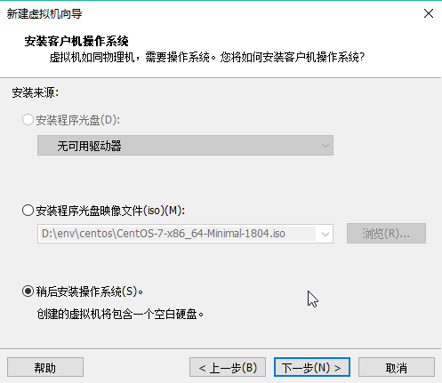

 

## 5.选择客户机操作系统

选择 Linux  CentOS 7 64 位

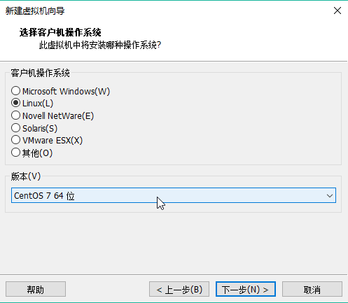

 

## 6.命名虚拟机

 为虚拟机命名，然后再自定义一个安装目录

 


 

## 7.处理器配置

此处默认即可

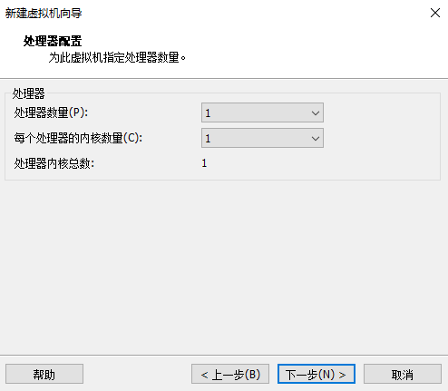

 

## 8.此虚拟机的内存

设置虚拟机的内存大小，我这里设置的是2G


 

## 9.网络类型

选择  “使用网络地址转换”

 


 

 

## 10.选择I/O控制器类型

默认即可


 

## 11.选择磁盘类型

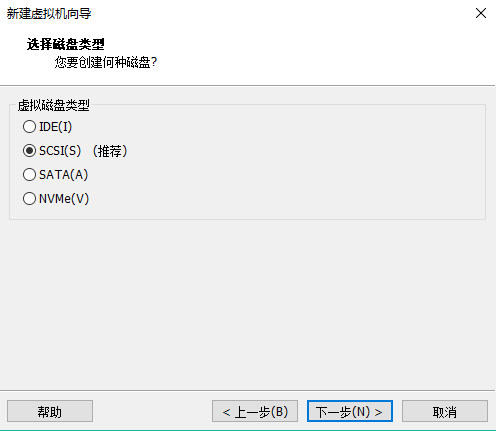

 

## 12.选择磁盘

 


 

## 13.指定磁盘容量

（1）设置一个最大磁盘大小：我这里设置的是20G

（2）选择 “将虚拟磁盘存储为单个文件”

 

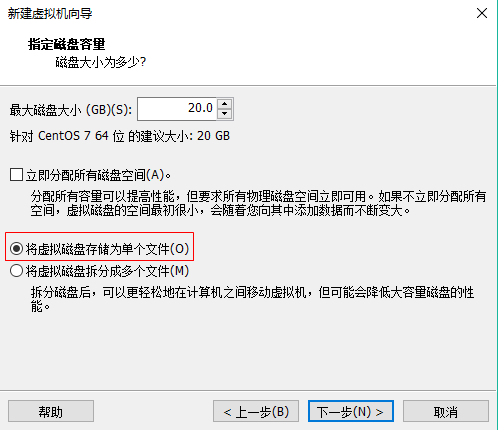

 

 

## 14.指定磁盘文件

 自定义磁盘文件的存储位置

 

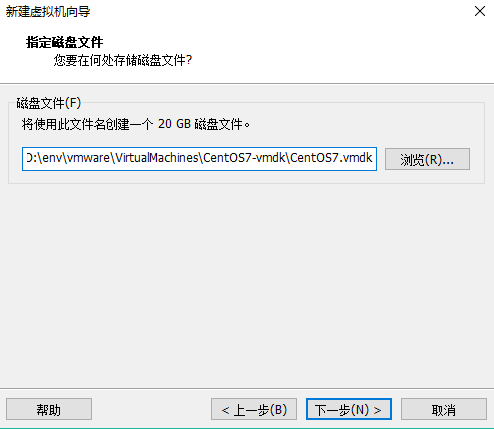

 

## 15.已准备好创建虚拟机

 选择 “自定义硬件”


 

## 16.硬件

（1）设置镜像文件

设置“新CD/DVD(IDE)”  -> 连接 -> 使用ISO镜像文件

然后选择2中下载好的镜像文件。


 

（2）删除打印机，然后点击关闭，再点击完成

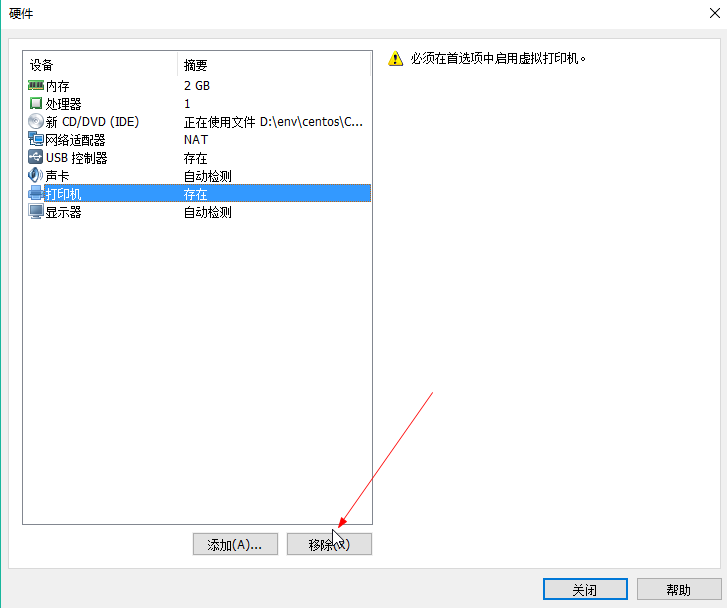


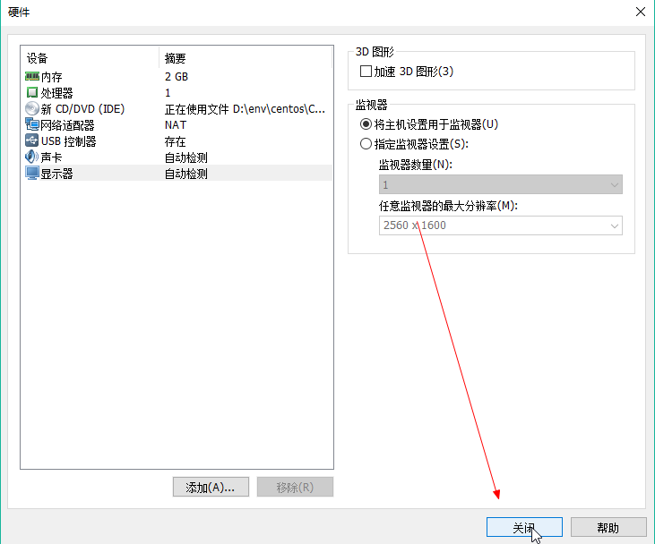

 

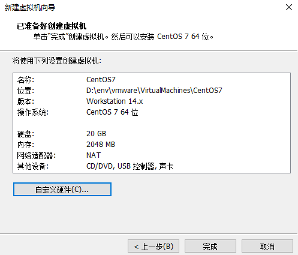

 

#  四、VMWare中安装CentOS7

## 1.开启此虚拟机

选择前面创建好的虚拟机，点击 开启此虚拟机

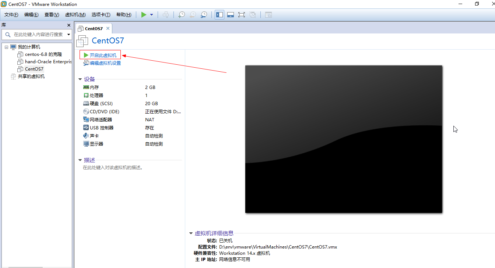

 

## 2.install centos 7

选择  `Install CentOS 7`


> 鼠标退出：Ctrl + ALT


## 3.选择语言

选择简体中文语言，再点击继续

 

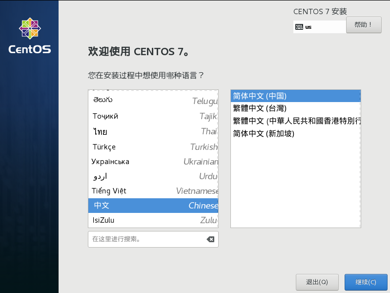

 

## 4.本地化

将日期和时间设置为亚洲上海

键盘、语言支持默认即可。

 


 

## 5.软件

### 5.1 安装源

这里会直接检测到刚刚配置的CentOS镜像，直接点击完成

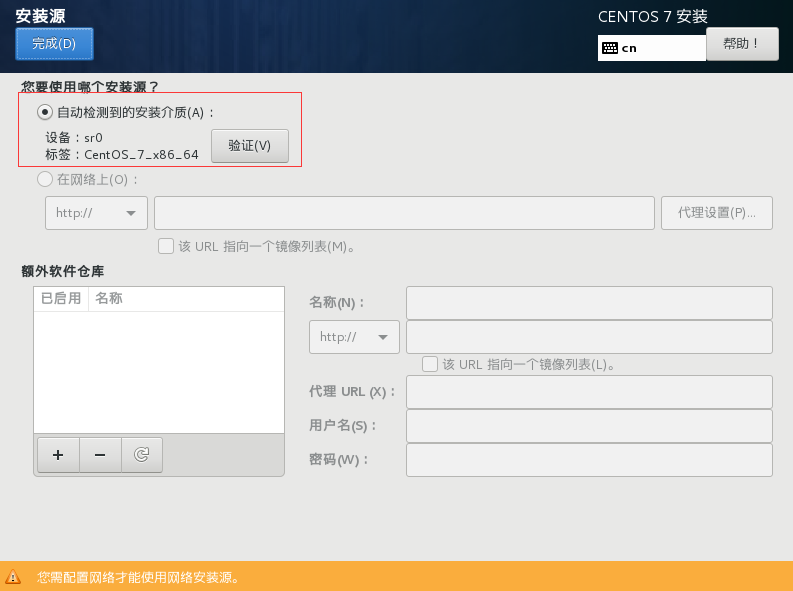


### 5.2 软件选择

这里我们选择 `GNOME 桌面`，并选择安装 `GNOME应用程序`、`开发工具`


## 6.系统

### 6.1 安装位置

可以使用默认的“自动分区”，

不过这里我们可以手动分区的方式来熟悉分区的方式。

#### 6.1.1 手动分区建议

一般需要创建如下四个分区

（1）20G硬盘以及1G RAM

| 分区  | 容量  | 类型 |
| ----- | ----- | ---- |
| /boot | 500MB | xfs  |
| /     | 8G    | xfs  |
| /home | 10G   | xfs  |
| swap  | 剩余  |      |

（2）80G硬盘以及2G RAM

| 分区  | 容量  | 类型 |
| ----- | ----- | ---- |
| /boot | 500MB | xfs  |
| /     | 13G   | xfs  |
| /home | 50G   | xfs  |
| var   | 4G    | xfs  |
| swap  | 剩余  |      |


#### 6.1.2 手动分区

（1）选择要分区的磁盘，然后勾选我要分区，最后点击完成，可进入分区页面。

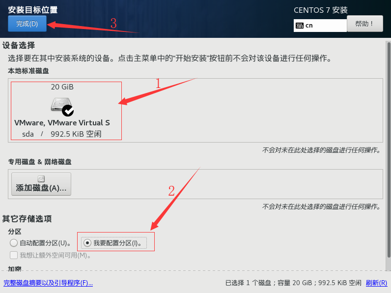


（2）分区方案选择“LVM”，然后点击“+”，选择挂载点“/boot”，期望容量为“500M”，然后点击“添加挂载点”。


 

同理，添加 `/ `、`/home` 、`swap`挂载点，然后点击“完成”

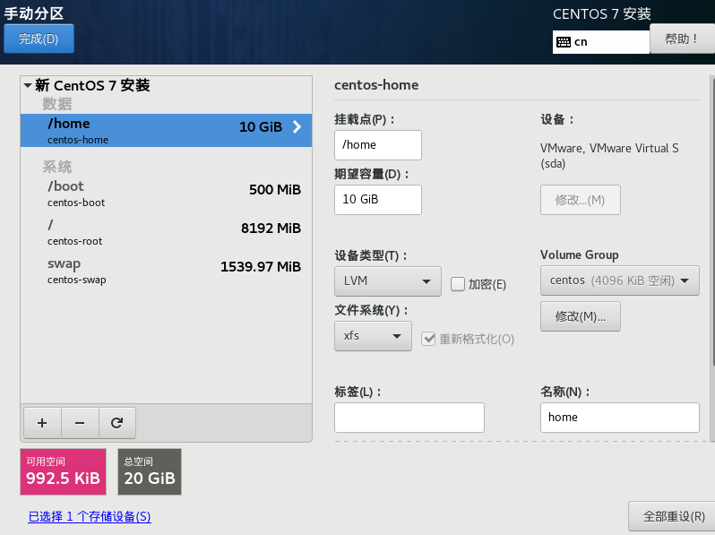


### 6.2 网络和主机名

这里设置状态为"打开"，其他默认即可。

~~（1）设置状态为“打开”，配置主机名，然后点击“配置...”~~


 

 ~~（2）配置静态IP~~


 

## 7.开始安装

（1）点击开始安装


 

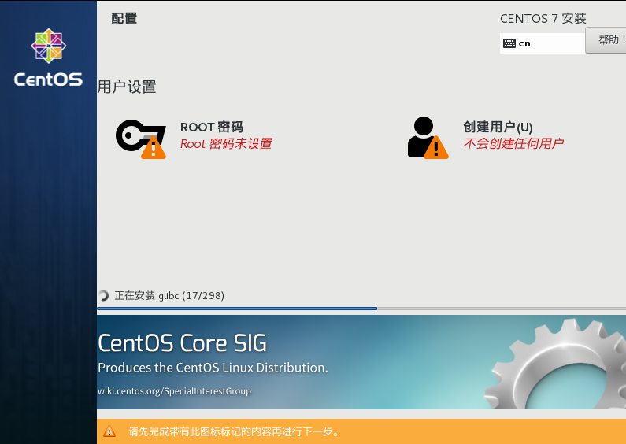

 

然后设置ROOT密码，创建一个用户，然后等待安装完成


### 7.1 Root密码

 点击设置Root密码

 

### 7.2 创建用户

创建一个用户，将其作为管理员，然后点击完成

 


 

##  8.重启

 安装完成之后，重启即可。


## 二、参考资料

1. [Windows 安装 VMware14 配置 centos7 教程](https://www.cc1021.com/article/156.html)
2. [CentOS 7.x 安装教程、硬盘分区、LVM、网络配置、软件源配](http://linux.it.net.cn/CentOS/course/2016/0519/22035.html)
3. [Installation of “CentOS 7.0″ with Screenshots](https://www.tecmint.com/centos-7-installation/)
4. [VMware安装Centos7超详细过程（图文）--51脚本](https://www.jb51.net/article/118850.htm)
5. [VMware虚拟机下安装CentOS7.0图文教程](https://www.linuxidc.com/Linux/2014-10/108013.htm)
6. [centos7.4 系统安装指导](https://www.cnblogs.com/xkus/p/7783583.html)