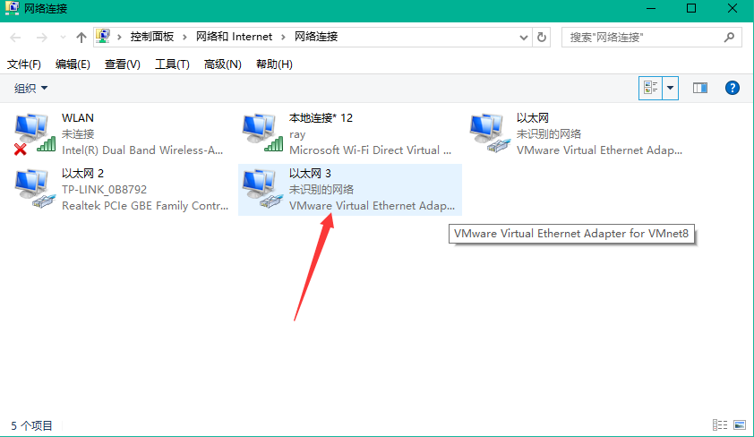
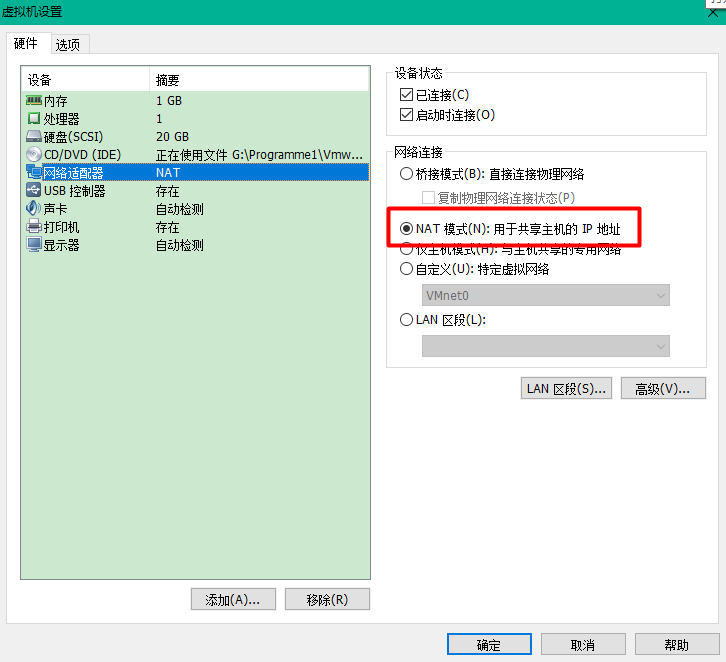
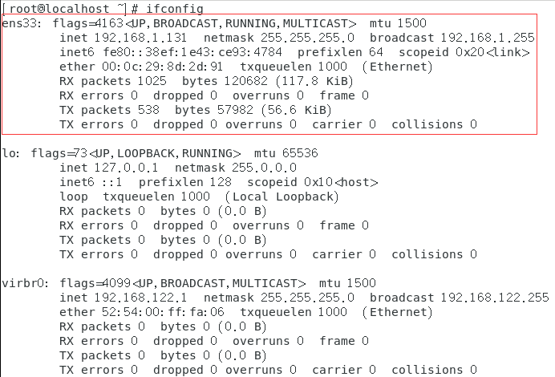

[TOC]


# 一、前言

前面新建的CentOS7的虚拟机的ip地址是动态变化的，这一节，我们将为虚拟机设置一个静态ip，并保证网络通畅


# 二、本地网络及VMware设置

## 1.本地网络

需要设置VMnet8

 控制面板—>网络和Internet—>网络共享中心—>更改网络适配器，即可进入网络连接



 

 找到VMnet8,右键—>属性—>Internet协议版本4（TCP/IPv4），设置ip地址和子网掩码，下图红框部分与linux系统一致。(保持和虚拟机IP保持在同一个网段)

 


## 2.VMware设置

### 2.1 VMware网络连接NAT模式

虚拟机—>设置



 

### 2.2 配置虚拟网络编辑器

在VMWare中，编辑—>虚拟网络编辑器


 

子网IP前三位、子网掩码与linux系统静态IP一致。


记住这个网关IP


# 三、linux静态ip配置

## 1.查看网络信息

### 1.1 查看ip地址

使用如下命令查看ip地址：

```bash
ifconfig
```





### 1.2 查看默认网卡设备文件

> 默认网卡设备文件在 `/etc/sysconfig/network-scripts` 文件夹下，文件名为 `ifcfg-${Name}`


使用如下命令查看默认网卡设备文件

```bash
cat /etc/sysconfig/network-scripts/ifcfg-ens33
```


```bash
TYPE="Ethernet" 			 # 网卡类型：为以太网
PROXY_METHOD="none" 		 # 代理方式：关闭状态
BROWSER_ONLY="no" 			 # 只是浏览器：否
BOOTPROTO="dhcp"		 	 # 网卡的引导协议：DHCP[中文名称: 动态主机配置协议]
DEFROUTE="yes"			 	 # 默认路由：是, 不明白的可以百度关键词 `默认路由` 
IPV4_FAILURE_FATAL="no"		 # 是不开启IPV4致命错误检测：否
IPV6INIT="yes"				 # IPV6是否自动初始化: 是[不会有任何影响, 现在还没用到IPV6]
IPV6_AUTOCONF="yes"			 # IPV6是否自动配置：是[不会有任何影响, 现在还没用到IPV6]
IPV6_DEFROUTE="yes"			 # IPV6是否可以为默认路由：是[不会有任何影响, 现在还没用到IPV6]
IPV6_FAILURE_FATAL="no"		 # 是不开启IPV6致命错误检测：否
IPV6_ADDR_GEN_MODE="stable-privacy"  # IPV6地址生成模型：stable-privacy [这只一种生成IPV6的策略]
NAME="ens33"						 # 网卡物理设备名称
UUID="8aaeb2df-738f-418b-87a4-8771a14693e3" 	# 通用唯一识别码, 每一个网卡都会有, 不能重复, 否则两台linux只有一台网卡可用
DEVICE="ens33"				 # 网卡设备名称, 必须和 `NAME` 值一样
ONBOOT="yes"  				 # 是否开机启动， 要想网卡开机就启动或通过 `systemctl restart network`控制网卡,必须设置为 `yes`
```


## 2.编辑默认网卡设备文件

### 2.1 编辑

编辑 `ifcfg-ens33` 配置文件

```bash
vim /etc/sysconfig/network-scripts/ifcfg-ens33
```

 

主要修改如下几处：

```bash
BOOTPROTO="static"   #设置网卡引导协议为 静态

ONBOOT="yes"         #设置网卡启动方式为 开机启动 并且可以通过系统服务管理器 systemctl 控制网卡

IPADDR="192.168.1.11"      # IP地址     
NETMASK="255.255.255.0"    # 子网掩码
GATEWAY="192.168.1.2"      # 网关,网关地址注意与前面查出来的保持一致，网关不对的话，后面是无法联网的

DNS1="114.114.114.114" 
DNS2="8.8.8.8"
```


> 此处的 GATEWAY 是虚拟机中配置的网关地址。 参见： [解决CentOS7虚拟机无法上网并设置CentOS7虚拟机使用静态IP上网](http://blog.csdn.net/a785975139/article/details/53023590)


> - 进入编辑模式：按I
>
> - 保存并退出vim：按esc退出编辑模式进入命令模式，输入：wq  即可保存并退出文件。

 

### 2.2 重启网络服务

```bash
systemctl restart network
```

或者

```
service network restart
```


### 2.3 完整配置信息

```bash
TYPE="Ethernet"
PROXY_METHOD="none"
BROWSER_ONLY="no"
BOOTPROTO="static"  		#<1>
DEFROUTE="yes"
IPV4_FAILURE_FATAL="no"
IPV6INIT="yes"
IPV6_AUTOCONF="yes"
IPV6_DEFROUTE="yes"
IPV6_FAILURE_FATAL="no"
IPV6_ADDR_GEN_MODE="stable-privacy"
NAME="ens33"
UUID="8aaeb2df-738f-418b-87a4-8771a14693e3"
DEVICE="ens33"
ONBOOT="yes"			    #<2>
IPADDR="192.168.1.11"       #<3>
NETMASK="255.255.255.0"     #<4>
GATEWAY="192.168.1.2"		#<5>
DNS1="114.114.114.114" 		#<6>
DNS2="8.8.8.8"				#<6>
```


## 3.检查网络是否通畅

使用 `ping` 命令检查网络是否通畅

``` bash
ping baidu.com
```


 


 

 

 

# 四、参考资料

1. [CentOS7配置网卡为静态IP，如果你还学不会那真的没有办法了！](https://segmentfault.com/a/1190000011954814)
2. [centOS7设置静态ip后无法上网的解决](https://blog.csdn.net/weiyongle1996/article/details/75050738)
3. [VMware虚拟机NAT模式的具体配置](https://blog.csdn.net/superbfly/article/details/52162214)
4. [解决CentOS7虚拟机无法上网并设置CentOS7虚拟机使用静态IP上网](http://blog.csdn.net/a785975139/article/details/53023590)
5. [Centos 7 学习之静态IP设置](https://blog.csdn.net/johnnycode/article/details/40624403)


