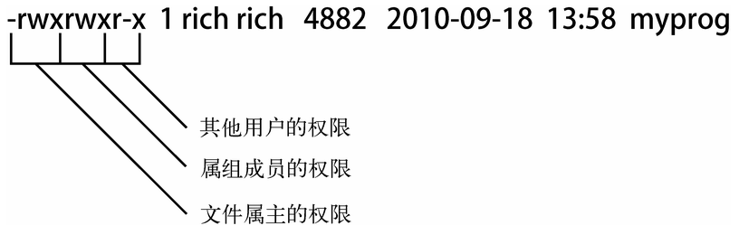

[TOC]


# 前言


# 一、Linux 安全性

Linux安全系统的核心是用户账户，每个能进入Linux系统的用户都会被分配唯一的用户账户。

用户对系统中各种对象的访问权限取决于他们登录系统时用的账户。

用户权限是通过创建用户时分配的用户ID（UserID，通常缩写为UID）来跟踪的。


## 1. `/etc/passwd` 文件

Linux系统使用一个专门的文件（`/etc/passwd`）来将用户的登录名匹配到对应的UID值。


```shell
[ray@localhost etc]$ cat /etc/passwd
root:x:0:0:root:/root:/bin/bash
bin:x:1:1:bin:/bin:/sbin/nologin
daemon:x:2:2:daemon:/sbin:/sbin/nologin
adm:x:3:4:adm:/var/adm:/sbin/nologin
lp:x:4:7:lp:/var/spool/lpd:/sbin/nologin
sync:x:5:0:sync:/sbin:/bin/sync
shutdown:x:6:0:shutdown:/sbin:/sbin/shutdown
halt:x:7:0:halt:/sbin:/sbin/halt
mail:x:8:12:mail:/var/spool/mail:/sbin/nologin
operator:x:11:0:operator:/root:/sbin/nologin
games:x:12:100:games:/usr/games:/sbin/nologin
ftp:x:14:50:FTP User:/var/ftp:/sbin/nologin
nobody:x:99:99:Nobody:/:/sbin/nologin
systemd-network:x:192:192:systemd Network Management:/:/sbin/nologin
dbus:x:81:81:System message bus:/:/sbin/nologin
polkitd:x:999:998:User for polkitd:/:/sbin/nologin
libstoragemgmt:x:998:995:daemon account for libstoragemgmt:/var/run/lsm:/sbin/nologin
colord:x:997:994:User for colord:/var/lib/colord:/sbin/nologin
rpc:x:32:32:Rpcbind Daemon:/var/lib/rpcbind:/sbin/nologin
gluster:x:996:993:GlusterFS daemons:/run/gluster:/sbin/nologin
saslauth:x:995:76:Saslauthd user:/run/saslauthd:/sbin/nologin
abrt:x:173:173::/etc/abrt:/sbin/nologin
rtkit:x:172:172:RealtimeKit:/proc:/sbin/nologin
pulse:x:171:171:PulseAudio System Daemon:/var/run/pulse:/sbin/nologin
radvd:x:75:75:radvd user:/:/sbin/nologin
unbound:x:994:989:Unbound DNS resolver:/etc/unbound:/sbin/nologin
chrony:x:993:988::/var/lib/chrony:/sbin/nologin
rpcuser:x:29:29:RPC Service User:/var/lib/nfs:/sbin/nologin
nfsnobody:x:65534:65534:Anonymous NFS User:/var/lib/nfs:/sbin/nologin
qemu:x:107:107:qemu user:/:/sbin/nologin
tss:x:59:59:Account used by the trousers package to sandbox the tcsd daemon:/dev/null:/sbin/nologin
usbmuxd:x:113:113:usbmuxd user:/:/sbin/nologin
geoclue:x:992:986:User for geoclue:/var/lib/geoclue:/sbin/nologin
ntp:x:38:38::/etc/ntp:/sbin/nologin
sssd:x:991:985:User for sssd:/:/sbin/nologin
setroubleshoot:x:990:984::/var/lib/setroubleshoot:/sbin/nologin
saned:x:989:983:SANE scanner daemon user:/usr/share/sane:/sbin/nologin
gdm:x:42:42::/var/lib/gdm:/sbin/nologin
gnome-initial-setup:x:988:982::/run/gnome-initial-setup/:/sbin/nologin
sshd:x:74:74:Privilege-separated SSH:/var/empty/sshd:/sbin/nologin
avahi:x:70:70:Avahi mDNS/DNS-SD Stack:/var/run/avahi-daemon:/sbin/nologin
postfix:x:89:89::/var/spool/postfix:/sbin/nologin
tcpdump:x:72:72::/:/sbin/nologin
ray:x:1000:1000:ray:/home/ray:/bin/bash
```


`/etc/passwd`文件的字段包含了如下信息：

> - 登录用户名
> - 用户密码
> - 用户账户的UID（数字形式）
> - 用户账户的组ID（GID）（数字形式）
> - 用户账户的文本描述（称为备注字段）
> - 用户HOME目录的位置
> - 用户的默认shell


`/etc/shadow` ：

> - 在上面的示例中，密码字段被设置成了x，这只是起一个占位作用。因为，在早期，`/etc/passwd` 文件中保存了用户加密后的密码，但由于许多程序都需要访问此文件来获取用户信息，这就构成了一个安全隐患。Linux开发者开始重新考虑这个策略。
>
> - 现在，绝大多数Linux系统都将用户密码保存在另一个单独的文件中（叫作shadow文件，位置在/etc/shadow）。只有特定的程序（比如登录程序）才能访问这个文件。


## 2.`/etc/shadow` 文件

>  `/etc/shadow`文件对Linux系统密码管理提供了更多的控制。只有root用户才能访问`/etc/shadow`文件，这让它比 `/etc/passwd`安全许多。


`/etc/shadow` 文件为系统上的每个用户账户都保存了一条记录

> 在/etc/shadow文件的每条记录中都有9个字段：
>
> - 与/etc/passwd文件中的登录名字段对应的登录名
> - 加密后的密码
> - 自上次修改密码后过去的天数密码（自1970年1月1日开始计算）
> - 多少天后才能更改密码
> - 多少天后必须更改密码
> - 密码过期前提前多少天提醒用户更改密码
> - 密码过期后多少天禁用用户账户
> - 用户账户被禁用的日期（用自1970年1月1日到当天的天数表示）
> - 预留字段给将来使用


使用shadow密码系统后，Linux系统可以更好地控制用户密码。它可以控制用户多久更改一次密码，以及什么时候禁用该用户账户，如果密码未更新的话。


# 二、管理用户

## 1.useradd

使用 `useradd` 添加用户

### 1.1 默认值

> - useradd命令使用系统的默认值以及命令行参数来设置用户账户
> - 系统默认值被设置在 `/etc/default/useradd` 文件中
> - 可以使用加入了 -D 选项的 useradd 命令查看所用Linux系统中的这些默认值


```shell
[ray@localhost etc]$ useradd -D
GROUP=100
HOME=/home
INACTIVE=-1
EXPIRE=
SHELL=/bin/bash
SKEL=/etc/skel
CREATE_MAIL_SPOOL=yes
```


在创建新用户时，如果你不在命令行中指定具体的值，useradd命令就会使用-D选项所显示的那些默认值:

> - 新用户会被添加到GID为100的公共组；
> - 新用户的HOME目录将会位于/home/loginname；
> - 新用户账户密码在过期后不会被禁用；
> - 新用户账户未被设置过期日期；
> - 新用户账户将 `bash shell` 作为默认shell；
> - 系统会将 `/etc/skel` 目录下的内容复制到用户的HOME目录下；
> - 系统为该用户账户在mail目录下创建一个用于接收邮件的文件。


### 1.2 synopsis


```shell
useradd -D              # 查看默认值
useradd -D [options]    # 修改默认值

useradd [options] LOGIN  # 添加新用户
```


### 1.3 options

```shell
-c<备注>：加上备注文字。备注文字会保存在passwd的备注栏位中；
-d<登入目录>：指定用户登入时的启始目录；
-D：变更预设值；
-e<有效期限>：指定帐号的有效期限；
-f<缓冲天数>：指定在密码过期后多少天即关闭该帐号；
-g<群组>：指定用户所属的群组；
-G<群组>：指定用户所属的附加群组；
-m：自动建立用户的登入目录；
-M：不要自动建立用户的登入目录；
-n：取消建立以用户名称为名的群组；
-r：建立系统帐号；
-s<shell>：指定用户登入后所使用的shell；
-u<uid>：指定用户id。
```


### 1.4 example

注：**创建用户时会使用默认值**


- 新建用户加入组：

```shell
useradd –g sales jack –G company,employees    //-g：加入主要组、-G：加入次要组
```


- 建立一个新用户账户，并设置ID：

```shell
useradd caojh -u 544
```

需要说明的是:

> 设定ID值时尽量要大于500，以免冲突。因为Linux安装后会建立一些特殊用户，一般0到499之间的值留给bin、mail这样的系统账号。


- 修改默认值

```shell
useradd -D -s /bin/ tsch  ## 修改默认值
```


## 2.userdel

删除用户以及与用户相关的文件

> 默认情况下，`userdel` 命令会只删除 `/etc/passwd` 文件中的用户信息，而不会删除系统中属于该账户的任何文件。


### 2.1 synopsis

```shell
 userdel [options] LOGIN  ## LOGIN:用户登录名
```


### 2.2 options

```shell
-f：强制删除用户，即使用户当前已登录；
-r：删除用户的同时，删除与用户相关的所有文件。
```


### 2.3 example

```shell
userdel linuxde       # 删除用户linuxde，但不删除其家目录及文件；

userdel -r linuxde    # 删除用户linuxde，其家目录及文件一并删除；
```


注意：要谨慎使用 `-r` 参数


## 3.usermod

### 3.1 usermod

用于修改用户的基本信息

```shell
usermod [options] LOGIN
```


options

```shell
-c<备注>：修改用户帐号的备注文字；
-d<登入目录>：修改用户登入时的目录；
-e<有效期限>：修改帐号的有效期限；
-f<缓冲天数>：修改在密码过期后多少天即关闭该帐号；
-g<群组>：修改用户所属的群组；
-G<群组>；修改用户所属的附加群组；
-l<帐号名称>：修改用户帐号名称；
-L：锁定用户密码，使密码无效；
-s<shell>：修改用户登入后所使用的shell；
-u<uid>：修改用户ID；
-U:解除密码锁定。
```


example

```shell
usermod -G staff newuser2    # 将 newuser2 添加到组 staff 中
```


```shell
usermod -l newuser1 newuser  # 修改newuser的用户名为newuser1
```


```shell
usermod -L newuser1         # 锁定账号newuser1
```


```shell
usermod -U newuser1   # 解除对newuser1的锁定
```


```shell
# 增加用户到用户组中
apk add shadow 			# 安装 shadow 包, usermod 命令包含在 usermod 中

# 添加用户到用户组中  
usermod -aG group user  # `-a` 参数表示附加，只和 `-G` 参数一同使用，表示将用户增加到组中。
```


### 3.2 passwd 和 chpasswd

- `passwd`：让用户可以更改自己的密码 （只有root用户有权限修改别的用户的密码）


example:

（1）如果是普通用户执行passwd只能修改自己的密码。如果新建用户后，要为新用户创建密码，则用passwd用户名，注意要以root用户的权限来创建。

```shell
[root@localhost ~]# passwd linuxde    //更改或创建linuxde用户的密码；
Changing password for user linuxde.
New UNIX password:          //请输入新密码；
Retype new UNIX password:   //再输入一次；
passwd: all authentication tokens updated successfully. //成功；
```


（2）普通用户如果想更改自己的密码，直接运行passwd即可，比如当前操作的用户是linuxde。

```shell
[linuxde@localhost ~]$ passwd
Changing password for user linuxde. //更改linuxde用户的密码；
(current) UNIX password:   //请输入当前密码；
New UNIX password:         //请输入新密码；
Retype new UNIX password:  //确认新密码；
passwd: all authentication tokens updated successfully. //更改成功；
```


（3）参数示例

比如我们让某个用户不能修改密码，可以用`-l`选项来锁定：

```shell
[root@localhost ~]# passwd -l linuxde    //锁定用户linuxde不能更改密码；
Locking password for user linuxde.
passwd: Success           //锁定成功；
```

```shell
[root@localhost ~]# passwd -d linuxde  //清除linuxde用户密码；
Removing password for user linuxde.
passwd: Success                         //清除成功；
[root@localhost ~]# passwd -S linuxde    //查询linuxde用户密码状态；
Empty password.                         //空密码，也就是没有密码；
```


- `chpasswd` ：批量更新用户口令的工具

> **chpasswd命令** 是批量更新用户口令的工具，是把一个文件内容重新定向添加到`/etc/shadow`中。


example：

先创建用户密码对应文件，格式为`username:password`，如`abc:abc123`，必须以这种格式来书写，并且不能有空行，保存成文本文件user.txt，然后执行chpasswd命令：

```
chpasswd < user.txt
```

以上是运用chpasswd命令来批量修改密码。是linux系统管理中的捷径。


### 3.3 chsh 、chfn 和 chage

- chsh：用来更换登录系统时使用的shell
- chfn：用来改变finger命令显示的信息。这些信息都存放在/etc目录里的passwd文件里。若不指定任何选项，则chfn命令会进入问答式界面。

- chage  ：是用来修改帐号和密码的有效期限


```shell
-m：密码可更改的最小天数。为零时代表任何时候都可以更改密码。
-M：密码保持有效的最大天数。
-w：用户密码到期前，提前收到警告信息的天数。
-E：帐号到期的日期。过了这天，此帐号将不可用。
-d：上一次更改的日期。
-i：停滞时期。如果一个密码已过期这些天，那么此帐号将不可用。
-l：例出当前的设置。由非特权用户来确定他们的密码或帐号何时过期。
```


# 三、管理组

组权限允许多个用户对系统中的对象（比如文件、目录或设备等）共享一组共用的权限。

## 1./etc/group 文件

和UID一样，GID在分配时也采用了特定的格式。系统账户用的组通常会分配低于500的GID值，而用户组的GID则会从500开始分配。

/etc/group文件有4个字段：

- 组名
- 组密码
- GID
- 属于该组的用户列表


## 2.groupadd

**groupadd命令** 用于创建一个新的工作组，新工作组的信息将被添加到系统文件中。


options：

```shell
-g：指定新建工作组的id；
-r：创建系统工作组，系统工作组的组ID小于500；
-K：覆盖配置文件“/ect/login.defs”；
-o：允许添加组ID号不唯一的工作组。
```


exmaple:

```shell
# 建立一个新组，并设置组ID加入系统
groupadd -g 344 springGroup        # 此时在/etc/passwd文件中产生一个组ID（GID）是344的项目。

usermod -G springGroup tom         # 将tom加入springGroup组
```


注：

> 如果加了-g选项，指定的组名会替换掉该账户的默认组。
>
> -G选项则将该组添加到用户的属组的列表里，不会影响默认组。


## 3.groupmod

更改群组ID或名称


```shell
-g<群组ID>：设置欲使用的群组识别码；
-o：重复使用群组识别码；
-n<新群组名称>：设置欲使用的群组名称。
```


example：

```shell
groupmod -n springGroup springGroup2
```


# 四、文件权限

## 1.理解文件权限

### 1.1 文件权限符

使用`ls -l`命令查看文件、目录的信息

````shell
[ray@localhost dev]$ ls -l
total 4
drwxrwxr-x. 2 ray ray  45 Jan 15 20:34 dir1
drwxrwxr-x. 2 ray ray  80 Jan 17 16:07 dir2
-rw-r--r--. 1 ray ray 419 Jan  9 20:21 ifcfg-ens33
lrwxrwxrwx. 1 ray ray   8 Jan  9 20:05 test2_link -> test2.sh
-rw-rw-r--. 1 ray ray   0 Jan  9 20:12 test2.sh
-rw-rw-r--. 1 ray ray   0 Jan  9 20:03 test3.sh
-rw-rw-r--. 1 ray ray   0 Jan 14 17:23 test4.sh
-rw-rw-r--. 1 ray ray   0 Jan  9 20:02 test.sh
````


输出结果的第一个字段就是描述文件和目录权限的编码。


##### 1.1.1 对象类型

这个字段的第一个字符代表了对象的类型：

- `-`  代表文件
- `d`  代表目录
- `l`  代表链接
- `c`  代表字符型设备
- `b`  代表块设备
- `n` 代表网络设备


##### 1.1.2  访问权限

之后有3组三字符的编码。每一组定义了3种访问权限：

- `r `代表对象是可读的
- `w` 代表对象是可写的
- `x` 代表对象是可执行的

若没有某种权限，在该权限位会出现单破折线。


##### 1.1.3  安全级别

这3组权限分别对应对象的3个安全级别：

- 对象的属主
- 对象的属组
- 系统其他用户





##### 1.1.4 Example

```shell
-rwxrwxr-x 1 rich rich 4882 2010-09-18 13: 58 myprog
```


分析：

>  文件myprog有下面3组权限。
>
> - rwx：文件的属主（设为登录名rich）。
> - rwx：文件的属组（设为组名rich）。
> - r-x ：系统上其他 人。
>
>
> 解读：
>
> > 登录名为rich的用户可以读取、写入以及执行这个文件（可以看作有全部权限）。
> >
> > 类似地，rich组的成员也可以读取、写入和执行这个文件。
> >
> > 然而不属于rich组的其他用户只能读取和执行这个文件：w被单破折线取代了，说明这个安全级别没有写入权限。


### 1.2 默认文件权限

umask命令用来设置所创建文件和目录的默认权限。

```shell
$ touch  newfile  # 使用touch命令创建文件时，会赋予文件默认的文件权限
$ ls -al newfile 
-rw-r--r-- 1 rich rich 0 Sep 20 19: 16 newfile
$
$ umask          # umask命令可以显示和设置这个默认权限
0022 
$
```


#### 1.2.1 粘着位

umask 第一位代表了一项特别的安全特性，叫作粘着位（stickybit）。


#### 1.2.2 文件权限码

后面的3位表示文件或目录对应的umask八进制值。


八进制模式的安全性设置：

> - **先获取这3个rwx权限的值，然后将其转换成3位二进制值，用一个八进制值来表示**。
> - 在这个二进制表示中，每个位置代表一个二进制位。
> - 因此，如果读权限是唯一置位的权限，权限值就是r--，转换成二进制值就是100，代表的八进制值是4。表7-5列出了可能会遇到的组合。


文件权限码：

| 权限 | 二进制值 | 八进制值 | 描述             |
| ---- | -------- | -------- | ---------------- |
| ---  | 000      | 0        | 没有任何权限     |
| --x  | 001      | 1        | 只有执行权限     |
| -w-  | 010      | 2        | 只有写入权限     |
| -wx  | 011      | 3        | 有写入和执行权限 |
| r--  | 100      | 4        | 只有读取权限     |
| r-x  | 101      | 5        | 有读取和执行权限 |
| rw-  | 110      | 6        | 有读取和写入权限 |
| rwx  | 111      | 7        | 有全部权限       |


八进制模式：

- 先取得权限的八进制值，然后再把这三组安全级别（属主、属组和其他用户）的八进制值顺序列出。


**权限 =  全权限 - umask**

> - 文件全权限为 666，目录全权限为 777
> - 在上述示例中，文件全权限为 666，减去掩码022  ，即为权限644


### 1.2.3 修改掩码

```shell
$ umask 026   # 设置默认掩码为 026
```


## 2.改变权限

**chmod命令** 用来变更文件或目录的权限。


```shell
 chmod  [OPTION]...   MODE[,MODE]...   FILE...
```


> - mode : 权限模式，可以使用八进制模式或符号模式


options：

```shell
u  # 操作对象简称，用户user，文件或目录的所有者。
g  # 操作对象简称，同组用户group，文件或目录所属群组
o  # 操作对象简称，其它用户others
a  # 操作对象简称，所有用户all，系统默认使用此项
+  # 权限操作符，添加某些权限
-  # 权限操作符，取消某些权限
=  # 权限操作符，设置文件的权限为给定的权限
r  # 权限设定（英文），表示可读权限
w  # 权限设定（英文），表示可写权限
x  # 权限设定（英文），表示可执行权限
-  # 权限设定（英文字符），表示没有权限
X  # 权限设定，如果目标文件是可执行文件或目录，可给其设置可执行权限
s  # 权限设定，设置权限suid和sgid，使用权限组合“u+s”设定文件的用户的ID位，“g+s”设置组ID位
t  # 权限设定，只有目录或文件的所有者才可以删除目录下的文件
-c或——changes    # 效果类似“-v”参数，但仅回报更改的部分，如果文件权限已经改变，显示其操作信息；
-f或--quiet或——silent # 操作过程中不显示任何错误信息；
-R或——recursive  # 递归处理，将指令目录下的所有文件及子目录一并处理；
-v或——verbose    # 显示命令运行时的详细执行过程；
--reference=<参考文件或目录> # 把指定文件或目录的所属群组全部设成和参考文件或目录的所属群组相同；
<权限范围>+<权限设置> # 开启权限范围的文件或目录的该选项权限设置；
<权限范围>-<权限设置> # 关闭权限范围的文件或目录的该选项权限设置；
<权限范围>=<权限设置> # 指定权限范围的文件或目录的该选项权限设置；
--help    # 显示帮助信息
--version # 显示版本信息
```


符号模式的格式：

```shell
[ugoa…][[ +-=][ rwxXstugo…]
```


Example:

（1）文件权限

```shell
chmod u+x,g+w f01　　# 为文件f01设置自己可以执行，组员可以写入的权限
chmod u=rwx,g=rw,o=r f01
chmod 764 f01
chmod a+x f01　　    # 对文件f01的u,g,o都设置可执行属性
```


（2）文件的属主和属组属性设置

```shell
chown user:market f01　　# 把文件f01给uesr，添加到market组
ll -d f1  查看目录f1的属性
```


## 3.改变所属关系

- chown命令用来改变文件的属主或属组

- chgrp命令用来改变文件的默认属组。


### 3.1 chown

> - 可以用来改变某个文件或目录的属主和属组。
> - 用户可以是用户或者是用户D，用户组可以是组名或组id。文件名可以使由空格分开的文件列表，在文件名中可以包含通配符。
> - 只有文件主和超级用户才可以便用该命令。


```shell
chown options owner[. group] file
```


options:

```shell
-c或——changes：效果类似“-v”参数，但仅回报更改的部分；
-f或--quite或——silent：不显示错误信息；
-h或--no-dereference：只对符号连接的文件作修改，而不更改其他任何相关文件；
-R或——recursive：递归处理，将指定目录下的所有文件及子目录一并处理；
-v或——version：显示指令执行过程；
--dereference：效果和“-h”参数相同；
--help：在线帮助；
--reference=<参考文件或目录>：把指定文件或目录的拥有者与所属群组全部设成和参考文件或目录的拥有者与所属群组相同；
--version：显示版本信息。
```


Example:

```shell
chown tom newfile  				 # 可用登录名或UID来指定文件的新属主
chown tom.springGroup newfile    # chown命令也支持同时改变文件的属主和属组
chown -R liu /usr/meng       	 # 将目录/usr/meng及其下面的所有文件、子目录的属主改成 liu
```


> 只有root用户能够改变文件的属主。任何属主都可以改变文件的属组，但前提是属主必须是原属组和目标属组的成员。


### 3.2 chgrp

用来变更文件或目录的所属群组

```shell
 chgrp [OPTION]... GROUP FILE..
```


options：

```shell
-R 递归式地改变指定目录及其下的所有子目录和文件的所属的组
-c或——changes：效果类似“-v”参数，但仅回报更改的部分；
-f或--quiet或——silent：不显示错误信息；
-h或--no-dereference：只对符号连接的文件作修改，而不是该其他任何相关文件；
-H如果命令行参数是一个通到目录的符号链接，则遍历符号链接
-R或——recursive：递归处理，将指令目录下的所有文件及子目录一并处理；
-L遍历每一个遇到的通到目录的符号链接
-P不遍历任何符号链接（默认）
-v或——verbose：显示指令执行过程；
--reference=<参考文件或目录>：把指定文件或目录的所属群组全部设成和参考文件或目录的所属群组相同；
```


Example：

```shell
chgrp -R mengxin /usr/meng        # 将/usr/meng及其子目录下的所有文件的用户组改为mengxin
chgrp newGroup file1              # 更改文件file1的群组为newGroup
```


注意：

> 用户必须是该文件的属主，且是新组的成员。


