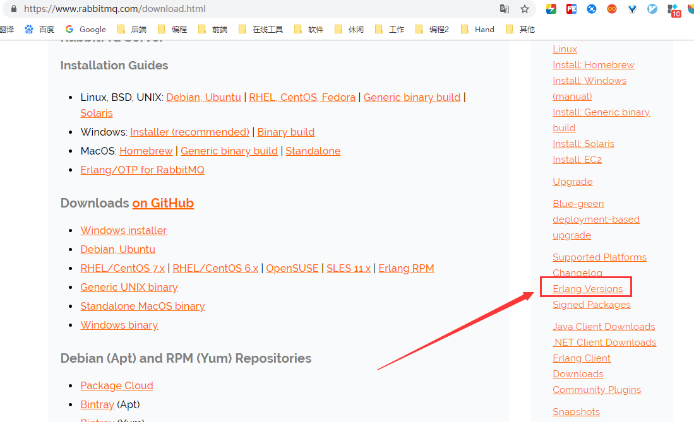
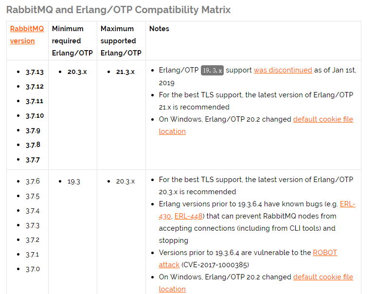
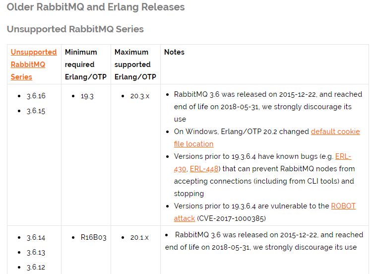
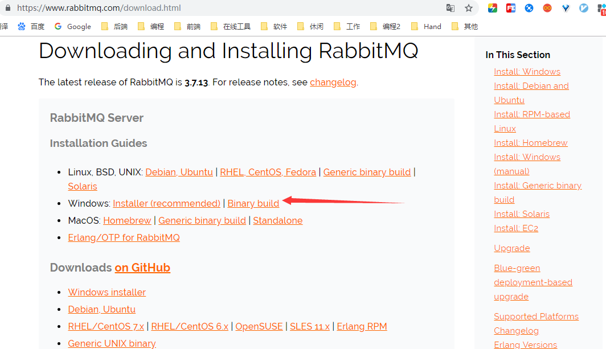
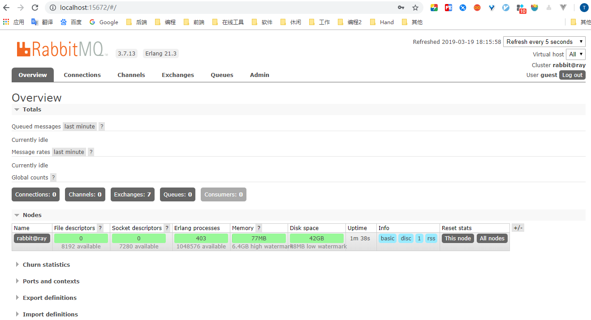

[TOC]


# 简介


> - [RabbitMQ官网](https://www.rabbitmq.com/) 
> - [RabbitMQ 与 Erlang Version 匹配表](https://www.rabbitmq.com/which-erlang.html) 


# 一、Windows上安装RabbitMQ

> RabbitMQ由Erlang语言开发，Erlang语言用于并发及分布式系统的开发，在电信领域应用广泛，OTP（Open
> Telecom Platform）作为Erlang语言的一部分，包含了很多基于Erlang开发的中间件及工具库。


安装RabbitMQ需要安装Erlang/OTP，并保持版本匹配


## 1.RabbitMQ 与 Erlang 版本匹配表

（1）前往 [RabbitMQ 官网下载页](https://www.rabbitmq.com/download.html) 





（2）然后再右侧栏点击 [Erlang Version](https://www.rabbitmq.com/which-erlang.html) ，即可看到 RabbitMQ 与 Erlang 版本匹配表





（3）继续往下翻，还能找到 RabbitMQ 的历史版本与 ErLang 的匹配表





## 2.安装 Erlang

### 2.1 下载

这里我们准备安装 RabbitMQ 3.7.13 ，然后安装表中推荐的 ErLang 21.x

前往 Erlang 官网下载页（http://www.erlang.org/downloads），下载对应版本的 OPT


### 2.2 安装

除了需要自定义安装目录外，其他按照安装向导一路默认即可


### 2.3 配置环境变量

创建一个名为 `ERLANG_HOME` 的用户变量，其值指向 `Erlang` 的安装目录，同时将 `%ERLANG_HOME%\bin`加入到 `path` 中

```properties
ERLANG_HOME=C:\dev-env\erlang\InstallSite
path=%ERLANG_HOME%\bin;   # 追加到path
```


### 2.4 验证

打开命令行，输入如下命令，若出现 Eshell 的版本，说明安装成功

```
C:\Users\shira>erl
Eshell V10.3  (abort with ^G)
1>
```


## 3. 安装RabbitMQ

> 具体的安装及使用入门可参见官方 [Installing on Windows (manual)](https://www.rabbitmq.com/install-windows-manual.html)


### 3.1 下载

（1）前往 RabbitMQ 官网下载页（https://www.rabbitmq.com/download.html），选择 [Binary build](https://www.rabbitmq.com/install-windows-manual.html)方式下载




（2）点击下载链接下载即可


### 3.2 安装

解压即可，可执行命令都在sbin目录


关于这些可执行命令的使用：

```bash
# 服务的安装与启停
rabbitmq-service install   # 同 rabbitmq-service.bat install
rabbitmq-service start
rabbitmq-service stop

# 查看mq的状态
rabbitmqctl status

# 
rabbitmq-server.bat -detached
# 停止节点
rabbitmqctl  stop

# 安装管理插件
rabbitmq-plugins enable rabbitmq_management  # 以管理员权限运行

```


为方便使用这些命令，我们可以将此目录添加到环境变量中。


### 3.3 配置环境变量

```properties
RABBITMQ_HOME=C:\dev-env\rabbitmq\rabbitmq_server-3.7.13
path=%RABBITMQ_HOME%\sbin;    # 追加到path
```


### 3.4 安装并运行服务

#### 3.4.1 安装服务

以管理员权限运行cmd，然后执行如下命令，即可安装 rabbitmq服务

```bash
rabbitmq-service install
```


若出现下面的异常，则可能是没以管理员权限运行cmd（笔者正是这个情况而导致的此异常），以管理员权限运行cmd，然后重新安装服务即可

```
C:\Users\shira>rabbitmq-service install
C:\dev-env\erlang\InstallSite\erts-10.3\bin\erlsrv: Unable to register RabbitMQ service with service manager.
Error: ¾Ü¾ø·ÃÎÊ¡£
"WARNING: Using RABBITMQ_ADVANCED_CONFIG_FILE: C:\Users\shira\AppData\Roaming\RabbitMQ\advanced.config"
C:\dev-env\erlang\InstallSite\erts-10.3\bin\erlsrv: No service with the name RabbitMQ exists.
```


#### 3.4.2 RabbitMQ启停

> 下面命令仍然需要以管理员权限运行cmd，否则会报`拒绝访问`的错误。

以服务的方式来启停RabbitMQ（推荐）

```
rabbitmq-service start
rabbitmq-service stop
```

以应用的方式来启动RabbitMQ

```
rabbitmq-server.bat -detached
```


### 3.5 安装管理插件

以管理员权限运行cmd，然后执行如下命令，以安装 RabbitMQ 管理插件

```bash
rabbitmq-plugins enable rabbitmq_management
```

安装完管理插件后需要重启 RabbitMQ，然后再访问如下地址

> http://localhost:15672/
>
> 以游客身份登录：guest/guest





## 4. 配置

待续


# 附录一：卸载RabbitMQ

（1）卸载软件

> 需卸载 Erlang、RabbitMQ
>
> 在控制面板中卸载软件，若有安装目录还有残留文件则清理一下


（2）清理注册表

> 可则将注册表中 RabbitMQ、ErlSrv  删除


（3）清理临时文件

> 


（4）清理 `.erlang.cookie`

> 使用EveryThing 全局搜索 `erlang.cookie`，然后删除


# 参考资料


