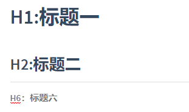

# 概览

本文转自：[Markdown 语法说明 (简体中文版)](https://www.appinn.com/markdown/)

[TOC]


# 一、区块元素{#BlockElement}

## 1.段落和换行

> - 段落：一个 Markdown 段落是由一个或多个连续的文本行组成，它的前后要有一个以上的空行
> - 换行：可以使用换行符`<br />`，同时可以使用区块应用`> `或区块列表`- `来代替换行符以达到换行效果


## 2.标题

> 标题推荐采用类 Atx 形式：在行首插入 1 到 6 个 `#` ，对应到标题 1 到 6 阶


示例如下：

```markdown
# H1:标题一

##  H2:标题二

######  H6：标题六
```


效果如下：




## 2.区块引用 

> 区块引用使用`> `作为标记：
>
> - 可以只在整个段落的第一行最前面加上`> ` 
> - 区块引用可以嵌套
> - 区块引用内可以使用其他markdown语法


示例如下：

```markdown
### 2.1 在每行的最前面加上 `> `

> 在每行的最前面加上 `> `
> 在每行的最前面加上 `> `
>
> 在每行的最前面加上 `> `
> 在每行的最前面加上 `> `

### 2.2 只在整个段落的第一行最前面加上`> ` 

> 也可以只在整个段落的第一行最前面加上 `> ` 
也可以只在整个段落的第一行最前面加上 `> ` 
也可以只在整个段落的第一行最前面加上 `> ` 

### 2.3 区块引用可以嵌套

> 区块引用可以嵌套
>> 区块引用可以嵌套
>>>> 区块引用可以嵌套
>
>>  区块引用可以嵌套
>
>  区块引用可以嵌套

 ### 2.4 区块引用内可以使用其他markdown语法
 
> #### 这是一个标题：h4。
> 
> 1.   这是第一行列表项。
> 2.   这是第二行列表项。
> 
> ```java
> System.out.println("这是一个代码块")
> ```

```


效果如下：

### 2.1 在每行的最前面加上 `> `

> 在每行的最前面加上 `> `
> 在每行的最前面加上 `> `
>
> 在每行的最前面加上 `> `
> 在每行的最前面加上 `> `

### 2.2 只在整个段落的第一行最前面加上`> ` 

> 也可以只在整个段落的第一行最前面加上 `> ` 
> 也可以只在整个段落的第一行最前面加上 `> ` 
> 也可以只在整个段落的第一行最前面加上 `> ` 

### 2.3 区块引用可以嵌套

> 区块引用可以嵌套
> > 区块引用可以嵌套
> >
> > >> 区块引用可以嵌套
>
> >  区块引用可以嵌套
>
> 区块引用可以嵌套

 ### 2.4 区块引用内可以使用其他markdown语法

> #### 这是一个标题：h4。
>
> 1.   这是第一行列表项。
> 2.   这是第二行列表项。
>
> ```java
> System.out.println("这是一个代码块")
> ```


## 3.列表

### 3.1 无序列表

> 无序列表可使用如下符号作为列表标记：
>
> - `*`
> - `+`
> - `-`


示例如下：

```markdown
无序列表 `*`
*   Red
*   Green
*   Blue

无序列表 `+`
+   Red
+   Green
+   Blue

无序列表 `-`
-   Red
-   Green
-   Blue
```


效果如下：


无序列表 `*`
*   Red
*   Green
*   Blue

无序列表 `+`
+   Red
+   Green
+   Blue

无序列表 `-`
-   Red
-   Green
-   Blue


### 3.2 有序列表

> - 有序列表则使用 `n.`（n表示起始数字）
>
> - 从起始数字开始递增


示例如下：

```
有序列表则使用数字接着一个英文句点：
1. Red
2. Green
3. Blue

列表标记上使用的数字并不会影响输出的 HTML 结果，效果等同
1. Red
1. Green
1. Blue

以下表示起始数字为3，
3. Red
1. Green
6. Blue
```


效果如下：

有序列表则使用数字接着一个英文句点：
1. Red
2. Green
3. Blue

列表标记上使用的数字并不会影响输出的 HTML 结果，效果等同
1. Red
2. Green
3. Blue

效果等同
3. Red
4. Green
5. Blue


### 3.3 列表嵌套

> 无序列表和有序列表都可以嵌套


示例如下:

```markdown
> 无序列表

- 一级无序列表
    - 二级无序列表（一级无序列表行尾按回车，接着按Tab键）
    - 二级无序列表（二级无序列表行尾按回车）
    
> 有序列表（二级有序列表符号仍然是从1开始，没法写成1.1、1.2形式）

1. 一级有序列表
     1. 二级有序列表（一级有序列表行尾按回车，接着按Tab键）
     2. 二级有序列表（二级有序列表行尾按回车）
```


效果如下

> 无序列表

- 一级无序列表
    - 二级无序列表（一级无序列表行尾按回车，接着按Tab键）
    - 二级无序列表（二级无序列表行尾按回车）

> 有序列表（二级有序列表符号仍然是从1开始，没法写成1.1、1.2形式）

1. 一级有序列表
     1. 二级有序列表（一级有序列表行尾按回车，接着按Tab键）
     2. 二级有序列表（二级有序列表行尾按回车）


### 3.4 任务列表

> 任务列表中：
>
> -  `[ ]` ：未完成
> - `[x]`：完成


示例如下:

```markdown
代办事项:
- [ ] 看2小时书
- [ ] 写一篇总结
- [ ] 听很多首歌
- [x] 保持单身

```


效果如下：


代办事项:
- [ ] 看2小时书
- [ ] 写一篇总结
- [ ] 听很多首歌
- [x] 保持单身


## 4.代码区块


> 代码区块使用方式如下：
>
> ```markdown
> ​```代码语言
> 多行代码
> 多行代码
> ​```
> ```


示例如下：

```markdown
​```java
String mutiCodeBlock="这是一个代码区块";
System.out.println(mutiCodeBlock);
​```
```


效果如下：

```java
String mutiCodeBlock="这是一个代码区块";
System.out.println(mutiCodeBlock);
```


## 5.表格

示例如下：

```
| Left-Aligned  | Center Aligned  | Right Aligned |
| :------------ |:---------------:| -----:|
| col 3 is      | some wordy text | $1600 |
| col 2 is      | centered        |   $12 |
| zebra stripes | are neat        |    $1 |
```


效果如下：

| Left-Aligned  | Center Aligned  | Right Aligned |
| :------------ | :-------------: | ------------: |
| col 3 is      | some wordy text |         $1600 |
| col 2 is      |    centered     |           $12 |
| zebra stripes |    are neat     |            $1 |


## 6.分割线

> - 在一行中用三个以上的`*`、`-`、`_`来建立一个分隔线，行内不能有其他东西。
> - 可以在星号或是减号中间插入空格


示例如下：

```markdown
> 使用`*`
***
****
* * *

> 使用`-`
---

> 使用`_`
___

```


> 使用`*`
***
****
* * *

> 使用`-`
---

> 使用`_`

___


## 7.目录

填写 `[TOC]` 可以显示全文内容的目录结构

示例如下：

```
以下是目录：
[toc] 
```


效果如下：

以下是目录：

[TOC]


# 二、区段元素

## 1.链接

### 1.1 标准链接

> 标准链接有两种语法形式：
>
> - 行内式：`[链接文字](链接url "可选的Title")`
> - 参考式：


#### 1.1.1 行内式

> 行内式语法格式：
>
> ```markdown
> [链接文字](链接url "可选的Title")
> ```
>
> 
>
> 注意链接可以使用相对路径


示例如下：

```
[前往百度--鼠标悬浮会显示Title](https://www.baidu.com/ "鼠标悬浮会显示的文本即为Title")
[前往百度--没有Tittle](https://www.baidu.com/)
```

效果如下：

[前往百度--鼠标悬浮会显示Title](https://www.baidu.com/ "鼠标悬浮会显示的文本即为Title")
[前往百度--没有Tittle](https://www.baidu.com/)


#### 1.1.2 参考式

参考式链接的优点在于可读性好，一般用于学术论文上，或者某一个链接在文章中多处使用，那么使用参考式链接可以方便地让你对链接进行集中管理。

> 参考式链接语法格式如下：
>
> - 标准格式
>
>     ```markdown
>     [链接文字][链接id]
>     [链接id]: 链接url "可选的Tittle"
>     ```
>
> - 隐式链接格式：
>
>     ```markdown
>     [链接文字][]
>     [链接文字]: 链接url "可选的Tittle"
>     ```


##### （1）标准格式

示例如下:

```markdown
[前往百度][baidu]

[baidu]: https://www.baidu.com/  "鼠标悬浮会显示的文本即为Title"
```


效果如下：

[前往百度][baidu]

[baidu]: https://www.baidu.com/  "鼠标悬浮会显示的文本即为Title"


##### （2） 隐式链接格式

示例如下：

```markdown
[前往百度][]

[前往百度]: https://www.baidu.com/  "鼠标悬浮会显示的文本即为Title"
```


效果如下：

[前往百度][]

[前往百度]: https://www.baidu.com/  "鼠标悬浮会显示的文本即为Title"


### 1.2 锚点链接

> Typora 暂不支持锚点链接

锚点链接可以让你实现在当前页面内的跳转

语法格式如下：

```
# 一、区块元素{#BlockElement}
跳转到[一、区块元素](#BlockElement)
```


效果如下：

跳转到[一、区块元素](#BlockElement)


## 2.图片

插入图片和插入标准链接语法相似，也有行内式和参考式。

### 2.1 行内式

行内式语法格式：

```markdown

```


示例如下:

```markdown
有标题


没标题

```


有标题


没标题


### 2.2 参考式

参考式语法格式如下：

```markdown
![图片的替代文字][图片id]
[图片id]: 图片url "可选的Tittle"
```


示例如下：

```markdown
有标题
![markDdown标题][img_id]
[img_id]: images/1553137609792.png "可选的Tittle"
```


效果如下：

有标题
![markDdown标题][img_id]

[img_id]: images/1553137609792.png "可选的Tittle"


## 3.代码区段

> 代码区段使用 \`代码\`

示例如下：

```markdown
代码区段使用 `代码`
```


效果如下：

代码区段使用 `代码`


## 4.斜体、粗体、下划线、删除线

> 在粗体、斜体的表示方式中，`*` 和 `_`等效，这里以`*`为例：
>
> -  一个`*`：斜体
> - 两个`*`：粗体
> - 三个`*`：加粗斜体
>
> 三个以上是无效的


示例如下:

```
 *斜体*  或   _斜体_
 
**粗体** 或  __粗体__

***加粗斜体***
 
****加粗斜体****

<u>下划线</u>

~~删除线~~
```


效果如下：

 *斜体*  或   _斜体_

**粗体** 或  __粗体__

***加粗斜体***

****加粗斜体****

<u>下划线</u>

~~删除线~~


## 5.上标、下标、脚注

### 5.1 上标、下标

示例如下：

```
上标^1^

下标~2~

```


效果如下：

上标^1^

下标~2~


### 5.2 脚注

示例如下：

```
百度[^1] 是一家互联网独角兽
[^1]:https://www.baidu.com/
```

效果如下：

百度[^1] 是一家互联网独角兽

[^1]:自己前往https://www.baidu.com/ 搜索相关资料


## 6.公式

具体用法参见

-  [Markdown_03_公式.md](./Markdown_03_公式.md)
- [Math and Academic Functions--typora](http://support.typora.io/Math/)


示例如下：

```Markdown
$$
\begin{align*}
y = y(x,t) &= A e^{i\theta} \\
&= A (\cos \theta + i \sin \theta) \\
&= A (\cos(kx - \omega t) + i \sin(kx - \omega t)) \\
&= A\cos(kx - \omega t) + i A\sin(kx - \omega t)  \\
&= A\cos \Big(\frac{2\pi}{\lambda}x - \frac{2\pi v}{\lambda} t \Big) + i A\sin \Big(\frac{2\pi}{\lambda}x - \frac{2\pi v}{\lambda} t \Big)  \\
&= A\cos \frac{2\pi}{\lambda} (x - v t) + i A\sin \frac{2\pi}{\lambda} (x - v t)
\end{align*}
$$
```


效果如下：


$$
\begin{align*}
y = y(x,t) &= A e^{i\theta} \\
&= A (\cos \theta + i \sin \theta) \\
&= A (\cos(kx - \omega t) + i \sin(kx - \omega t)) \\
&= A\cos(kx - \omega t) + i A\sin(kx - \omega t)  \\
&= A\cos \Big(\frac{2\pi}{\lambda}x - \frac{2\pi v}{\lambda} t \Big) + i A\sin \Big(\frac{2\pi}{\lambda}x - \frac{2\pi v}{\lambda} t \Big)  \\
&= A\cos \frac{2\pi}{\lambda} (x - v t) + i A\sin \frac{2\pi}{\lambda} (x - v t)
\end{align*}
$$


## 7.表情

> 可用的表情列表，请参见：[Git_04_gitmoji的使用](../git/Git_04_gitmoji的使用.md)

在Markdown中可使用表情，语法格式为：

```markdown
:表情:
```


示例如下：

```markdown
:smile:
:zap:
:smirk:
:fire:
:bug:
:sparkles:
```


效果如下：

:smile:
:zap:
:smirk:
:fire:
:bug:
:sparkles:


这些表情不仅可用在Markdown中，也可用在git commit 提交信息中，具体用法参见：[Git_04_gitmoji的使用](../git/Git_04_gitmoji的使用.md)


# 参考资料

1. [Markdown 语法说明 (简体中文版)](https://www.appinn.com/markdown/)
2. [Markdown 语法手册 （完整整理版）](https://blog.csdn.net/witnessai1/article/details/52551362)
3. [https://support.typora.io/](https://support.typora.io/)


