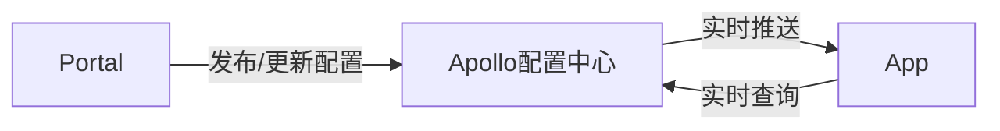

[TOC]

# 前言

# 一、流程图

# 二、序列图

# 三、甘特图

# 参考资料

1. [https://support.typora.io/Draw-Diagrams-With-Markdown/](https://support.typora.io/Draw-Diagrams-With-Markdown/)
2. [https://github.com/adrai/flowchart.js](http://flowchart.js.org/)
3. [Markdown绘制流程图的方法](https://blog.csdn.net/ww1473345713/article/details/47620577)
4. [Markdown中使用mermaid画流程图](https://www.cnblogs.com/nanqiang/p/8244309.html)