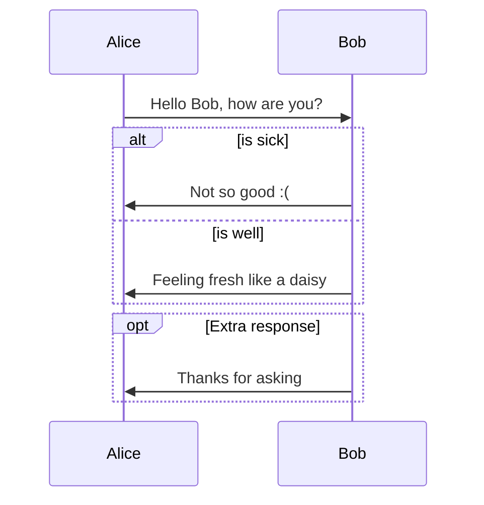
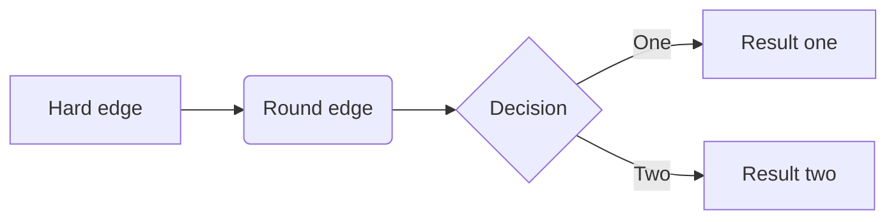
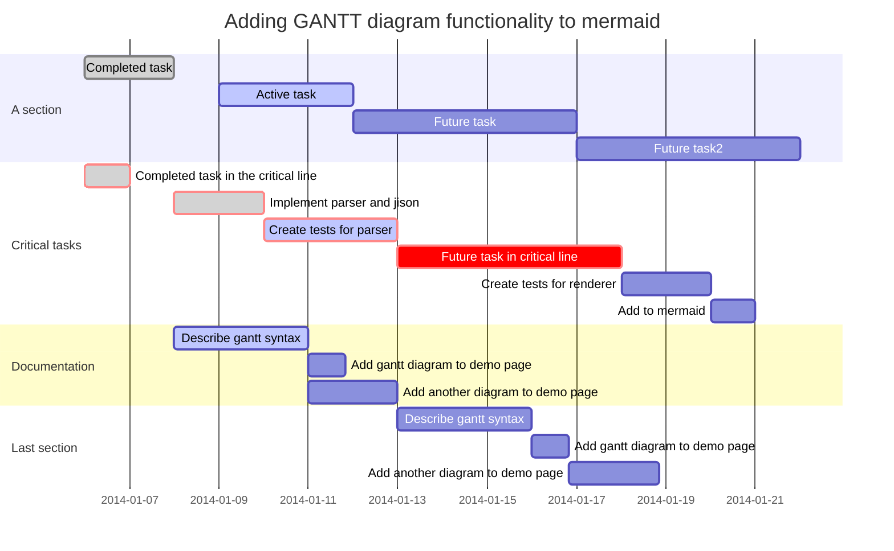

[TOC]


# 前言


# 一、序列图（Sequence）

序列图由 [js-sequence](https://bramp.github.io/js-sequence-diagrams/)提供支持，可以将代码块转成序列图


示例如下：

```
Title: Here is a title
A->B: Normal line
B-->C: Dashed line
C->>D: Open arrow
D-->>A: Dashed open arrow
```


效果如下：

```sequence
Title: Here is a title
A->B: Normal line
B-->C: Dashed line
C->>D: Open arrow
D-->>A: Dashed open arrow
```


# 二、流程图（Flowchart）

序列图由[flowchart.js](http://flowchart.js.org/)提供支持，可以将代码块转成序列图


示例如下：

```
​```flow
st=>start: Start
op=>operation: Your Operation
cond=>condition: Yes or No?
e=>end

st->op->cond
cond(yes)->e
cond(no)->op
​```
```


效果如下：

```flow
st=>start: Start
op=>operation: Your Operation
cond=>condition: Yes or No?
e=>end

st->op->cond
cond(yes)->e
cond(no)->op
```


# 三、Mermaid

Mermaid 支持生成序列图、流程图、甘特图

详细用法参见官方文档 : https://mermaidjs.github.io/

## 1.Sequence

示例如下：

```
​```mermaid
%% Example of sequence diagram
  sequenceDiagram
    Alice->>Bob: Hello Bob, how are you?
    alt is sick
    Bob->>Alice: Not so good :(
    else is well
    Bob->>Alice: Feeling fresh like a daisy
    end
    opt Extra response
    Bob->>Alice: Thanks for asking
    end
​```
```


效果如下：




## 2.Flowchart

示例如下：

```
​```mermaid
graph LR
A[Hard edge] -->B(Round edge)
    B --> C{Decision}
    C -->|One| D[Result one]
    C -->|Two| E[Result two]
​```
```


效果如下：




## 3.Gantt


~~~gfm

~~~


效果如下：


# 参考资料

1. [https://support.typora.io/Draw-Diagrams-With-Markdown/](https://support.typora.io/Draw-Diagrams-With-Markdown/)
2. [https://github.com/adrai/flowchart.js](http://flowchart.js.org/)
3. [Markdown绘制流程图的方法](https://blog.csdn.net/ww1473345713/article/details/47620577)
4. [Markdown中使用mermaid画流程图](https://www.cnblogs.com/nanqiang/p/8244309.html)