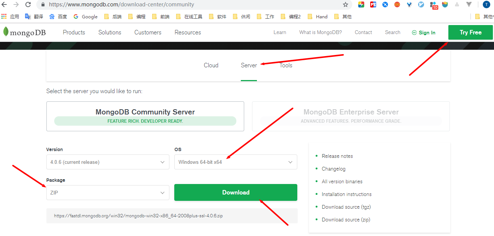
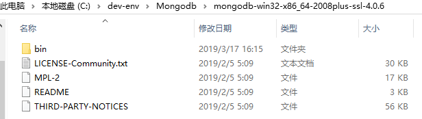

[TOC]


# 前言


# 一、Windows 平台安装 MongoDB

## 1. 下载

进入[官网](https://www.mongodb.com) -> 点击`Try Free` -> 选择Server，即可看到下面网址，然后下载对应版本的MongoDB

> https://www.mongodb.com/download-center/community

这里我们选择下载ZIP压缩包




将压缩包解压后，目录结构如下图所示




## 2. 安装

### 2.1 新建 `data` 和 `logs` 文件夹

新建 data 和 logs 文件夹，分别用来存放数据库数据文件和日志文件。

并在logs文件夹在创建 mongo.log 日志文件。


### 2.2 新建 `mongo.conf`配置文件

新建`mongo.conf`配置文件，文件内容如下： 

````properties
#数据库路径
dbpath=C:\dev-env\Mongodb\mongodb-win32-x86_64-2008plus-ssl-4.0.6\data
#日志输出文件路径
logpath=C:\dev-env\Mongodb\mongodb-win32-x86_64-2008plus-ssl-4.0.6\logs\mongo.log
#错误日志采用追加模式
logappend=true
#启用日志文件，默认启用
journal=true
#这个选项可以过滤掉一些无用的日志信息，若需要调试使用请设置为false
quiet=true
#端口号 默认为27017
port=27017
````

> 主要需要修改上述两个路径


## 3. 启动服务端

进入bin目录，通过执行`mongod.exe`命令来启动MongoDB服务端

```shell
mongod.exe --config  "../mongo.conf"
```


验证服务端是否成功启动：

（1）访问：http://127.0.0.1:27017/ 页面，出现如下信息：

> It looks like you are trying to access MongoDB over HTTP on the native driver port.


## 4. 开启认证登录

### 4.1 客户端登录

进入bin目录，通过执行`mongo.exe`命令来启动客户端，并对服务端进行连接

```
# 连接到服务端：127.0.0.1:27017 
mongo
mongo.exe
```


### 4.2 创建用户

```mongodb
use admin
db.createUser(
    {
        user:"root",
        pwd:"root",
        roles:[{role:"root",db:"admin"}]
    }
)
```


### 4.3 开启认证登录

（1）在`mongo.conf`配置文件中设置 `auth=true`

（2）重启MongoDB

（3）使用账号密码连接数据库

使用 mongo.exe 命令连接

```shell
mongo.exe -u root -p --authenticationDatabase admin
然后输入密码
```


# 参考资料

1. [安装 MongoDB--菜鸟教程](http://www.runoob.com/mongodb/mongodb-window-install.html)
2. 


