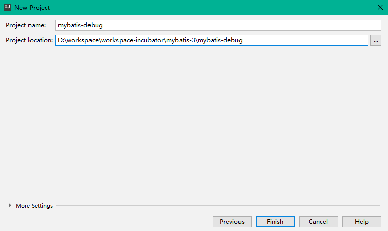

[TOC]


# 前言

关于Mybatis的源码阅读，推荐github上一个带中文注释的mybatis源码

> https://github.com/tuguangquan/mybatis


# 一、Mybatis源码调试环境搭建

> - 源码地址：https://github.com/mybatis/mybatis-3
> - 官方文档：http://www.mybatis.org/mybatis-3/zh/index.html

## 1.获取源码

（1）去 github 上 fork 一份 Mybatis 的源码，然后 clone 到本地

```bash
git clone git@github.com:shirayner/mybatis-3.git
```

（2）基于目标版本切换出自己源码调试的分支

```bash
# 本文编写时，最新版本为 mybatis-3.5.2，因此基于此tag切换出自己的分支
git checkout mybatis-3.5.2
# 基于 mybatis-3.5.2 创建并切换到自己的源码调试分支
git checkout -b mybatis-3.5.2-ray
```


## 2.导入Idea

打开Idea，直接点击 `Open` ，选择刚刚获取的 `mybatis-3` 项目，即可将项目导入到Idea中。

然后在项目根目录编译并安装项目到本地：

```
mvn clean install
```


## 3.创建测试工程

### 3.1 数据库准备

```sql
create database mybatis_debug;
use mybatis_debug;
CREATE TABLE `user`  (
    `id` bigint(12) NOT NULL AUTO_INCREMENT COMMENT '主键自增',
    `name` varchar(50) NOT NULL COMMENT '用户名',
    `age` int (3) unsigned DEFAULT 3 COMMENT '年龄',
    `creation_date` datetime(0) NOT NULL DEFAULT CURRENT_TIMESTAMP  COMMENT '创建日期',
    `last_update_date` datetime(0) NOT NULL DEFAULT CURRENT_TIMESTAMP  COMMENT '上次更新日期',
    PRIMARY KEY (`id`)
) ENGINE=InnoDB DEFAULT CHARSET=utf8 COMMENT='用户表';

```


### 3.2 创建测试工程

#### 3.2.1 新建Project

在当前目录，创建一个测试工程，用于编写Mybatis测试用例，方便我们对源码进行调试。

（1）依次选择 File -> New -> Project... -> Maven -> Next


（2）填写测试项目的坐标

```properties
com.ray.study.mybatis
mybatis-debug-ray
```


（3）选择项目的目录为Mybatis工程的子目录




（3）将测试工程加入到当前窗口


#### 3.2.2 POM.xml

```xml
<?xml version="1.0" encoding="UTF-8"?>
<!--

       Copyright 2009-2019 the original author or authors.

       Licensed under the Apache License, Version 2.0 (the "License");
       you may not use this file except in compliance with the License.
       You may obtain a copy of the License at

          http://www.apache.org/licenses/LICENSE-2.0

       Unless required by applicable law or agreed to in writing, software
       distributed under the License is distributed on an "AS IS" BASIS,
       WITHOUT WARRANTIES OR CONDITIONS OF ANY KIND, either express or implied.
       See the License for the specific language governing permissions and
       limitations under the License.

-->
<project xmlns="http://maven.apache.org/POM/4.0.0"
         xmlns:xsi="http://www.w3.org/2001/XMLSchema-instance"
         xsi:schemaLocation="http://maven.apache.org/POM/4.0.0 http://maven.apache.org/xsd/maven-4.0.0.xsd">
  <modelVersion>4.0.0</modelVersion>

  <groupId>com.ray.study.mybatis</groupId>
  <artifactId>mybatis-debug</artifactId>
  <version>1.0-SNAPSHOT</version>

  <properties>
    <project.build.sourceEncoding>UTF-8</project.build.sourceEncoding>
    <java.version>1.8</java.version>
  </properties>

  <dependencies>

    <dependency>
      <groupId>junit</groupId>
      <artifactId>junit</artifactId>
      <version>4.12</version>
      <scope>test</scope>
    </dependency>


    <dependency>
      <groupId>org.projectlombok</groupId>
      <artifactId>lombok</artifactId>
      <version>1.16.8</version>
    </dependency>

    <dependency>
      <groupId>org.mybatis</groupId>
      <artifactId>mybatis</artifactId>
      <version>3.5.2</version>
    </dependency>

    <dependency>
      <groupId>ognl</groupId>
      <artifactId>ognl</artifactId>
      <version>3.2.10</version>
      <scope>compile</scope>
      <optional>true</optional>
    </dependency>

    <dependency>
      <groupId>org.javassist</groupId>
      <artifactId>javassist</artifactId>
      <version>3.24.1-GA</version>
      <scope>compile</scope>
      <optional>true</optional>
    </dependency>

    <dependency>
      <groupId>org.hibernate.javax.persistence</groupId>
      <artifactId>hibernate-jpa-2.1-api</artifactId>
      <version>1.0.0.Final</version>
    </dependency>

    <dependency>
      <groupId>mysql</groupId>
      <artifactId>mysql-connector-java</artifactId>
      <version>5.1.47</version>
      <scope>runtime</scope>
    </dependency>


  </dependencies>

  <build>
    <!-- 解决target/classes下没有 src/main/resources下的资源文件 -->
    <resources>
      <resource>
        <directory>src/main/java</directory>
        <includes>
          <include>**/*.*</include>
        </includes>
      </resource>
      <resource>
        <directory>src/main/resources</directory>
        <includes>
          <include>**/*.*</include>
        </includes>
      </resource>
    </resources>

    <plugins>
      <plugin>
        <groupId>org.apache.maven.plugins</groupId>
        <artifactId>maven-compiler-plugin</artifactId>
        <configuration>
          <source>${java.version}</source>
          <target>${java.version}</target>
          <encoding>${project.build.sourceEncoding}</encoding>
        </configuration>
      </plugin>

      <plugin>
        <groupId>org.apache.maven.plugins</groupId>
        <artifactId>maven-surefire-plugin</artifactId>
        <version>2.5</version>
        <configuration>
          <skipTests>true</skipTests>
        </configuration>
      </plugin>
    </plugins>
  </build>


</project>

```


### 3.3 业务代码

#### 3.3.1 entity

```java
package com.ray.study.mybatis.debug.entity;

import lombok.AllArgsConstructor;
import lombok.Data;
import lombok.NoArgsConstructor;

import javax.persistence.GeneratedValue;
import javax.persistence.Id;
import java.io.Serializable;
import java.util.Date;

/**
 * description
 *
 * @author shira 2019/05/09 21:26
 */
@Data
@AllArgsConstructor
@NoArgsConstructor
public class User implements Serializable {

	private static final long serialVersionUID = 8655851615465363473L;

  @Id
  @GeneratedValue
	private Long id;

	private String name;

	private Integer age;

	private Date creationDate;

	private Date lastUpdateDate;

	public User(String name, int age){
	  this.name =name;
	  this.age =age;
	  this.creationDate = new Date();
	  this.lastUpdateDate = new Date();
  }


}

```


### 3.3.2 Mapper

```java
package com.ray.study.mybatis.debug.mapper;

import com.ray.study.mybatis.debug.entity.User;
import org.apache.ibatis.annotations.*;

import java.util.List;
import java.util.Map;

/**
 * description
 *
 * @author shira 2019/09/05 23:29
 */
public interface UserMapper {

  /**
   * 根据用户名查询用户结果集
   *
   * @param name 用户名
   * @return 查询结果
   */
  @Select("SELECT * FROM  user  WHERE name = #{name}")
  User findByName(@Param("name") String name);

  User findById(Long id);

  /**
   * 查询所有用户
   *
   * @return
   */
  @Results({@Result(property = "name", column = "name"), @Result(property = "age", column = "age")})
  @Select("SELECT id,name, age,creation_date,creation_date FROM user")
  List<User> findAll();

  /**
   * 保存用户信息
   *
   * @param user 用户信息
   * @return 成功 1 失败 0
   */
  int insert(User user);

  @Insert("INSERT INTO USER(NAME, AGE) VALUES(#{name}, #{age})")
  int insertByNameAndAge(@Param("name") String name, @Param("age") Integer age);

  @Insert("INSERT INTO USER(NAME, AGE, CREATION_DATE, LAST_UPDATE_DATE) VALUES(#{name}, #{age}, #{creationDate}, #{lastUpdateDate} )")
  int insertByUser(User user);

  @Insert("INSERT INTO USER(NAME, AGE) VALUES(#{name,jdbcType=VARCHAR}, #{age,jdbcType=INTEGER})")
  int insertByMap(Map<String, Object> map);


  @Update("UPDATE user SET age=#{age} WHERE name=#{name}")
  void update(User user);

  @Delete("DELETE FROM user WHERE id =#{id}")
  void delete(Long id);

}

```


# 参考资料

1. [入门_Mybatis官方文档](http://www.mybatis.org/mybatis-3/zh/getting-started.html)
2. [Mybatis3.x 源码阅读-01环境搭建](https://blog.csdn.net/qq157538651/article/details/88555198)
3. [MyBatis源码阅读准备](https://www.jianshu.com/p/e739afb8fe31)


