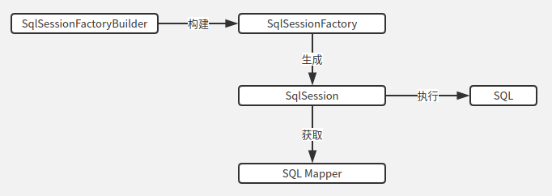
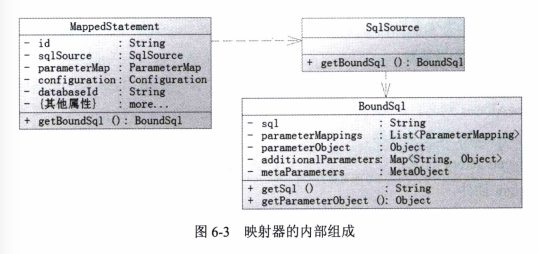

[TOC]

# 前言

# 一、Mybatis核心组成

## 1.SqlSessionFactoryBuilder

SqlSessionFactory的构造器，它会根据配置信息来生产 SqlSessionFactory

## 2.SqlSessionFactory

生成 SqlSession（会话）的工厂

每个Mybatis应用都是以 SqlSessionFactory 的实例为中心的

## 3.SqlSession

类似于JDBC的Connection对象，是一个即可以发送Sql去执行并返回结果，也可以获取Mapper的接口

## 4.SQL Mapper

映射器，由一个Java接口和XML文件（或注解）构成，需要给出对应的SQL和映射规则。它负责发送SQL去执行，并返回结果

一个映射器由三部分组成：

- MappedStatement：保存映射器的一个节点
- SqlSource：它是提供BoundSql对象的地方
- BoundSql：建立SQL和参数的地方

# 二、Mybatis源码分析

Mybatis的运行可分为两部分：

> - 构建SqlSessionFactory
> - SqlSession的执行过程

## 1.构建SqlSessionFactory

## 2.SqlSession的执行过程

# 参考资料

1. [Java架构-Mybatis源码正确打开方式](https://juejin.im/post/5c04e6325188252e4c2e94ca)
2. [MyBatis框架及原理分析](https://www.cnblogs.com/adolfmc/p/8997281.html)
3. [《深入理解mybatis原理》 MyBatis的架构设计以及实例分析](https://blog.csdn.net/luanlouis/article/details/40422941)
4. [MyBatis整体架构](https://blog.csdn.net/tiankong_12345/article/details/90813101)
5. 