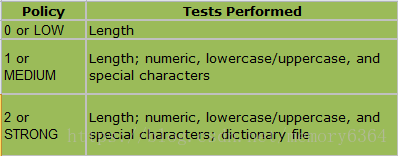
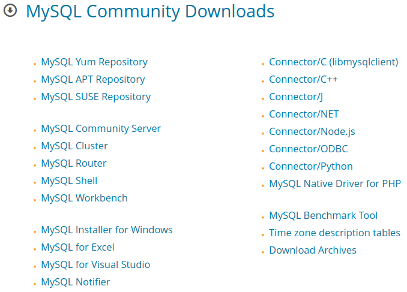
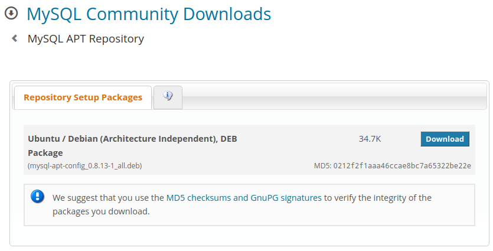
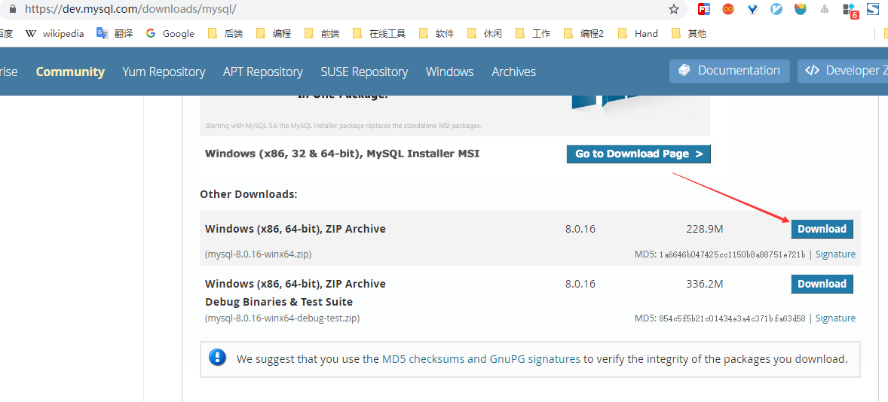
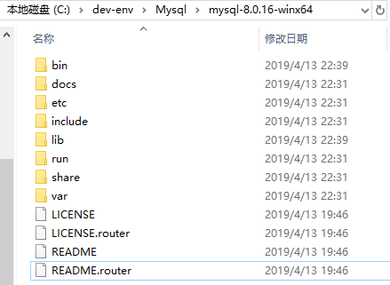
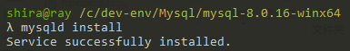
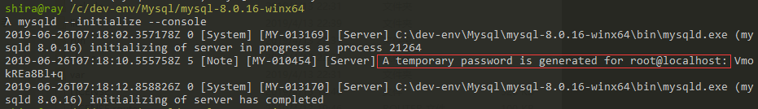

[TOC]


# 前言


# 一、Linux安装Mysql

## 1.RedHat下安装Mysql

我们将在 Centos7 系统下使用 yum 命令安装 MySQL

### 1.1 检测

安装前，我们可以检测系统是否自带安装 MySQL:

```shell
rpm -qa | grep mysql
```

如果你系统有安装，那可以选择进行卸载:

```shell
rpm -e mysql　　// 普通删除模式
rpm -e --nodeps mysql　　// 强力删除模式，如果使用上面命令删除时，提示有依赖的其它文件，则用该命令可以对其进行强力删除
```


### 1.2 安装

#### 1.2.1 添加`MySQL Yum`

接下来我们在 Centos7 系统下使用 yum 命令安装 MySQL，需要注意的是 CentOS 7 默认安装的是 MariaDB ，所以在安装前我们需要先去官网下载 Yum 资源包，下载地址为：<https://dev.mysql.com/downloads/repo/yum/>

- a. 前往  mysql yum Repository 下载页面：https://dev.mysql.com/downloads/repo/yum/
- b.复制相应的版本名


- c.根据版本名得到下载地址：`http://repo.mysql.com/版本名`

- d.更新添加yum源

```shell
wget http://repo.mysql.com/mysql80-community-release-el7-2.noarch.rpm
rpm -ivh mysql-community-release-el7-5.noarch.rpm
yum update
```


- e.检测是否成功添加yum源

```shell
yum repolist enabled | grep "mysql.*-community.*"
```


- f.列出yum源中的mysql版本系列，然后启用想用的版本并禁用其他版本。

```shell
yum repolist all | grep mysql
```


发现启用的版本是 mysql5.6 ，我们想使用的是mysql5.7，因此将 mysql5.6禁用，将mysql 5.7 启用

```shell
sudo yum-config-manager --disable mysql56-community
sudo yum-config-manager --enable mysql57-community
```


#### 1.2.2 安装Mysql

```shell
 sudo yum install mysql-community-server
```


#### 1.2.3 启动mysql

- 方式一

    ```shell
    sudo service mysqld restart   # 重启mysql
    sudo service mysqld status    # 查看mysql运行状态
    ```

    

- 方式二

    ```shell
    systemctl start mysqld   # 启动mysql
    systemctl status mysqld  # 查看mysql运行状态
    ```

    

#### 1.2.4 设置开机自启

```shell
systemctl enable mysqld  # 设置开机自启
systemctl daemon-reload
```


#### 1.2.5 修改密码

（1）默认密码

mysql 默认密码会输出到日志中，可通过如下命令查看默认密码

```shell
sudo grep 'temporary password' /var/log/mysqld.log
```

可知默认密码为空


（2）登录mysql

```shell
sudo mysql -uroot -p

sudo mysql -h hostname -u username -p   # longin on remote server
```


（3）修改密码

```mysql
mysql> alter user 'root'@'localhost' identified by 'Ray12345.';
```


mysql 8 修改的密码必须符合密码校验规则:

> 参见官方文档：[The Password Validation Component](https://dev.mysql.com/doc/refman/8.0/en/validate-password.html)


validate_password_policy 有以下取值： 




默认是1，即MEDIUM，所以刚开始设置的密码必须符合长度，且必须含有数字，小写或大写字母，特殊字符。 


有时候，只是为了自己测试，不想密码设置得那么复杂，譬如说，我只想设置root的密码为123456。 
必须修改两个全局参数：

```mysql
-- 1.修改validate_password_policy参数的值
mysql> set global validate_password_policy=0;

-- 2.validate_password_length(密码长度)参数默认为8，我们修改为1
mysql> set global validate_password_length=1;
```

完成之后再次执行修改密码语句即可成功

```mysql
mysql> alter user 'root'@'localhost' identified by '123456.';
```


还可尝试如下方式修改密码（mysql8及以上可能不行）：

```shell
shell>  mysqladmin -u root password "root";   # 可行
```


```mysql
mysql> set password for 'root'@'localhost' =password('root');
```


```mysql
# ALTER USER 'root'@'localhost' IDENTIFIED BY 'root';   # 不可行
```


## 2.Debian下安装Mysql

> 参考： 
>
> - [Debian9安装MySQL](https://www.jianshu.com/p/40b770d86a7b)
> - [Mariadb修改root密码](https://www.cnblogs.com/keithtt/p/6922378.html)


### 2.1 安装


#### 2.1.1 添加软件源

（1）前往官网下载页面，下载 APT 源








使用dpkg指令添加该文件进apt-get的源

```bash
sudo dpkg -i mysql-apt-config_0.8.13-1_all.deb
```


然后会弹出一个mysql的源的配置界面，安装自己需要的版本，然后ok即可


接着更新缓存

```bash
sudo apt-get update
```


#### 2.1.2 安装

```bash
sudo apt-get install mysql-server
```


#### 2.1.3 修改Root用户

（1）root用户登录mysql

初始密码为空

输入如下命令，密码直接回车，即可登录

```bash
# 注意需要加sudo
sudo mysql -uroot -p
```


（2）修改 `'root'@'localhost'` 密码 

```mysql
-- 2.1 更新 mysql 库中 user 表的字段：
MariaDB [(none)]> use mysql;  
MariaDB [mysql]> UPDATE user SET password=password('newpassword') WHERE user='root';  
MariaDB [mysql]> flush privileges;  
MariaDB [mysql]> exit;
```


（3）创建 `'root'@'%'` 用户 

```mysql
MariaDB [(none)]> use mysql;  
MariaDB [mysql]> UPDATE user SET host='%' WHERE user='root';  
```


### 2.2 Mysql 常用操作

```
sudo service mysql start
sudo service mysql stop
sudo service mysql restart
```


## 2.配置mysql

命令行执行如下命令，可查看mysql的相关信息

```shell
 sudo service mysqld status  
```


由此，可知mysql的相关重要文件如下：

| 文件或目录            | 描述                            |
| --------------------- | ------------------------------- |
| `/etc/my.cnf`         | Mysql主配置文件                 |
| `/var/lib/mysql`      | mysql数据库的数据库文件存放位置 |
| `/var/log/mysqld.log` | mysql默认的日志文件             |


### 2.1 配置字符集

修改 `/etc/my.cnf` 配置文件，在相关节点（没有则自行添加）下添加编码配置，如下：

```properties
[mysqld]
character-set-server=utf8

[mysql]
default-character-set=utf8

[client]
character-set-server=utf8
```


重启mysql服务，查询编码。可以看到已经改过来了

```shell
shell> systemctl restart mysqld
shell> mysql -uroot -p
mysql> show variables like 'character%';
```


### 2.2 远程连接设置

默认只允许root帐户在本地登录，如果要在其它机器上连接mysql，必须**添加一个允许远程连接的帐户**。

#### 2.2.1 删除匿名用户

执行以下sql  查看是否有匿名用户：

```
select user,host from mysql.user;
```

执行以下sql 删除匿名用户：

```
delete from mysql.user where user='';
```

再次查看：

```
select user,host from mysql.user;
```

刷新，使以上操作生效：

```
flush privileges;
```


#### 2.2.2 新建用户

创建用户有如下方式：

- 方式一

    ```mysql
    mysql> create user 'username'@'%' identified by 'password';    -- 新建用户
    ```

    例如：

    ```mysql
    mysql> create user 'ray'@'%' identified by 'Ray12345.';    -- 新建用户
    ```


- 方式二

    ```mysql
    -- 创建用户并授权
    mysql> grant all  on *.* to 'ray'@'%' identified by 'Ray12345.';   -- 暂时有问题
    mysql> flush privileges;
    ```

    

#### 2.2.3 授权用户

添加一个允许远程连接的帐户

```mysql
mysql> grant all  on *.* to ray@'%';
mysql> flush privileges;
```


# 二、Window 安装Mysql

## 1.下载Mysql

前往[Mysql 官网](https://dev.mysql.com/downloads/mysql/)下载




下载之后解压即可




## 2. 配置

### 2.1 配置环境变量

```properties
MYSQL_HOME=C:\dev-env\Mysql\mysql-8.0.16-winx64
Path=%MYSQL_HOME%\bin
```


### 2.2 my.ini 配置文件

创建`%MYSQL_HOME%\my.ini`文件，内容如下：

```properties
[mysqld]
# 设置3306端口
port=3306
# 设置mysql的安装目录
basedir=C:\dev-env\Mysql\mysql-8.0.16-winx64
# 设置mysql数据库的数据的存放目录
datadir=C:\dev-env\Mysql\mysql-8.0.16-winx64\data
# 允许最大连接数
max_connections=200
# 允许连接失败的次数。这是为了防止有人从该主机试图攻击数据库系统
max_connect_errors=10
# 服务端使用的字符集默认为UTF8
character-set-server=UTF8MB4
# 创建新表时将使用的默认存储引擎
default-storage-engine=INNODB
# 默认使用“mysql_native_password”插件认证
default_authentication_plugin=mysql_native_password
# 开启binlog
log-bin=mysql-bin
binlog-format=Row
server-id=1001

[mysql]
# 设置mysql客户端默认字符集
default-character-set=UTF8MB4

[client]
# 设置mysql客户端连接服务端时默认使用的端口
port=3306
default-character-set=UTF8MB4
```


## 3.MySQL服务安装及初始化

### 3.1 安装Mysql服务

以管理员权限运行cmd，执行如下命令

```bash
mysqld -install
```


> mysqld -install [服务名]
>
> 后面的服务名可以不写，默认的名字为 mysql。当然，如果你的电脑上需要安装多个MySQL服务，就可以用不同的名字区分了，比如 mysql5 和 mysql8。





> 删除服务: `mysqld -remove`


### 3.2 Mysql初始化

然后执行如下命令进行Mysql数据库的初始化

```bash
mysqld --initialize --console
```

然后Mysql会在控制台上打印一条root用户的临时密码：` VmokREa8Bl+q`




> 需要记住此处的临时密码，后面会用到。若忘记了此临时密码，则删除 data文件夹，重新执行`mysqld --initialize --console`来重新初始化Mysql数据库即可。


## 4.mysql的启停

```bash
# 启动mysql
net start mysql

# 停止mysql
net stop mysql
```


## 5.远程连接设置

数据库初始化时创建的 root 账户（root@localhost）只允许在本地登录，如果要在其它机器上连接mysql，必须**添加一个允许远程连接的帐户**。

### 5.1 修改Root用户

修改root用户密码，并允许root用户远程登录

```bash
mysql> ALTER USER 'root'@'localhost' IDENTIFIED WITH mysql_native_password BY 'root';
mysql> ALTER USER 'root'@'%' IDENTIFIED WITH mysql_native_password BY 'root';
```


> 默认会有`'root'@'localhost'`用户，若没有`'root'@'%'` 则自己创建即可
>
> ```mysql
>  CREATE USER 'root'@'%' IDENTIFIED WITH mysql_native_password BY 'root';
> ```


### 5.2 创建用户

```bash
mysql> CREATE USER 'ray'@'%' IDENTIFIED WITH mysql_native_password BY 'ray';
```


### 5.3 授权用户

添加一个允许远程连接的帐户

```mysql
mysql> grant all  on *.* to ray@'%';
mysql> flush privileges;
```


# 三、Mysql连接管理工具

开源的Mysql连接管理工具如下：

## 1.DBever

> https://dbeaver.io/


## 2.HeidiSql

> https://www.heidisql.com/


# 参考资料

## 1.Linux安装Mysql

1. [CentOS7 yum 安装与配置MySQL5.7](https://www.cnblogs.com/ianduin/p/7679239.html)
2. [Installing MySQL on Linux Using the MySQL Yum Repository](https://dev.mysql.com/doc/refman/8.0/en/linux-installation-yum-repo.html)
3. [MySQL Documentation：Installing MySQL on Linux Using the MySQL Yum Repository](https://dev.mysql.com/doc/refman/8.0/en/linux-installation-yum-repo.html)
4. https://linuxize.com/post/install-mysql-on-centos-7/
5. [[centos7 mysql数据库安装和配置](https://www.cnblogs.com/starof/p/4680083.html)](https://www.cnblogs.com/starof/p/4680083.html)


## 2.Window 安装Mysql

1. [Win10安装mysql-8.0.11-winx64详细步骤](https://blog.csdn.net/qq_20788055/article/details/80372577)

