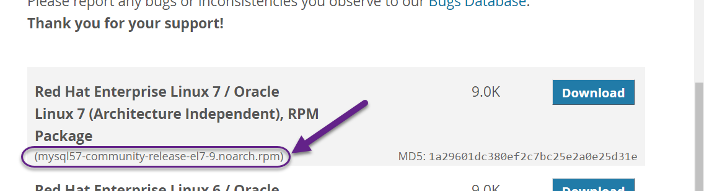
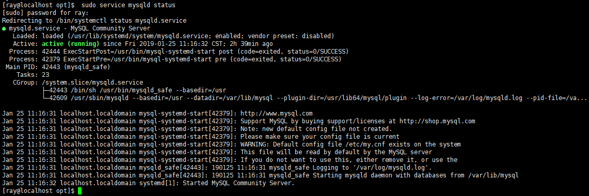

[TOC]


# 前言


# 一、LInux安装Mysql

## 1.使用yum安装

我们将在 Centos7 系统下使用 yum 命令安装 MySQL

### 1.1 检测

安装前，我们可以检测系统是否自带安装 MySQL:

```shell
rpm -qa | grep mysql
```

如果你系统有安装，那可以选择进行卸载:

```shell
rpm -e mysql　　// 普通删除模式
rpm -e --nodeps mysql　　// 强力删除模式，如果使用上面命令删除时，提示有依赖的其它文件，则用该命令可以对其进行强力删除
```


### 1.2 安装

#### 1.2.1 添加`MySQL Yum`

接下来我们在 Centos7 系统下使用 yum 命令安装 MySQL，需要注意的是 CentOS 7 默认安装的是 MariaDB ，所以在安装前我们需要先去官网下载 Yum 资源包，下载地址为：<https://dev.mysql.com/downloads/repo/yum/>

- a. 前往  mysql yum Repository 下载页面：https://dev.mysql.com/downloads/repo/yum/
- b.复制相应的版本名



- c.根据版本名得到下载地址：`http://repo.mysql.com/版本名`

- d.更新添加yum源

```shell
wget http://repo.mysql.com/mysql-community-release-el7-5.noarch.rpm
rpm -ivh mysql-community-release-el7-5.noarch.rpm
yum update
```


- e.检测是否成功添加yum源

```shell
yum repolist enabled | grep "mysql.*-community.*"
```


- f.列出yum源中的mysql版本系列，然后启用想用的版本并禁用其他版本。

```shell
yum repolist all | grep mysql
```


发现启用的版本是 mysql5.6 ，我们想使用的是mysql5.7，因此将 mysql5.6禁用，将mysql 5.7 启用

```shell
sudo yum-config-manager --disable mysql56-community
sudo yum-config-manager --enable mysql57-community
```


#### 1.2.2 安装Mysql

```shell
 sudo yum install mysql-community-server
```


#### 1.2.3 启动mysql

```shell
 sudo service mysqld restart   # 重启mysql
 sudo service mysqld status    # 查看mysql运行状态
```


#### 1.2.4 修改密码

（1）默认密码

mysql 默认密码会输出到日志中，可通过如下命令查看默认密码

```shell
sudo grep 'temporary password' /var/log/mysqld.log
```

可知默认密码为空


（2）登录mysql

```shell
sudo mysql -uroot -p

sudo mysql -h hostname -u username -p   # longin on remote server
```


（3）修改密码

可通过如下方式修改密码：


```shell
shell>  mysqladmin -u root password "root";   # 可行
```


```mysql
mysql> set password for 'root'@'localhost' =password('root');
```


```mysql
# ALTER USER 'root'@'localhost' IDENTIFIED BY 'root!';   # 不可行
```


## 2.配置mysql

命令行执行如下命令，可查看mysql的相关信息

```shell
 sudo service mysqld status  
```




由此，可知mysql的相关重要文件如下：

| 文件或目录            | 描述                            |
| --------------------- | ------------------------------- |
| `/etc/my.cnf`         | Mysql主配置文件                 |
| `/var/lib/mysql`      | mysql数据库的数据库文件存放位置 |
| `/var/log/mysqld.log` | mysql默认的日志文件             |


### 2.1 配置字符集

修改 `/etc/my.cnf` 配置文件，在相关节点（没有则自行添加）下添加编码配置，如下：

```properties
[mysqld]
character-set-server=utf8
[client]
default-character-set=utf8
[mysql]
default-character-set=utf8
```


重启mysql服务，查询编码。可以看到已经改过来了

```shell
shell> systemctl restart mysqld
shell> mysql -uroot -p
mysql> show variables like 'character%';
```


### 2.2 远程连接设置

默认只允许root帐户在本地登录，如果要在其它机器上连接mysql，必须**添加一个允许远程连接的帐户**。

#### 2.2.1 删除匿名用户

执行以下sql  查看是否有匿名用户：

```
select user,host from mysql.user;
```

执行以下sql 删除匿名用户：

```
delete from mysql.user where user='';
```

再次查看：

```
select user,host from mysql.user;
```

刷新，使以上操作生效：

```
flush privileges;
```


#### 2.2.2 新建用户

```shell
mysql> create user 'username'@'%' identified by 'password';    # 新建用户
```


如：

```mysql
mysql> create user 'ray'@'%' identified by 'ray';    # 新建用户
```


#### 2.2.3 授权用户

添加一个允许远程连接的帐户

```mysql
mysql> grant all  on *.* to ray@'%' identified by 'ray';
mysql> flush privileges;
```


# 参考资料

1. [Installing MySQL on Linux Using the MySQL Yum Repository](https://dev.mysql.com/doc/refman/8.0/en/linux-installation-yum-repo.html)
2. [MySQL Documentation](https://dev.mysql.com/doc/)
3. https://linuxize.com/post/install-mysql-on-centos-7/
4. [[centos7 mysql数据库安装和配置](https://www.cnblogs.com/starof/p/4680083.html)](https://www.cnblogs.com/starof/p/4680083.html)


