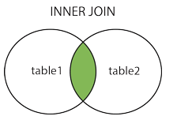
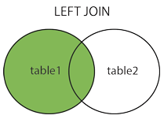
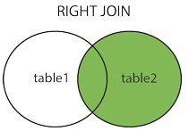

[TOC]


# 前言

数据表准备：

```mysql
create table if not exists user (
	id bigint ( 12 ) not null auto_increment,
	user_name varchar ( 45 ) not null,
	password varchar ( 45 ) not null,
    sex varchar ( 4 ) not null,
	age int ( 4 ) unsigned default null,
	city varchar ( 45 ) default null,
	start_date date default null,
	end_date date default null,
	description varchar ( 200 ) default null,
	primary key ( id ) 
);

insert into user (user_name, password,sex,age,city) values ('tom' ,'123','男',11,'shanghai');
insert into user (user_name, password,sex,age,city) values ('jack' ,'123','男',21,'shanghai');
insert into user (user_name, password,sex,age,city) values ('mike' ,'123','男',31,'shanghai');
insert into user (user_name, password,sex,age,city) values ('caly' ,'123','女',31,'shanghai');
insert into user (user_name, password,sex,age,city) values ('carter' ,'123','男',41,'wuhan');
insert into user (user_name, password,sex,age,city) values ('bush' ,'123','男',51,'wuhan');
insert into user (user_name, password,sex,age,city) values ('jerry' ,'123','男',61,'wuhan');
insert into user (user_name, password,sex,age,city) values ('xiaohong' ,'123','女',41,'wuhan');
insert into user (user_name, password,sex,age,city) values ('xiaoming' ,'123','男',41,'beijing');
```


# 一、查询语句

```mysql
select  select_list
[from table_list]
[where row_constraint]
[group by grouping_columns]
[order by sorting_columns]
[having group_constraint]
[limit row_count];
```


## 1. 基本查询

```mysql
select user_name from user where id = 1;          
select id,user_name,age from user where id = 1;     -- 查询多个字段
select * from user where id = 1;                    -- 查询全部字段
select distinct user_name from user;                -- 查询不同的字段
```


## 2. 数据过滤


### 2.1 Where 子句操作符

| 运算符             | 说明                                                         |
| ------------------ | ------------------------------------------------------------ |
| =                  | 等于                                                         |
| !=                 | 不等于，某些数据库系统也写作 <>                              |
| >                  | 大于                                                         |
| <                  | 小于                                                         |
| >=                 | 大于或等于                                                   |
| <=                 | 小于或等于                                                   |
| BETWEEN … AND …    | 介于某个范围之内，例：WHERE age BETWEEN 20 AND 30            |
| NOT BETWEEN …AND … | 不在某个范围之内                                             |
| IN(项1,项2,…)      | 在指定项内，例：WHERE city IN('beijing','shanghai')          |
| NOT IN(项1,项2,…)  | 不在指定项内，Mysql对NOT的支持仅在对IN,BETWEEN,EXISTS子句取反,这与其他多数数据库对各种条件都支持不同. |
| LIKE               | 搜索匹配，常与模式匹配符配合使用                             |
| NOT LIKE           | LIKE的反义                                                   |
| IS NULL            | 空值判断符                                                   |
| IS NOT NULL        | 非空判断符                                                   |
| NOT、AND、OR       | 逻辑运算符，分别表示否、并且、或，用于多个逻辑连接。 优先级：NOT > AND > OR |
| %                  | 模式匹配符，表示任意字串，例：WHERE username LIKE '%user'    |


### 2.3 LIKE与正则表达式

当需要使用模糊匹配的时候，可以使用 like 和 正则表达式

（1）Like

```mysql
select * from user where user.name like '_a%';  -- 可匹配 jack、cakedsds等
```


通过like指定进行模糊查询，在like的匹配模式中可以使用通配符：

> - `%`百分号通配符：表示任何字符出现任意次数**(可以是0次)**. 
> - `_`下划线通配符：表示只能匹配单个字符.


通配符搜索的处理一般要比前面讨论的其他搜索所花时间更长。这里给出一些使用通配符要记住的技巧。

> - **不要过度使用通配符**。如果其他操作符能达到相同的目的，应该使用其他操作符。
> - 在确实需要使用通配符时，除非绝对有必要，否则**不要把它们用在搜索模式的开始处**。把通配符置于搜索模式的开始处，搜索起来是最慢的。
> - 仔细注意通配符的位置。如果放错地方，可能不会返回想要的数据。


（2）正则表达式

Where子句中可以使用正则表达式来匹配文本的特殊的串

> 关于正则表达式可参考
>
> - [正则表达式-菜鸟教程](http://www.runoob.com/regexp/regexp-syntax.html)
> - [正则表达式手册](http://tool.oschina.net/uploads/apidocs/jquery/regexp.html)


示例：

```mysql
select * from user where user.age regexp '12|13|14';    -- 匹配 12或13 或14
select * from user where user.age regexp '[12345]0';    -- 字符集合。匹配所包含的任意一个字符
select * from user where user.age regexp '[1-5]0';      -- 匹配范围。等价于 ‘[12345]0’

```


### 3.4 组合Where子句

Mysql允许组合使用多个Where子句，主要通过：and、or


AND：与操作

```mysql
SELECT * FROM products WHERE products.vend_id = 1003 AND products.prod_price <= 10;
```


OR：或操作，IN性能比OR好，能使用IN的子句中不使用OR

```mysql
SELECT * FROM products WHERE products.vend_id = 1002 OR products.vend_id = 1003;
```


## 3. 联结

当涉及到多表联合查询时，就需要用到联结。

以下面两表为例：

- 数据表t1

```mysql
+-----+-----+
| i1  | c1  |
+-----+-----+
|  1  |  a  | 
|  2  |  b  | 
|  3  |  c  | 
+-----+-----+
```


- 数据表t2

```mysql
+-----+-----+
| i2  | c2  |
+-----+-----+
|  2  |  c  | 
|  3  |  b  | 
|  4  |  a  | 
+-----+-----+
```


### 3.1 交叉联结（cross join）

> 所有表中的所有行互相连接，即笛卡尔积


```mysql 
select * from t1,t2;
select * from t1 cross join t2;     -- 两个语句效果等价
```

以上两个语句效果相同，查询结果如下：

```mysql
+-----+-----+-----+-----+
| i1  | c1  | i2  | c2  |
+-----+-----+-----+-----+
|  1  |  a  |  2  |  c  |  
|  2  |  b  |  2  |  c  |  
|  3  |  c  |  2  |  c  |  
|  1  |  a  |  3  |  b  |  
|  2  |  b  |  3  |  b  |  
|  3  |  c  |  3  |  b  |  
|  1  |  a  |  4  |  a  |  
|  2  |  b  |  4  |  a  |  
|  3  |  c  |  4  |  a  |  
+-----+-----+-----+-----+
```


可以看到 t1表中任一记录与t2表中任一记录两两相关联，这就是交叉联结，也即： **所有表中的所有行互相连接**。

从数学上来说，就是笛卡尔积。

> 假设集合A={a,b}，集合B={0,1,2}，则两个集合的笛卡尔积为{(a,0),(a,1),(a,2),(b,0),(b,1),(b,2)}


从上述语句可以看到，笛卡尔积发生的条件：

> （1）多表查询没有连接条件   
>
> （2）连接条件无效       

​                     

### 3.2 内联结（inner join）

> **结果集中包含两表中同时满足联结条件的记录**


示例：

```mysql
select t1.*,t2.* from t1 inner join t2 on t1.i1=t2.i2;
select t1.*,t2.* from t1，t2 where t1.i1=t2.i2;   -- 两个语句效果等价
```

以上两个语句效果相同，查询结果如下：

```mysql
+-----+-----+-----+-----+
| i1  | c1  | i2  | c2  |
+-----+-----+-----+-----+
|  2  |  b  |  2  |  c  |  
|  3  |  c  |  3  |  b  |  
+-----+-----+-----+-----+
```


效果如下图：




### 3.3 左外联结（left [outer] join）

> 除了包含两表中同时满足联结条件的记录，**还包含左表中不满足联结条件的记录，对应的右表记录用NULL填充**。
>
> 也可理解为：包含左表所有记录，右表不满足联结条件的记录用NULL填充。


示例：

```mysql
select t1.*,t2.* from t1 left [outer] join t2 on t1.i1=t2.i2;
```

查询结果如下：

```mysql
+-----+-----+-----+-----+
| i1  | c1  | i2  | c2  |
+-----+-----+-----+-----+
|  1  |  a  | NULL| NULL|  
|  2  |  b  |  2  |  c  |  
|  3  |  c  |  3  |  b  |  
+-----+-----+-----+-----+
```


效果如下图：




### 3.4 右外联结（right [outer] join）

> 除了包含两表中同时满足联结条件的记录，**还包含右表中不满足联结条件的记录，对应的左表记录用NULL填充**。
>
> 也可理解为：包含右表所有记录，左表不满足联结条件的记录用NULL填充。


示例：

```mysql
select t1.*,t2.* from t1 right [outer] join t2 on t1.i1=t2.i2;
```

查询结果如下：

```mysql
+-----+-----+-----+-----+
| i1  | c1  | i2  | c2  |
+-----+-----+-----+-----+
|  2  |  b  |  2  |  c  |  
|  3  |  c  |  3  |  b  |  
| NULL| NULL|  4  |  a  | 
+-----+-----+-----+-----+
```


效果如下图：




## 4.子查询

子查询是将一个查询语句嵌套在另一个查询语句中，如:

```mysql
SELECT * FROM t1
  WHERE column1 = (SELECT MAX(column2) FROM t2);
```


### 4.1 操作符


子查询中常用的操作符有ANY(SOME)、ALL、IN、EXISTS:

```mysql
SELECT s1 FROM t1 WHERE s1 = ANY (SELECT s1 FROM t2);  -- <1>
SELECT s1 FROM t1 WHERE s1 IN    (SELECT s1 FROM t2);  -- <2>,  <1>和<2> 等价


-- some是any的别名，以下两句等价
SELECT s1 FROM t1 WHERE s1 <> ANY  (SELECT s1 FROM t2);
SELECT s1 FROM t1 WHERE s1 <> SOME (SELECT s1 FROM t2);


SELECT s1 FROM t1 WHERE s1 > ALL (SELECT s1 FROM t2);     -- 条件：s1大于子查询中所有的值

SELECT column1 FROM t1 WHERE EXISTS (SELECT * FROM t2);   -- 存在

SELECT DISTINCT store_type FROM stores
  WHERE NOT EXISTS (SELECT * FROM cities_stores
                    WHERE cities_stores.store_type = stores.store_type);  -- 不存在在

```


### 4.2 行子查询（Row Subqueries）

行子查询可以返回一条记录，用于匹配。


```mysql
-- 以下两句等效
SELECT * FROM t1
  WHERE (col1,col2) = (SELECT col3, col4 FROM t2 WHERE id = 10);
  
SELECT * FROM t1
  WHERE ROW(col1,col2) = (SELECT col3, col4 FROM t2 WHERE id = 10);
  
-- 以下两句等效
SELECT * FROM t1 WHERE (column1,column2) = (1,1);
SELECT * FROM t1 WHERE column1 = 1 AND column2 = 1;
```


### 4.3 相关子查询


```mysql
SELECT * FROM t1
  WHERE column1 = ANY (SELECT column1 FROM t2
                       WHERE t2.column2 = t1.column2);
```


### 4.4 合并子查询结果

````mysql
(SELECT a FROM t1 WHERE a=10 AND B=1 ORDER BY a LIMIT 10)
UNION
(SELECT a FROM t2 WHERE a=11 AND B=2 ORDER BY a LIMIT 10);
````


## 5.分组

> - MySQL使用 `GROUP BY` 将查询结果根据某一列或多列的值进行分组，值相等的为一组，分组的目的一般与统计有关。
> - 分组之前，统计的是整个查询结果，分组后统计的是每一个组，即每个组上都会得到一个函数结果。


### 5.1 单字段分组

查看不同的城市及其个数

```mysql
mysql> select city ,count(*) count_city  from  user group by city;

+----------+------------+
| city     | count_city |
+----------+------------+
| beijing  |          1 |
| shanghai |          4 |
| wuhan    |          4 |
+----------+------------+
3 rows in set (0.01 sec)

```


### 5.2 多字段分组

查询不同城市的男女人数

```mysql
mysql> select city, sex ,count(*) count_city  from  user group by city,sex;
+----------+-----+------------+
| city     | sex | count_city |
+----------+-----+------------+
| beijing  | 男  |          1 |
| shanghai | 女  |          1 |
| shanghai | 男  |          3 |
| wuhan    | 女  |          1 |
| wuhan    | 男  |          3 |
+----------+-----+------------+
5 rows in set (0.00 sec)

```


### 5.3 过滤分组（Having）

> 如果想过滤查询结果，可使用HAVING子句对组进行筛选，得到符合条件的组的信息。

对 5.1 的结果集进行过滤，查询出数量大于1的城市

```
mysql> select city ,count(*) count_city  from  user group by city having count_city > 1;
+----------+------------+
| city     | count_city |
+----------+------------+
| shanghai |          4 |
| wuhan    |          4 |
+----------+------------+
2 rows in set (0.00 sec)

```


### 5.4 `GROUP_CONCAT()`

> GROUPBY子句还可以和GROUP_CONCAT()函数一起使用，GROUP_CONCAT()函数返回一个字符串结果，**该结果由分组中的值连接组合而成**。


```mysql
mysql> select city ,group_concat(age) from  user group by city;
+----------+-------------------+
| city     | group_concat(age) |
+----------+-------------------+
| beijing  | 41                |
| shanghai | 11,21,31,31       |
| wuhan    | 41,51,61,41       |
+----------+-------------------+
3 rows in set (0.00 sec)
```


### 5.5 rollup

> 在分组统计数据的基础上再进行统计汇总


```mysql
mysql> select city ,count(*) count_city  from  user group by city with rollup;
+----------+------------+
| city     | count_city |
+----------+------------+
| beijing  |          1 |
| shanghai |          4 |
| wuhan    |          4 |
| NULL     |          9 |
+----------+------------+
4 rows in set (0.00 sec)
```


## 6.排序

默认采用升序排序：

> - asc :  升序
> - desc : 降序

```mysql
mysql> select *  from  user order by age ;
+----+-----------+----------+-----+------+----------+------------+----------+-------------+
| id | user_name | password | sex | age  | city     | start_date | end_date | description |
+----+-----------+----------+-----+------+----------+------------+----------+-------------+
|  1 | tom       | 123      | 男  |   11 | shanghai | NULL       | NULL     | NULL        |
|  2 | jack      | 123      | 男  |   21 | shanghai | NULL       | NULL     | NULL        |
|  3 | mike      | 123      | 男  |   31 | shanghai | NULL       | NULL     | NULL        |
|  4 | caly      | 123      | 女  |   31 | shanghai | NULL       | NULL     | NULL        |
|  5 | Carter    | 123      | 男  |   41 | wuhan    | NULL       | NULL     | NULL        |
|  8 | xiaohong  | 123      | 女  |   41 | wuhan    | NULL       | NULL     | NULL        |
|  9 | xiaoming  | 123      | 男  |   41 | beijing  | NULL       | NULL     | NULL        |
|  6 | bush      | 123      | 男  |   51 | wuhan    | NULL       | NULL     | NULL        |
|  7 | jerry     | 123      | 男  |   61 | wuhan    | NULL       | NULL     | NULL        |
+----+-----------+----------+-----+------+----------+------------+----------+-------------+
9 rows in set (0.00 sec)


mysql> select *  from  user order by age desc;
+----+-----------+----------+-----+------+----------+------------+----------+-------------+
| id | user_name | password | sex | age  | city     | start_date | end_date | description |
+----+-----------+----------+-----+------+----------+------------+----------+-------------+
|  7 | jerry     | 123      | 男  |   61 | wuhan    | NULL       | NULL     | NULL        |
|  6 | bush      | 123      | 男  |   51 | wuhan    | NULL       | NULL     | NULL        |
|  5 | Carter    | 123      | 男  |   41 | wuhan    | NULL       | NULL     | NULL        |
|  8 | xiaohong  | 123      | 女  |   41 | wuhan    | NULL       | NULL     | NULL        |
|  9 | xiaoming  | 123      | 男  |   41 | beijing  | NULL       | NULL     | NULL        |
|  3 | mike      | 123      | 男  |   31 | shanghai | NULL       | NULL     | NULL        |
|  4 | caly      | 123      | 女  |   31 | shanghai | NULL       | NULL     | NULL        |
|  2 | jack      | 123      | 男  |   21 | shanghai | NULL       | NULL     | NULL        |
|  1 | tom       | 123      | 男  |   11 | shanghai | NULL       | NULL     | NULL        |
+----+-----------+----------+-----+------+----------+------------+----------+-------------+
9 rows in set (0.00 sec)
```


# 参考资料

1. [Mysql 连接的使用](http://www.runoob.com/mysql/mysql-join.html) 
2. [MySQL（七）联结表](https://www.cnblogs.com/imyalost/p/6407317.html)
3. [Mysql多表查询](http://www.zsythink.net/archives/1105)
4. [MySQL Where 条件语句介绍和运算符小结](https://www.jb51.net/article/57342.htm)

