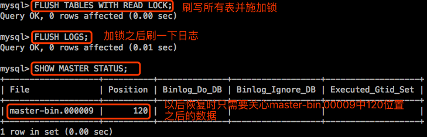

[TOC]


# 前言


# 一、数据备份的基本概念

只要发生数据传输、数据存储和数据交换，就有可能产生数据故障。

> - 通常，数据故障可划分为**系统故障**、**事务故障**和**介质故障**三大类。从信息安全的角度出发，实际上第三方或敌方的“信息攻击”，也会产生不同种类的数据故障。例如：计算机病毒型、特洛伊木马型、“黑客”入侵型、逻辑炸弹型等。
> - 这些故障将会造成的**后果**有：**数据丢失**、**数据被修改**、**增加无用数据**及**系统瘫痪**等。
> - 作为系统管理员，就是要千方百计地维护系统和数据的完整性与准确性。通常**采取的措施**有：**安装防火墙**，防止“黑客”入侵；**安装防病毒软件**，采取存取控制措施；**选用高可靠性的软件产品**；增强计算机网络的安全性。
>
> 但是，世界上没有万无一失的信息安全措施。信息世界“攻击和反攻击”也永无止境。对信息的攻击和防护好似矛与盾的关系，螺旋式地向前发展。
>
> 在信息的收集、处理、存储、传输和分发中经常会存在一些新的问题，其中最值得我们关注的就是系统失效、数据丢失或遭到破坏。威胁数据的安全、造成系统失效的主要原因有以下几个方面：硬盘驱动器损坏、人为错误、“黑客”攻击、病毒、自然灾害、电源浪涌、磁干扰等。

因此，数据备份是保护数据的最后手段，也是防止主动型信息攻击的最后一道防线。


## 1.数据备份的意义

数据备份的任务与意义就在于，**当灾难发生后，通过备份的数据完整、快速、简捷、可靠地恢复原有系统**。


## 2.备份时考虑因素

备份时可考虑以下因素：

> - **定期备份**：数据库要定期做备份，备份的周期应当根据应用数据系统可承受的恢复时间，而且定期备份的时间应当在系统负载最低的时候进行。对于重要的数据，要保证在极端情况下的损失都可以正常恢复。
> - **恢复测试**：定期备份后，同样需要定期做恢复测试，了解备份的正确可靠性，确保备份是有意义的、可恢复的。
> - **增量备份**：根据系统需要来确定是否采用增量备份，增量备份只需要备份每天的增量数据，备份花费的时间少，对系统负载的压力也小。缺点就是恢复的时候需要加载之前所有的备份数据，恢复时间较长。
> - `log-bin`：确保MySQL打开了`log-bin`选项，MySQL在做完整恢复或者基于时间点恢复的时候都需要BINLOG。
> - **异地备份**：可以考虑异地备份。


## 3.数据备份类型

### 3.1 数据库服务器是否在线

根据备份时，数据库服务器是否在线：

- **冷备：cold backup。**服务器离线，数据库读写操作都不能执行。
- **温备：warm backup。**全局施加共享锁，所有业务只能读，不能写。
- **热备：hot backup。**服务器不离线，读写操作都能进行。这就可能会有问题了。我们去备份，数据量很大，我们得夜间备份，在你复制的过程中，如果文件发生了改变，前一半后一半时间戳不一致，备份好的文件恢复过来是不允许访问的。在文件系统上，这样的文件属于时间点不一致文件，因此是不允许访问的。我们可以把整个数据库锁定，然后创建一快照，通过快照进行备份。通过快照备份，时间点一定是一致的，但是也有一些其他的问题。首先你要锁定整个库，你一锁定，别人就读写不了了。所以这也不能算是热备。真正的热备是指任何业务不终止，它能够自动在背后进行备份，而且自动保证时间点是一致的。**【注意】:要想完成热备，通常是基于事务的存储引擎才能完成的。**

### 3.2 备份数据集

根据备份的数据集：

- **完全备份：full backup**
- **部分备份: partial backup**


### 3.3 备份接口

根据备份时的接口（直接备份数据文件还是通过mysql服务器导出数据）：

- **物理备份：**直接复制(归档)数据文件的备份方式；physical backup。
    copy命令就可以备份了，还可以tar归档压缩备份，因此不需要额外的工具就可以备份。恢复也很简单，把备份的文件复制到数据库里面就可以了，但是要兼容才行。但好在MySQL的InnoDB和MyISAM非常容易跨平台，一般来说，在windows上备份的在Linux上也能用，在Linux上备份的在windows上也能用。物理备份比较适合大数据量备份，比如超过10G，甚至几十个G，千万别用逻辑备份。
- **逻辑备份：**把数据从库中提出出来保存为文本文件；logical backup。
    从根本上来讲，逻辑备份备份后为文本文件，我们可以使用grep、sed、awk来处理查看，物理备份的文件则不能被如此处理。而且逻辑备份恢复简单，导入就可以了。逻辑备份也有缺点，比如说与物理备份恢复速度比，逻辑备份恢复更慢，占据空间更大。还有逻辑备份有个重要缺点，无法保证浮点数的精度，因为我们必须把二进制数据转换成文本格式。更重要的是使用逻辑备份还原数据以后还需要重建索引。 对于非常大的表，重建索引是相当消耗时间和资源的，由其是CPU资源。逻辑备份的工具：mysqldump


### 3.4 完全、增量、差异

根据备份时是备份整个数据还是仅备份变化的数据：

- **完全备份：**full backup
- **增量备份：**incremental backup。得使用专业的备份工具进行增量备份。
- **差异备份：**differential backup
    增量和差异：差异，每一次起始点不是上一次备份，而是上一次完全备份。见下图。将来设计备份策略的时候，需要根据你的数据量变化频度来设计。

[](https://raw.githubusercontent.com/jkzhao/MarkdownPictures/master/MySQL/93.png)


# 四、各种备份与恢复方法实现

## 1. `SELECT ... INTO OUTFILE`

利用`SELECT ... INTO OUTFILE`实现数据的备份与还原。

（1）备份数据

```mysql
mysql > use hellodb; --  打开 hellodb 库 
mysql > select * from students;  -- 查看 students 的属性
mysql > select * from students where Age > 30 into outfile '/tmp/user.txt';  -- 将年龄大于30的同学的信息备份出来
```


（2）查看备份数据

```shell
shell >  cd  /tmp 
shell >  cat stud.txt
```


（3）数据被破坏

>  会发现是个文本文件。所以不能直接导入数据库了。需要使用LOADDATAINFILE恢复回到MySQL服务器端，删除年龄大于30的用户，模拟数据被破坏，

```mysql
mysql > delete from students where Age > 30;
```


（4）恢复数据

```mysql
mysql > load data infile '/tmp/stud.txt' into table students;
```


## 2. `mysqldump`

利用mysqldump工具对数据进行备份和还原。

mysqldump常用来做温备，所以首先需要对想备份的数据施加读锁。


### 2.1 施加读锁的方式

（1）直接在备份的时候添加选项

> - lock-all-tables：是对要备份的数据库的所有表施加读锁。
> - lock-table：仅对单张表施加读锁，即使是备份整个数据库，它也是在备份某张表的时候才对该表施加读锁，因此适用于备份单张表。


（2）在服务器端书写命令

```mysql
mysql > flush tables with read lock;  -- 施加锁，表示把位于内存上的表统统都同步到磁盘上去，然后施加读锁
mysql > flush tables with read lock;  -- 释放读
```

但这对于InnoDB存储引擎来讲，虽然也能够请求到读锁，但是不代表它的所有数据都已经同步到磁盘上，

因此当面对InnoDB的时候，要使用如下命令，看看InnoDB所有的数据都已经同步到磁盘上，才进行备份操作。

```mysql
mysql >  show engine innodb status;
```


### 2.2 备份过程

采取的备份策略为：完全备份+增量备份+二进制日志


（1）先给数据库做完全备份：

```shell
shell >  mysqldump -uroot --single-transaction --master-data = 2 --databases hellodb > /backup/hellodb_`date+%F`.sql
```

> - `--single-transaction`：基于此选项能实现热备InnoDB表，因此，不需要同时使用`--lock-all-tables`；
> - `--master-data=2`：记录备份那一时刻的二进制日志的位置，并且注释掉，1是不注释的；
> - `--databases hellodb`：指定备份的数据库。


（2）回到MySQL服务器端更新数据

```mysql
mysql > create table tb1( id int);  -- 创建表
mysql > insert into tb1 values( 1),( 2),( 3);   -- 插入数据，这里只做演示，随便插入了几个数
```


（3）先查看完全备份文件里边记录的位置

```shell
shell > cat hellodb_2013-09-08.sql | less 

--CHANGE MASTER TO MASTER_LOG_FILE =' mysql-bin.000013', MASTER_LOG_POS = 15684;  -- 记录了二进制日志的位
```


显示此时的二进制日志的位置，从备份文件里边记录的位置到我们此时的位置，即为增量的部

# 三、备份与恢复

## 1.`select... into outfile` 备份与恢复

通过Query将特定数据以指定方式输出到文本文件中，类似于Oracle中的SPOOL功能


### 1.1 语法

参数说明如下:

> - `FIELDS ESCAPED BY ['name']`：在SQL语句中需要转义的字符；
> - `FIELDS TERMINATED BY`：设定每两个字段之间的分隔符；
> - `FIELDS [OPTIONALLY] ENCLOSED BY 'name'` ：包装，有OPTIONALLY数字类型不被包装，否则全包装；
> - `LINES TERMINATED BY  'name'`：行分隔符，即每记录结束时添加的字符


### 1.2 备份

示例1：

```mysql
mysql>  select * from user into outfile '/var/lib/mysql-files/user.txt'; 
```


示例2:

```mysql
mysql > select * into outfile '/ tmp/ tb1. txt' 
-> fields terminated by ',' 
-> optionally enclosed by '"' 
-> lines terminated by '\ n' --默 认 
-> from tb1 limit 50;
Query OK, 50 rows affected (0.00 sec) 

[root@ gc tmp] more tb1. txt 
"information_schema"," CHARACTER_SETS"," SYSTEM VIEW" "information_schema"," COLLATIONS"," SYSTEM VIEW" ......
```


### 1.3 恢复

`LOAD DATA INFILE `语句用于高速地从一个文本文件中读取行，并写入一个表中，文件名称必须为一个文字字符串。此命令是 `SELECT ... INTO OUTFILE` 反操作，


示例1：

```mysql
mysql>  load data infile '/var/lib/mysql-files/user.txt' into table user;
```


示例2：

```
LOAD DATA LOCAL INFILE 'data.txt' INTO TABLE tbl_name 
FIELDS TERMINATED BY ',' 
OPTIONALLY ENCLOSED BY '"' 
LINES TERMINATED BY '\n'
```


## 2.mysqldump 备份与恢复

> `mysqldump` 是采用SQL级别的备份机制，它将数据表导成 SQL 脚本文件，在不同的 MySQL 版本之间升级时相对比较合适，可用于备份mysql数据库和数据表的 表结构以及内容，这也是最常用的备份方法。


### 2.1 语法

执行 `mysqldump --help` 可查看其用法

```mysql
mysqldump [OPTIONS] database [tables]
mysqldump [OPTIONS] --databases [OPTIONS] DB1 [DB2 DB3...]
mysqldump [OPTIONS] --all-databases [OPTIONS]

```


**[OPTIONS]**

> - `-A`, `--all-databases` 
>
>     备份所有数据库
>
> - `-B`, `--database`
>
>     备份多个指定的数据库
>
> - `-F`,` --flush-logs` 
>
>     开始备份前刷新binlog日志，可用于后面增量恢复
>
> - `--master-data[=#]` 
>
>     增加 binlog日志文件名和对应的位置点（即CHANGE MASTER语句） --master-data=1 不注释可执行语句 --masterd-data=2 注释可执行语句
>
> - `-x`, `--lock-all-tables` 
>
>     在开始导出之前，提交请求锁定所有数据库中的所有表，以保证数据的一致性。这是一个全局读锁，并且自动关闭 `--single-transaction` 和 `--lock-tables` 选项。
>
> - `-l`, `--lock-tables` 
>
>     它和 `--lock-all-tables` 类似，不过是锁定当前导出的数据表，而不是一下子锁定全部库下的表。本选项只适用于 `MyISAM` 表，如果是 `Innodb` 表可以用 `--single-transaction` 选项。
>
> - `-d`, `--no-data` 
>
>     只备份表结构，而不备份数据
>
> - `--single-transaction`   
>
>     事务，适合innodb事务数据库备份
>
> - `--default-character-set=charset`  
>
>     指定导出数据时采用何种字符集，如果数据表不是采用默认的 `latin1` 字符集的话，那么导出时必须指定该选项，否则再次导入数据后将产生乱码问题。
>
> - `--complete-insert`，`-c`
>
>     导出的数据采用包含字段名的完整 `INSERT` 方式，也就是把所有的值都写在一行。这么做能提高插入效率，但是可能会受到 `max_allowed_packet` 参数的影响而导致插入失败。因此，需要谨慎使用该参数，至少我不推荐。
>
> - `--extended-insert = true|false`
>
>     默认情况下，`mysqldump` 开启 `--complete-insert` 模式，因此不想用它的的话，就使用本选项，设定它的值为 `false` 即可。
>
> - `--disable-keys`
>
>     告诉 `mysqldump` 在 `INSERT` 语句的开头和结尾增加 `/*!40000 ALTER TABLE table DISABLE KEYS */;` 和 `/*!40000 ALTER TABLE table ENABLE KEYS */;` 语句，这能大大提高插入语句的速度，因为它是在插入完所有数据后才重建索引的。该选项只适合 `MyISAM` 表。
>
> - `--hex-blob` 
>
>     使用十六进制格式导出二进制字符串字段。如果有二进制数据就必须使用本选项。影响到的字段类型有 `BINARY、VARBINARY、BLOB`。
>
> - `--opt`
>
>     这只是一个快捷选项，等同于同时添加 `--add-drop-tables --add-locking --create-option --disable-keys --extended-insert --lock-tables --quick --set-charset` 选项。本选项能让 `mysqldump` 很快的导出数据，并且导出的数据能很快导回。该选项默认开启，但可以用 `--skip-opt` 禁用。注意，如果运行 `mysqldump` 没有指定 `--quick` 或 `--opt` 选项，则会将整个结果集放在内存中。如果导出大数据库的话可能会出现问题。
>
> - `--quick，-q`
>
>     该选项在导出大表时很有用，它强制 `mysqldump` 从服务器查询取得记录直接输出而不是取得所有记录后将它们缓存到内存中。
>
> - `--routines，-R`
>
>     导出存储过程以及自定义函数。
>
> - `--triggers`
>
>     同时导出触发器。该选项默认启用，用 `--skip-triggers` 禁用它。


### 2.2 备份

备份的时候需要保证数据一致性:

> - 对于事务支持的存储引擎，如Innodb或者BDB等，可以通过控制将整个备份过程在同一个事务中，使用“--single-transaction”选项
> - 对于不支持事务的存储引擎，则可通过读锁来保证数据一致性。


施加读锁有如下两种方式：

（1）添加 `mysqldump` 参数

> - -x，–lock-all-tables：请求锁定所有表之后再备份，对MyISAM、InnoDB、Aria做温备。
> - –lock-tables：备份哪张表，就锁定哪张表。这种并不理想，不建议使用，使用上面的那个。
> - –single-transaction: 能够对InnoDB存储引擎实现热备；


例如：

```mysql
mysqldump -uray -p'Ray12345.' --default-character-set=utf8 --opt --extended-insert=false  --triggers -R --hex-blob -x  db_name > db_name.sql
```


（2）手动锁表




```mysql
mysql>  flush tables with read lock;   -- 刷写所有表并施加读锁
mysql>  flush logs;  -- 加锁之后刷一下日志
mysql>  show master status;
mysql>  mysqldump -uray -p'Ray12345.' --default-character-set=utf8 --opt --extended-insert=false  --triggers -R --hex-blob -x  db_name > db_name.sql    -- 然后用mysqldump备份就可以了
mysql>  unlock  tables;   -- 释放锁
```


**（1）备份 `MyISAM` 表**

```mysql
mysqldump -uray -p'Ray12345.' --default-character-set=utf8 --opt --extended-insert=false  --triggers -R --hex-blob -x  db_name > db_name.sql

-- 即
shell> mysqldump -uray -p'Ray12345.' 
	-> --default-character-set=utf8 --opt --extended-insert=false 
	-> --triggers -R --hex-blob -x db_name > db_name.sql
```


**（2）备份 `Innodb` 表**


```mysql
mysqldump -uray -p'Ray12345.' --default-character-set=utf8 --opt --extended-insert=false  --triggers -R --hex-blob --single-transaction  db_name > db_name.sql

-- 即
shell> mysqldump -uray -p'Ray12345.' 
	-> --default-character-set=utf8 --opt --extended-insert=false 
	-> --triggers -R --hex-blob  --single-transaction  db_name > db_name.sql
```


另外，如果想要实现在线备份，还可以使用 `--master-data` 参数来实现，如下：

```mysql
mysqldump -uray -p'Ray12345.'  --default-character-set=utf8 --opt --master-data=1  --single-transaction --flush-logs db_name > db_name.sql

-- 即
shell> mysqldump -uray -p'Ray12345.' 
	-> --default-character-set=utf8 --opt --master-data=1 
	-> --single-transaction --flush-logs db_name > db_name.sql
```

它只是在一开始的瞬间请求锁表，然后就刷新binlog了，而后在导出的文件中加入`CHANGE MASTER` 语句来指定当前备份的binlog位置，如果要把这个文件恢复到slave里去，就可以采用这种方法来做。

> 注意：--extended-insert 需要根据实际情况决定是否启用或关闭 ，会对数据恢复速度产生较大影响。

 

### 2.3 恢复

用 `mysqldump` 备份出来的文件是一个可以直接倒入的 SQL 脚本，有两种方法可以将数据导入：

（1）直接用 `mysql` 客户端

```shell
mysql -uray -p'Ray12345.' db_name  <  db_name.sql
```


（2）用 SOURCE 语法

其实这不是标准的 SQL 语法，而是 `mysql` 客户端提供的功能，例如：

```mysql
mysql>  source /tmp/db_name.sql;
```

这里需要指定文件的绝对路径，并且必须是 `mysqld` 运行用户(例如 nobody)有权限读取的文件。


### 2.4 备份语句示例

**示例**：

（1）**备份所有数据库**

```shell
shell>  mysqldump -uroot -p --all-database > /tmp/ dumpback/ alldb.sql
```

（2）**备份指定数据库**

```shell
[root@ gc ～]  mysqldump -uroot -p --database sqoop hive > /tmp/dumpback/sqoop_hive.sql
```

（3）**备份某数据库中的表**

```shell
[root@ gc ～]  mysqldump -uroot -p sqoop tb1 > /tmp/ dumpback/ sqoop_tb1. sql
```


（4）**查看备份内容**

```shell
[root@ gc dumpback]  more  sqoop_tb1.sql
```


# 四、备份与恢复实战演示


## 准备数据库以及数据表


- **studymysql.sql**

```mysql
create database if not exists studymysql;
use studymysql;
create table if not exists user (
	id bigint ( 12 ) not null auto_increment,
	user_name varchar ( 45 ) not null,
	password varchar ( 45 ) not null,
    sex varchar ( 4 ) not null,
	age int ( 4 ) unsigned default null,
	city varchar ( 45 ) default null,
	start_date date default null,
	end_date date default null,
	description varchar ( 200 ) default null,
	primary key ( id ) 
);

insert into user (user_name, password,sex,age,city) values ('tom' ,'123','男',11,'shanghai');
insert into user (user_name, password,sex,age,city) values ('jack' ,'123','男',21,'shanghai');
insert into user (user_name, password,sex,age,city) values ('mike' ,'123','男',31,'shanghai');
insert into user (user_name, password,sex,age,city) values ('caly' ,'123','女',31,'shanghai');
insert into user (user_name, password,sex,age,city) values ('carter' ,'123','男',41,'wuhan');
insert into user (user_name, password,sex,age,city) values ('bush' ,'123','男',51,'wuhan');
insert into user (user_name, password,sex,age,city) values ('jerry' ,'123','男',61,'wuhan');
insert into user (user_name, password,sex,age,city) values ('xiaohong' ,'123','女',41,'wuhan');
insert into user (user_name, password,sex,age,city) values ('xiaoming' ,'123','男',41,'beijing');
```


登录shell，创建 studymysql.sql

```bash
[ray@localhost mysql]$ pwd
/home/ray/dev/mysql
[ray@localhost mysql]$ vim studymysql.sql

# 将上述文件粘贴，并保存

```


登录mysql

```shell
shell > mysql -uroot -p
```


查看数据库列表

```
mysql> show databases;
+--------------------+
| Database           |
+--------------------+
| information_schema |
| example            |
| mysql              |
| performance_schema |
+--------------------+
4 rows in set (0.00 sec)
```


准备 `studymysql` 数据库： 使用 source 命令运行sql

```mysql
mysql> source /home/ray/dev/mysql/studymysql.sql

Query OK, 1 row affected (0.00 sec)

Database changed
Query OK, 0 rows affected (0.08 sec)

Query OK, 1 row affected (0.00 sec)

Query OK, 1 row affected (0.01 sec)

Query OK, 1 row affected (0.00 sec)

Query OK, 1 row affected (0.01 sec)

Query OK, 1 row affected (0.00 sec)

Query OK, 1 row affected (0.00 sec)

Query OK, 1 row affected (0.01 sec)

Query OK, 1 row affected (0.01 sec)

Query OK, 1 row affected (0.00 sec)

-- 查看数据库列表，发现已经有 studymysql 数据库了
mysql> show databases;
+--------------------+
| Database           |
+--------------------+
| information_schema |
| example            |
| mysql              |
| performance_schema |
| studymysql         |
+--------------------+
5 rows in set (0.00 sec)

mysql> use studymysql  			-- 切换数据库
Database changed

mysql> show tables;    		 	-- 查看数据表列表
+----------------------+
| Tables_in_studymysql |
+----------------------+
| user                 |
+----------------------+
1 row in set (0.00 sec)

mysql> select * from user;  	 -- 查看user 表
+----+-----------+----------+-----+------+----------+------------+----------+-------------+
| id | user_name | password | sex | age  | city     | start_date | end_date | description |
+----+-----------+----------+-----+------+----------+------------+----------+-------------+
|  1 | tom       | 123      | 男  |   11 | shanghai | NULL       | NULL     | NULL        |
|  2 | jack      | 123      | 男  |   21 | shanghai | NULL       | NULL     | NULL        |
|  3 | mike      | 123      | 男  |   31 | shanghai | NULL       | NULL     | NULL        |
|  4 | caly      | 123      | 女  |   31 | shanghai | NULL       | NULL     | NULL        |
|  5 | carter    | 123      | 男  |   41 | wuhan    | NULL       | NULL     | NULL        |
|  6 | bush      | 123      | 男  |   51 | wuhan    | NULL       | NULL     | NULL        |
|  7 | jerry     | 123      | 男  |   61 | wuhan    | NULL       | NULL     | NULL        |
|  8 | xiaohong  | 123      | 女  |   41 | wuhan    | NULL       | NULL     | NULL        |
|  9 | xiaoming  | 123      | 男  |   41 | beijing  | NULL       | NULL     | NULL        |
+----+-----------+----------+-----+------+----------+------------+----------+-------------+
9 rows in set (0.00 sec)

```


## 1. `SELECT ... INTO OUTFILE` 备份与恢复


### 1.1 备份数据

查看默认备份目录：

```mysql
mysql>  SELECT @@GLOBAL.secure_file_priv;
+---------------------------+
| @@GLOBAL.secure_file_priv |
+---------------------------+
| /var/lib/mysql-files/     |
+---------------------------+
1 row in set (0.00 sec)
```


备份数据到备份目录中：

```mysql
mysql>  select * from user into outfile '/var/lib/mysql-files/user.txt'; 

-- 将备份文件拷贝到/tmp下，并查看
shell>  cp /var/lib/mysql-files/user.txt   /tmp/user.txt
shell>  cat  /tmp/user.txt
```


### 1.2 数据毁坏

将数据删掉，来默认真实环境中数据的毁坏

```mysql
delete from user;
```


### 1.3 恢复数据

```mysql
load data infile '/var/lib/mysql-files/user.txt' into table user;
```


## 2. mysqldump 备份与恢复

这里我们采用的备份策略为：完全备份+增量备份+二进制日志


### 2.1 完全备份

（1）先给数据库做完全备份：

```shell
shell >  mysqldump -uray -p'Ray12345.' --single-transaction --master-data=2 --databases studymysql > /tmp/backup/studymysql_`date +%Y-%m-%d-%H`.sql
```

> - `--single-transaction`：基于此选项能实现热备InnoDB表，因此，不需要同时使用`--lock-all-tables`；
> - `--master-data=2`：记录备份那一时刻的二进制日志的位置，并且注释掉，1是不注释的；
> - `--databases hellodb`：指定备份的数据库。


（2）查看此时的二进制日志的位置

完全备份文件里边记录了二进制日志的位置，查看一下

```mysql
shell > cat studymysql_2019-02-28-12.sql | less 


--
-- Position to start replication or point-in-time recovery from
--
-- 记录了二进制日志的位置
-- CHANGE MASTER TO MASTER_LOG_FILE='binlog.000002', MASTER_LOG_POS=5941;

--
-- Current Database: `studymysql`
--

CREATE DATABASE /*!32312 IF NOT EXISTS*/ `studymysql` /*!40100 DEFAULT CHARACTER SET utf8 */;
```


### 2.2 增量备份

在上一次完全备份之后，我们的数据有发生了变化

#### 2.2.1  数据变更

（1）回到MySQL服务器端更新数据

```
 mysql > create table tb1( id int);  -- 创建表
 mysql > insert into tb1 values( 1),( 2),( 3);   -- 插入数据，这里只做演示，随便插入了几个数
```


（2）查看此时的二进制日志的位置

```
 -- 显示此时的二进制日志的位置，从备份文件里边记录的位置到我们此时的位置，即为增量的部分
 
 mysql> show master status;
 
 +---------------+----------+--------------+------------------+-------------------+
 | File          | Position | Binlog_Do_DB | Binlog_Ignore_DB | Executed_Gtid_Set |
 +---------------+----------+--------------+------------------+-------------------+
 | binlog.000002 |     6439 |              |                  |                   |
 +---------------+----------+--------------+------------------+-------------------+
 1 row in set (0.00 sec)
 
```


#### 2.2.2 增量备份

我们对上一次完全备份到目前为止，有所变更的数据做一次增量备份

```shell
shell>  mysqlbinlog --start-position=5941 --stop-position=6439  /var/lib/mysql/binlog.000002 > /tmp/backup/studymysql_`date +%Y-%m-%d-%H`.sql
```


### 2.3 数据毁坏

自上一次增量备份到目前为止，我们的数据有一些变化

```mysql
insert into tb1 values( 4),( 5),( 6);  -- 模拟变化的数据
```

然而，我们对这些变化的数据还未来得及备份，数据就毁坏了

```mysql
drop database studymysql;    -- 删库，模拟数据毁坏
```


### 2.4 导出日志

查看删库时，二进制日志的位置

```mysql
shell>   mysqlbinlog --start-position=6439  /var/lib/mysql/binlog.000002
```

然后导出二进制日志

```mysql
shell>  mysqlbinlog --start-position=5941 --stop-position=6439  /var/lib/mysql/binlog.000002 > /tmp/backup/studymysql.sql
```


### 2.5 恢复数据

先让mysql 离线

```mysql
mysql> set sql_log_bin=0;   -- 关闭二进制日志
mysql > flush logs;   -- 刷写日志
```


恢复数据：

```shell
shell>  mysql  <  /tmp/backup/studymysql_2019-02-28-12.sql  # 导入完全备份文件
shell>  mysql  <  /tmp/backup/studymysql_2019-02-28-13.sql  # 导入增量备份文件
shell>  mysql  <  /tmp/backup/studymysql.sql  # 导入二进制日志文件
```


