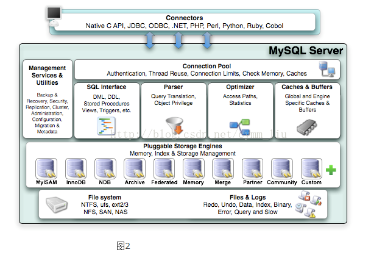
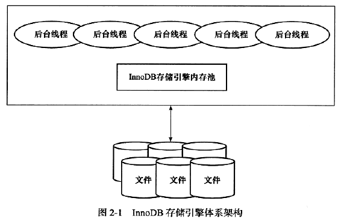

[TOC]

# 前言

# 一、Mysql体系结构

## 1.数据库与实例

- 数据库：

  > 数据库是文件的集合，这些文件可能存在于内存中或磁盘上。

- 数据库实例

  > 数据库实例是程序，用户通过数据库实例来操作数据库数据。数据库实例是位于用户和操作系统之间的一层数据管理软件，用户对数据库数据的任何操作，包括数据库定义、数据查询、数据维护等都是在数据库实例下进行的。
  >
  > Mysql数据库实例由后台线程以及一个共享内存区组成。

## 2.Mysql体系结构

Mysql由如下部分组成：

> - 连接池组件
> - 管理服务和工具组件
> - SQL接口组件
> - 查询分析器组件
> - 优化器组件
> - 缓冲（Cache）组件
> - 插件式存储引擎
> - 物理文件

# 二、InnoDB体系结构

## 1. 体系结构图

### 1.1 体系结构概览

 InnoDB 存储引擎体系结构，可分为如下三个部分：

（1）内存池

> InnoDB存储引擎有多个内存块，可以认为这些内存块组成了一个大的内存池，负责如下工作：
>
> - 维护所有进程/线程需要访问的内部数据结构
> - 缓存磁盘上的数据
> - 重做日志（redo log）缓冲
> - ......

（2）后台线程

> - 主要负责刷新内存池中的数据，保证内存池缓存的数据是最新的
> - 此外，将已修改的数据文件刷新到磁盘文件
> - 同时，保证在数据库发生异常的情况下InnoDB能恢复到正常运行状态

（3）文件

InnoDB会将相关数据持久化到这些磁盘文件中

### 1.2 体系结构图

在InnoDB的体系结构中涉及的内存区域和磁盘文件如下图所示

# 参考资料

1. [【MySQL】漫谈MySQL体系结构](https://blog.csdn.net/da_guo_li/article/details/80280289)
2. [MySQL基础架构与日志详解](https://blog.csdn.net/qq_40378034/article/details/90758268)
3. 