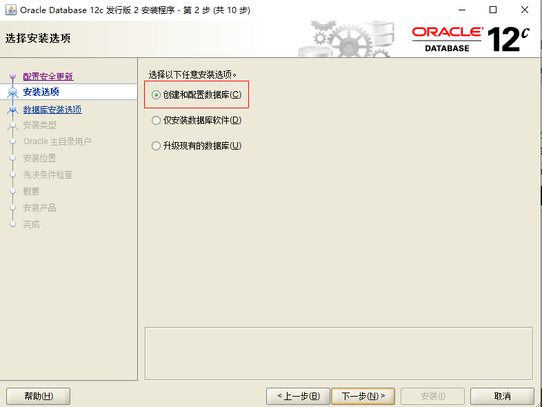
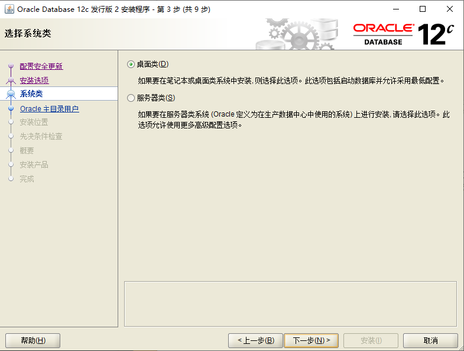
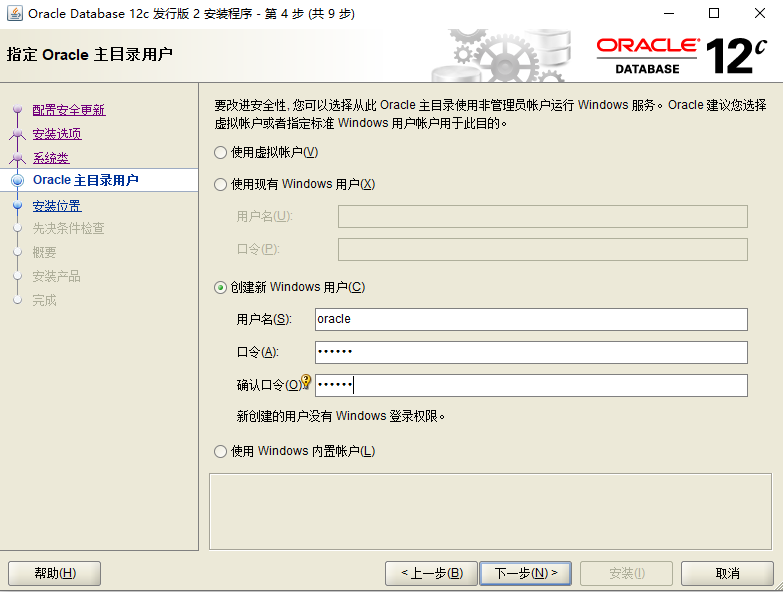
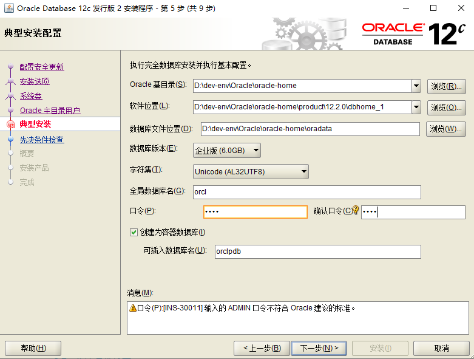
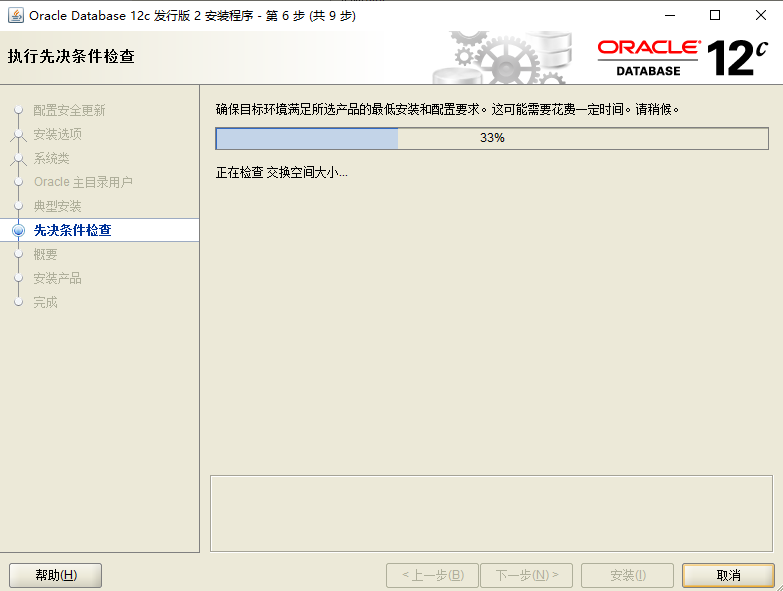
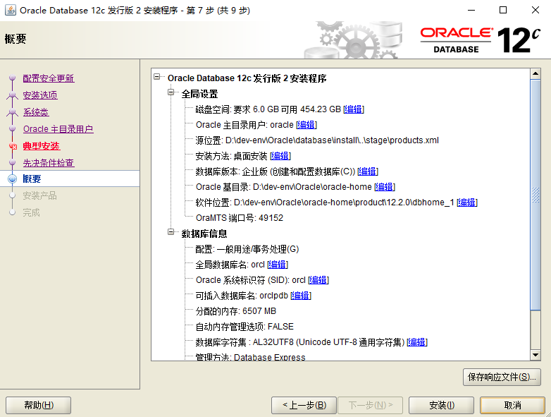
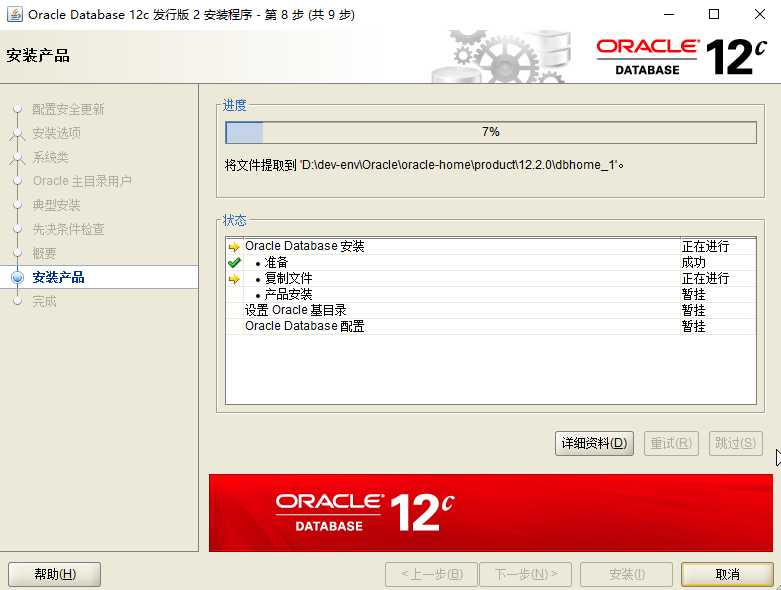
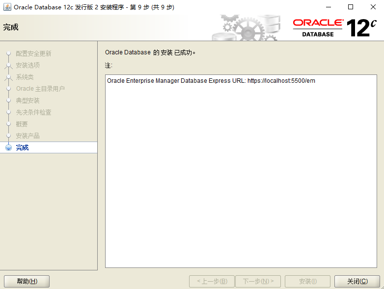
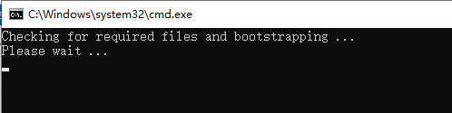

[TOC]


# 一、Oracle12c下载及安装

## 1.下载

前往Oracle官网下载即可

> https://www.oracle.com/technetwork/cn/database/enterprise-edition/downloads/index.html


解压后目录为：


双击setup.exe即可运行安装向导


## 2.安装

### 2.1 配置安全更新

安装程序要求提供您的电子邮件地址以获取最新的安全问题和更新。可以取消勾选，然后点击下一步

这里取消勾选，然后点击下一步即可


### 2.2 安装选项

如果首次安装Oracle数据库，需选择第一个选项




### 2.3 系统类

安装程序允许您选择系统类型。因为我们是在桌面计算机上安装Oracle，而不是服务器，因此，这里选择第一个选项：桌面类(Desktop class)，然后单击下一步按钮。




### 2.4 Oracle主目录用户

在这一步骤中，允许指定要安装和配置Oracle Home以增强安全性的Windows用户帐户。




> 使用现有的Windows用户：如果选择该项，则需要指定没有管理权限的用户。
>
> 创建新Windows用户：创建一个新用户，输入用户名和密码，确认密码
>
> 使用Windows内置账户选择该项：内置账户，Oracle也建议使用权限受限的账户。

 此处可选择第二项。注意，这里创建的用户名与已有的发生冲突的话，后面的安装会报错！

oracle


### 2.5 典型安装

在此步骤中，选择要安装Oracle数据库的文件夹，全局数据库名称和密码，可插拔数据库名称。




可以忽略警告

hssp

这里最好不要创建为容器数据库


### 2.6 执行先决条件检查

这一步自行完成，是对之前的配置进行检查。单击”下一步”。 




### 2.7 概要

- 上一步的检查没有问题后，会生成Oracle安装配置的概要信息，也可以这些配置信息保存到本地，方便以后查阅，确认无误后，单击”安装”
- 注意：安装前最好将电脑的杀毒软件都强行关闭，确保安装过程顺利。
- 注意：安装过程中，切勿关闭程序、断电或重启电脑。 





### 2.8 安装产品

整个安装过程持续时间较长，大概需要半个小时，耐心等待！ 




### 2.9 完成安装





# 二、Oracle 相关配置

## 1.启动服务

Oracle安装完成后，系统服务中会注册相应的服务，其中有两个服务必须启动，否则无法正常使用Oracle：

> - OracleServiceORCL：数据库的主服务，此服务必须开启，否则无法使用Oracle
> - OracleOraDB12Home1TNSListener：数据库的监听服务，若要连接服务器，此服务必须开启


Ctrl+Shift+Esc打开任务管理器，打开服务选项，如下图所示：


## 2.Net Manager配置

> 开始–>所有程序–>Oracle–>配置和移植工具–>Net Manager–>右键–>管理员身份运行。


（1）先将原本的Listener删除


# 三、Oracle数据库的卸载

## 1.运行`deinstall.bat`

> 可执行文件位置：`%Oracle_Home%\product\12.2.0\dbhome_1\deinstall\deinstall.bat`


运行可执行文件，我的为`D:\dev-env\Oracle\oracle12c\product\12.2.0\dbhome_1\deinstall\deinstall.bat`




## 2.删除服务

cmd中执行 sc  delete 服务名

```
sc delete OracleJobSchedulerORCL
sc delete OracleOraDB12Home2MTSRecoveryService
sc delete OracleOraDB12Home2TNSListener
sc delete OracleServiceORCL
sc delete OracleVssWriterORCL
```


## 2.删除注册表内容

Cmd运行regedit命令，删除下面内容： 

> （1）`计算机\HKEY_LOCAL_MACHINE\SOFTWARE\ORACLE `：删除此键
>
> （2）`计算机\HKEY_LOCAL_MACHINE\SYSTEM\CurrentControlSet\Services`：删除键下所有以oracle为首的键
>
> （3）HKEY_LOCAL_MACHINE|SYSTEM|CurrentControlSet|Services|Eventlog|Application删除此键下所有以oracle为首的键。 
>
> （4）HKEY_CLASSES_ROOT删除此键下所有以Ora，Oracle，Orcl，EnumOra 为前缀的键。 
>
> （5）`计算机\HKEY_CURRENT_USER\Software\Microsoft\Windows\CurrentVersion\Explorer\MenuOrder\Start Menu\Programs` ：删除此键下所有以oracle为首的键
>
> （6）`计算机\HKEY_LOCAL_MACHINE\SOFTWARE\ODBC\ODBCINST.INI` ：删除了Microsoft ODBC FOR ORACLE注册表键以外的所有有Oracle字样的键值。 


## 3.删除环境变量

删除环境变量CLASSPATH，PATH中含有Oracle字样的值。 


## 4.删除ORACLE相关的文件及目录

C：\Progrm Files\Oracle目录；删除ORACLE_BASE目录。  删除F：\app目录。无法删除的，重新启动机器之后再删除。


# 参考资料

1. [Oracle 12C安装_w3cschool](https://www.w3cschool.cn/oraclejc/oraclejc-vuqx2qqu.html)
2. [**Oracle 12c Windows安装、介绍及简单使用(图文)**](https://www.jianshu.com/p/b0b57d5c76cd)
3. [**Oracle 12c R2 for Windows_X64 安装**](https://www.cnblogs.com/sunsiyuan/p/8485418.html)
4. [**Oracle 12c 安装和卸载**](https://blog.csdn.net/since_1904/article/details/70176445)
5. 


