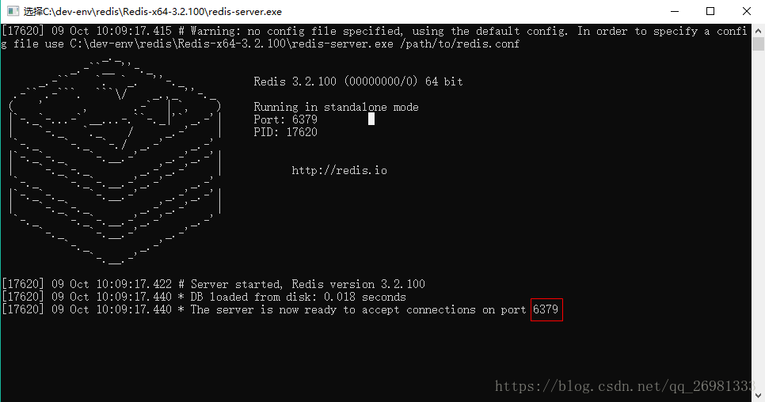
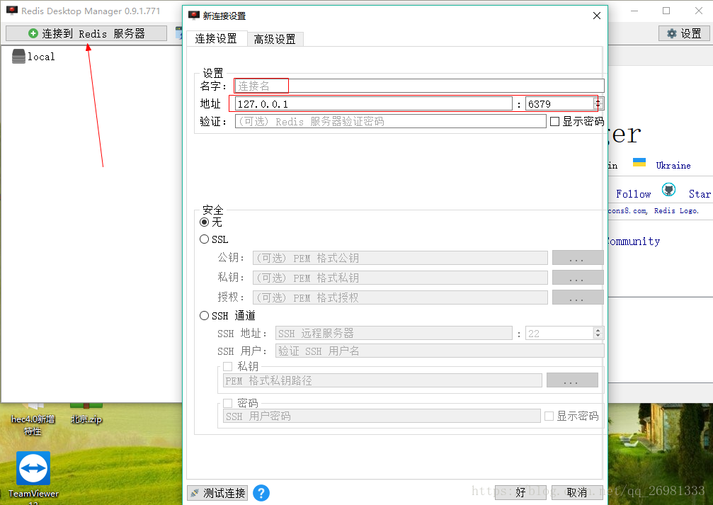
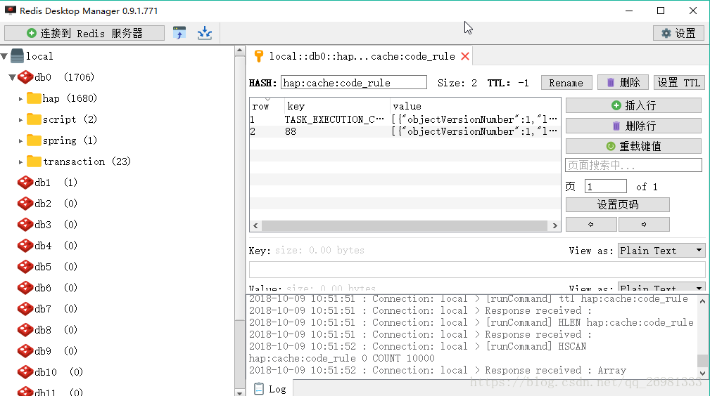

[TOC]


# 前言


# 一、Linux下Redis 单机环境搭建

## 1.下载解压

前往[官网](https://redis.io/download)下载稳定版


然后解压

```bash
# 创建安装目录
sudo mkdir /usr/local/redis/

# 解压至安装目录
sudo tar -zxvf redis-5.0.5.tar.gz  -C /usr/local/redis/
```


## 2.添加软链接

创建一个redis目录的软链接，这样做是为了不把redis目录固定在指定版本上，有利于Redis未来版本升级，算是安装软件的一种好习惯

(有疑问)

```bash
sudo ln -s /usr/local/redis/redis-5.0.5  redis
```


## 3.编译和安装

```bash
cd /usr/local/redis/redis-5.0.5

# 编译
make

# 安装
make install
```


## 3.启动redis

```bash
cd /usr/local/redis/redis-5.0.5/src
./redis-server
./redis-server ../redis.conf
```


# 二、Windows下Redis单机环境搭建

## 1.安装Redis

### 1.1 下载解压

去 GitHub Windows 版 Redis 项目地址下载，然后解压即可

> [MicrosoftArchive/redis](<https://github.com/microsoftarchive/redis/releases>)


### 1.2 启动

直接运行 redis 的 home 目录下的 redis-server.exe 即可。

出现下图界面，说明启动成功



## 2.安装Redis可视化工具

这里要安装的是 RedisDesktopManager

### 2.1 下载

下载地址：

> [亲测可用，也可自己百度搜索下载](https://www.7down.com/soft/233274.html)

GitHub  RedisDesktopManager 项目地址（此种方式需要付费）

> [uglide/RedisDesktopManager](https://github.com/uglide/RedisDesktopManager)


### 2.2 安装

一路默认安装即可


### 2.3 启动

双击可执行文件运行之后，点击 `连接到 Redis服务器` ，设置下 `连接名`、`Redis 的ip&port`，然后点击`测试连接`，测试成功之后点击`好`即可连接 redis 。


下图为redis中的数据列表示例



# 参考资料

1. [菜鸟教程_Redis 安装](https://www.runoob.com/redis/redis-install.html)
2. 


