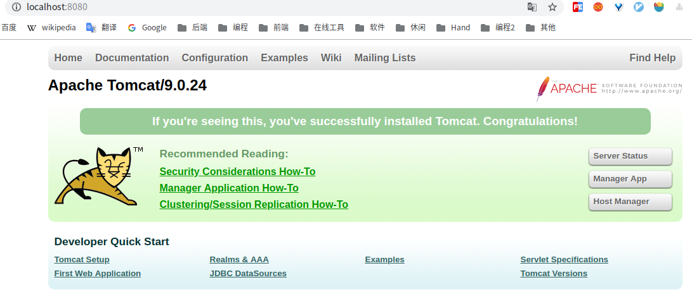

[TOC]


# 一、Linux 安装Tomcat

## 1.下载

前往[官网](https://tomcat.apache.org/)下载 `tar.gz`格式的压缩包

## 2.解压

```bash
# 创建安装目录
sudo mkdir /usr/local/tomcat/

# 解压至安装目录
sudo tar -zxvf apache-tomcat-9.0.24.tar.gz -C /usr/local/tomcat/
```


## 3.设置环境变量

编辑文件`/etc/profile`

```bash
sudo vim /etc/profile
```

添加文件末尾追加 JTomcat环境变量

```properties
export CATALINA_HOME=/usr/local/tomcat/apache-tomcat-9.0.24
export PATH=$CATALINA_HOME/bin:$PATH
```

使环境变量生效

```
source /etc/profile
```


## 4.验证

开放文件权限

```bash
cd /usr/local/tomcat
sudo chmod -R 777 apache-tomcat-9.0.24
```


启动tomcat

```bash
ray@ray:/$ $CATALINA_HOME/bin/startup.sh

Using CATALINA_BASE:   /usr/local/tomcat/apache-tomcat-9.0.24
Using CATALINA_HOME:   /usr/local/tomcat/apache-tomcat-9.0.24
Using CATALINA_TMPDIR: /usr/local/tomcat/apache-tomcat-9.0.24/temp
Using JRE_HOME:        /usr/local/java/jdk1.8.0_202
Using CLASSPATH:       /usr/local/tomcat/apache-tomcat-9.0.24/bin/bootstrap.jar:/usr/local/tomcat/apache-tomcat-9.0.24/bin/tomcat-juli.jar
Tomcat started.
```


然后访问 `http://localhost:8080/`，出现下图，说明安装成功




# 二/WIndow下安装

## 1.下载解压


## 2.配置环境变量

```properties
CATALINA_HOME   =C:\dev-env\Tomcat\apache-tomcat-9.0.24
CATALINA_BASE   =%CATALINA_HOME%
CATALINA_TMPDIR =%CATALINA_HOME%\temp
Path            =%CATALINA_HOME%\lib;%CATALINA_HOME%\bin
```


# 参考资料

1. 