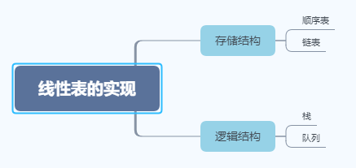

[TOC]

# 前言

# 一、线性表的基本概念

## 1.线性结构的特点

（1）存在唯一的一个被称作"第一个"的数据元素；

（2）存在为一个一个被称作“最后一个”的数据元素；

（3）除第一个之外，集合中的每个元素均只有一个前驱；

（4）除最后一个之外，集合中每个数据元素均只有一个后继。

## 2.线性表的类型定义

若将线性表记为： 
$$
(a_1,...,a_{i-1},a_i,a_{i+1},...,a_n)  \tag{2-1}
$$

则

（1）表中 a~i-1~ 领先于a~i~ , a~i~ 领先于a~i+1~ , 称a~i-1~是 a~i~ 的直接前驱元素， a~i+1~ 是 a~i~的直接后继元素。

（2）当i=1,2,...n-1时，a~i~有且仅有一个直接后继，当i=2,3,...,n时，a~i~有且仅有一个一个直接前驱。

（3）线性表中元素的个数n(n>=0)定义为线性表的长度，n=0时称为空表。

## 3.线性表的实现

# 参考资料

