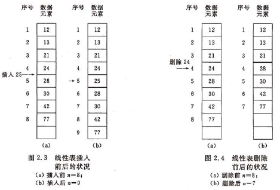

[TOC]


# 前言


# 一、顺序表的基本概念

## 1.定义

线性表的顺序表示指的是用**一组地址连续的存储单元**依次存储线性表的数据元素。


线性表的这种机内表示称作线性表的顺序存储结构或顺序映像，通常，称这种存储结构的线性表为顺序表。


## 2.特点

- 逻辑关系上相邻的两个元素在物理位置上也相邻
- 随机存取


## 3.重要操作




（1）插入操作

一般情况下，在第i（i>=1 && i<=n）个元素之前插入一个元素时，需将第n至第i（共n-i+1）个元素依次向后移动一个位置


（2）删除操作

一般情况下，删除第i（i>=1 && i<=n）个元素时，需将第i+1至第n（共n-i）个元素依次向前移动一个位置


（3）随机存取


## 4.时间复杂度

线性表优缺点：

> （1）优点：随机存取
>
> （2）缺点：插入和删除时，需要移动大量元素


# 二、顺序表的实现

由于高级程序设计语言中的数组类型也有随机存取的的特性，因此，通常都用**数组**来描述数据结构中的顺序存储结构。


## 1.要点分析

（1）数组扩容时机

默认的数组，是静态数组，数组的容量一经初始化便固定不便，只能存储固定容量的数据元素。

可对数组进行扩容来解决此问题：

> 在数组容量达到 3/4 时，将数组容量扩大 2 倍


（2）数组缩容时机

在数组容量低于 1/4 时，将数组容量缩小一半


## 2.代码实现


```java
package com.ray.study.datastructure.linearlist.arraylist;

/**
 * ArrayList : 变长数组实现
 *
 * @author shira 2019/07/05 14:48
 */
public class ArrayList<E> {

    static final float DEFAULT_LOAD_FACTOR = 0.75f;

    private E[] elementData;
    private int size;

    /** 构造函数，传入数组的容量capacity构造Array **/
    public ArrayList(int capacity){
        elementData = (E[])new Object[capacity];
        size = 0;
    }

    /** 无参数的构造函数，默认数组的容量capacity=10 **/
    public ArrayList(){
        this(10);
    }

    /** 获取数组的容量 **/
    public int getCapacity(){
        return elementData.length;
    }

    /** 获取数组中的元素个数 **/
    public int getSize(){
        return size;
    }

    /** 返回数组是否为空 **/
    public boolean isEmpty(){
        return size == 0;
    }

    /** 在index索引的位置插入一个新元素e **/
    public void add(int index, E e){

        if(index < 0 || index > size) {
            throw new IllegalArgumentException("Add failed. Require index >= 0 and index <= size.");
        }

        if(size >= elementData.length * DEFAULT_LOAD_FACTOR) {
            resize(2 * elementData.length);
        }

        for(int i = size - 1; i >= index ; i --) {
            elementData[i + 1] = elementData[i];
        }

        elementData[index] = e;

        size ++;
    }

    /** 向所有元素后添加一个新元素 **/
    public void addLast(E e){
        add(size, e);
    }

    /** 在所有元素前添加一个新元素 **/
    public void addFirst(E e){
        add(0, e);
    }

    /** 获取index索引位置的元素 **/
    public E get(int index){
        if(index < 0 || index >= size) {
            throw new IllegalArgumentException("Get failed. Index is illegal.");
        }
        return elementData[index];
    }


    public E getLast(){
        return get(size - 1);
    }

    public E getFirst(){
        return get(0);
    }


    /** 修改index索引位置的元素为e **/
    public E set(int index, E e){
        if(index < 0 || index >= size) {
            throw new IllegalArgumentException("Set failed. Index is illegal.");
        }

        E oldValue = elementData[index];
        elementData[index] = e;

        return oldValue;
    }

    /** 查找数组中是否有元素e  **/
    public boolean contains(E e){
        for(int i = 0 ; i < size ; i ++){
            if(elementData[i].equals(e)) {
                return true;
            }
        }
        return false;
    }

    /** 查找数组中元素e所在的索引，如果不存在元素e，则返回-1 **/
    public int find(E e){
        for(int i = 0 ; i < size ; i ++){
            if(elementData[i].equals(e)) {
                return i;
            }
        }
        return -1;
    }

    /** 从数组中删除index位置的元素, 返回删除的元素 **/
    public E remove(int index){
        if(index < 0 || index >= size) {
            throw new IllegalArgumentException("Remove failed. Index is illegal.");
        }

        E ret = elementData[index];
        for(int i = index + 1 ; i < size ; i ++) {
            elementData[i - 1] = elementData[i];
        }
        size --;
        elementData[size] = null; // loitering objects != memory leak

        if(size <= elementData.length / 4 && elementData.length / 2 != 0) {
            resize(elementData.length / 2);
        }
        return ret;
    }

    /** 从数组中删除第一个元素, 返回删除的元素 **/
    public E removeFirst(){
        return remove(0);
    }

    /** 从数组中删除最后一个元素, 返回删除的元素 **/
    public E removeLast(){
        return remove(size - 1);
    }

    /** 从数组中删除元素e  **/
    public void removeElement(E e){
        int index = find(e);
        if(index != -1) {
            remove(index);
        }
    }

    @Override
    public String toString(){

        StringBuilder res = new StringBuilder();
        res.append(String.format("Array: size = %d , capacity = %d\n", size, elementData.length));
        res.append('[');
        for(int i = 0 ; i < size ; i ++){
            res.append(elementData[i]);
            if(i != size - 1) {
                res.append(", ");
            }
        }
        res.append(']');
        return res.toString();
    }

    /** 将数组空间的容量变成newCapacity大小 **/
    private void resize(int newCapacity){

        E[] newData = (E[])new Object[newCapacity];
        for(int i = 0 ; i < size ; i ++) {
            newData[i] = elementData[i];
        }
        elementData = newData;
    }


}

```


# 参考资料

