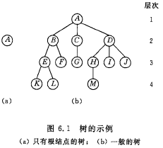
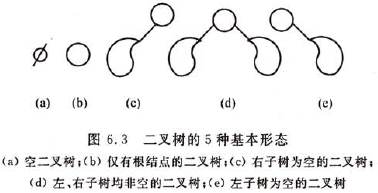
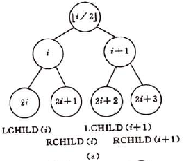
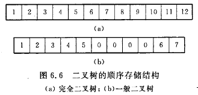
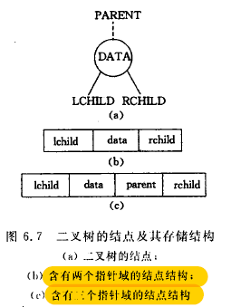

[TOC]


# 前言


# 一、树



## 1. 定义

树(Tree)是n（n>=0）个结点的有限集。在任意一棵非空树种：

（1）有且仅有一个特定的根（Root）的结点

（2）当n>1时，其余结点可分为m（m>0）个互不相交的有限集T1,T2,...,Tm，其中每一个集合本身又是一棵树，并且称为根的子树。


> 树的结构定义是一个递归的定义，即树的定义中又用到树的概念。


## 2.相关概念

### 2.1 结点的度、树的度

结点拥有的子树数称为**结点的度**(Degree)

树的度是树内各结点的度的最大值


### 2.2 叶子结点、分支结点、内部结点

度为0的结点称为叶子结点，或终端结点。

度不为0的结点称为分支结点，或非终端结点。

除根结点之外，分支结点也称为内部结点。


### 2.3 孩子、双亲、兄弟

结点的子树的根称为该结点的孩子（CHild），相应地，该结点称为孩子的双亲。

同一个双亲的孩子之间互称兄弟（Sibling）


### 2.4 祖先、子孙

结点的祖先是从根到该结点所经分支上的所有结点。

反之，以某结点为根的子树中的任一结点都称为该结点的子孙。


### 2.5 结点的层次、堂兄弟、树的深度或高度

**结点的层次**（Level）从根开始定义起，根为第一层，根的孩子为第二层。若某结点在第l层，则其子树的根就在第l+1层。其双亲在同一层的结点互为**堂兄弟**。


树中结点的最大层次称为树的**深度**（Depth）或**高度**


### 2.6 森林

**森林**(Forest)是m（m>=0）棵互不相交的树的集合。对树中每个结点而言，其子树的集合即为森林。


# 二、二叉树

## 1.定义

二叉树或为空，或是由一个根节点加上两棵分别称为左子树和右子树的、互不相交的二叉树组成。


二叉树可以有5种基本形态：




## 2.二叉树的性质

**性质1**：在二叉树的第i层上至多有2^i-1^个结点（i>=1）。

**性质2**：深度为k的二叉树，至多有2^k^-1个结点（k>=1）。

**性质3**：对任何一棵二叉树T，如果其终端结点数为n~0~，度为2的结点数为n~2~，则n~0~=n~2~+1。


## 3.完全二叉树的性质

$$

$$


> - 一棵深度为k且有2^k^-1个结点的二叉树称为**满二叉树**。
> - 深度为k的，有n个节点的二叉树，当且仅当其每一个结点都与深度为k的满二叉树中编号从1至n的结点一一对应时，称之为**完全二叉树**。


**性质4**：具有n个结点的完全二叉树的深度为⌊log~2~n⌋+1。

**性质5**：如果对一棵有n个结点的完全二叉树（其深度为⌊log~2~n⌋+1）的结点按层序（每层从左到右）编号，则对任一结点i（i>=1,i<=n）,有：

> （1）如果i=1，则结点i是二叉树的根，无双亲；如果i>1，则其双亲Parent(i)是结点⌊i/2⌋.
>
> （2）如果2i>n，则结点i无左孩子（结点i为叶子结点）；否则其左孩子 LCHILD(i)是结点2i.
>
> （3）如果2i+1>n，则结点i无右孩子；否则其右孩子rchild(i)是结点2i+1.							





## 4.树的存储结构

### 4.1 顺序存储结构





按照完全二叉树的存储顺序来存储对应结点，空节点存0


### 4.2 链式存储




## 5.遍历二叉树

遍历二叉树：

> 按照某条搜索路径巡访树中每个结点，使得每个结点均被访问一次，而且仅被访问一次。

遍历对线性结构来说很容易，而对树结构则不然，由于二叉树是一种非线性结构，每个结点都可能有两棵子树，因而需要寻找一种规律，以便使二叉树上的结点能排列在一个线性队列上，从而便于遍历。


二叉树的遍历分为深度优先遍历、层序优先遍历

### 5.1 深度优先遍历

先序遍历：

> 若二叉树为空，则空操作；否则
>
> （1）访问根节点；
>
> （2）先序遍历左子树；
>
> （3）先序遍历右子树；


中序遍历：

> 若二叉树为空，则空操作；否则
>
> （1）中序遍历左子树；
>
> （2）访问根节点；
>
> （3）中序遍历右子树；


后序遍历：

> 若二叉树为空，则空操作；否则
>
> （1）后序遍历左子树；
>
> （2）后序遍历右子树；
>
> （3）访问根节点；


先序遍历的递归算法如下：

```java
    // 先序遍历以node为根的二分搜索树, 递归算法
    private void preOrder(Node node){

        if(node == null) {
            return;
        }

        System.out.println(node.e);
        preOrder(node.left);
        preOrder(node.right);
    }
```


