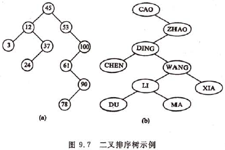
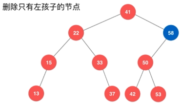
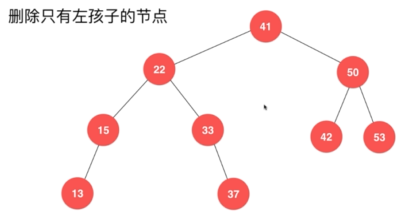
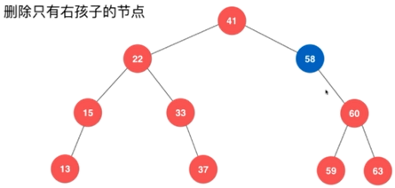
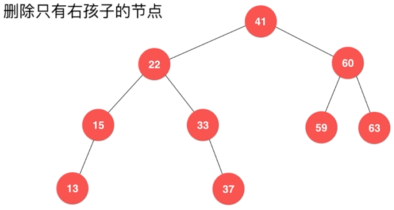
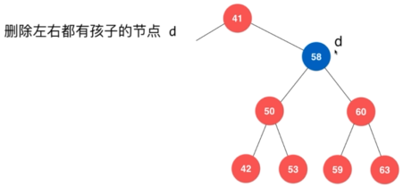
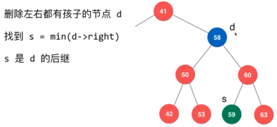
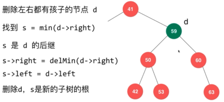

[TOC]


# 前言


# 一、二叉查找树



## 1.定义

二叉查找树， 或者是一棵空树；或者是具备下列性质的二叉树：

（1）若它的左子树不空，则左子树上所有结点的值均小于它的根结点的值；

（2）若它的右子树不空，则右子树上所有结点的值均大于它的根结点的值；

（3）它的左、右子树也分别为二叉查找树。


二叉查找树，又称二叉排序树，或二分搜索树。中序遍历二叉查找树可得到一个递增序列（假设不考虑重复）


##  2.二叉查找树的实现

通常，可取二叉链表作为二叉查找树的存储结构


```java
package com.ray.study.datastructure.tree.binarysearchtree;

import java.util.LinkedList;
import java.util.Queue;
import java.util.Stack;

/**
 * 二叉查找树，也叫二叉排序树，也叫二分搜索树
 *
 * @author shira 2019/07/09 21:36
 */
public class BinarySearchTree <E extends Comparable<E>> {

    private class Node{
        public E e;
        public Node left, right;

        public Node(E e){
            this.e = e;
            left = null;
            right = null;
        }
    }

    private Node root;
    private int size;

    public BinarySearchTree(){
        root = null;
        size = 0;
    }

    public int size(){
        return size;
    }

    public boolean isEmpty(){
        return size == 0;
    }

    // 向二分搜索树中添加新的元素e
    public void add(E e){
        root = add(root, e);
    }

    // 向以node为根的二分搜索树中插入元素e，递归算法
    // 返回插入新节点后二分搜索树的根
    private Node add(Node node, E e){

        if(node == null){
            size ++;
            return new Node(e);
        }

        if(e.compareTo(node.e) < 0) {
            node.left = add(node.left, e);
        } else if(e.compareTo(node.e) > 0) {
            node.right = add(node.right, e);
        }

        return node;
    }

    // 看二分搜索树中是否包含元素e
    public boolean contains(E e){
        return contains(root, e);
    }

    // 看以node为根的二分搜索树中是否包含元素e, 递归算法
    private boolean contains(Node node, E e){

        if(node == null) {
            return false;
        }

        if(e.compareTo(node.e) == 0) {
            return true;
        } else if(e.compareTo(node.e) < 0) {
            return contains(node.left, e);
        } else // e.compareTo(node.e) > 0
        {
            return contains(node.right, e);
        }
    }

    // 二分搜索树的前序遍历
    public void preOrder(){
        preOrder(root);
    }

    // 前序遍历以node为根的二分搜索树, 递归算法
    private void preOrder(Node node){

        if(node == null) {
            return;
        }

        System.out.println(node.e);
        preOrder(node.left);
        preOrder(node.right);
    }

    // 二分搜索树的非递归前序遍历
    public void preOrderNR(){

        if(root == null) {
            return;
        }

        Stack<Node> stack = new Stack<>();
        stack.push(root);
        while(!stack.isEmpty()){
            Node cur = stack.pop();
            System.out.println(cur.e);

            if(cur.right != null) {
                stack.push(cur.right);
            }
            if(cur.left != null) {
                stack.push(cur.left);
            }
        }
    }

    // 二分搜索树的中序遍历
    public void inOrder(){
        inOrder(root);
    }

    // 中序遍历以node为根的二分搜索树, 递归算法
    private void inOrder(Node node){

        if(node == null) {
            return;
        }

        inOrder(node.left);
        System.out.println(node.e);
        inOrder(node.right);
    }

    // 二分搜索树的后序遍历
    public void postOrder(){
        postOrder(root);
    }

    // 后序遍历以node为根的二分搜索树, 递归算法
    private void postOrder(Node node){

        if(node == null) {
            return;
        }

        postOrder(node.left);
        postOrder(node.right);
        System.out.println(node.e);
    }

    // 二分搜索树的层序遍历
    public void levelOrder(){

        if(root == null) {
            return;
        }

        Queue<Node> q = new LinkedList<>();
        q.add(root);
        while(!q.isEmpty()){
            Node cur = q.remove();
            System.out.println(cur.e);

            if(cur.left != null) {
                q.add(cur.left);
            }
            if(cur.right != null) {
                q.add(cur.right);
            }
        }
    }

    // 寻找二分搜索树的最小元素
    public E minimum(){
        if(size == 0) {
            throw new IllegalArgumentException("BST is empty!");
        }

        return minimum(root).e;
    }

    // 返回以node为根的二分搜索树的最小值所在的节点
    private Node minimum(Node node){
        if(node.left == null) {
            return node;
        }
        return minimum(node.left);
    }

    // 寻找二分搜索树的最大元素
    public E maximum(){
        if(size == 0) {
            throw new IllegalArgumentException("BST is empty");
        }

        return maximum(root).e;
    }

    // 返回以node为根的二分搜索树的最大值所在的节点
    private Node maximum(Node node){
        if(node.right == null) {
            return node;
        }

        return maximum(node.right);
    }

    // 从二分搜索树中删除最小值所在节点, 返回最小值
    public E removeMin(){
        E ret = minimum();
        root = removeMin(root);
        return ret;
    }

    // 删除掉以node为根的二分搜索树中的最小节点
    // 返回删除节点后新的二分搜索树的根
    private Node removeMin(Node node){

        if(node.left == null){
            Node rightNode = node.right;
            node.right = null;
            size --;
            return rightNode;
        }

        node.left = removeMin(node.left);
        return node;
    }

    // 从二分搜索树中删除最大值所在节点
    public E removeMax(){
        E ret = maximum();
        root = removeMax(root);
        return ret;
    }

    // 删除掉以node为根的二分搜索树中的最大节点
    // 返回删除节点后新的二分搜索树的根
    private Node removeMax(Node node){

        if(node.right == null){
            Node leftNode = node.left;
            node.left = null;
            size --;
            return leftNode;
        }

        node.right = removeMax(node.right);
        return node;
    }

    // 从二分搜索树中删除元素为e的节点
    public void remove(E e){
        root = remove(root, e);
    }

    // 删除掉以node为根的二分搜索树中值为e的节点, 递归算法
    // 返回删除节点后新的二分搜索树的根
    private Node remove(Node node, E e){

        if( node == null ) {
            return null;
        }

        if( e.compareTo(node.e) < 0 ){
            node.left = remove(node.left , e);
            return node;
        }
        else if(e.compareTo(node.e) > 0 ){
            node.right = remove(node.right, e);
            return node;
        }
        else{   // e.compareTo(node.e) == 0

            // 待删除节点左子树为空的情况
            if(node.left == null){
                Node rightNode = node.right;
                node.right = null;
                size --;
                return rightNode;
            }

            // 待删除节点右子树为空的情况
            if(node.right == null){
                Node leftNode = node.left;
                node.left = null;
                size --;
                return leftNode;
            }

            // 待删除节点左右子树均不为空的情况

            // 找到比待删除节点大的最小节点, 即待删除节点右子树的最小节点
            // 用这个节点顶替待删除节点的位置
            Node successor = minimum(node.right);
            successor.right = removeMin(node.right);
            successor.left = node.left;

            node.left = node.right = null;

            return successor;
        }
    }

    @Override
    public String toString(){
        StringBuilder res = new StringBuilder();
        generateBSTString(root, 0, res);
        return res.toString();
    }

    // 生成以node为根节点，深度为depth的描述二叉树的字符串
    private void generateBSTString(Node node, int depth, StringBuilder res){

        if(node == null){
            res.append(generateDepthString(depth) + "null\n");
            return;
        }

        res.append(generateDepthString(depth) + node.e +"\n");
        generateBSTString(node.left, depth + 1, res);
        generateBSTString(node.right, depth + 1, res);
    }

    private String generateDepthString(int depth){
        StringBuilder res = new StringBuilder();
        for(int i = 0 ; i < depth ; i ++) {
            res.append("--");
        }
        return res.toString();
    }
}

```


### 2.1 查找元素

（1）递归终止条件：

> - 若根结点为空，则表示找不到，返回false；
> - 若待查找值等于根结点值，则表示找到，true；

（2）若待查找值小于根结点值，则去左子树递归地查找

（3）若待查找值大于根结点值，则去右子树递归地查找


```java
   // 看二分搜索树中是否包含元素e
    public boolean contains(E e){
        return contains(root, e);
    }

    // 看以node为根的二分搜索树中是否包含元素e, 递归算法
    private boolean contains(Node node, E e){

        if(node == null) {
            return false;
        }

        if(e.compareTo(node.e) == 0) {
            return true;
        } else if(e.compareTo(node.e) < 0) {
            return contains(node.left, e);
        } else // e.compareTo(node.e) > 0
        {
            return contains(node.right, e);
        }
    }
```


### 2.2 插入

（1）递归终止条件：

> - 若根结点为空，插入即可

（2）若待插入值小于根结点值，则去左子树递归地插入

（3）若待插入值大于根结点值，则去右子树递归地插入


```java
    // 向二分搜索树中添加新的元素e
    public void add(E e){
        root = add(root, e);
    }

    // 向以node为根的二分搜索树中插入元素e，递归算法
    // 返回插入新节点后二分搜索树的根
    private Node add(Node node, E e){

        if(node == null){
            size ++;
            return new Node(e);
        }

        if(e.compareTo(node.e) < 0) {
            node.left = add(node.left, e);
        } else if(e.compareTo(node.e) > 0) {
            node.right = add(node.right, e);
        }

        return node;
    }

```


### 2.3 删除

**删除的逻辑**：

（1）递归终止条件：

> - 若根结点为空，则返回空
> - 在待删除元素值等于根结点值根的情况下：
>   - 若根结点没有孩子，也即为叶子结点，则直接删除
>   - 若根结点只有一个孩子（有左子树或右子树），则将根结点的双亲结点直接指向其孩子
>   - 若根结点有两个孩子，则用根结点的前驱（左子树的最大值）或者后继（右子树的最小值）来代替该结点的数据，然后再删除这个前驱或后继。


（2）若待删除元素值小于根结点值，则去左子树递归地删除

（3）若待删除元素值大于根结点值，则去右子树递归的删除


**删除示例：**

（1）删除只有左孩子的结点








（2）删除只有右孩子的结点







（3）删除有两个孩子的结点









**递归删除的实现**：

```java
    // 删除掉以node为根的二分搜索树中值为e的节点, 递归算法
    // 返回删除节点后新的二分搜索树的根
    private Node remove(Node node, E e){

        if( node == null ) {
            return null;
        }

        int compareResult = e.compareTo(node.e) ;
        if( compareResult < 0 ){
            node.left = remove(node.left , e);
        }else if(compareResult > 0 ){
            node.right = remove(node.right, e);
        }else if(node.left !=null && node.right !=null ){
            node.e = findMin(node.right).e;
            node.right = remove(node.right, node.e);
        }else{
            node = (node.left != null) ? node.left : node.right;
            size--;
        }

        return node;
    }

    // 返回以node为根的二分搜索树的最小值所在的节点
    private Node findMin(Node node){
        if(node.left == null) {
            return node;
        }
        return findMin(node.left);
    }


```


