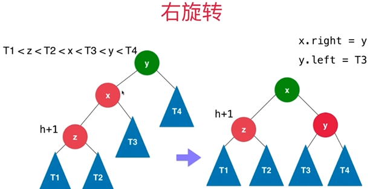
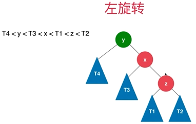
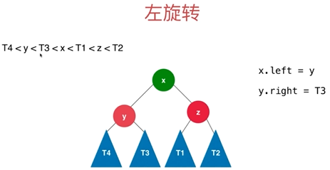
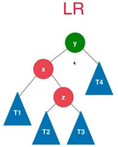
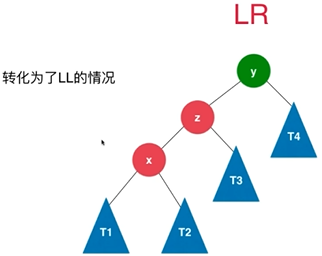
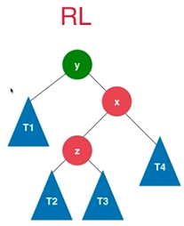
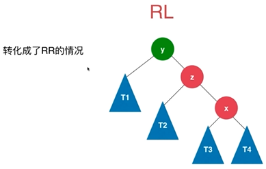

[TOC]


# 前言

二叉查找树的算法时间复杂度与高度有关，这也是二叉查找树快的原因，平均情况下，其查找的时间复杂度为O(log~n~)，但在最坏情况下，即二叉查找树退化成链表时，复杂度变为O(n).


为保持二叉查找树高度的平衡性，我们对其高度进行了平衡性限制，由此产生平衡二叉树。


# 一、平衡二叉树基本概念

## 1.定义

关于平衡二叉树的定义有两种说法，个人感觉严蔚敏版要稍微准确点

- 严蔚敏版 数据结构中：

  > 平衡二叉树（Balanced Binary Tree 或 Height-Balanced Tree） 又称 AVL 树。 它或者是一棵空树，或者是具有下列性质的二叉树：**它的左子树和右子树都是平衡二叉树，且左右子树的深度差的绝对值不超过1。**


- 数据结构与算法分析Java版描述中

  > AVL（Adelson-Velskii 和Landis）树是**带有平衡条件**（balance condition）的二叉查找树
  >
  > （感觉应该改成：AVL（Adelson-Velskii 和Landis）树是带有平衡条件（balance condition）的二叉树）


若将二叉树结点上的平衡因子BF（Balance-Factor）定义为该结点的左子树的深度减去它的右子树的深度，则平衡二叉树上所有结点的平衡因此只可能是-1、0和1.


下面谈论的平衡二叉树，都是带有平衡条件的二叉查找树。


## 2.平衡的维护

在插入时，进行平衡因子的维护。

> 若描述对某结点进行旋转，则其他结点保持不动.
>
> 要旋转的结点皆为第一个不平衡结点的子节点。

### 2.1 LL

LL：表示新插入结点是第一个不平衡的结点的左孩子的左孩子

此时需要对X进行一次右旋转。





### 2.2 RR

RR：表示新插入结点是第一个不平衡的结点的右孩子的右孩子

此时需要左旋转。







### 2.3 LR

RR：表示新插入结点是第一个不平衡的结点的左孩子的右孩子




此时需要做如下操作：

（1）首先对X进行左旋转，即可转化为LL



（2）再对Z进行右旋转即可


### 2.4 RL





（1）先对x进行一次右旋转，即可转化为RR



（2）再对Z进行左旋转即可


# 二、平衡二叉树的实现

```

```


## 1.一些基本操作


```java

    public int getSize(){
        return size;
    }

    public boolean isEmpty(){
        return size == 0;
    }

    /**
     * 判断该二叉树是否是一棵二分搜索树
     * @return 是否是一棵二分搜索树
     */
    public boolean isBST(){

        // 中序遍历后形成递增序列
        ArrayList<K> keys = new ArrayList<>();
        inOrder(root, keys);

        for(int i = 1 ; i < keys.size() ; i ++) {
            if(keys.get(i - 1).compareTo(keys.get(i)) > 0) {
                return false;
            }
        }
        return true;
    }

    private void inOrder(Node node, ArrayList<K> keys){

        if(node == null) {
            return;
        }

        inOrder(node.left, keys);
        keys.add(node.key);
        inOrder(node.right, keys);
    }

    
```


## 2.平衡维护


```java
    /**
     * 获取结点node的高度
     * @param node
     * @return
     */
    private int getHeight(Node node){
        if(node == null) {
            return 0;
        }
        return node.height;
    }

    /**
     * 判断该二叉树是否是一棵平衡二叉树
     * @return 是否是一棵平衡二叉树
     */
    public boolean isBalanced(){
        return isBalanced(root);
    }

    /**
     * 判断以Node为根的二叉树是否是一棵平衡二叉树，递归算法
     * @param node 以Node为根的二叉树
     * @return 是否平衡
     */
    private boolean isBalanced(Node node){

        if(node == null) {
            return true;
        }

        int balanceFactor = getBalanceFactor(node);
        if(Math.abs(balanceFactor) > 1) {
            return false;
        }
        return isBalanced(node.left) && isBalanced(node.right);
    }


    /**
     * 获得结点node的平衡因子
     * @param node  结点node
     * @return 结点node的平衡因子
     */
    private int getBalanceFactor(Node node){
        if(node == null) {
            return 0;
        }
        return getHeight(node.left) - getHeight(node.right);
    }


   

    /*
         对节点y进行向右旋转操作，返回旋转后新的根节点x
                y                              x
               / \                           /   \
              x   T4     向右旋转 (y)        z     y
             / \       - - - - - - - ->    / \   / \
            z   T3                       T1  T2 T3 T4
           / \
         T1   T2
    */
    private Node rightRotate(Node y) {
        // 向右旋转过程
        Node x = y.left;
        y.left = x.right;
        x.right = y;


        // 更新height
        y.height = Math.max(getHeight(y.left), getHeight(y.right)) + 1;
        x.height = Math.max(getHeight(x.left), getHeight(x.right)) + 1;

        return x;
    }

    /*
         对节点y进行向左旋转操作，返回旋转后新的根节点x
            y                             x
          /  \                          /   \
         T1   x      向左旋转 (y)       y     z
             / \   - - - - - - - ->   / \   / \
           T2  z                     T1 T2 T3 T4
              / \
             T3 T4

     */
    private Node leftRotate(Node y) {
        // 向左旋转过程
        Node x = y.right;
        y.right = x.left;
        x.left = y;

        // 更新height
        y.height = Math.max(getHeight(y.left), getHeight(y.right)) + 1;
        x.height = Math.max(getHeight(x.left), getHeight(x.right)) + 1;

        return x;
    }


    /**
     * 对以node为根的树进行平衡维护
     * @param node 以node为根的树
     * @return 返回平衡后的树的根
     */
    private Node balance(Node node){
        if(node == null){
            return node;
        }

        // 计算平衡因子
        int balanceFactor = getBalanceFactor(node);

        if (balanceFactor > HIGHTEST_BALANCE_FACTOR) {
            if(getBalanceFactor(node.left)>=0){
                // LL
                node =  rightRotate(node);
            }else{
                // LR
                node.left = leftRotate(node.left);
                node =  rightRotate(node);
            }
        }else if(balanceFactor < LOWEST_BALANCE_FACTOR){
            if(getBalanceFactor(node.right)<=0){
                // RR
                node = leftRotate(node);
            }else{
                // RL
                node.right = rightRotate(node.right);
                node = leftRotate(node);
            }
        }

        // 更新height
        node.height = 1 + Math.max(getHeight(node.left), getHeight(node.right));

        // 原本就是平衡的就直接返回
        return node;
    }


```

## 3.添加

```java
    /**
     * 向二分搜索树中添加新的元素(key, value)
     * @param key 键
     * @param value 值
     */
    public void add(K key, V value){
        root = add(root, key, value);
    }


    /**
     * 向以node为根的二分搜索树中插入元素(key, value)，递归算法
     *
     * @param node 以node为根的二分搜索树
     * @param key 键
     * @param value 值
     * @return 返回插入新节点后二分搜索树的根
     */
    private Node add(Node node, K key, V value){

        if(node == null){
            size ++;
            return new Node(key, value);
        }

        int compareResult = key.compareTo(node.key) ;
        if(compareResult < 0) {
            node.left = add(node.left, key, value);
        } else if(compareResult > 0) {
            node.right = add(node.right, key, value);
        } else {
            // 插入一个原本就有的值，当做更新进行处理
            node.value = value;
        }

        // 更新height
        node.height = 1 + Math.max(getHeight(node.left), getHeight(node.right));

        // 平衡维护
        return balance(node);
    }
```


## 4.删除


