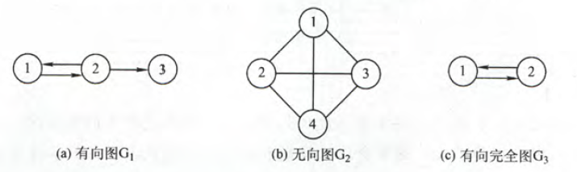
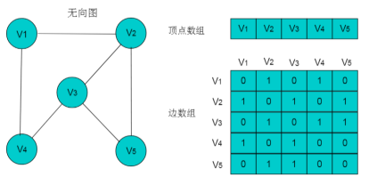
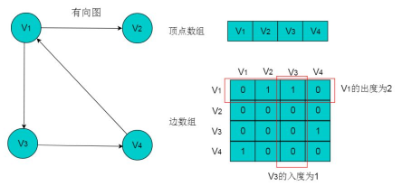
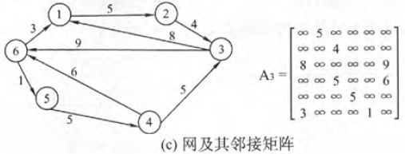
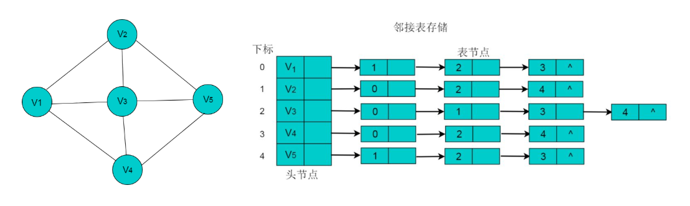
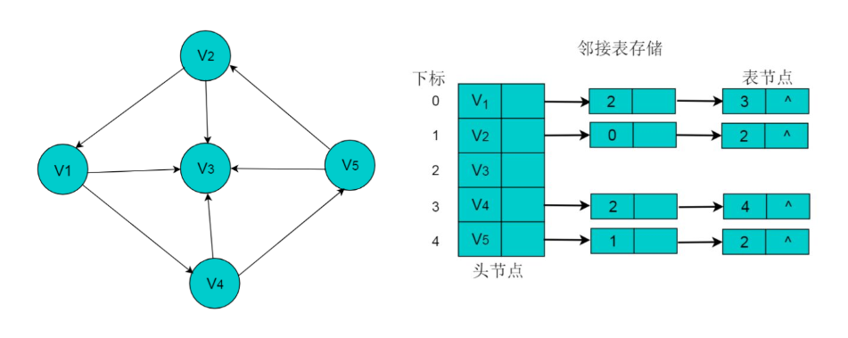
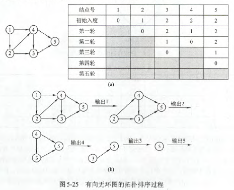

[TOC]


# 前言


# 一、图的基本概念

## 1.图的定义

图 G 由顶点集 V 和边集 E 组成，记为 G = (V , E)

其中：

> - V(G) 表示图G中顶点的有限非空集；E(G)表示图G中顶点之间的关系（边）集合。
> - 若 V={v~1~，v~2~，...，v~n~}，用 `|V|` 表示图G中顶点的个数，也称为图 G 的阶，`E={(u,v)|u∈V，v∈V}`，用 |E| 表示图 G 中边的条数
> - 图的顶点集一定非空


## 2.基本概念




### 2.1 有向图

若 E 是有向边（也称为弧）的有限集合时，则图G为有向图。弧是顶点的有序对，记为`<v,w>` ，其中 v、w是顶点，v称为弧尾，w称为弧头，称为从顶点v到顶点w的弧，也称为v邻接到w，或w邻接自v


### 2.2 无向图


### 2.3 简单图


（4）多重图


（5）完全图（也称简单完全图）


（6）子图


（7）连通、连通图和连通分量


（8）强连通图、强连通分量


（9）生成树、生成森林


（10）顶点的度、入度和出度


（11）边的权和网


（12）稠密图、稀疏图


（13）路径、路径长度和回路


（14）简单路径、简单回路


（15）距离


（16）有向树


# 二、图的存储及基本操作

图的存储必须要完整、准确地反映顶点集和边集的信息，主要的存储方式有两种：邻接矩阵、邻接表

## 1.邻接矩阵

所谓邻接矩阵，就是用一个一维数组存储图中的顶点信息，用一个二维数组存储图中边的信息（即各顶点之间的邻接关系），存储顶点之间邻接关系的二维数组称为邻接矩阵。


结点数为 n 的图 G=(V，E) 的邻接矩阵A是 n*n 的，将 G 的顶点编号为v~1~ ,v~2~ , ... , v~n~ 

- 对于不带权图，若(v~i~ , v~j~)∈E，则 `A[i][j]=1`,否则 `A[i][j]=0`
- 对于带权图，若顶点v~i~ 和 v~j~ 之间有边相连，则邻接矩阵中对应项存放着该边对应的权值，即`A[i][j]`=w~ij~ ；若不相连，则用 ∞ 表示这两个顶点之间不存在边，即 `A[i][j]= ∞`


（1）无向图



（2）有向图




（3）网




## 2.邻接表

当一个图为稀疏图时，使用邻接矩阵表示法显然要浪费大量的存储空间。而图的邻接表法结合了顺序存储和链式存储方法，大大减少了这种不必要的浪费。


所谓邻接表：

- 对图 G 中的每个顶点 v~i~ 建立一个单链表，第 i 个单链表中的结点表示依附于顶点 v~i~ 的边（对于有向图则是以顶点 v~i~ 为尾的弧），这个单链表就称为顶点 v~i~ 的`边表`（对于有向图则称为出边表）
- 边表的头指针和顶点的数据信息采用顺序存储（称为`顶点表`）

因此，在邻接表中存在两种结点：顶点表结点和边表结点


（1）无向图




（2）有向图




# 三、图的遍历

图的遍历是指从图中的某一顶点出发，按照某种搜索方法沿着图中的边对图中的所有顶点访问一次且仅访问一次。


## 1.深度优先搜索

深度优先搜索（Depth-First-Search，DFS），类似于树的先序遍历，它的基本思想是：

- 首先访问图中某一起始顶点 v
- 然后由 v 出发，访问与 v 邻接且未被访问的任一顶点w~1~，接着再访问与w~1~邻接且未被访问的任一顶点 w~2~，.......重复上述过程
- 当不能再继续向下访问时，一次退回到最近被访问的顶点，若它还有邻接顶点未被访问，则从该顶点开始继续上述搜索过程，直到图中所有顶点均被访问过为止。


## 2.广度优先搜索

广度优先搜索（Breadth-First-Search，BFS），类似于二叉树的层序遍历，它的基本思想是：

- 首先访问起始顶点 v
- 接着由 v 出发，依次访问 v 的各个未访问过的邻接顶点 w~1~ ，w~2~，...，w~i~
- 然后再依次访问 w~1~ ，w~2~，...，w~i~ 的所有未被访问过的邻接顶点；
- 再从这些访问过的顶点出发，再访问他们所有未被访问过的邻接顶点......以此类推，直到图中所有顶点都被访问过为止


该算法需借助一个辅助队列，以记住正在访问的顶点的下一层顶点


# 四、图的代码实现

## 1.邻接矩阵表示

无向图的邻接矩阵代码实现如下：

```java
package com.ray.study.datastructure.graph.adjmatrix;

import java.util.ArrayList;
import java.util.LinkedList;

/**
 * 无向图的邻接矩阵表示
 *
 * @author shira 2019/08/21 11:19
 */
public class Graph {
    /**
     * 顶点集
     **/
    private ArrayList<String> vertexList;

    /**
     * 边集(邻接矩阵)
     **/
    private int[][] edges;

    /**
     * 表示边的数目
     **/
    private int sizeOfEdges;

    /**
     * 记录某个顶点是否被访问
     **/
    private boolean[] isVisited;


    public Graph(int n) {
        vertexList = new ArrayList<>(n);
        edges = new int[n][n];
        sizeOfEdges = 0;
    }

    //====================================================
    //  一、图的基本操作
    //====================================================

    /**
     * 1.插入顶点
     *
     * @param vertex 顶点值
     */
    public void insertVertex(String vertex) {
        vertexList.add(vertex);
    }

    /**
     * 2.插入边: (v1,v2)
     *
     * @param v1     第一个顶点的下标
     * @param v2     第二个顶点的下标
     * @param weight 边的权值
     */
    public void insertEdge(int v1, int v2, int weight) {
        edges[v1][v2] = weight;
        edges[v2][v1] = weight;
        sizeOfEdges++;
    }

    public int sizeOfVertex() {
        return vertexList.size();
    }

    public int sizeOfEdge() {
        return sizeOfEdges;
    }

    public String getVertex(int index) {
        return vertexList.get(index);
    }

    public int getWeight(int v1, int v2) {
        return edges[v1][v2];
    }

    /**
     * 7.显示邻接矩阵
     */
    public void showAdjacencyMatrix() {
        for (int[] links : edges) {
            for(int link :links){
                System.out.printf(" %d",link);
            }
            System.out.println();
        }
    }


    //====================================================
    //  二、图的遍历
    //====================================================

    /**
     * 1.深度优先搜索：
     *  可参考树的先根遍历，我们若称图的当前节点为根，则其邻接节点是一个子图
     *   （1）先访问根（当前节点）
     *   （2）访问第一个邻接子图
     *   （3）访问其他邻接子图
     *   （4）访问其他连通分量
     */
    public void dfs(){
        isVisited = new boolean[vertexList.size()];

        //遍历所有的结点，进行dfs[回溯]
        for(int i = 0; i < sizeOfVertex(); i++) {
            // 这一层循环的作用：（1）用于回溯，（2）若无向图是非连通的，进入其他连通分量遍历
            if(!isVisited[i]) {
                dfs(i);
            }
        }
    }


    /**
     * 深度优先搜索
     * 在图中选定起始顶点i，进行图的深度优先搜索
     * @param i 起始顶点i的下标
     */
    private void dfs(int i){
        // 访问节点并设置节点已被访问
        System.out.print(vertexList.get(i));
        isVisited[i] = true;

        //查找节点i的第一个邻接结点j
        int j = getFirstNeighbor(i);

        while(j != -1) {
            // 先访问第一个节点点j
            if(!isVisited[j]) {
                System.out.print("->");
                dfs(j);
            }
            //再访问其兄弟节点
            j = getNextNeighbor(i, j);
        }
    }


    /**
     * 获取邻接矩阵中指定节点的第一个邻接节点的下标
     *
     * @param i 指定节点的下标
     * @return 第一个邻接节点的下标
     */
    public int getFirstNeighbor(int i) {
        for(int j = 0; j < vertexList.size(); j++) {
            if(edges[i][j] > 0) {
                return j;
            }
        }
        return -1;
    }

    /**
     * 根据指定顶点的某一个邻接节点的下标来获取下一个邻接节点
     *
     *   例如边集中有 (v1,v2)、(v1,v3) ,则getNextNeighbor(v1,v2)返回v3
     * @param v1 指定顶点的下标
     * @param v2 指定顶点的某一个邻接节点的下标
     * @return 指定顶点的下一个邻接节点的下标
     */
    public int getNextNeighbor(int v1, int v2) {
        for(int j = v2 + 1; j < vertexList.size(); j++) {
            if(edges[v1][j] > 0) {
                return j;
            }
        }
        return -1;
    }


    /**
     * 2.广度优先搜索
     *    遍历所有结点，都进行广度优先搜索
     */
    public void bfs() {
        isVisited = new boolean[vertexList.size()];

        for(int i = 0; i < sizeOfVertex(); i++) {
            if(!isVisited[i]) {
                bfs(i);
            }
        }
    }

    /**
     * 广度优先搜索
     * @param i  起始顶点的下标
     */
    private void bfs( int i) {
        LinkedList queue = new LinkedList();

        //访问节点，并做已访问标记，然后将其入队
        System.out.print(vertexList.get(i));
        isVisited[i] = true;
        queue.addLast(i);

        int u;
        int w;
        while( !queue.isEmpty()) {
            //取出队列的头结点下标，并获取其第一个邻接节点
            u = (Integer)queue.removeFirst();
            w = getFirstNeighbor(u);
            while(w != -1) {
                // 先访问第一个邻接节点
                if(!isVisited[w]) {
                    System.out.print("->"+getVertex(w));
                    isVisited[w] = true;
                    queue.addLast(w);
                }
                //以u为前驱点，找w后面的下一个邻结点
                //体现广度优先
                w = getNextNeighbor(u, w);
            }
        }
    }


    public static void main(String[] args) {
        // 顶点集
        String vertexs[] = {"1", "2", "3", "4", "5", "6", "7", "8"};

        // 构建图
        Graph graph = new Graph(vertexs.length);

        //添加顶点
        for (String vertex : vertexs) {
            graph.insertVertex(vertex);
        }

        //添加边
        graph.insertEdge(0, 1, 1);
        graph.insertEdge(0, 2, 1);
        graph.insertEdge(1, 3, 1);
        graph.insertEdge(1, 4, 1);
        graph.insertEdge(3, 7, 1);
        graph.insertEdge(4, 7, 1);
        graph.insertEdge(2, 5, 1);
        graph.insertEdge(2, 6, 1);
        graph.insertEdge(5, 6, 1);

        // 显示邻接矩阵
        graph.showAdjacencyMatrix();

        // 深度优先搜索
        graph.dfs();
        System.out.println();
        graph.bfs();
    }

}

```


# 五、最短路径

> 可参考资料：
>
> - [**Dijkstra算法原理**](https://blog.csdn.net/yalishadaa/article/details/55827681)
> - [最短路径问题---Dijkstra算法详解](https://blog.csdn.net/qq_35644234/article/details/60870719)


常见的最短路径算法如下：

（1）无权图

对于无权图的单源最短路径问题，可用BFS算法求解


（2）带权有向图

**单源最短路径问题**：给定带权有向图G和源点v，求从v到G中其余各顶点的最短路径

**多源最短路径问题**：给定带权有向图G和源点u、v，求u、v之间的最短路径


## 1.BFS算法求解单源最短路径问题

（1）无权图最短路径

如果图 G=(V，E) 为非带权图，定义从顶点 u 到顶点 v 的**最短路径**`d(u,v)`为从 u 到 v 的任何路径中边数最少的一条；如果从 u 到 v 没有通路，则`d(u,v)= ∞`


可以使用BFS求解非带权图的单源最短路径问题，这是由广度优先搜索总是按照距离由近到远来遍历图中的每个顶点的性质决定的。

```java
  /**
     * 1.基于广度优先搜索的单源最短路径
     * @param u
     */
    public void minDistanceBfs(int u) {
        LinkedList queue = new LinkedList();
        isVisited = new boolean[vertexList.size()];
        // d[i] 表示从u到i的最短路径
        int[] d = new int[sizeOfVertex()];
        for (int i = 0; i < d.length; i++) {
            // 初始化路径长度
            d[i] = Integer.MAX_VALUE;
        }


        // 访问顶点u
        isVisited[u] = true;
        d[u]=0;
        System.out.print(d[u]);
        queue.addLast(u);

        // 访问邻接节点
        int w;
        while (!queue.isEmpty()) {
            u = (int) queue.removeFirst();
            w = getFirstNeighbor(u);
            while(w!=-1){
                if(!isVisited[w]){
                    // 访问w
                    isVisited[w] = true;
                    d[w] = d[u]+1;
                    System.out.print("  "+d[w]);
                    queue.addLast(w);
                }

                w = getNextNeighbor(u,w);
            }
        }
        System.out.println("\n====================");
    }
```


## 2.Dijkstra算法求解单源最短路径

求带权有向图中某个源点到其余各顶点的最短路径，最常用的就是Dijkstra算法。该算法要求所有边的权重都为非负值。


### 2.1 算法思想

Dijkstra算法基于贪心算法，**按路径长度递增的次序**产生最短路径（因为每次都是从集合V-S中选择距离最小的顶点加入到集合S中）


该算法将图中顶点集分为两组：

> - 集合S：已求出最短路径的顶点集合（源节点s到该集合中的每个结点之间最短路径）
> - 集合V-S：尚未求出最短路径的顶点集合

该算法重复从V-S中选择距离最小的结点u，将u加入到S中，然后对所有从u出发的边进行松弛操作。


> **松弛操作**：对边(u，v)的松弛过程，主要就是判断 d(s,u) + d(u,v) < d(s,v)  是否成立，若成立，则s与v之间的额最短路径为 d(s,u) + d(u,v)


### 2.2 算法过程

该算法设置一个集合S记录已求得最短路径的顶点，可用一个数组s[]来实现，初始化为0，当s[v~i~] = 1 时，表示将顶点v~i~ 放入S中，初始时把源点v~0~ 放入S中。此外，在构造过程中还设置了两个辅助数组：

> - dist[]：记录了从源点v~0~ 到其余各顶点当前的最短路径长度，dist[i]初值为`adjMatrix[v0][i]`
> - path[]: path[i] 表示从源点到顶点i之间的最短路径的前驱结点，在算法结束时，可根据其值追溯得到源点v0到顶点vi的最短路径

假设从顶点0出发，即v0 =0，集合S最初只包含顶点0，邻接矩阵 adjMatrix 表示带权有向图， `adjMatrix[i][j]` 表示有向边`<i,j>` 的权值，若不存在有向边`<i,j>` ，则`adjMatrix[i][j]`为`∞`。


Dijkstra算法的步骤如下：

> （1）初始化：集合S初始化为{0}，`dist[]`的初始值 `dist[i] = adjMatrix[0][i], i=1,2,...,n-1`
>
> （2）从顶点集合 `V-S` 中选出 v~j~ ，满足 `dist[j] = Min{ dist[i] | vi∈V-S }`，v~j~就是当前求得的一条从v~0~出发的最短路径的终点，令 `S = S ‎∪ {j}`
>
> （3）修改从v~0~ 出发到集合V-S上任一顶点 V~k~ 可到达的最短路径长度： 如果`dist[j] + adjMatrix[j][k] < dist[k]`，则令 `disk[k] = dist[j] + adjMatrix[j][k]`
>
> （4）重复（2）~（3）操作共 n-1 次，直到所有的顶点都包含在 S 中


### 2.3 代码实现


## 3.Floyd算法求解所有结点对的最短路径问题


# 六、最小生成树

图的应用主要有：

> - 最小生成树
> - 最短路径
> - 拓扑排序
> - 关键路径


## 1. 基本概念

### 1.1 什么是最小生成树

一个连通图的生成树是图的极小连通子图，它包含图中所有顶点，并且只包含尽可能少的边。

> 这意味着对于生成树来说，若砍去它的一条边，就会使生成树变成非连通图；若给它增加一条边，就会形成图中的一条回路。


对于一个带权连通无向图 G=(V,E) ，生成树不同，每棵树的权（即树中所有边上的权值之和）也可能不同。设 {T} 为 G 的所有生成树的集合，若 T 为 {T} 中边的权值之和最小的那棵生成树，则称T为G的**最小生成树**。 


### 1.2 最小生成树的性质

（1）最小生成树不是惟一的

> 即最小生成树的树形不唯一，{T} 中可能有多个最小生成树


（2）最小生成树的边的权值之和总是唯一的

（3）最小生成树的边数为顶点数减1

（4）假设 G=(V，E)是一个带权连通无向图，U是顶点集V的一个非空子集。若（u，v）是一条具有最小权值的边，其中 u∈U，v∈V-U，则必存在一棵包含边（u，v）的最小生成树


## 2. 最小生成树算法

基于性质（4）的最小生成树算法主要有 : **Prim** 算法 和 **Kruskal** 算法，他们都是基于**贪心算法**的策略


### 2.1 Prim算法


### 2.2 Kruskal算法


# 七、拓扑排序

## 1.基本概念

（1）有向无环图

一个有向图中不存在环，则称为有向无环图，简称DAG图  （*Directed Acyclic Graph*）

（2）AOV网

如果用DAG图表示一个工程，其顶点表示活动，用有向边<V~i~，V~j~>表示V~i~必须先于活动 V~j~ 进行的这样一种关系，则将这种有向图称为顶点表示活动的网络，记为AOV网


（3）拓扑排序

在图论中，由一个有向无环图的顶点组成的序列，当且仅当满足下列条件时，称为该图的一个拓扑排序：

> - 每个顶点出现且只出现一次
> - 若顶点A在序列中排在顶点B的前面，则在图中不存在从顶点B到顶点A的路径。


或者定义为：

> 拓扑排序是对有向无环图的顶点的一种排序，它使得如果存在一条从顶点A到顶点B的路径，那么在排序中顶点B出现在顶点A的后面。

每个DAG图都有一个或者多个拓扑排序序列


## 2.拓扑排序算法

对一个DAG图进行拓扑排序的算法有很多，比较常用的一种方法的步骤如下：

> （1）从DAG图中选择一个没有前驱的顶点并输出
>
> （2）从图中删除该顶点和所有以它为起点的有向边
>
> （3）重复（1）、（2）直到当前的DAG图为空或者当前图中不存在无前驱的顶点为止。而后一种情况说明有向图中必然有环。





# 八、关键路径


# 参考资料

1. [数据结构与算法——图论基础与图存储结构](https://www.itcodemonkey.com/article/13876.html)
2. [数据结构和算法学习笔记：图论](http://www.yeolar.com/note/2012/05/30/ds-graph/)
3. [Graph and its representations](https://www.geeksforgeeks.org/graph-and-its-representations/)
4. 


