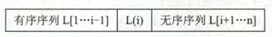
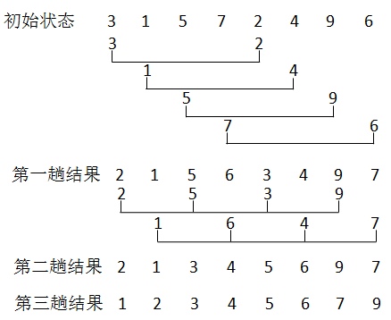
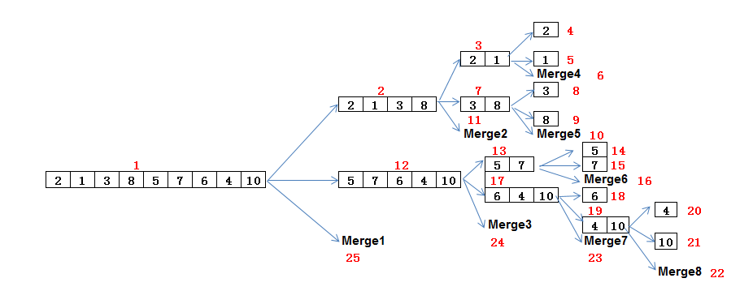
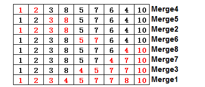
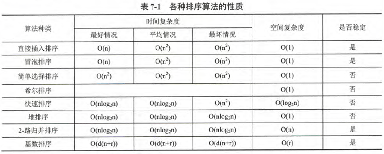

[TOC]

# 前言

排序算法的分类与比较，参见[排序算法_wikipedia](https://zh.wikipedia.org/wiki/排序算法)


# 排序的分类

排序算法可以分为**内部排序**和**外部排序**。

> - 内部排序是数据记录在内存中进行排序
> - 外部排序是指能够处理大量数据的排序算法。在排序过程中需要进行多次内存和外存（磁盘、磁带等）之间的交换


# 一、内部排序


## 1.插入排序

插入排序的基本思想：每一次将一个待排序的记录，按其关键字大小插入到前面已经排好序的子序列，知道全部记录插入完成。


### 1.1 直接插入排序

**（1）基本思想**

假设在排序过程中，待排序L[1...n]在某次排序过程中的某一时刻状态如下：



- 查出`L(i)`在`L[1...i-1]`中的插入位置 k

- 将`L[k...i-1]`中所有元素全部后移一个位置

- 将`L(i)`复制到`L(k)`


**（2）代码实现**

```java
package com.ray.study.algorithm.basic.sort.insertionsort;

import java.util.Arrays;

/**
 * 直接插入排序：
 * （1）把n个待排序的元素看成一个有序表和一个无序表，开始时有序表中只有一个元素，无序表中有n-1个元素
 * （2）排序过程即每次从无序表中取出第一个元素，将它插入到有序表中，使之成为新的有序表
 * （3）重复n-1次完成整个排序过程
 *
 * @author shira 2019/08/06 18:39
 */
public class StraightInsertionSort {

    public void sort(int[] a) {
        int j;
        for (int i = 1; i < a.length; i++) {
            int temp = a[i];
            for (j = i - 1; j >= 0 && temp < a[j]; j--) {
                // 元素后移
                a[j + 1] = a[j];
            }
            // 插入temp
            a[j + 1] = temp;

            //打印本轮结果
            System.out.println(Arrays.toString(a));
        }
    }


    public static void main(String[] args) {
        int a[] = {3, 1, 5, 7, 2, 4, 9, 6};
        StraightInsertionSort sorter = new StraightInsertionSort();
        sorter.sort(a);
    }

}

```


输出结果：

```
[1, 3, 5, 7, 2, 4, 9, 6]
[1, 3, 5, 7, 2, 4, 9, 6]
[1, 3, 5, 7, 2, 4, 9, 6]
[1, 2, 3, 5, 7, 4, 9, 6]
[1, 2, 3, 4, 5, 7, 9, 6]
[1, 2, 3, 4, 5, 7, 9, 6]
[1, 2, 3, 4, 5, 6, 7, 9]
```


### 1.2 折半插入排序

**（1）基本思路**

前面的直接插入排序算法中，每趟插入的过程中，都进行了两项工作：

-  从前面的子表中查找出待插入元素应该被插入的位置

- 给插入位置腾出空间，将待插入元素复制到表中的插入位置

该算法，总是边比较边移动元素，下面将比较和移动操作分离出来，即先折半查找出元素的待插入位置，然后再统一地移动待插入位置之后的所有元素。


**（2）代码实现**

```java
package com.ray.study.algorithm.basic.sort.insertionsort;

import java.util.Arrays;

/**
 * 折半插入排序:
 * 基于直接插入排序算法进行改进，在将元素插入到有序表时，先折半查找插入位置，然后再统一移动待插入元素之后的元素
 *
 * @author shira 2019/08/06 18:39
 */
public class BinaryInsertionSort {

    public void sort(int[] a) {
        for (int i = 1; i < a.length; i++) {
            int temp = a[i];

            int low = 0;
            int high = i - 1;
            // 折半查找，寻找插入位置
            while (low <= high) {
                int mid = low + (high - low) / 2;
                if (a[i] < a[mid]) {
                    high = mid - 1;
                } else {
                    low = mid + 1;
                }
            }

            for (int j = i - 1; j >= low; j--) {
                // 元素后移
                a[j + 1] = a[j];
            }
            // 插入元素
            a[low] = temp;

            //打印本轮结果
            System.out.println(Arrays.toString(a));
        }
    }


    public static void main(String[] args) {
        int a[] = {3, 1, 5, 7, 2, 4, 9, 6};
        BinaryInsertionSort sorter = new BinaryInsertionSort();
        sorter.sort(a);
    }


}

```


输出结果：

```
 1 3 5 7 2 4 9 6
 1 3 5 7 2 4 9 6
 1 3 5 7 2 4 9 6
 1 2 3 5 7 4 9 6
 1 2 3 4 5 7 9 6
 1 2 3 4 5 7 9 6
 1 2 3 4 5 6 7 9
```


### 1.3 希尔排序

直接插入排序算法适用于基本有序的排序表和数据量不大的排序表。基于这两点，1959年 D.L.Shell 提出希尔排序，又称为缩小增量排序。

**（1）基本思想**

先将待排序表分割成若干形如 `L[i, i+d, ... i+k]`的"特殊"子表，分别进行直接插入排序，当整个表中元素已呈"基本有序"时，再对全体记录进行一次直接插入排序。


**（2）排序过程**

- 先取一个小于n的步长d~1~ ,把表中全部记录分成d~1~ 个组，所有距离为d~1~ 的倍数的记录放在同一个组中，在各组中进行直接插入排序；
- 然后取第二个步长 d~2~ < d~1~ ，重复上述过程，直到所取到的d~1~ = 1，即所有记录已放在同一组中，再进行直接插入排序，由于此时已经具有较好的局部有序性，故可以很快得到最终结果。

到目前为止，尚未求得一个最好的增量序列，希尔提出的方法是 d~1~ = n/2 ，d~i+1~ = ⌊d~i~ / 2⌋ ，并且最后一个增量等于1。


**（3）实例**

​		 无序序列：int a[] = {3,1,5,7,2,4,9,6};

　　第一趟时： n=8; gap=n/2=4; 把整个序列共分成了4个子序列{3，2}、{1，4}、{5，9}、{7，6}

　　第二趟时：gap=gap/2=2; 把整个序列共分成了2个子序列{2，5，3，9}、{1，6，4，7}

　　第三趟时：对整个序列进行直接插入排序

　　****

　　


**（4）代码实现**

```java
package com.ray.study.algorithm.basic.sort.insertionsort;

import java.util.Arrays;

/**
 * 希尔排序:
 *      （1）初始步长为总长度一半，
 *      （2）按步长分组，并进行组内直接插入排序
 *      （3）之后步长依次除2且向下取整，重复（2）（3）过程，直到最终增量为1
 *
 * @author shira 2019/08/06 18:39
 */
public class ShellSort {

    public void sort(int[] a) {
        // 初始增量为总长度一半，之后依次除2且向下取整，且最终增量为1
        for (int gap = a.length / 2; gap >= 1; gap = gap / 2) {
            // 开始组内直接插入排序, 从每一组的第二个元素开始
            for (int i = gap; i < a.length; i++) {
                if (a[i] < a[i - gap]) {
                    int temp = a[i];
                    int j;
                    for (j = i - gap; j >= 0 && temp < a[j]; j-=gap) {
                        // 直接插入排序，元素右移
                        a[j+gap] = a[j];
                    }
                    a[j+gap] = temp;
                }
            }

            //打印本轮结果
            System.out.println(Arrays.toString(a));
        }
    }


    public static void main(String[] args) {
        int a[] = {3, 1, 5, 7, 2, 4, 9, 6};
        ShellSort sorter = new ShellSort();
        sorter.sort(a);
    }

}

```


输出结果：

```
[2, 1, 5, 6, 3, 4, 9, 7]
[2, 1, 3, 4, 5, 6, 9, 7]
[1, 2, 3, 4, 5, 6, 7, 9]
```


## 2.交换排序

所谓交换，就是根据序列中两个元素关键字的比较结果来对换这两个记录在序列中的位置。

### 2.1 冒泡排序

（1）基本思想

假设待排序表长为n，从后往前（或从前往后）两两比较相邻元素的值，若为逆序，则交换他们，直到序列比较完。我们称之为一趟冒泡，结果将最小的元素交换到待排序列的第一个位置。

下一趟冒泡时，前一趟确定的最小元素不再参与比较，待排序列减少一个元素，每趟冒泡的结果把序列中的最小值放到了序列的最终位置，......，这样最多做n-1趟冒泡就能把所有元素排好序。


**（2）算法过程**


**（3）代码实现**

```java
package com.ray.study.algorithm.basic.sort.exchangesort;

import java.util.Arrays;

/**
 * 冒泡排序
 *
 * @author shira 2019/08/06 23:18
 */
public class BubbleSort {

    /**
     * 1_1 : 从后往前，依次冒出最小元素
     * <p>
     * 外层循环：控制n-1趟冒泡
     * 内层循环：控制每趟冒泡的交换过程
     * [0 ...i ...n-1]
     * - [0...i] 有序， [i+1...n-1]无序，因此每趟冒泡的区间为[i+1...n-1]
     *
     * @param a 待排序序列
     */
    public void sort1Min(int[] a) {
        for (int i = 0; i < a.length - 1; i++) {
            // 从后往前
            for (int j = a.length - 1; j > i; j--) {
                if (a[j] < a[j - 1]) {
                    int temp = a[j];
                    a[j] = a[j - 1];
                    a[j - 1] = temp;
                }
            }
            //打印本轮结果
            System.out.println(Arrays.toString(a));
        }
    }

    /**
     * 1_2: 从前往后，依次冒出最大元素
     * <p>
     * 外层循环：控制n-1趟冒泡
     * 内层循环：控制每趟冒泡的交换过程
     * [0 ...(n-1-i) ...n-1]
     * - [(n-1-i)...n-1] 有序， [0...(n-1-i-1)]无序，因此每趟冒泡的区间为[0...(n-1-i-1)]
     * </p>
     *
     * @param a 待排序序列
     */
    public void sort1Max(int[] a) {
        for (int i = 0; i < a.length - 1; i++) {
            for (int j = 0; j < a.length - 1 - i; j++) {
                if (a[j] > a[j + 1]) {
                    int temp = a[j];
                    a[j] = a[j + 1];
                    a[j + 1] = temp;
                }
            }
            //打印本轮结果
            System.out.println(Arrays.toString(a));
        }
    }

    /**
     * 2: 冒泡算法改进1：
     * (1) 设置标志 exchange，用于标识每趟冒泡是否发生交换;
     * (2) 若无交换，则说明整个序列已有序，可结束整个排序过程
     * <p>
     * [0 ...i ...n-1]
     * - [0...i] 有序， [i+1...n-1]无序，因此每趟冒泡的区间为[i+1...n-1]
     * - 若区间 [i+1...n-1] 中没有交换，则说明 [i+1...n-1] 有序，也即整个区间有序
     * </p>
     *
     * @param a 待排序序列
     */
    public void sort2(int[] a) {
        for (int i = 0; i < a.length - 1; i++) {
            // 标识本趟冒泡是否发生交换的标志
            boolean exchange = false;
            // 从后往前
            for (int j = a.length - 1; j > i; j--) {
                if (a[j] < a[j - 1]) {
                    exchange = true;
                    int temp = a[j];
                    a[j] = a[j - 1];
                    a[j - 1] = temp;
                }
            }

            if (!exchange) {
                // 若本趟冒泡没有发生交换，说明整个序列已有序
                break;
            }
            //打印本轮结果
            System.out.println(Arrays.toString(a));
        }
    }


    /**
     * 3: 冒泡算法改进2：
     * (1) 设置标志 pos，用于记录每趟冒泡最后一次交换的位置;
     * (2) 由于pos位置之后的记录均已交换到位,故在进行下一趟排序时只要扫描到pos位置即可。
     * <p>
     * [0 ...i ...n-1]
     * - [0...i] 有序， [i+1...n-1]无序，假设此次每趟冒泡的区间为[i+1...n-1]
     * - 若此趟冒泡 [i+1...p...n-1]，最后一次交换的位置为p, 则区间 [i+1...p] 有序，也即[0...p]有序，则下一次冒泡区间为[p...n-1]
     * </p>
     *
     * @param a 待排序序列
     */
    public void sort3(int[] a) {
        int i = 0;
        while (i < a.length - 1) {
            // 若此趟冒泡没有发生交换，说明区间[i+1...n-1]有序，也即整个序列有序
            int p = a.length - 1;
            for (int j = a.length - 1; j > i; j--) {
                if (a[j] < a[j - 1]) {
                    int temp = a[j];
                    a[j] = a[j - 1];
                    a[j - 1] = temp;

                    p = j;
                }
            }

            // 调整下一次的冒泡区间为 [p...n-1]
            i = p;

            //打印本轮结果
            System.out.println(Arrays.toString(a));
        }
    }

    /**
     * 4: 冒泡算法改进4：
     * 利用在每趟排序中进行正向和反向两遍冒泡的方法一次可以得到两个最终值（最大者和最小者）， 从而使排序趟数几乎减少了一半。
     * <p>
     * [0 ...low...high...n-1]
     * - [0...low] 与 [high...n-1]有序，[low...high]无序，因此每趟冒泡的区间为[low...high]
     *
     * </p>
     *
     * @param a 待排序序列
     */
    private void sort4(int a[]) {
        int low = 0;
        int high = a.length - 1;

        while (low < high) {
            boolean exchange = false;
            for (int j = low; j < high; j++) {
                //正向冒泡,找到最大者
                if (a[j] > a[j + 1]) {
                    exchange =true;
                    int tmp = a[j];
                    a[j] = a[j + 1];
                    a[j + 1] = tmp;
                }
            }
            //修改high值, 前移一位
            --high;

            for (int j = high; j > low; j--) {
                //反向冒泡,找到最小者
                if (a[j] < a[j - 1]) {
                    exchange = true;
                    int tmp = a[j];
                    a[j] = a[j - 1];
                    a[j - 1] = tmp;
                }
            }
            //修改low值,后移一位
            ++low;

            if (!exchange) {
                // 若本趟冒泡没有发生交换，说明整个序列已有序
                break;
            }

            //打印本轮结果
            System.out.println(Arrays.toString(a));
        }
    }


    public static void main(String[] args) {
        int a[] = {3, 1, 5, 7, 2, 4, 9, 6, 8};
        BubbleSort sorter = new BubbleSort();
        sorter.sort4(a);
    }
}

```


输出结果：

```
==========sort1Min================ 
 1 3 2 5 7 4 6 9 8
 1 2 3 4 5 7 6 8 9
 1 2 3 4 5 6 7 8 9
 1 2 3 4 5 6 7 8 9
 1 2 3 4 5 6 7 8 9
 1 2 3 4 5 6 7 8 9
 1 2 3 4 5 6 7 8 9
 1 2 3 4 5 6 7 8 9
 ==========sort1Max================ 
 1 3 5 2 4 7 6 8 9
 1 3 2 4 5 6 7 8 9
 1 2 3 4 5 6 7 8 9
 1 2 3 4 5 6 7 8 9
 1 2 3 4 5 6 7 8 9
 1 2 3 4 5 6 7 8 9
 1 2 3 4 5 6 7 8 9
 1 2 3 4 5 6 7 8 9
 ==========sort2================ 
 1 3 2 5 7 4 6 9 8
 1 2 3 4 5 7 6 8 9
 1 2 3 4 5 6 7 8 9
 ==========sort3================ 
 1 3 2 5 7 4 6 9 8
 1 2 3 4 5 7 6 8 9
 1 2 3 4 5 6 7 8 9
 1 2 3 4 5 6 7 8 9
 ==========sort4================ 
 1 2 3 5 4 6 7 8 9
 1 2 3 4 5 6 7 8 9
```


### 2.2 快速排序

快速排序是对冒泡排序的一种改进

**（1）基本思想**

其基本思想是基于分治的：

- 在待排序表 L[0...n-1]中任取一个元素 pivot 作为基准，通过一趟排序将待排序表划分为独立的两部分 L[0...k-1] 和 L[k+1...n-1]，使得 L[0...k-1]中所有元素小于 pivot ，L[k+1...n]中所有元素大于或等于 pivot，则pivot放在了其最终位置L(k)上，这个过程称作 **一趟快速排序**。
- 而后分别递归地对两个子表重复上述过程，直至每部分内只有一个元素或空为止，即所有元素放在了其最终位置上。


快速排序算法的关键在于划分操作，同时快速排序算法的性能也主要取决于划分操作的好坏。


**（2）代码实现**

```java
package com.ray.study.algorithm.basic.sort.exchangesort;

/**
 * 快速排序
 *
 * @author shira 2019/08/06 23:18
 */
public class QuickSort {

    public void quickSort(int[] a) {
        quickSort(a, 0, a.length - 1);
    }

    /**
     * 快速排序
     *
     * @param a 待排序序列
     */
    public void quickSort(int[] a, int low, int high) {
        if (low < high) {
            // 以pivot为基准(枢轴)将序列划分为两部分，
            int pivot = partition(a, low, high);
            quickSort(a, low, pivot - 1);
            quickSort(a, pivot + 1, high);

        }
    }


    /**
     * 一趟快速排序的过程：
     * - 每次以表中第一个元素作为枢轴值（基准）对表进行划分，
     * - 将表中比枢轴值大的元素向右移动，比枢轴值小的元素向左移动，使得一趟快速排序之后，表中元素被枢轴值一分为二。
     * <p>
     * [low(0)...i...j...high(n-1)]   假设 a[j] < a[low] < a[i] < a[hight]
     * （1）将low作为枢轴值p暂存
     * （2）从后往前，找到第一个比枢轴值小的元素j，替换low(0)的位置, 此时[j+1...high(n-1)]均大于p, 待排区间缩小为[low...i...high(j)]
     * （3）从前往后，找到第一个比枢轴值大的元素i，替换high(j)的位置, 此时[low(0)...i-1]均小于p，待排区间缩小为[low(i)...high(j-1)]
     * （4）在区间[i...j-1]重复（2）（3）操作，即可找到p的位置（low==high）
     *
     * @param a    待排序列
     * @param low  相当于低位指针
     * @param high 相当于高位指针
     * @return
     */
    public int partition(int[] a, int low, int high) {
        // 记录枢轴值：将表中第一个元素作为枢轴值（基准）对表进行划分
        int pivot = a[low];
        while (low < high) {
            // 1.从后往前，找到第一个比枢轴值小的元素j，替换low的值，此时high==j
            while (low < high && a[high] >= pivot) {
                high--;
            }
            a[low] = a[high];

            // 2.从前往后，找到第一个比枢轴值大的元素i，替换high的值, 此时low==i
            while (low < high && a[low] <= pivot) {
                low++;
            }
            a[high] = a[low];

            // 3.此时区间[low(0)...i...j...high(n-1)]缩小为 [low(i)...high(j)], 重复这个过程，即可找到p的位置：low==high
        }

        // 此时 low == high，枢轴放到最终位置
        a[low] = pivot;

        //打印本轮结果
        printArray(a);

        return low;
    }


    private void printArray(int[] a) {
        for (int k = 0; k < a.length; k++) {
            System.out.print(" " + a[k]);
        }
        System.out.println();
    }


    public static void main(String[] args) {
        int a[] = {3, 1, 5, 7, 2, 4, 9, 6, 8};
        QuickSort sorter = new QuickSort();
        sorter.quickSort(a);
    }
}

```


输出结果：

```
[2, 1, 3, 7, 5, 4, 9, 6, 8]
[1, 2, 3, 7, 5, 4, 9, 6, 8]
[1, 2, 3, 6, 5, 4, 7, 9, 8]
[1, 2, 3, 4, 5, 6, 7, 9, 8]
[1, 2, 3, 4, 5, 6, 7, 9, 8]
[1, 2, 3, 4, 5, 6, 7, 8, 9]
```


## 3.选择排序

选择排序的思想是：每一趟（例如第i趟）在后面 n-i+1 个待排序元素中选取关键字最小的元素，作为有序子序列的第i个元素，直到第n-1趟做完，待排序元素只剩下1个，就不用再选了。

### 3.1 简单选择排序

（1）基本思想

假设待排序列为L[0...n-1]，第i趟排序，即从[i...n-1]中选择关键字最小的元素与L(i)交换，每一趟排序可以确定一个元素的位置，这样经过n-1趟排序就可以使得整个序列有序。


（2）代码实现

```java
package com.ray.study.algorithm.basic.sort.selectsort;

import java.util.Arrays;

/**
 * 简单选择排序：
 *     （1）假设待排序列为L[0...n-1]，第i趟排序，即从[i...n-1]中选择关键字最小的元素与L(i)交换，每一趟排序可以确定一个元素的位置
 *     （2）这样经过n-1趟排序就可以使得整个序列有序
 *
 * @author shira 2019/08/12 23:46
 */
public class SimpleSelectSort {

    public void sort(int[] a) {

        for(int i=0; i<a.length-1; i++){
            // 1.从[i...n-1]中选择关键字最小的元素
            int min = i;
            for(int j = i+1; j < a.length; j++) {
                if(a[j]<a[min]){
                    min = j;
                }
            }

            // 2.与第i个位置交换
            if(min != i){
                int temp =a[i];
                a[i]=a[min];
                a[min]=temp;
            }


            //打印本轮结果
            System.out.println(Arrays.toString(a));
        }
    }

    
    public static void main(String[] args) {
        int a[] = {3, 1, 5, 7, 2, 4, 9, 6};
        SimpleSelectSort sorter = new SimpleSelectSort();
        sorter.sort(a);
    }
}

```


输出结果：

```
[1, 3, 5, 7, 2, 4, 9, 6]
[1, 2, 5, 7, 3, 4, 9, 6]
[1, 2, 3, 7, 5, 4, 9, 6]
[1, 2, 3, 4, 5, 7, 9, 6]
[1, 2, 3, 4, 5, 7, 9, 6]
[1, 2, 3, 4, 5, 6, 9, 7]
[1, 2, 3, 4, 5, 6, 7, 9]
```


### 3.2 堆排序

堆排序（Heapsort）是指利用堆这种数据结构所设计的一种排序算法。堆是一个近似完全二叉树的结构，并同时满足堆的性质：即子结点的键值或索引总是小于（或者大于）它的父节点。

> n个关键字序列L[1...n]，当且仅当该序列满足以下条件时，称为堆：
>
> - `L(i)<= L(2i)` 且 `L(i)<=L(2i+1)`            （小根堆）
> - 或者 `L(i)>= L(2i)` 且 `L(i)>=L(2i+1)`   （大根堆）


堆排序可以说是一种利用堆的概念来排序的选择排序。分为两种方法：

1. 大根堆：每个节点的值都大于或等于其子节点的值，在堆排序算法中用于升序排列；
2. 小根堆：每个节点的值都小于或等于其子节点的值，在堆排序算法中用于降序排列；

堆排序的平均时间复杂度为 Ο(nlogn)。


> 堆排序是对简单选择排序的改进
>
> 简单选择排序是从n个记录中找出一个最小的记录，需要比较n-1次。但是这样的操作并没有把每一趟的比较结果保存下来，在后一趟的比较中，有许多比较在前一趟已经做过了，但由于前一趟排序时未保存这些比较结果，所以后一趟排序时又重复执行了这些比较操作，因而记录的比较次数较多。


**（1）基本思想**

- 将初始待排序关键字序列(R1,R2….Rn)构建成大顶堆，此堆为初始的无序区；
- 将堆顶元素R[1]与最后一个元素R[n]交换，此时得到新的无序区(R1,R2,……Rn-1)和新的有序区(Rn),且满足R[1,2…n-1]<=R[n]；
- 由于交换后新的堆顶R[1]可能违反堆的性质，因此需要对当前无序区(R1,R2,……Rn-1)调整为新堆，然后再次将R[1]与无序区最后一个元素交换，得到新的无序区(R1,R2….Rn-2)和新的有序区(Rn-1,Rn)。不断重复此过程直到有序区的元素个数为n-1，则整个排序过程完成。

​                             

**（2）算法过程**


**（3）代码实现**

```java
package com.ray.study.algorithm.basic.sort.selectsort;

import java.util.Arrays;

/**
 * 堆排序：
 * （1）建堆
 * （2）将堆顶元素与无序区最后一个元素交换，并重新调整无序区，使其符合堆的特性
 * （3）重复（2）操作， 直至无序区长度为 1。
 *
 * @author shira 2019/08/15 14:45
 */
public class HeapSort {

    public void sort(int[] a) {

        /**
         * (1)建堆：
         *    - beginIndex = 第一个非叶子节点(即第一个有孩子的结点)，
         *    - 叶子节点可以看作已符合堆要求的节点，因此从第一个非叶子节点开始即可。
         */
        int beginIndex = (a.length - 1) >> 1;
        for (int i = beginIndex; i >= 0; i--) {
            maxHeapify(a, i, a.length - 1);
        }

        
        /**
         * 遍历：
         *      将栈顶元素与无序区最后一个元素交换，并重新调整无序区，使其符合堆的特性
         */
        for (int i = a.length - 1; i > 0; i--) {
            swap(a, 0, i);
            maxHeapify(a, 0, i - 1);
        }
    }


    /**
     * 调整无序区L[index...len-1]，使其符合堆的特性
     *
     *
     * @param begin 无序区首元素索引，即当前根结点索引
     * @param end   无序区尾元素索引
     */
    private void maxHeapify(int[] a, int begin, int end) {
        // 获取孩子节点中最大值的索引
        int max = getMaxChildIndex(a, begin, end);
        if(max == -1){
            return ;
        }

        // 若孩子节点大于父节点，则交换父子节点，然后递归地向下调整子树
        if (a[max] > a[begin]) {
            swap(a, max, begin);
            maxHeapify(a, max, end);
        }
    }

    private void swap(int[] a, int i, int j) {
        int temp = a[i];
        a[i] = a[j];
        a[j] = temp;
    }

    private int getMaxChildIndex(int[] a, int begin, int end) {
        // (1) 找出当前结点的左右孩子中的最大值
        // 左、右子节点索引，
        int leftChild = (begin << 1) + 1;
        int rightChild = leftChild + 1;
        // 子节点值最大索引，默认左子节点。
        int max = leftChild;

        if (leftChild > end) {
            // 左子节点索引超出计算范围，直接返回。
            return -1;
        }

        // 先判断左右子节点，哪个较大。
        if (rightChild <= end && a[rightChild] > a[leftChild]) {
            max = rightChild;
        }

        return max;
    }

    public static void main(String[] args) {
        int[] a = {3, 1, 5, 7, 2, 4, 9, 6, 8};
        HeapSort sorter = new HeapSort();
        sorter.sort(a);
        System.out.println(Arrays.toString(a));
    }

}

```


## 4.归并排序

> 归并：将两个或两个以上的有序表组合成一个新的有序表

归并排序是采用分治法的一个非常典型的应用。归并排序的思想就是先递归分解数组，再合并数组。


**（1）基本思想**

2-路归并排序：

> 假定待排序表含有n个记录，则可以看成是n个有序的子表，每个子表长度为1，然后两两归并，得到 n/2 个长度为2或1的有序表；再两两归并，......，如此重复，直到合并成一个长度为n的有序表为止，这种排序方法称为2-路归并排序


**（2）排序过程**


[下图来源](https://blog.csdn.net/qq_28081081/article/details/80603251)


[下面两个图来源](https://blog.csdn.net/m0_37962600/article/details/80165953)



其中每个Merge所代表的数组如下




**（3）代码实现**

```java
package com.ray.study.algorithm.basic.sort.mergesort;

import java.util.Arrays;

/**
 * 归并排序：
 * 一趟归并排序的操作：调用到⌈n/2h⌉次算法merge()将L[1...n]中前后相邻且长度为h的有序段进行两两归并，
 *                  得到前后相邻、长度为2h的有序段，整个归并排序需要进行到⌈log2(n)⌉趟。
 *
 * @author shira 2019/08/13 12:28
 */
public class MergeSort {

    public  void sort(int[] a) {
        mergeSort(a, 0, a.length-1);
    }

    /**
     * 递归形式的2-路归并排序算法是基于分治的，其过程如下：
     *   分解：将含有n个元素的待排序表分成各含有n/2个元素的子表，采用2-路归并排序算法对两个子表递归地进行排序；
     *   合并：合并两个已排序的子表得到排序结果。
     *
     * @param a 待排序数组
     * @param low 数组起始索引
     * @param high 数组结束索引
     */
    public void mergeSort(int[] a, int low, int high) {
        int mid = (low + high) / 2;
        if (low < high) {
            // 左边
            mergeSort(a, low, mid);
            // 右边
            mergeSort(a, mid + 1, high);
            // 左右归并
            merge(a, low, mid, high);

            //打印本轮结果
            System.out.println(Arrays.toString(a));
        }

    }


    /**
     * 合并两个已排序的子表得到排序结果：
     *
     * L[low...mid] , L[mid+1...high]
     *
     * @param a 待排序列
     * @param low 左侧子序列起始索引
     * @param mid 左侧子序列结束索引
     * @param high 右侧子序列结束索引
     */
    private  void merge(int[] a, int low, int mid, int high) {
        int[] temp = new int[high - low + 1];
        // 左指针
        int i = low;
        // 右指针
        int j = mid + 1;
        int k = 0;

        // 把较小的数先移到新数组中
        while (i <= mid && j <= high) {
            if (a[i] < a[j]) {
                temp[k++] = a[i++];
            } else {
                temp[k++] = a[j++];
            }
        }

        // 把左边剩余的数移入数组
        while (i <= mid) {
            temp[k++] = a[i++];
        }

        // 把右边边剩余的数移入数组
        while (j <= high) {
            temp[k++] = a[j++];
        }

        //把辅助数组复制到原数组
        for (int m = 0; m < temp.length; m++) {
            a[low+m] = temp[m];
        }
    }


    public static void main(String args[]) {
        int a[] = {3, 1, 5, 7, 2, 4, 9, 6};
        MergeSort sorter = new MergeSort();
        sorter.sort(a);

    }
}

```


## 5.**分布排序**

前面的排序算法都是基于比较的排序算法，而最佳的基于比较排序的算法时间复杂度为O(nlogn)。

> 基于比较的排序算法是不能突破O(NlogN)的。简单证明如下：
>
> N个数有N!个可能的排列情况，也就是说基于比较的排序算法的判定树有N!个叶子结点，比较次数至少为log(N!)=O(NlogN)(斯特林公式)。


为了改进这些算法的时间复杂度，可以对输入数据做一些限制（如取值范围固定），由此产生了三种线性排序算法：

> - 计数排序
> - 桶排序
> - 基数排序


### 5.1 计数排序

**（1）基本思想**

计数排序使用一个额外的数组 C ，其中第i个元素是待排序数组 A 中值等于 i 的元素的个数。然后根据数组 C 来将 A 中的元素排到正确的位置。

**（2）计数排序的特征**

计数排序（Counting sort）是一种稳定的线性时间排序算法，当输入的元素是 n 个 0 到 k 之间的整数时，它的运行时间是 **Θ(n + k)**。计数排序不是比较排序，排序的速度快于任何比较排序算法。

由于用来计数的数组C的长度取决于待排序数组中数据的范围（等于待排序数组的最大值与最小值的差加上1），这使得计数排序**对于数据范围很大的数组，需要大量时间和内存**。例如：计数排序是用来排序0到100之间的数字的最好的算法，但是它不适合按字母顺序排序人名。但是，计数排序可以用在基数排序算法中，能够更有效地排序数据范围很大的数组。


**（3）算法过程**

> - （1）找出待排序的数组中最大和最小的元素
> - （2）统计数组中每个值为i的元素出现的次数，存入数组C的第i项
> - （3）对所有的计数累加（从C中的第一个元素开始，每一项和前一项相加）
> - （4）反向填充目标数组：将每个元素i放在新数组的第C(i)项，每放一个元素就将C(i)减去1


**（4）代码实现**

````java
package com.ray.study.algorithm.basic.sort.distributionsort;

import java.util.Arrays;

/**
 * 计数排序:
 * - （1）找出待排序的数组a中最大和最小的元素
 * - （2）统计数组中每个值为i的元素出现的次数，存入数组C的第i项
 * - （3）从c还原回a
 *
 * @author shira 2019/08/14 13:54
 */
public class CountingSort {

    public void sort(int[] a) {
        // （1）找出待排序的数组中最大和最小的元素
        int max = a[0];
        int min = a[0];
        for (int value : a) {
            if (value > max) {
                max = value;
            }
            if (value < min) {
                min = value;
            }
        }

        countingSort(a, min, max);
    }

    /**
     * 计数排序：
     * - (1) 根据min、max 确定辅助数组c的大小
     * - (2) 统计数组中每个值为i的元素出现的次数，存入数组C的第i项
     * - (3) 从c还原回a
     *
     * @param a   待排序数组
     * @param min 数组的最小值
     * @param max 数组的最大值
     *            
     */
    private void countingSort(int[] a, int min, int max) {

        // （2）创建额外的辅助数组c, 统计数组中每个值为i的元素出现的次数，存入数组C的第i项
        int[] c = new int[max - min + 1];
        for (int value : a) {
            c[value - min]++;
        }

        // （3）从c还原到a
        int j = 0;
        for (int i = 0; i < c.length; i++) {
            while (c[i]-- > 0) {
                // c的下标i+min即为A中元素的值
                a[j++] = i + min;
            }
        }

    }

    public static void main(String[] args) {
        int[] a = {3, 1, 5, 7, 2, 4, 9, 6, 8};
        CountingSort sorter = new CountingSort();
        sorter.sort(a);
        System.out.println(Arrays.toString(a));
    }

}

````


### 5.2 桶排序

桶排序是计数排序的泛化。它利用了函数的映射关系，高效与否的关键就在于这个映射函数的确定。为了使桶排序更加高效，我们需要做到这两点：

1. 在额外空间充足的情况下，尽量增大桶的数量
2. 使用的映射函数能够将输入的 N 个数据均匀的分配到 K 个桶中

同时，对于桶中元素的排序，选择何种比较排序算法对于性能的影响至关重要。


**（1）基本思想**

- 将待排序列分到有限数量的桶里
- 每个桶再分别排序（可以使用其它排序算法或者是递归地使用桶排序算法）
- 合并桶中数据


**（2）算法过程**

元素分布在桶中：


然后，元素在每个桶中排序：


**（3）代码实现**

```java
package com.ray.study.algorithm.basic.sort.distributionsort;

import java.util.ArrayList;
import java.util.Arrays;
import java.util.List;

/**
 * 桶排序：
 * - 将待排序列分到有限数量的桶里
 * - 每个桶再分别排序（可以使用其它排序算法或者是递归地使用桶排序算法）
 * - 合并桶中数据
 *
 *
 * @author shira 2019/08/14 16:30
 */
public class BucketSort {


    /**
     * 桶排序：
     *      桶的默认容量为 size/200
     *
     * @param a 待排序列
     */
    public void sort(int[] a) {
        // （1）找出待排序的数组中最大和最小的元素
        int max = a[0];
        int min = a[0];
        for (int value : a) {
            if (value > max) {
                max = value;
            }
            if (value < min) {
                min = value;
            }
        }
        int bucketCapacity = (max - min + 1) / 200;
        if (bucketCapacity < 1) {
            bucketCapacity++;
        }

        bucketSort(a, min, max, bucketCapacity);
    }


    /**
     * 桶排序
     *
     * @param a              待排序列
     * @param bucketCapacity 每个桶的容量
     */
    public void sort(int[] a, int bucketCapacity) {
        // （1）找出待排序的数组中最大和最小的元素
        int max = a[0];
        int min = a[0];
        for (int value : a) {
            if (value > max) {
                max = value;
            }
            if (value < min) {
                min = value;
            }
        }

        bucketSort(a, min, max, bucketCapacity);
    }


    /**
     * 桶排序
     * @param a 待排序列
     * @param min 数组的最小值
     * @param max 数组的最大值
     * @param bucketCapacity 每个桶的容量
     */
    private void bucketSort(int[] a, int min, int max, int bucketCapacity) {
        // 1.根据桶的容量计算桶的数量
        int bucketCount = (max - min) / bucketCapacity + 1;

        // 2.建桶
        List<List<Integer>> bucketList = new ArrayList<>();
        for (int i = 0; i <= bucketCount; i++) {
            bucketList.add(new ArrayList<>());
        }

        // 3.数据入桶, 可以保证桶i中的元素值小于桶i+1中元素值
        for (int i = 0; i < a.length; i++) {
            int index = (a[i] - min) / bucketCapacity;
            bucketList.get(index).add(a[i]);
        }

        // 4.桶内排序
        ArrayList<Integer> bucket = null;
        int index = 0;
        for (int i = 0; i < bucketList.size(); i++) {
            bucket = (ArrayList<Integer>) bucketList.get(i);
            insertSort(bucket);

            // 5.由于前面的桶元素值皆小于后面的桶的元素值，因此可直接将桶中排序后的元素放回原数组
            for (int k : bucket) {
                a[index++] = k;
            }
        }

    }


    /**
     * 桶内排序
     *
     * @param bucket 桶
     */
    private void bucketInnerSort(List<Integer> bucket) {
        // 桶内排序采用直接插入排序算法
        insertSort(bucket);
    }


    /**
     * 直接插入排序
     *
     * @param bucket
     */
    private void insertSort(List<Integer> bucket) {
        for (int i = 1; i < bucket.size(); i++) {
            int temp = bucket.get(i);
            int j = i - 1;
            for (; j >= 0 && temp < bucket.get(j); j--) {
                // 元素后移
                bucket.set(j + 1, bucket.get(j));
            }
            // 插入temp
            bucket.set(j + 1, temp);
        }
    }


    
    public static void main(String[] args) {
        int[] a = {3, 1, 5, 7, 2, 4, 9, 6, 8};
        BucketSort sorter = new BucketSort();
        sorter.sort(a);
        System.out.println(Arrays.toString(a));
    }

}

```


### 5.3 基数排序

基数排序采用**多关键字排序思想**（即基于关键字各位的大小进行排序），借助“**分配**”和“**收集**”两种操作对单逻辑关键字进行排序。

基数排序又分为最高位优先（MSD）排序和最低位优先（LSD）排序

基数排序按照最高位优先或最低位优先来排序有两种实现方案：

- **MSD（Most significant digital） 从最左侧高位开始进行排序**。先按k1排序分组, 同一组中记录, 关键码k1相等, 再对各组按k2排序分成子组, 之后, 对后面的关键码继续这样的排序分组, 直到按最次位关键码kd对各子组排序后. 再将各组连接起来, 便得到一个有序序列。*MSD方式适用于位数多的序列*。
- **LSD （Least significant digital）从最右侧低位开始进行排序**。先从kd开始排序，再对kd-1进行排序，依次重复，直到对k1排序后便得到一个有序序列。*LSD方式适用于位数少的序列*。


**（1）基本思想**

将所有待比较数值（正整数）统一为同样的数位长度，数位较短的数前面补零。然后，从最低位开始，依次进行一次排序。这样从最低位排序一直到最高位排序完成以后,数列就变成一个有序序列。


**（2）算法过程**

通过序列中各个元素的值，对排序的N个元素进行若干趟的“分配”与“收集”来实现排序。

- **分配**：我们将L[i]中的元素取出，首先确定其个位上的数字，根据该数字分配到与之序号相同的桶中
- **收集**：当序列中所有的元素都分配到对应的桶中，再按照顺序依次将桶中的元素收集形成新的一个待排序列L[]。对新形成的序列L[]重复执行分配和收集元素中的十位、百位…直到分配完该序列中的最高位，则排序结束


**（3）代码实现**

```java
package com.ray.study.algorithm.basic.sort.distributionsort;

import java.util.Arrays;

/**
 * 基数排序
 *
 * @author shira 2019/08/14 23:57
 */
public class RadixSort {

    public void sort(int[] a) {
        //取得数组中的最大数，并取得位数
        int max = getMaxValue(a);
        int maxDigit = getMaxDigit(max);
        radixSort(a,maxDigit);
    }


    /**
     * 基数排序：
     *    - 按位数遍历，从最低位开始，依次进行一次排序
     *    - 一次排序的过程：
     *          - 分配：将所有元素分配到对应桶中
     *          - 收集：将桶中数据收集到待排序列中
     *          
     * @param a 待排序列
     * @param maxDigit 待排序列的最高位数
     */
    private void radixSort(int[] a, int maxDigit) {
        // 基数排序由于是对整数进行排序，每位取值[0...9],因此需要10个桶；
        // 而考虑到特殊情况，比如数组中每个元素某位的值相同，这时所有元素都被放入一个桶中，因此单个桶容量为a.length
        int bucketCount = 10;
        int bucketCapacity = a.length;

        // 个位：n % 10， 十位： n / 10 % 10 ， 百位：n / (10*10) %10
        int mod = 10;
        int dev = 1;

        //申请一个桶空间
        int[][] buckets = new int[bucketCount][bucketCapacity];

        //从低位到高位，对每一位遍历，将所有元素分配到桶中
        for (int i = 0; i < maxDigit; i++,dev*=10) {
            //存储各个桶中存储元素的数量
            int[] bktLen = new int[bucketCount];

            //分配：将所有元素分配到对应桶中
            for (int j = 0; j < a.length; j++) {
                int whichBucket = (a[j] / dev) % mod;
                buckets[whichBucket][bktLen[whichBucket]] = a[j];
                bktLen[whichBucket]++;
            }

            //收集：将不同桶里数据挨个捞出来, 由于靠近桶底的元素排名靠前,因此从桶底先捞
            int index = 0;
            for (int k = 0; k < buckets.length; k++) {
                for (int l = 0; l < bktLen[k]; l++) {
                    a[index++] = buckets[k][l];
                }
            }

            // 打印本轮结果
            System.out.println(Arrays.toString(a));
        }
    }


    private int getMaxValue(int[] a) {
        int max = a[0];
        for (int value : a) {
            if (max < value) {
                max = value;
            }
        }
        return max;
    }


    /**
     * 获取最高位数
     *
     * @param max 数组最大值
     * @return 最高位数
     */
    private int getMaxDigit(int max) {
        int maxDigit = 1;
        while (max / 10 > 0) {
            maxDigit++;
            max = max / 10;
        }
        return maxDigit;
    }


    public static void main(String[] args) {
        int[] a = {33, 14, 56, 78, 21, 47, 95, 66, 89};
        RadixSort sorter = new RadixSort();
        sorter.sort(a);
    }

}

```


**（4）算法评估**

> d为位数，r为基数（即桶的数量），n为原数组个数

**时间效率**：基数排序需要进行d趟分配和收集，一趟分配需要O(n)，一趟收集是需要O(r)，所以基数排序的时间复杂度为O(d*(n+r))，它与序列的初始状态无关。

**稳定性**：基数排序不改变相同元素之间的相对顺序，因此它是稳定的排序算法。

**适用范围**：

> - 基数排序更适合用于对时间, 字符串等这些**整体权值未知的数据**进行排序。
> - 基数排序是采用空间换时间，数据量过大时，容易造成内存溢出。


### 5.4 基数排序 vs 计数排序 vs 桶排序

​	这三种排序算法都利用了桶的概念，但对桶的使用方法上有明显差异：

> - 计数排序：每个桶只存储单一键值；
> - 桶排序：每个桶存储一定范围的数值；
> - 基数排序：根据键值的每位数字来分配桶；


## 6.内部排序算法比较





# 二、外部排序

外部排序是指能够处理大量数据的排序算法。许多应用中，经常需要对大文件进行排序，因为文件中记录很多、信息量庞大，**无法将整个文件拷贝进内存中进行排序**。因此，需要将待排序的记录存储在外存上，排序时再把数据一部分一部分的调入内存进行排序。**在排序过程中需要进行多次内存和外存之间的交换**，这种排序方法就被称为外部排序。

外部排序通常采用的是一种“**排序-归并**”的策略。在排序阶段，先读入能放在内存中的数据量，将其排序输出到一个临时文件，依此进行，将待排序数据组织为多个有序的临时文件。尔后在归并阶段将这些临时文件组合为一个大的有序文件，也即排序结果


# 参考资料

## 1.精选动图资料


[十大经典排序算法动画与解析，看我就够了！（配代码完全版）](https://juejin.im/post/5c09c6dfe51d453428653244#heading-28)

[十大经典排序算法（动图演示）](https://www.cnblogs.com/onepixel/p/7674659.html)


## 2.参考资料

- [排序系列 之 直接插入排序算法 —— Java实现](https://www.cnblogs.com/snowcan/p/6244128.html)

- [排序系列 之 折半插入排序算法 —— Java实现](https://www.cnblogs.com/snowcan/p/6244361.html)

- [排序系列 之 希尔排序算法 —— Java实现](https://www.cnblogs.com/snowcan/p/6244391.html)

- [排序系列 之 冒泡排序及其改进算法 —— Java实现](https://www.cnblogs.com/snowcan/p/6244385.html)

- [排序系列 之 快速排序算法 —— Java实现](https://www.cnblogs.com/snowcan/p/6244398.html)

- 堆排序

  - [1.7 堆排序_菜鸟教程](https://www.runoob.com/w3cnote/heap-sort.html)
  - [堆排序就这么简单](https://segmentfault.com/a/1190000013960582)
  - [14.9 堆排序](https://www.kancloud.cn/maliming/leetcode/742952)

- 归并排序
  - [Java实现归并排序](https://www.cnblogs.com/of-fanruice/p/7678801.html)
  - [【排序算法】归并排序原理及Java实现](https://blog.csdn.net/jianyuerensheng/article/details/51262984)
  - [**java实现归并排序（思想与实现）**](https://blog.csdn.net/qq_28081081/article/details/80603251)
  - [八种排序算法（二）-----归并排序](https://blog.csdn.net/m0_37962600/article/details/80165953)
  
- 计数排序
  - [计数排序_wikipedia](https://zh.wikipedia.org/wiki/计数排序)
  - [1.8 计数排序_菜鸟教程](https://www.runoob.com/w3cnote/counting-sort.html)
  - [三种线性排序算法 计数排序、桶排序与基数排序](https://www.byvoid.com/zhs/blog/sort-radix)
  - [算法系列-计数排序](https://www.cnblogs.com/eaglet/archive/2010/09/16/1828016.html)
  
- 桶排序
  - [1.9 桶排序_菜鸟教程](https://www.runoob.com/w3cnote/bucket-sort.html)
  - [排序算法:桶排序](https://juejin.im/post/5b4f55676fb9a04fb745d0df)
  - [排序算法笔记：桶排序 BucketSort in java](https://my.oschina.net/wangchen881202/blog/192320)
  
- 基数排序

  - [基数排序_wikipedia](https://zh.wikipedia.org/wiki/%E5%9F%BA%E6%95%B0%E6%8E%92%E5%BA%8F)

  - [Java 排序算法 — 基数排序](http://cmsblogs.com/?p=4703)

  - [基数排序就这么简单](https://segmentfault.com/a/1190000013986116)

  - [排序算法笔记：基数排序 RadixSort in java](https://my.oschina.net/wangchen881202/blog/190076)

  - [1.10 基数排序_菜鸟教程](https://www.runoob.com/w3cnote/radix-sort.html)

    


