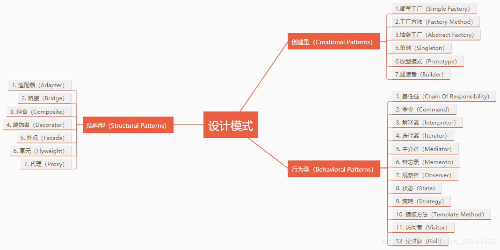

# 一、前言
在开始学习设计模式前，你需要对UML有所了解。
可参见：
> - [UML_00_资源帖](https://blog.csdn.net/qq_26981333/article/details/83189439)
> - [UML_01_画图工具](https://blog.csdn.net/qq_26981333/article/details/83189462)
> - [UML_02_概述](https://blog.csdn.net/qq_26981333/article/details/83189586)
> - [UML_03_类图](https://blog.csdn.net/qq_26981333/article/details/83189596)
>  - [UML_04_时序图](https://blog.csdn.net/qq_26981333/article/details/83628959)

# 二、OOP三大基本特性
## 1.封装
> 封装，也就是把客观事物封装成抽象的类，并且类可以把自己的属性和方法只让可信的类操作，对不可信的进行信息隐藏。

## 2.继承
> 继承是指这样一种能力，它可以使用现有的类的所有功能，并在无需重新编写原来类的情况下对这些功能进行扩展。

## 3.多态
> 多态指一个类实例的相同方法在不同情形有不同的表现形式。具体来说就是不同实现类对公共接口有不同的实现方式，但这些操作可以通过相同的方式（公共接口）予以调用。

# 三、设计原则

> - 单一职责原则
> - 里氏替换原则
> - 依赖倒置原则
> - 接口隔离原则
> - 迪米特法则
> - 开闭原则

在实际项目中，不能过度设计，而是需要对这些设计原则进行权衡，这是因为考虑到`项目工期`、`成本`、`人员技术水平`、`硬件情况`、`网络情况`甚至有时候还要考虑`政府政策`、`垄断协议`等因素。

在合适的业务场景下，对设计原则进行权衡取舍，适度设计。

## 1.单一职责原则
> Single Responsibility Principle

### 定义

单一职责原则要求 一个接口或类只有一个原因引起变化 ，也就是一个接口或类只有一个职责，它就负责一件事情。

>  一个类/接口/方法只负责一项职责

### 优劣
- 	优点
> - 类的`复杂性降低`，实现什么职责都有清晰明确的定义；
> - `可读性提高`，复杂性降低，那当然可读性提高了；
> - `可维护性提高`，可读性提高，那当然更容易维护了；
> - `变更引起的风险降低`，变更是必不可少的，如果接口的单一职责做得好，一个接口修改只对相应的实现类有影响，对其他的接口无影响，这对系统的扩展性、维护性都有非常大的帮助

- 弊端
  类的单一职责确实受非常多因素的制约，纯理论地来讲，这个原则是非常优秀的，但是现实有现实的难处，你必须去考虑`项目工期`、`成本`、`人员技术水平`、`硬件情况`、`网络情况`甚至有时候还要考虑`政府政策`、`垄断协议`等因素。

###   最佳实践
接口一定要做到单一职责，类的设计尽量做到只有一个原因引起变化 

## 2.里氏替换原则
> Liskov Substitution Principle

### 定义

只要父类能出现的地方子类就可以出现 

> 第一种定义，也是最正宗的定义： 
> > If for each object o1 of type S there is an object o2 of type T such that for all programs P defined in terms of T, the behavior of P is unchanged when o1 is substituted for o2 then S is a subtype of T.
> > （如果对每一个类型为S的对象o1，都有类型为T的对象o2，使得以T定义的所有程序P在所有的对象o1都代换成o2时，程序P的行为没有发生变化，那么类型S是类型T的子类型。）
>
> 第二种定义：
> >Functions that use pointers or references to base classes must be able to use objects of derived classes without knowing it.
> >（所有引用基类的地方必须能透明地使用其子类的对象。）

> 只要父类能出现的地方子类就可以出现，而且替换为子类也不会产生任何错误或异常，使用者可能根本就不需要知道是父类还是子类。但是，反过来就不行了，有子类出现的地方，父类未必就能适应。

###  

### 优点

> `增强程序的健壮性`，版本升级时也可以保持非常好的兼容性。即使增加子类，原有的子类还可以继续运行。在实际项目中，每个子类对应不同的业务含义，使用父类作为参数，传递不同的子类完成不同的业务逻辑，非常完美！

### 注意事项
（1）在类中调用其他类时务必要使用父类或接口，如果不能使用父类或接口，则说明类的设计已经违背了LSP原则。
（2）如果子类不能完整地实现父类的方法，或者父类的某些方法在子类中已经发生“畸变”，则建议断开父子继承关系，采用依赖、聚集、组合等关系代替继承。

### 最佳实践
在项目中，采用里氏替换原则时，`尽量避免子类的“个性”`，一旦子类有“个性”，这个子类和父类之间的关系就很难调和了，把子类当做父类使用，子类的“个性”被抹杀——委屈了点；把子类单独作为一个业务来使用，则会让代码间的耦合关系变得扑朔迷离——缺乏类替换的标准。

## 3.依赖倒置原则
> Dependence Inversion Principle

### 定义
高层模块不应该依赖低层模块，两者都应该依赖其抽象；
>-  抽象不应该依赖细节；
> -  细节应该依赖抽象。

> 原始定义：
> >  High level modules should not depend upon low level modules.Both should depend upon abstractions.Abstractions should not depend upon details.Details should depend upon abstractions.
>
>  解读：
> > （1）每一个逻辑的实现都是由原子逻辑组成的，不可分割的原子逻辑就是低层模块，原子逻辑的再组装就是高层模块。
> > （2）在Java语言中，抽象就是指接口或抽象类，两者都是不能直接被实例化的
> > （3）细节就是实现类，实现接口或继承抽象类而产生的类就是细节，其特点就是可以直接被实例化，也就是可以加上一个关键字new产生一个对象。
>
> 依赖倒置原则在Java语言中的表现就是：
> > （1）模块间的依赖通过抽象发生，实现类之间不发生直接的依赖关系，其依赖关系是通过接口或抽象类产生的；
> > （2）接口或抽象类不依赖于实现类；
> > （3）实现类依赖接口或抽象类。

### 核心思想
面向接口编程

### 优点
> - 可以减少类间的耦合性
> - 提高系统的稳定性
> - 降低并行开发引起的风险
> - 提高代码的可读性和可维护性。

### 最佳实践
依赖倒置原则的本质就是`面向接口编程`，通过抽象（接口或抽象类）使各个类或模块的实现彼此独立，不互相影响，实现模块间的松耦合。

> - 每个类尽量都有接口或抽象类，或者抽象类和接口两者都具备
> - 变量的表面类型尽量是接口或者是抽象类
> - 任何类都不应该从具体类派生
> - 尽量不要覆写基类的方法

结合里氏替换原则：
- 接口负责定义`public属性和方法，并且声明与其他对象的依赖关系`
- 抽象类负责`公共构造部分`的实现
- 实现类准确地实现`业务逻辑`，同时在适当的时候对父类进行细化。

## 4.接口隔离原则
> Interface Segregation Principle

### 定义
用多个专门的接口，而不使用单一的总接口，客户端不应该依赖它不需要的接口。

> 两种定义：
> >  Clients should not be forced to depend upon interfaces that they don't use.
> >  客户端不应该依赖它不需要的接口
>
> > The dependency of one class to another one should depend on the smallest possible interface.
> > 类间的依赖关系应该建立在最小的接口上
>
> > 建立单一接口，不要建立臃肿庞大的接口。再通俗一点讲：接口尽量细化，同时接口中的方法尽量少。

### 接口细化，接口纯洁
接口隔离原则是对接口进行规范约束，其包含以下4层含义：
> - 接口要尽量小
> > 根据接口隔离原则拆分接口时，首先必须满足单一职责原则。
>
> - 接口要高内聚
> > 高内聚就是提高接口、类、模块的处理能力，减少对外的交互。
> >  要求在接口中尽量少公布public方法，接口是对外的承诺，承诺越少对系统的开发越有利，变更的风险也就越少，同时也有利于降低成本。
>
> - 定制服务
> > 定制服务就是单独为一个个体提供优良的服务。
> > 采用定制服务就必然有一个要求：只提供访问者需要的方法
>
> - 接口设计是有限度的
>

### 最佳实践
接口和类尽量使用原子接口或原子类来组装
> -  一个接口只服务于一个子模块或业务逻辑；
> -  通过业务逻辑压缩接口中的public方法，接口时常去回顾，尽量让接口达到“满身筋骨肉”，而不是“肥嘟嘟”的一大堆方法；
> -  已经被污染了的接口，尽量去修改，若变更的风险较大，则采用适配器模式进行转化处理；
> -  了解环境，拒绝盲从。每个项目或产品都有特定的环境因素，环境不同，接口拆分的标准就不同。

根据经验和常识决定接口的粒度大小：
（1）接口粒度太小，导致接口数据剧增，开发人员呛死在接口的海洋里；
（2）接口粒度太大，灵活性降低，无法提供定制服务，给整体项目带来无法预料的风险。

## 5.迪米特法则
> Law of Demeter，也称为最少知识原则（Least Knowledge Principle）

### 定义
一个对象应该对其他对象有最少的了解

> 尽量降低类与类之间的耦合

### 最少知识
迪米特法则对类的低耦合提出了明确的要求，其包含以下4层含义。

（1）只和朋友交流
> 迪米特法则还有一个英文解释是： Only talk to your immediate friends（只与直接的朋友通信）
>
> 什么叫做直接的朋友呢？每个对象都必然会与其他对象有耦合关系，两个对象之间的耦合就成为朋友关系，这种关系的类型有很多，例如组合、聚合、依赖等。
>
> 朋友类的定义是这样的：出现在`成员变量`、`方法的输入输出参数中的类`称为成员朋友类，而出现在方法体内部的类不属于朋友类

注意：
> 一个类只和朋友类交流，不与陌生类交流。
> 类与类之间的关系是建立在类间的，而不是方法间，因此一个方法尽量不引入一个类中不存在的对象，当然，JDKAPI提供的类除外。

（2）朋友间也是有距离的
>一个类公开的public属性或方法越多，修改时涉及的面也就越大，变更引起的风险扩散也就越大。因此，为了保持朋友类间的距离，在设计时需要反复衡量：`是否还可以再减少public方法和属性，是否可以修改为private、package-private（包类型，在类、方法、变量前不加访问权限，则默认为包类型）、protected等访问权限，是否可以加上final关键字等`。

注意：
> 迪米特法则要求类“羞涩”一点，尽量不要对外公布太多的public方法和非静态的public变量，尽量内敛，多使用private、package-private、protected等访问权限。

（3）是自己的就是自己的

在实际应用中经常会出现这样一个方法：放在本类中也可以，放在其他类中也没有错，那怎么去衡量呢？你可以坚持这样一个原则：

如果一个方法放在本类中，既不增加类间关系，也对本类不产生负面影响，那就放置在本类中。

（4）谨慎使用Serializable

在一个项目中使用RMI（Remote Method Invocation，远程方法调用）方式传递一个VO（Value Object，值对象），这个对象就必须实现Serializable接口（仅仅是一个标志性接口，不需要实现具体的方法），也就是把需要网络传输的对象进行序列化，否则就会出现NotSerializableException异常。

### 最佳实践
迪米特法则的核心观念就是`类间解耦，弱耦合`，只有弱耦合了以后，类的复用率才可以提高。其要求的结果就是产生了大量的中转或跳转类，导致系统的复杂性提高，同时也为维护带来了难度。读者在采用迪米特法则时需要反复权衡，`既做到让结构清晰，又做到高内聚低耦合`。

## 6.开闭原则
开闭原则是Java世界里最基础的设计原则，它指导我们如何建立一个稳定的、灵活的系统。
> Open-Close Principle

### 定义
对扩展开放，对修改关闭

> Software entities like classes, modules and functions should be open for extension but closed for modifications.
> 一个软件实体如类、模块和函数应该对扩展开放，对修改关闭。
### 核心思想
面向抽象编程

### 重要性
开闭原则是最基础的一个原则：
> 依照Java语言的称谓，开闭原则是抽象类，其他五大原则是具体的实现类

> - 便于测试
> - 便于复用
> - 便于维护
> - 面向对象开发的要求

### 如何使用开闭原则
（1）抽象约束

> 抽象是对一组事物的通用描述，没有具体的实现，也就表示它可以有非常多的可能性，可以跟随需求的变化而变化。因此，通过接口或抽象类可以约束一组可能变化的行为，并且能够实现对扩展开放，其包含三层含义：
> -  第一，通过接口或抽象类约束扩展，对扩展进行边界限定，不允许出现在接口或抽象类中不存在的public方法；
> -  第二，参数类型、引用对象尽量使用接口或者抽象类，而不是实现类；
> -  第三，抽象层尽量保持稳定，一旦确定即不允许修改。

（2）元数据（metadata）控制模块行为
尽量使用元数据来控制程序的行为，减少重复开发。
> 什么是元数据？
> 用来描述环境和数据的数据，通俗地说就是配置参数，参数可以从文件中获得，可以从注解中获得，也可以从数据库中获得。

（3）制定项目章程，约定优于配置

（4）封装变化
对变化的封装包含两层含义：
> - 第一，将相同的变化封装到一个接口或抽象类中；
> - 第二，将不同的变化封装到不同的接口或抽象类中，不应该有两个不同的变化出现在同一个接口或抽象类中。

补充：
>封装变化，也就是受保护的变化（protectedvariations），找出预计有变化或不稳定的点，我们为这些变化点创建稳定的接口，准确地讲是封装可能发生的变化，一旦预测到或“第六感”发觉有变化，就可以进行封装.

23个设计模式都是从各个不同的角度对变化进行封装的，我们会在各个模式中逐步讲解

# 四、设计模式
## 1.什么是设计模式
设计模式（Design pattern）代表了`最佳的实践`，通常被有经验的面向对象的软件开发人员所采用。设计模式是软件开发人员在软件开发过程中面临的`一般问题的解决方案`。这些解决方案是众多软件开发人员经过相当长的一段时间的试验和错误总结出来的。

## 2.设计模式的优点
设计模式是一套被反复使用的、多数人知晓的、经过分类编目的、代码设计经验的总结。使用设计模式是为了`重用代码、让代码更容易被他人理解、保证代码可靠性。 毫无疑问，设计模式于己于他人于系统都是多赢的，设计模式使代码编制真正工程化`，设计模式是软件工程的基石，如同大厦的一块块砖石一样。项目中合理地运用设计模式可以完美地解决很多问题，每种模式在现实中都有相应的原理来与之对应，每种模式都描述了一个在我们周围不断重复发生的问题，以及该问题的核心解决方案，这也是设计模式能被广泛应用的原因。

## 3.设计模式分类

# 五、参考资料
1. [Java设计模式七大原则](https://segmentfault.com/a/1190000013099635)
2. [设计模式7大原则](http://blog.51cto.com/sky2012/1624439)
3. [Java设计模式（十三） 别人再问你设计模式，叫他看这篇文章](http://www.jasongj.com/design_pattern/summary/)