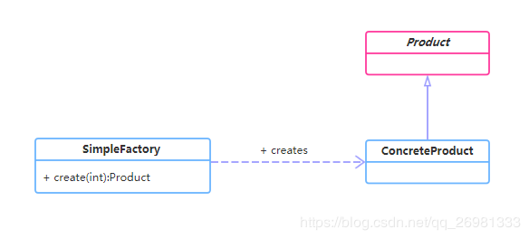

[TOC]

# 一、前言

前面我们了解了设计原则以及设计模式的概念，从这一节开始我们来了解下23种设计模式。

这一节我们来看下简单工厂模式。


# 二、基本概念
## 1.定义
（1）简单工厂模式(Simple Factory Pattern)，又称为静态工厂方法(Static Factory Method)模式，它属于类创建型模式。
（2）简单工厂模式专门定义一个工厂类，可以根据参数的不同返回不同类的实例，被创建的实例通常都具有共同的父类。
（3）不属于23种GOF设计模式

## 2.适用场景
（1）工厂类负责创建的对象比较少
（2）客户端（应用层）只知道传入工厂类的参数，对于如何创建对象，并不关心

## 3.优缺点
（1）优点
只需传入一个正确的参数，就可以获取你所需要的对象，而无需知道其创建的细节。
（2）缺点
工厂类的职责相对过重，增加新的产品需要修改工厂类的判断逻辑，违背了开闭原则。
也无法形成基于集成的等级结构。

## 4.登场角色

简单工厂模式包含如下角色：

- SimpleFactory：简单工厂角色
   简单工厂角色负责实现创建所有实例的内部逻辑
- Product：抽象产品角色
  抽象产品角色是所创建的所有对象的父类，负责描述所有实例所共有的公共接口
- ConcreteProduct：具体产品角色
  具体产品角色是创建目标，所有创建的对象都充当这个角色的某个具体类的实例。


# 三、代码实例
## 1.类图
示例的类图如下：


## 2.代码
### 2.1 抽象产品
>Video

```java
package com.geely.design.pattern.creational.simplefactory;

/**
 * Created by geely
 */
public abstract class Video {
    public abstract void produce();

}

```

### 2.2 具体产品
>JavaVideo

```java
package com.geely.design.pattern.creational.simplefactory;

/**
 * Created by geely
 */
public class JavaVideo extends Video {
    @Override
    public void produce() {
        System.out.println("录制Java课程视频");
    }
}

```
> PythonVideo

```java
package com.geely.design.pattern.creational.simplefactory;

/**
 * Created by geely
 */
public class PythonVideo extends Video {
    @Override
    public void produce() {
        System.out.println("录制Python课程视频");
    }
}

```

### 2.3 简单工厂
> VideoFactory

```java
package com.geely.design.pattern.creational.simplefactory;

/**
 * Created by geely
 */
public class VideoFactory {
    public Video getVideo(Class c){
        Video video = null;
        try {
            video = (Video) Class.forName(c.getName()).newInstance();
        } catch (InstantiationException e) {
            e.printStackTrace();
        } catch (IllegalAccessException e) {
            e.printStackTrace();
        } catch (ClassNotFoundException e) {
            e.printStackTrace();
        }
        return video;
    }


    public Video getVideo(String type){
        if("java".equalsIgnoreCase(type)){
            return new JavaVideo();
        }else if("python".equalsIgnoreCase(type)){
            return new PythonVideo();
        }
        return null;
    }

}

```


# 四、源码分析
## 1.JDK
JDK类库中广泛使用了简单工厂模式

### 1.1 DateFormat
工具类java.text.DateFormat，它用于格式化一个本地日期或者时间。

```java
public final static DateFormat getDateInstance();
public final static DateFormat getDateInstance(int style);
public final static DateFormat getDateInstance(int style,Locale
locale);
```

### 1.2 Calendar
如日期类 java.util.Calendar

```java
public static Calendar getInstance();
public static Calendar getInstance(TimeZone zone);
public static Calendar getInstance(Locale aLocale);
```

### 1.3 DriverManager
如使用jdbc连接数据库时

```java
//1.注册Driver到DriverManager
Class.forName("com.mysql.jdbc.Driver");
Connection conn = null;
//2.生成数据库连接
conn = DriverManager.getConnection("jdbc:mysql://hostname:port/db_name","db_username", "db_password");
conn.close();
```
将mysql驱动注册到DriverManager
```java
public class Driver extends NonRegisteringDriver implements java.sql.Driver {
    public Driver() throws SQLException {
    }

    static {
        try {
            DriverManager.registerDriver(new Driver());
        } catch (SQLException var1) {
            throw new RuntimeException("Can't register driver!");
        }
    }
}
```

生成数据库连接

```java
    //Attempts to establish a connection to the given database URL.
    @CallerSensitive
    public static Connection getConnection(String url,
        String user, String password) throws SQLException {
        java.util.Properties info = new java.util.Properties();

        if (user != null) {
            info.put("user", user);
        }
        if (password != null) {
            info.put("password", password);
        }

        return (getConnection(url, info, Reflection.getCallerClass()));
    }


    //  Worker method called by the public getConnection() methods.
    private static Connection getConnection(
        String url, java.util.Properties info, Class<?> caller) throws SQLException {
        /*
         * When callerCl is null, we should check the application's
         * (which is invoking this class indirectly)
         * classloader, so that the JDBC driver class outside rt.jar
         * can be loaded from here.
         */
        ClassLoader callerCL = caller != null ? caller.getClassLoader() : null;
        synchronized(DriverManager.class) {
            // synchronize loading of the correct classloader.
            if (callerCL == null) {
                callerCL = Thread.currentThread().getContextClassLoader();
            }
        }

        if(url == null) {
            throw new SQLException("The url cannot be null", "08001");
        }

        println("DriverManager.getConnection(\"" + url + "\")");

        // Walk through the loaded registeredDrivers attempting to make a connection.
        // Remember the first exception that gets raised so we can reraise it.
        SQLException reason = null;

        for(DriverInfo aDriver : registeredDrivers) {
            // If the caller does not have permission to load the driver then
            // skip it.
            if(isDriverAllowed(aDriver.driver, callerCL)) {
                try {
                    println("    trying " + aDriver.driver.getClass().getName());
                    Connection con = aDriver.driver.connect(url, info);
                    if (con != null) {
                        // Success!
                        println("getConnection returning " + aDriver.driver.getClass().getName());
                        return (con);
                    }
                } catch (SQLException ex) {
                    if (reason == null) {
                        reason = ex;
                    }
                }

            } else {
                println("    skipping: " + aDriver.getClass().getName());
            }

        }

        // if we got here nobody could connect.
        if (reason != null)    {
            println("getConnection failed: " + reason);
            throw reason;
        }

        println("getConnection: no suitable driver found for "+ url);
        throw new SQLException("No suitable driver found for "+ url, "08001");
    }
```


# 六、参考资料
1. [CyC2018/CS-Notes](https://github.com/CyC2018/CS-Notes/blob/master/notes/%E8%AE%BE%E8%AE%A1%E6%A8%A1%E5%BC%8F.md) 
2. [quanke/design-pattern-java-source-code](https://github.com/quanke/design-pattern-java-source-code)
3. [图说设计模式](https://design-patterns.readthedocs.io/zh_CN/latest/)
4. [设计模式笔记：简单工厂模式（Simple Factory）](https://www.cnblogs.com/libingql/p/3887577.html)
5. [深入浅出设计模式——简单工厂模式（Simple Factory）](http://www.cnblogs.com/Bobby0322/p/4178412.html)