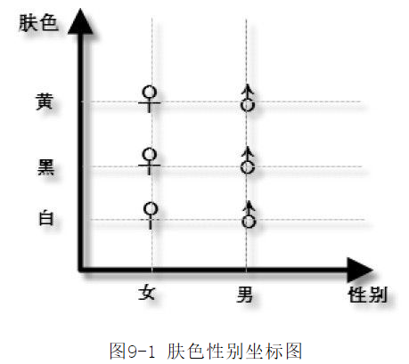
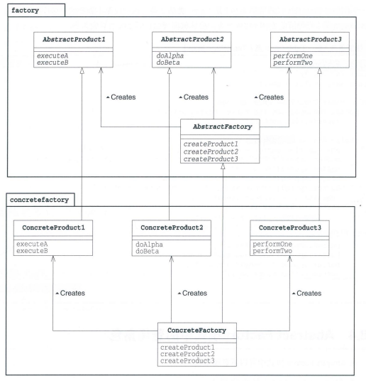
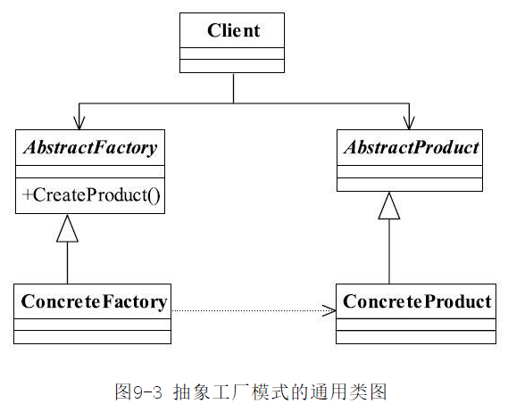
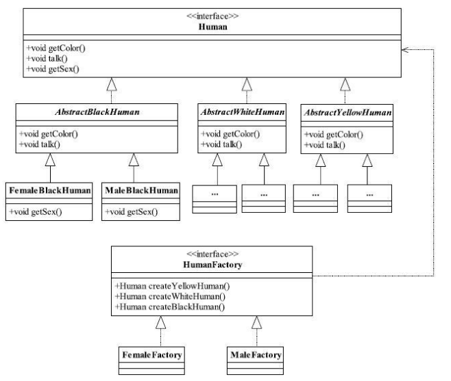

[TOC]


# 一、前言

抽象工厂模式是工厂模式的升级版。将工厂模式下的抽象工厂进一步抽象，就成了抽象工厂模式。

工厂模式相当于抽象工厂中的产品等级结构这一层，将AbstractFactory 的层次提升，进一步抽象，就出现抽象工厂模式。


# 二、基本概念
## 1.定义
### 1.1 标准定义
为创建`一组`相关或相互依赖的对象提供一个接口，而且无须指定它们的具体类

> Provide an interface for creating families of related or dependent objects without specifying their concrete classes.

### 1.2 精简定义
抽象工厂的工作是将抽象零件组装为抽象产品。 

我们并不关心零件的具体实现，而是只关心接口（API）。我们仅使用该接口（API）将零件组装成为产品。子类这一层负责方法的具体实现。

## 2.产品族与产品等级结构

### 产品族
几个互不影响的产品线，组成一个产品族。

### 产品等级结构
同一条产品线下，不同类型的产品组成一个产品等级结构。

### 示例



 > 上图来自《设计模式之禅》的女娲八卦炉造人示例。
 > > 肤色组成一个产品族，而性别组成一个产品等级结构。
 > >
 > > 产品族：白色人种、黑色人种、黄色人种
 > > 产品等级结构：黄色人种男、黄色人种女


## 3.适用场景
一个对象族（或者一组没有任何关系的对象）都有相同的约束，则可以使用抽象工厂模式。

## 4.优劣
### 优点
（1）封装性
具体产品的实现细节交给子类，高层模块只需要依赖抽象即可。
（2）将一系列的产品族统一到一起创建。

### 缺点
产品族扩展困难。
> 横向（产品等级结构）扩展容易
> 纵向（产品族）扩展困难
>
## 5.登场角色


将此图进一步抽象，可得到下图，可以发现其实和工厂方法的类图相同。但是在细节上来看，抽象工厂的层次更深，具有产品族的概念。


### 5.1 AbstractFactory(抽象工厂)
负责定义用于生成抽象产品的接口。

### 5.2 AbstractProduct（抽象产品）
负责定义AbstractFactory角色所生成的抽象零件和产品的接口

### 5.3 ConcreteProduct（具体产品）
负责实现 AbstractProduct 的接口（API） 

### 5.4 ConcreteFactory（具体工厂）
负责实现 AbstractFactory 定义的接口

# 三、代码实例一
《设计模式之禅》的女娲八卦炉造人示例。




# 四、代码实例二
此示例的功能就是使用抽象工厂模式将带有层次关系的链接的集合制作成HTML文件。


## 1.抽象工厂
>  Factory

```java
public abstract class Factory {
    public static Factory getFactory(String className) {
        Factory factory = null;
        try {
            factory = (Factory) Class.forName(className).newInstance();
        } catch (ClassNotFoundException e) {
            System.out.println("not found " + className + " class");
        } catch (Exception e) {
            e.printStackTrace();
        }
        return factory;
    }

    public abstract Link createLink(String caption, String url);

    public abstract Tray createTray(String caption);

    public abstract Page createPage(String title, String author);
}

```

## 2.抽象零件与抽象产品
### 2.1 抽象零件
 -  Item

```java
//代表项目，是 Link 和 Tray 的父类
public abstract class Item {
    //项目的标题
    protected String caption;

    public Item(String caption) {
        this.caption = caption;
    }

    public abstract String makeHtml();
}
```
- Link

```java
//表示 HYML 超链接的类
public abstract class Link extends Item {

    protected String url;

    public Link(String caption, String url) {
        super(caption);
        this.url = url;
    }
}
```

- Tray

```java
//Tray 类表示一个含有多个 Link 类和 Tray 类的容器。
public abstract class Tray extends Item {
    protected List<Item> tray = new ArrayList<>();

    public Tray(String caption) {
        super(caption);
    }

    public void add(Item item) {
        tray.add(item);
    }
}
```


### 2.2 抽象产品
> Page 

```java
//抽象地表示 HTML 页面的类，可以看作是零件组成的产品
public abstract class Page {
    protected String title;
    protected String author;
    protected List<Item> content = new ArrayList<>();

    public Page(String title, String author) {
        this.title = title;
        this.author = author;
    }

    public void add(Item item) {
        content.add(item);
    }

    public void output() {
        try {
            String fileNmae = "file/abstractFactory/" + title + ",html";
            Writer writer = new FileWriter(fileNmae);
            writer.write(this.makeHtml());
            writer.close();
            System.out.println(fileNmae + "编写完成");
        } catch (IOException e) {
            e.printStackTrace();
        }
    }

    public abstract String makeHtml();
}

```

## 3.具体工厂及产品族1
### 3.1 具体工厂
ListFactory

```java
public class ListFactory extends Factory {
    @Override
    public Link createLink(String caption, String url) {
        return new ListLink(caption, url);
    }

    @Override
    public Tray createTray(String caption) {
        return new ListTray(caption);
    }

    @Override
    public Page createPage(String title, String author) {
        return new ListPage(title, author);
    }
}

```

### 3.2 产品族

（1）ListLink（具体零件1）

```java
public class ListLink extends Link {
    public ListLink(String caption, String url) {
        super(caption, url);
    }

    @Override
    public String makeHtml() {
        return "    <li><a href=\"" + url + "\">" + caption + "</a><li>\n";
    }
}
```

（2）ListTray（具体零件2）

```java
public class ListTray extends Tray {
    public ListTray(String caption) {
        super(caption);
    }

    @Override
    public String makeHtml() {
        StringBuffer buffer = new StringBuffer();
        buffer.append("<li>\n");
        buffer.append(caption + "\n");
        buffer.append("<ul>\n");
        Iterator<Item> it = tray.iterator();
        while (it.hasNext()) {
            Item item = it.next();
            buffer.append(item.makeHtml());
        }
        buffer.append("</ul>\n");
        buffer.append("</li>\n");
        return buffer.toString();
    }
}

```

（3）ListPage (具体产品)

```java
public class ListPage extends Page {
    public ListPage(String title, String author) {
        super(title, author);
    }

    @Override
    public String makeHtml() {
        StringBuffer buffer = new StringBuffer();
        buffer.append("<html><head><title>" + title + "</title></head>\n");
        buffer.append("<body>\n");
        buffer.append("<h1>" + title + "</h1>\n");
        buffer.append("<ul>\n");
        Iterator<Item> it = content.iterator();
        while (it.hasNext()) {
            Item item = it.next();
            buffer.append(item.makeHtml());
        }
        buffer.append("</ul>\n");
        buffer.append("<hr><address>" + author + "</address>");
        buffer.append("</body></html>\n");
        return buffer.toString();
    }
}
```

## 4.具体工厂及产品族2
### 4.1 具体工厂
> TableFactory
>
```java
public class TableFactory extends Factory {
    @Override
    public Link createLink(String caption, String url) {
        return new TableLink(caption, url);
    }

    @Override
    public Tray createTray(String caption) {
        return new TableTray(caption);
    }

    @Override
    public Page createPage(String title, String author) {
        return new TablePage(title, author);
    }
}
```

### 4.2 产品族

（1）TableLink（具体零件）

```java
public class TableLink extends Link {
    public TableLink(String caption, String url) {
        super(caption, url);
    }

    @Override
    public String makeHtml() {
        return "<td><a href=\"" + url + "\">" + caption + "</a></td>\n";
    }
}
```

（2）TableTray（具体零件）

```java
public class TableTray extends Tray {
    public TableTray(String caption) {
        super(caption);
    }

    @Override
    public String makeHtml() {
        StringBuffer buffer = new StringBuffer();
        buffer.append("<td>");
        buffer.append("<table width=\"100%\" border=\"1\"><tr>");
        buffer.append("<td bgcolor=\"#cccccc\" align = \"center\" colspan=\"" + tray.size() + "\"><b>"
                + caption + "</b></td>");
        buffer.append("</tr>\n");
        buffer.append("<tr>\n");
        Iterator<Item> it = tray.iterator();
        while (it.hasNext()) {
            Item item = it.next();
            buffer.append(item.makeHtml());
        }
        buffer.append("</tr></table>");
        buffer.append("</td>");
        return buffer.toString();
    }
}

```
（3）TablePage（具体产品）

```java
public class TablePage extends Page {
    public TablePage(String title, String author) {
        super(title, author);
    }

    @Override
    public String makeHtml() {
        StringBuffer buffer = new StringBuffer();
        buffer.append("<html><head><title>" + title + "</title></head>\n");
        buffer.append("<body>\n");
        buffer.append("<h1>" + title + "</h1>\n");
        buffer.append("<table width=\"80%\" border =\"3\">\n");
        Iterator<Item> iterator = content.iterator();
        while (iterator.hasNext()) {
            Item item = iterator.next();
            buffer.append(item.makeHtml());
        }
        buffer.append("</table>\n");
        buffer.append("<hr><address>" + author + "</address>");
        buffer.append("</body></html>\n");
        return buffer.toString();
    }
}
```

## 5.主函数
> Main
>
```java
public class Main {
    public static void main(String[] args) {
        Scanner scanner = new Scanner(System.in);
        String line = scanner.nextLine();
        Factory factory = Factory.getFactory(line);
        Link people = factory.createLink("人民日报", "http://www.people.com.cn");
        Link gmw = factory.createLink("光明日报", "http://www.gwm.cn/");
        Link us_yahoo = factory.createLink("Yahoo!", "http://www.yahoo.com/");
        Link jp_yahoo = factory.createLink("Yahoo! Japan", "http://www.yahoo.co.jp/");
        Link excite = factory.createLink("Excite", "http://www.excite.com/");
        Link google = factory.createLink("Google", "http://www.google.com/");

        Tray trayNews = factory.createTray("日报");
        trayNews.add(people);
        trayNews.add(gmw);

        Tray trayYahoo = factory.createTray("Yahoo!");
        trayYahoo.add(us_yahoo);
        trayYahoo.add(jp_yahoo);

        Tray traySearch = factory.createTray("搜索引擎");
        traySearch.add(trayYahoo);
        traySearch.add(excite);
        traySearch.add(google);

        Page page = factory.createPage("LinkPage", "杨文轩");
        page.add(trayNews);
        page.add(traySearch);
        page.output();
    }
}
```


# 四、相关设计模式
## 1. Builder模式
AbstractFactory模式通过调用抽象产品的接口来组装抽象产品，生成具有复杂结构的实例。
Builder模式则是分阶段地制作复杂实例。

## 2. Factory 模式
有时，AbstractFactory模式中零件和产品的生成会使用到 Factory Method模式。

## 3. Composite模式
有时，AbstractFactory模式在制作产品时会使用Composite模式。

## 4. Singleton模式
有时，AbstractFactory模式中的具体工厂会使用Singleton模式。


# 五、源码分析


# 六、参考资料
1. [CyC2018/CS-Notes](https://github.com/CyC2018/CS-Notes/blob/master/notes/%E8%AE%BE%E8%AE%A1%E6%A8%A1%E5%BC%8F.md) 
2. [quanke/design-pattern-java-source-code](https://github.com/quanke/design-pattern-java-source-code)
3. [图说设计模式](https://design-patterns.readthedocs.io/zh_CN/latest/)
4. [图解设计模式-CSDN-wujunyucg](https://blog.csdn.net/wujunyucg/article/category/7301352/1)