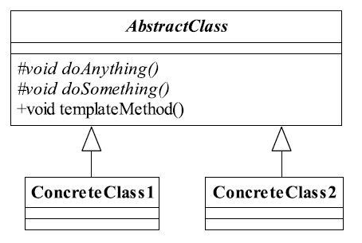
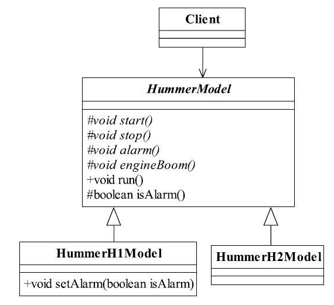

[TOC]


# 一、前言


# 二、基本概念
## 1.定义
### 1.1 标准定义
定义一个操作中的算法的框架，而将一些步骤延迟到子类中。使得子类可以不改变一个算法的结构即可重定义该算法的某些特定步骤。

> Define the skeleton of an algorithm in an operation, deferring some steps to subclasses.Template Method lets subclasses redefine certain steps of an algorithm without changing the algorithm's structure.

### 1.2 精简定义
表述一：
> 模板方法模式就是在模板方法中按照一定的规则和顺序调用基本方法

表述二：
>  在父类中定义处理流程的框架，在子类中实现具体处理。 

## 2.适用场景
（1）提取公共代码
多个子类有公有的方法，并且逻辑基本相同时。

（2）定义算法框架
重要、复杂的算法，可以把核心算法设计为模板方法，周边的相关细节功能则由各个子类实现。

（3）重构时
重构时，模板方法模式是一个经常使用的模式，把相同的代码抽取到父类中，然后通过`钩子函数`（见“模板方法模式的扩展”）约束其行为。


## 3.优劣
### 3.1 优点
（1）封装不变部分，扩展可变部分。
把认为是不变部分的算法封装到父类实现，而可变部分的则可以通过继承来继续扩展。

（2）提取公共部分代码，便于维护

### 3.2 缺点
按照我们的设计习惯，抽象类负责声明最抽象、最一般的事物属性和方法，实现类完成具体的事物属性和方法。但是模板方法模式却颠倒了，抽象类定义了部分抽象方法，由子类实现，子类执行的结果影响了父类的结果，也就是`子类对父类产生了影响`，这在复杂的项目中，会带来代码阅读的难度，而且也会让新手产生不适感。

## 4.登场角色



### 4.1 AbstractClass（抽象模板）
有两类方法：
| 分类     | 描述                                                       |
| -------- | ---------------------------------------------------------- |
| 基本方法 | 由子类实现，并且在模板方法被调用的方法                     |
| 模板方法 | 通过按照一定的规则和顺序调用基本方法，来定义处理流程的框架 |
| 钩子方法 | 是基本方法。通过钩子方法的返回值可以决定公共部分的执行结果 |

> - 为了防止恶意的操作，一般模板方法都加上final关键字，不允许被覆写。
> - 抽象模板中的基本方法尽量设计为protected类型，符合迪米特法则，不需要暴露的属性或方法尽量不要设置为protected类型。实现类若非必要，尽量不要扩大父类中的访问权限。


### 4.2 ConcreteClass（具体模板）
实现父类定义的基本方法


# 三、代码实例
以悍马车辆模型为例


## 1. 抽象模板
- HummerModel
```java
/**
 * @author cbf4Life cbf4life@126.com
 * I'm glad to share my knowledge with you all.
 * Hummer Model是悍马车辆模型的意思，不是悍马美女车模
 */
public abstract class HummerModel {

	/*
	 * 首先，这个模型要能够被发动起来，别管是手摇发动，还是电力发动，反正
	 * 是要能够发动起来，那这个实现要在实现类里了
	 */
	protected abstract void start();
	
	//能发动，那还要能停下来，那才是真本事
	protected abstract void stop();
	
	//喇叭会出声音，是滴滴叫，还是哔哔叫
	protected abstract void alarm();
	
	//引擎会轰隆隆的响，不响那是假的
	protected abstract void engineBoom();
	
	//那模型应该会跑吧，别管是人退的，还是电力驱动，总之要会跑
	final public void run() {
		
		//先发动汽车
		this.start();
		
		//引擎开始轰鸣
		this.engineBoom();
		
		//要让它叫的就是就叫，喇嘛不想让它响就不响
		if(this.isAlarm()){
			this.alarm();
		}
		
		
		//到达目的地就停车
		this.stop();
	}
	
	//钩子方法，默认喇叭是会响的
	protected  boolean isAlarm(){
		return true;
	}
}
```

## 2. 具体模板
- HummerH1Model 

H1型号的悍马是由客户自己控制是否要响喇叭，也就是说外界条件改变，影响到模板方法的执行。在我们的抽象类中isAlarm的返回值就是影响了模板方法的执行结果，该方法就叫做`钩子方法（HookMethod）`。
```java
/**
 * @author cbf4Life cbf4life@126.com
 * I'm glad to share my knowledge with you all.
 * 悍马车是每个越野者的最爱，其中H1最接近军用系列
 */
public class HummerH1Model extends HummerModel {
	private boolean alarmFlag = true;  //是否要响喇叭
	
	@Override
	protected void alarm() {
		System.out.println("悍马H1鸣笛...");
	}

	@Override
	protected void engineBoom() {
		System.out.println("悍马H1引擎声音是这样在...");
	}

	@Override
	protected void start() {
		System.out.println("悍马H1发动...");
	}

	@Override
	protected void stop() {
		System.out.println("悍马H1停车...");
	}
	
	protected boolean isAlarm() {
		return this.alarmFlag;
	}

	//要不要响喇叭，是有客户的来决定的
	public void setAlarm(boolean isAlarm){
		this.alarmFlag = isAlarm;
	}

}

```

- HummerH2Model 
```java
/**
 * @author cbf4Life cbf4life@126.com
 * I'm glad to share my knowledge with you all.
 * H1和H2有什么差别，还真不知道，真没接触过悍马
 */
public class HummerH2Model extends HummerModel {

	protected void alarm() {
		System.out.println("悍马H2鸣笛...");
	}

	protected void engineBoom() {
		System.out.println("悍马H2引擎声音是这样在...");
	}
	
	protected void start() {
		System.out.println("悍马H2发动...");
	}

	protected void stop() {
		System.out.println("悍马H2停车...");
	}
	
	
	//默认没有喇叭的
	protected boolean isAlarm() {		
		return false;
	}
	
	
	
}
```

## 3.客户端

```java
/**
 * @author cbf4Life cbf4life@126.com
 * I'm glad to share my knowledge with you all.\
 * 客户开始使用这个模型
 */
public class Client {

	public static void main(String[] args) throws IOException {
		System.out.println("-------H1型号悍马--------");
		System.out.println("H1型号的悍马是否需要喇叭声响？0-不需要   1-需要");
		String type=(new BufferedReader(new InputStreamReader(System.in))).readLine();
		HummerH1Model h1 = new HummerH1Model();
		if(type.equals("0")){  
			h1.setAlarm(false);
		}
		h1.run();
		
		System.out.println("\n-------H2型号悍马--------");
		HummerH2Model h2 = new HummerH2Model();
		h2.run();  
	}

}

```

# 四、相关设计模式

# 五、源码分析

# 六、参考资料
1. [CyC2018/CS-Notes](https://github.com/CyC2018/CS-Notes/blob/master/notes/%E8%AE%BE%E8%AE%A1%E6%A8%A1%E5%BC%8F.md) 
2. [quanke/design-pattern-java-source-code](https://github.com/quanke/design-pattern-java-source-code)
3. [图说设计模式](https://design-patterns.readthedocs.io/zh_CN/latest/)
4. [图解设计模式-CSDN-wujunyucg](https://blog.csdn.net/wujunyucg/article/category/7301352/1)