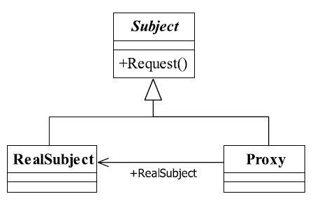
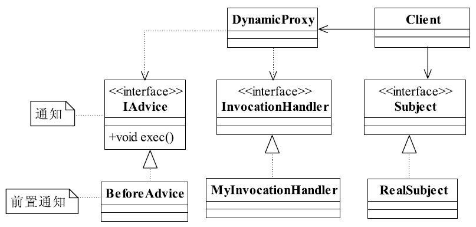

[TOC]


# 一、前言


# 二、代理模式
## 1.定义
### 1.1 标准定义

为其他对象提供一种代理以控制对这个对象的访问。

> Provide a surrogate or placeholder for another object to control access to it.


### 1.2 精简定义


## 2.适用场景


## 3.优劣

### 3.1 优点

（1）职责清晰

真实的角色就是实现实际的业务逻辑，不用关心其他非本职责的事务，通过后期的代理完成一件事务，附带的结果就是编程简洁清晰。


（2）高扩展性

具体主题角色是随时都会发生变化的，只要它实现了接口，甭管它如何变化，都逃不脱如来佛的手掌（接口），那我们的代理类完全就可以在不做任何修改的情况下使用。


（3）智能化


## 4.登场角色




### 4.1 Subject（抽象主题）

抽象主题类可以是抽象类也可以是接口，是一个最普通的业务类型定义，无特殊要求。


### 4.2 RealSubject（具体主题）

也叫做被委托角色、被代理角色，是业务逻辑的具体执行者


### 4.3 Proxy（代理类）

也叫做委托类、代理类。它负责对真实角色的应用，把所有抽象主题类定义的方法限制委托给真实主题角色实现，并且在真实主题角色处理完毕前后做预处理和善后处理工作。


## 5.通用源码

### 5.1 Subject

```java
public interface Subject {
	
	//定义一个方法
	public void request();
}
```


### 5.2 RealSubject

```java
public class RealSubject implements Subject {
   
   //实现方法
   public void request() {
      //业务逻辑处理
   }

}
```


### 5.3 Proxy

```java
public class Proxy implements Subject {
   //要代理哪个实现类
   private Subject subject = null;
   
   //默认被代理者
   public Proxy(){
      this.subject = new RealSubject();
   }
   
   public Proxy(Subject _subject){
      this.subject = _subject;
   }
   
   //通过构造函数传递代理者
   public Proxy(Object...objects ){

   }
   
   //实现接口中定义的方法
   public void request() {
      this.before();
      this.subject.request();
      this.after();
   }
   
   //预处理
   private void before(){
      //do something
   }
   
   //善后处理
   private void after(){
      //do something
   }
}
```


### 5.4 Client

```
public class Client {
   
   public static void main(String[] args) {
      Subject realSub = new RealSubject();
      Subject proxy = new Proxy(realSub);
      proxy.request();
   }
}
```


## 6.代码实例

以游戏代练为例


### 6.1 Subject

```java
/**
 * 游戏玩家
**/
public interface IGamePlayer {

   //登录游戏
   public void login(String user,String password);
   
   //杀怪，这是网络游戏的主要特色
   public void killBoss();
   
   //升级
   public void upgrade();
}
```


### 6.2 RealSubject

```java
/**
 * 真实玩家
 */
public class GamePlayer implements IGamePlayer {
   private String name = "";
   
   //构造函数限制谁能创建对象，并同时传递姓名
   public GamePlayer(IGamePlayer _gamePlayer,String _name) throws Exception{
      if(_gamePlayer == null ){
         throw new Exception("不能创建真是角色！");
      }else{
         this.name = _name;
      }
      
   }
   //打怪，最期望的就是杀老怪
   public void killBoss() {
      System.out.println(this.name + "在打怪！");
   }
   
   //进游戏之前你肯定要登录吧，这是一个必要条件
   public void login(String user, String password) {
      System.out.println("登录名为"+user + " 的用户 " + this.name + "登录成功！");
   }

   //升级，升级有很多方法，花钱买是一种，做任务也是一种
   public void upgrade() {
      System.out.println(this.name + " 又升了一级！");
   }

}
```


### 6.3 Proxy


```java
/**
 * 游戏代练者
 */
public class GamePlayerProxy implements IGamePlayer {
   private IGamePlayer gamePlayer = null;
   
   //通过构造函数传递要对谁进行代练
   public GamePlayerProxy(String name){
      try {
         gamePlayer = new GamePlayer(this,name);
      } catch (Exception e) {
         // TODO 异常处理
      }
   }
   
   //代练杀怪
   public void killBoss() {
      this.gamePlayer.killBoss();
   }

   //代练登录
   public void login(String user, String password) {
      this.gamePlayer.login(user, password);

   }

   //代练升级
   public void upgrade() {
      this.gamePlayer.upgrade();

   }

}
```


### 6.4 Client

```java
/**
 * 场景类
 */
public class Client {

   public static void main(String[] args) {

      //然后再定义一个代练者
      IGamePlayer proxy = new GamePlayerProxy("张三");
      
      //开始打游戏，记下时间戳
      System.out.println("开始时间是：2009-8-25 10:45");
      proxy.login("zhangSan", "password");
      //开始杀怪
      proxy.killBoss();
      //升级
      proxy.upgrade();
      //记录结束游戏时间
      System.out.println("结束时间是：2009-8-26 03:40");
      
   }

}
```


# 三、动态代理

## 1.定义

动态代理是在实现阶段不用关心代理谁，而在运行阶段才指定代理哪一个对象。


> 动态代理的主要意图就是解决我们常说的“审计”问题，也就是横切面编程，在不改变我们已有代码结构的情况下增强或控制对象的行为。


## 2.登场角色




动态代理实现代理的职责，业务逻辑Subject实现相关的逻辑功能，两者之间没有必然的相互耦合的关系。通知Advice从另一个切面切入，最终在高层模块也就是Client进行耦合，完成逻辑的封装任务。


### 2.1 Subject（抽象主题）

抽象主题类可以是抽象类也可以是接口，是一个最普通的业务类型定义，无特殊要求。


### 2.2 RealSubject（具体主题）

也叫做被委托角色、被代理角色，是业务逻辑的具体执行者


### 2.3 DynamicProxy（动态代理类）

也叫做委托类、代理类。它负责对真实角色的应用，把所有抽象主题类定义的方法限制委托给真实主题角色实现，并且在真实主题角色处理完毕前后做预处理和善后处理工作。

### 2.4 InvocationHandler

InvocationHandler是JDK提供的动态代理接口，对被代理类的方法进行代理。

> 可在其实现类中实现对被代理类的增强


### 2.5 Advice

切面


## 3.通用源码

### 3.1 Subject

```java
public interface Subject {
   
   //业务操作
   public void doSomething(String abc);
}
```


### 3.2 RealSubject

```java
public class RealSubject implements Subject {

   //业务操作
   public void doSomething(String str) {
      System.out.println("do something!---->" + str);
   }

}
```


### 3.3 DynamicProxy

```java
public class DynamicProxy<T> {

   public static <T> T newProxyInstance(ClassLoader classLoader, Class<?>[] interfaces, InvocationHandler invocationHandler){
       
       /**
        * （1）使用给定的类加载器，找到该类的所有接口，然后实现所有方法，当然方法都是空的。
        * （2）由InvocationHandler的实现类来实现所有方法，其invoke方法接管所有方法的实现
       **/
       
      //执行目标，并返回结果
      return (T)Proxy.newProxyInstance(classLoader,interfaces, invocationHandler);       
   }
}
```


### 3.4 InvocationHandler

可在此类中进行增强处理（前置通知、后置通知、环绕通知等）

InvocationHandler 是 JDK 提供的动态代理接口，对被代理类的方法进行代理。


```java
public class MyInvocationHandler implements InvocationHandler {
   //被代理的对象
   private Object target = null;
    
   //通过构造函数传递一个对象
   public MyInvocationHandler(Object _obj){
      this.target = _obj;
   }
  
    //代理方法 
   public Object invoke(Object proxy, Method method, Object[] args)
         throws Throwable {
       
      //前置增强处理，寻找JoinPoint连接点，AOP框架使用元数据定义
      if(true){
         //执行一个前置通知
         (new BeforeAdvice()).exec();
      }
       
      //真正执行被代理的方法
      return method.invoke(this.target, args);
   }
}
```


### 3.5 Advice

- IAdvice

```java
/**
 * 抽象通知
 */
public interface IAdvice {
   
   //通知只有一个方法，执行即可
   public void exec();
}
```


- BeforeAdvice

```java
/**
 * 前置通知
 */
public class BeforeAdvice implements IAdvice{
   
   public void exec(){
      System.out.println("我是前置通知，我被执行了！");
   }
}
```


- AfterAdvice

```java
/**
 * 后置通知
 */
public class AfterAdvice implements IAdvice {
   
   public void exec() {
      System.out.println("我是后续通知，我被执行了！");
   }

}
```


### 2.6 Clent

```java
public class Client {

   public static void main(String[] args) {
      // 定义一个主题
      Subject subject = new RealSubject();
      // 定义一个Handler
      InvocationHandler handler = new MyInvocationHandler(subject);
      // 定义主题的代理
      Subject proxy = DynamicProxy.newProxyInstance(
            subject.getClass().getClassLoader(),
            subject.getClass().getInterfaces(),
            handler);
      // 代理的行为
      proxy.doSomething(" Finish");
   }
}
```


### 2.7 扩展DynamicProxy

- SubjectDynamicProxy

```java
public class SubjectDynamicProxy extends DynamicProxy{

   public static <T> T newProxyInstance(Subject subject){
      //获得ClassLoader
      ClassLoader loader = subject.getClass().getClassLoader();
      //获得接口数组
      Class<?>[] classes = subject.getClass().getInterfaces();
      //获得handler
      InvocationHandler handler = new MyInvocationHandler(subject);
      return newProxyInstance(loader, classes, handler);
   }
}
```


- 场景类

```java
public class Client {
   
   public static void main(String[] args) {
      //定义一个主题
      Subject subject = new RealSubject();
      //定义主题的代理
      Subject proxy = SubjectDynamicProxy.newProxyInstance(subject);
      //代理的行为
      proxy.doSomething("Finish");
   }
}
```


## 4.代码实例

这里我们还是以游戏代练场景为例

### 4.1 Subject

```java
/**
 * 游戏玩家
 */
public interface IGamePlayer {

   //登录游戏
   public void login(String user,String password);
   
   //杀怪，这是网络游戏的主要特色
   public void killBoss();
   
   //升级
   public void upgrade();
}
```


### 4.2 RealSubject

```java
/**
 * 真实玩家
 */
public class GamePlayer implements IGamePlayer {
   private String name = "";
   
   //通过构造函数传递名称
   public GamePlayer(String _name){
      this.name = _name;
   }
      
   //打怪，最期望的就是杀老怪
   public void killBoss() {
      System.out.println(this.name + "在打怪！");
   }
   
   //进游戏之前你肯定要登录吧，这是一个必要条件
   public void login(String user, String password) {
      System.out.println("登录名为"+user + " 的用户 " + this.name + "登录成功！");
   }

   //升级，升级有很多方法，花钱买是一种，做任务也是一种
   public void upgrade() {
      System.out.println(this.name + " 又升了一级！");
   }

}
```


### 4.3 DynamicProxy

```java
public class DynamicProxy<T> {

   public static <T> T newProxyInstance(ClassLoader loader, Class<?>[] interfaces, InvocationHandler h){
      T newProxyInstance = (T)Proxy.newProxyInstance(loader,interfaces, h);
      return newProxyInstance;
   }
}
```


### 4.4 MyIvocationHandler

```java
public class MyIvocationHandler implements InvocationHandler {
   //被代理者
   Class<?> cls =null;
   //被代理的实例
   Object obj = null;
   
   //我要代理谁
   public MyIvocationHandler(Object _obj){
      this.obj = _obj;
   }
   
   //调用被代理的方法
   public Object invoke(Object proxy, Method method, Object[] args)
         throws Throwable {
      Object result = method.invoke(this.obj, args);
      //如果是登录方法，则发送信息
      if(method.getName().equalsIgnoreCase("login")){
         System.out.println("有人在用我的账号登陆！");
      }
      return result;
   }
   
}
```


### 4.5 Client

```java
public class Client {

   public static void main(String[] args) throws Throwable  {
      //定义一个痴迷的玩家
      IGamePlayer player = new GamePlayer("张三");
      
      //开始打游戏，记下时间戳
      System.out.println("开始时间是：2009-8-25 10:45");
      
      //获得类的class loader
      ClassLoader cl = player.getClass().getClassLoader();
      
      
      IGamePlayer proxy = DynamicProxy.newProxyInstance(cl,new Class[] {IGamePlayer.class}, new MyIvocationHandler(player));
      
      //登陆
      proxy.login("zhangSan", "password");
      //开始杀怪
      proxy.killBoss();
      //升级
      proxy.upgrade();

      //记录结束游戏时间
      System.out.println("结束时间是：2009-8-26 03:40");
      
   }
   
   

}
```


# 四、相关设计模式


# 五、源码分析

## 1. Mybatis


# 六、参考资料
1. [CyC2018/CS-Notes](https://github.com/CyC2018/CS-Notes/blob/master/notes/%E8%AE%BE%E8%AE%A1%E6%A8%A1%E5%BC%8F.md) 
2. [quanke/design-pattern-java-source-code](https://github.com/quanke/design-pattern-java-source-code)
3. [图说设计模式](https://design-patterns.readthedocs.io/zh_CN/latest/)
4. [图解设计模式-CSDN-wujunyucg](https://blog.csdn.net/wujunyucg/article/category/7301352/1)