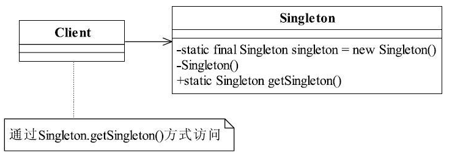

[TOC]


# 一、前言


# 二、基本概念
## 1.定义
确保某一个类只有一个实例，而且自行实例化并向整个系统提供这个实例。

>  Ensure a class has only one instance, and provide a global point of access to it.


## 2.适用场景

当要求一个类有且仅有一个对象时，可以采用单例模式

具体的场景如下：

- 需要生成唯一序列号的环境；

- 需要一个全局访问点

    在整个项目中需要一个共享访问点或共享数据，例如一个Web页面上的计数器，可以不用把每次刷新都记录到数据库中，使用单例模式保持计数器的值，并确保是线程安全的；

- 创建一个对象需要消耗的资源过多，如要访问IO和数据库等资源；

- 工具类对象

    需要定义大量的静态常量和静态方法（如工具类）的环境，可以采用单例模式（当然，也可以直接声明为static的方式）。


## 3.优劣

（1）优点

- 减少内存开销

    由于单例模式在内存中只有一个实例，减少了内存开销，特别是一个对象需要频繁地创建、销毁时，而且创建或销毁时性能又无法优化，单例模式的优势就非常明显。

- 减少性能开销

    由于单例模式只生成一个实例，所以减少了系统的性能开销，当一个对象的产生需要比较多的资源时，如读取配置、产生其他依赖对象时，则可以通过在应用启动时直接产生一个单例对象，然后用永久驻留内存的方式来解决（在JavaEE中采用单例模式时需要注意JVM垃圾回收机制）。	

- 避免对资源的多重占用

    单例模式可以避免对资源的多重占用，例如一个写文件动作，由于只有一个实例存在内存中，避免对同一个资源文件的同时写操作。


- 单例模式可以在系统设置全局的访问点，优化和共享资源访问

    例如可以设计一个单例类，负责所有数据表的映射处理。


（2）缺点

- 不适用于变化频繁的对象


## 4.登场角色




### 4.1 Singleton

Singleton类称为单例类，通过使用private的构造函数确保了在一个应用中只产生一个实例，并且是自行实例化的


## 5.注意事项

- 线程同步问题

    在高并发情况下，请注意单例模式的线程同步问题。

- 对象复制问题

    在Java中，对象默认是不可以被复制的，若实现了Cloneable接口，并实现了clone方法，则可以直接通过对象复制方式创建一个新对象，对象复制是不用调用类的构造函数，因此即使是私有的构造函数，对象仍然可以被复制。在一般情况下，类复制的情况不需要考虑，很少会出现一个单例类会主动要求被复制的情况，解决该问题的最好方法就是单例类不要实现Cloneable接口。


# 三、代码实例

## 1.饿汉式（静态常量）[可用]


```java
public class Singleton {

   private final static Singleton INSTANCE = new Singleton();

   private Singleton(){}

   public static Singleton getInstance(){
      return INSTANCE;
   }
}
```


优点：写法简单，是在类装载的时候就完成实例化。避免了线程同步问题。

缺点：在类装载的时候就完成实例化，没有达到Lazy Loading的效果。如果从始至终从未使用过这个实例，则会造成内存的浪费。


## 2.饿汉式（静态代码块）[可用]

```java
public class Singleton {

   private static Singleton instance;

   static {
      instance = new Singleton();
   }

   private Singleton() {}

   public static Singleton getInstance() {
      return instance;
   }
}
```


这种方式和上面的方式其实类似，只不过将类实例化的过程放在了静态代码块中，也是在类装载的时候，就执行静态代码块中的代码，初始化类的实例。优缺点和上面是一样的。


## 3.懒汉式(线程不安全)[不可用]

```java
public class Singleton {

   private static Singleton singleton;

   private Singleton() {}

   public static Singleton getInstance() {
      if (singleton == null) {
         singleton = new Singleton();
      }
      return singleton;
   }
}
```


这种写法起到了Lazy Loading的效果，但是只能在单线程下使用。

如果在多线程下，一个线程进入了if (singleton == null)判断语句块，还未来得及往下执行，另一个线程也通过了这个判断语句，这时便会产生多个实例。所以在多线程环境下不可使用这种方式。


## 4.懒汉式(线程安全，同步方法)[不推荐用]

```java
public class Singleton {

   private static Singleton singleton;

   private Singleton() {}

   public static synchronized Singleton getInstance() {
      if (singleton == null) {
         singleton = new Singleton();
      }
      return singleton;
   }
}
```


解决上面第三种实现方式的线程不安全问题，做个线程同步就可以了，于是就对getInstance()方法进行了线程同步。

缺点：效率太低了，每个线程在想获得类的实例时候，执行getInstance()方法都要进行同步。而其实这个方法只执行一次实例化代码就够了，后面的想获得该类实例，直接return就行了。方法进行同步效率太低要改进。


## 5.懒汉式(线程安全，同步代码块)[不可用]

```javascript
public class Singleton {

   private static Singleton singleton;

   private Singleton() {}

   public static Singleton getInstance() {
      if (singleton == null) {
         synchronized (Singleton.class) {
            singleton = new Singleton();
         }
      }
      return singleton;
   }
}
```

由于第四种实现方式同步效率太低，所以摒弃同步方法，改为同步产生实例化的的代码块。

但是这种同步并不能起到线程同步的作用。跟第3种实现方式遇到的情形一致，假如一个线程进入了if (singleton == null)判断语句块，还未来得及往下执行，另一个线程也通过了这个判断语句，这时便会产生多个实例。


## 6.双重检查[推荐用]

```java
public class Singleton {

   private static volatile Singleton singleton;

   private Singleton() {}

   public static Singleton getInstance() {
      if (singleton == null) {
         synchronized (Singleton.class) {
            if (singleton == null) {
               singleton = new Singleton();
            }
         }
      }
      return singleton;
   }
}
```


Double-Check概念对于多线程开发者来说不会陌生，如代码中所示，我们进行了两次if (singleton == null)检查，这样就可以保证线程安全了。这样，实例化代码只用执行一次，后面再次访问时，判断if (singleton == null)，直接return实例化对象。

优点：线程安全；延迟加载；效率较高。


## 7.静态内部类[推荐用]

```java
public class Singleton {

   private Singleton() {}

   private static class SingletonInstance {
      private static final Singleton INSTANCE = new Singleton();
   }

   public static Singleton getInstance() {
      return SingletonInstance.INSTANCE;
   }
}
```


这种方式跟饿汉式方式采用的机制类似，但又有不同。两者都是采用了类装载的机制来保证初始化实例时只有一个线程。不同的地方在饿汉式方式是只要Singleton类被装载就会实例化，没有Lazy-Loading的作用，而静态内部类方式在Singleton类被装载时并不会立即实例化，而是在需要实例化时，调用getInstance方法，才会装载SingletonInstance类，从而完成Singleton的实例化。

类的静态属性只会在第一次加载类的时候初始化，所以在这里，JVM帮助我们保证了线程的安全性，在类进行初始化时，别的线程是无法进入的。

优点：避免了线程不安全，延迟加载，效率高。


## 8.枚举[推荐用]

```java
public enum Singleton {
   INSTANCE;
   public void whateverMethod() {

   }
}
```


借助JDK1.5中添加的枚举来实现单例模式。不仅能避免多线程同步问题，而且还能防止反序列化重新创建新的对象。可能是因为枚举在JDK1.5中才添加，所以在实际项目开发中，很少见人这么写过。


# 四、相关设计模式

# 五、源码分析

# 六、参考资料
1. [CyC2018/CS-Notes](https://github.com/CyC2018/CS-Notes/blob/master/notes/%E8%AE%BE%E8%AE%A1%E6%A8%A1%E5%BC%8F.md) 
2. [quanke/design-pattern-java-source-code](https://github.com/quanke/design-pattern-java-source-code)
3. [图说设计模式](https://design-patterns.readthedocs.io/zh_CN/latest/)
4. [图解设计模式-CSDN-wujunyucg](https://blog.csdn.net/wujunyucg/article/category/7301352/1)
5. [单例模式的八种写法比较](https://www.cnblogs.com/zhaoyan001/p/6365064.html)