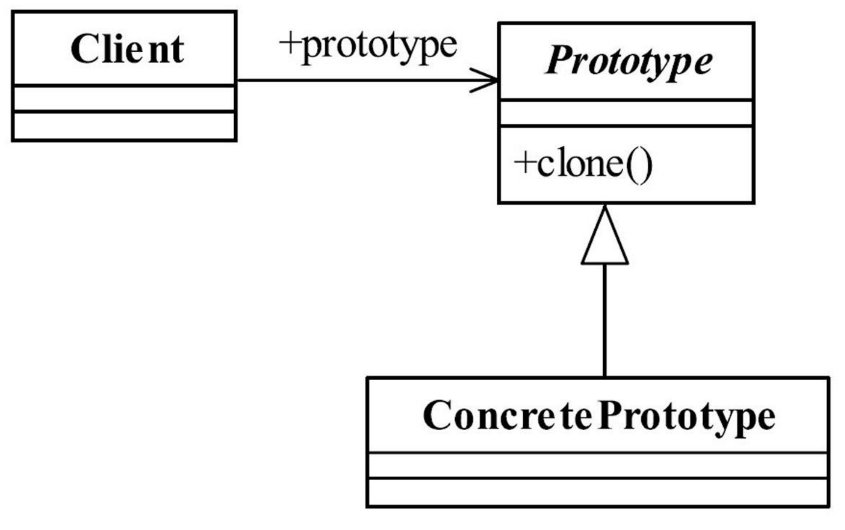

[TOC]


# 一、前言


# 二、基本概念
## 1.定义

用原型实例指定创建对象的种类，并且通过拷贝这些原型创建新的对象。

> Specify the kinds of objects to create using a prototypical instance, and create new objects by copying this prototype.


> 原型模式的核心是一个clone方法，通过该方法进行对象的拷贝.


## 2.适用场景

- 资源优化

    类初始化需要消化非常多的资源，这个资源包括数据、硬件资源等。

- 性能和安全

    通过new产生一个对象需要非常繁琐的数据准备或访问权限，则可以使用原型模式。

- 一个对象多个修改者的场景

    一个对象需要提供给其他对象访问，而且各个调用者可能都需要修改其值时，可以考虑使用原型模式拷贝多个对象供调用者使用。


在实际项目中，原型模式很少单独出现，一般是和工厂方法模式一起出现，通过clone的方法创建一个对象，然后由工厂方法提供给调用者。原型模式已经与Java融为一体，大家可以随手拿来使用。


## 3.优劣

- 性能优良

    原型模式是在内存二进制流的拷贝，要比直接new一个对象性能好很多，特别是要在一个循环体内产生大量的对象时，原型模式可以更好地体现其优点。

- 逃避构造函数的约束

    这既是它的优点也是缺点，直接在内存中拷贝，构造函数是不会执行的。优点就是减少了约束，缺点也是减少了约束，需要大家在实际应用时考虑。


## 4.深拷贝和浅拷贝

浅拷贝：对基本数据类型进行值传递，对引用数据类型进行引用传递般的拷贝，此为浅拷贝。


深拷贝：对基本数据类型进行值传递，对引用数据类型，创建一个新的对象，并复制其内容，此为深拷贝。


### 4.1 浅拷贝实例

- Thing

```java
public class Thing implements Cloneable{
	//定义一个私有变量
	private ArrayList<String> arrayList = new ArrayList<String>();

	@Override
	public Thing clone(){
		Thing thing=null;
		try {
			thing = (Thing)super.clone();
		} catch (CloneNotSupportedException e) {
			e.printStackTrace();
		}
		return thing;
	}
	
	//设置HashMap的值
	public void setValue(String value){
		this.arrayList.add(value);
	}
	
	//取得arrayList的值
	public ArrayList<String> getValue(){
		return this.arrayList;
	}
		
}
```


- Client

```java
public class Client {

   // 输出： [张三, 李四]
   public static void main(String[] args) {
      //产生一个对象
      Thing thing = new Thing();
      //设置一个值
      thing.setValue("张三");
      
      //拷贝一个对象
      Thing cloneThing = thing.clone();
      cloneThing.setValue("李四");
      
      System.out.println(thing.getValue());

   }

}
```


Object类提供的方法clone只是拷贝本对象，其对象内部的数组、引用对象等都不拷贝，还是指向原生对象的内部元素地址，这种拷贝就叫做浅拷贝。确实是非常浅，两个对象共享了一个私有变量。


### 4.2 深拷贝实例

- Thing

```java
public class Thing implements Cloneable{
   //定义一个私有变量
   private  ArrayList<String> arrayList = new ArrayList<String>();

   @Override
   public Thing clone(){
      Thing thing=null;
      try {
         thing = (Thing)super.clone();  
         this.arrayList = (ArrayList<String>)this.arrayList.clone();
      } catch (CloneNotSupportedException e) {
         e.printStackTrace();
      }
      return thing;
   }
   
   //设置HashMap的值
   public void setValue(String value){
      this.arrayList.add(value);
   }
   
   //取得arrayList的值
   public ArrayList<String> getValue(){
      return this.arrayList;
   }
      
}
```


- Client

```java
public class Client {


   public static void main(String[] args) {
      //产生一个对象
      Thing thing = new Thing();
      //设置一个值
      thing.setValue("张三");
      thing.setValue("abcd");
      
      //拷贝一个对象
      Thing cloneThing = thing.clone();
      cloneThing.setValue("李四");
      
      System.out.println(thing.getValue());

   }

}
```


## 5.登场角色




## 6.最佳实践

原型模式先产生出一个包含大量共有信息的类，然后可以拷贝出副本，修正细节信息，建立一个完整的个性对象。


# 三、相关设计模式


# 四、源码分析


# 五、参考资料
1. [CyC2018/CS-Notes](https://github.com/CyC2018/CS-Notes/blob/master/notes/%E8%AE%BE%E8%AE%A1%E6%A8%A1%E5%BC%8F.md) 
2. [quanke/design-pattern-java-source-code](https://github.com/quanke/design-pattern-java-source-code)
3. [图说设计模式](https://design-patterns.readthedocs.io/zh_CN/latest/)
4. [图解设计模式-CSDN-wujunyucg](https://blog.csdn.net/wujunyucg/article/category/7301352/1)
5. [细说 Java 的深拷贝和浅拷贝](https://www.cnblogs.com/plokmju/p/7357205.html)