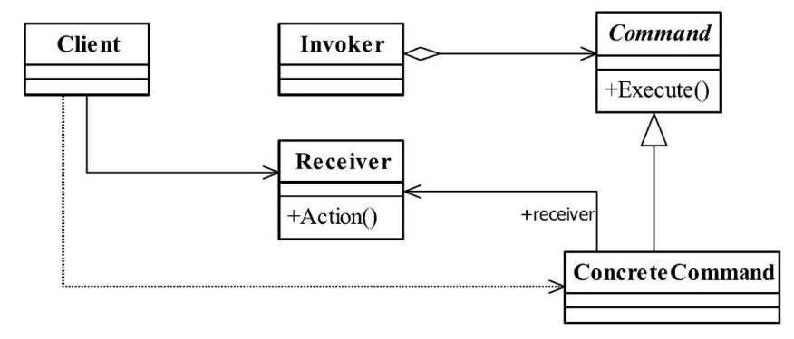

[TOC]


# 一、前言


# 二、基本概念
## 1.定义

将一个请求封装成一个对象，从而让你使用不同的请求把客户端参数化，对请求排队或者记录请求日志，可以提供命令的撤销和恢复功能。

> Encapsulate a request as an object, thereby letting you parameterize clients with different requests, queue or log requests, and support undoable operations.
>


## 2.适用场景

只要你认为是命令的地方就可以采用命令模式


## 3.优点

- 类间解耦

调用者角色与接收者角色之间没有任何依赖关系，调用者实现功能时只需调用Command抽象类的execute方法就可以，不需要了解到底是哪个接收者执行。


- 可扩展

Command的子类可以非常容易地扩展，而调用者Invoker和高层次的模块Client不产生严重的代码耦合。


- 命令模式结合其他模式会更优秀

命令模式可以结合责任链模式，实现命令族解析任务；结合模板方法模式，则可以减少Command子类的膨胀问题。


## 4.登场角色



### 4.1 Receiver（接收者）

命令接收者，将完成具体命令。


### 4.2 Command（命令）

用于封装请求。

将请求封装成命令。


### 4.3 Invoker（调用者）

命令调用者，将调用命令。


## 5.通用源码

### 5.1 Receiver

- Receiver

```java
public abstract class Receiver {
   //抽象接收者，定义每个接收者都必须完成的业务
   public abstract void doSomething();
}
```


- ConcreteReciver1

```java
public class ConcreteReciver1 extends Receiver{
   
   //每个接受者都必须处理一定的业务逻辑
   public void doSomething(){
      
   }
}
```


- ConcreteReciver2

```java
public class ConcreteReciver2 extends Receiver{
   
   //每个接受者都必须处理一定的业务逻辑
   public void doSomething(){
      
   }
}
```


### 5.2 Command

在每个命令类中，通过构造函数定义了该命令是针对哪一个接收者发出的，定义一个命令接收的主体。


- Command

```java
public abstract class Command {
   //定义一个子类的全局共享变量
   protected final Receiver receiver; 
    
   //实现类必须定义一个接收者
   public Command(Receiver _receiver){
      this.receiver = _receiver;
   }  
    
   //每个命令类都必须有一个执行命令的方法
   public abstract void execute();
}
```


- ConcreteCommand1

```java
public class ConcreteCommand1 extends Command {
   //声明自己的默认接收者
   public ConcreteCommand1(){
      super(new ConcreteReciver1());
   }  
   //设置新的接收者
   public ConcreteCommand1(Receiver _receiver){
      super(_receiver);
   }  
   //每个具体的命令都必须实现一个命令
   public void execute() {
      //业务处理
      super.receiver.doSomething();
   }
}
```


- ConcreteCommand2

```java
public class ConcreteCommand2 extends Command { 
   //声明自己的默认接收者
   public ConcreteCommand2(){
      super(new ConcreteReciver2());
   }  
    
   //设置新的接收者
   public ConcreteCommand2(Receiver _receiver){
      super(_receiver);
   }  
    
   //每个具体的命令都必须实现一个命令
   public void execute() {
      //业务处理
      super.receiver.doSomething();
   }
}
```


### 5.3 Invoker


```java
public class Invoker {
   private Command command;
    
   //受气包，接受命令
   public void setCommand(Command _command){
      this.command = _command;
   }
   
   //执行命令
   public void action(){
      this.command.execute();
   }
   
}
```


### 5.4 Client


```java
public class Client {
   
   public static void main(String[] args) {
      //首先声明出调用者Invoker
      Invoker invoker = new Invoker();
   
      //定义一个发送给接收者的命令
      Command command = new ConcreteCommand1();
      
      //把命令交给调用者去执行
      invoker.setCommand(command);
      invoker.action();
      
   }
}
```


## 6.命令的撤销

要撤销命令，可通过如下两种方式实现：

- 结合备忘录模式

一是结合备忘录模式还原最后状态，该方法适合接收者为状态的变更情况，而不适合事件处理；

- 反命令

二是通过增加一个新的命令，实现事件的回滚，这种情况需要对事件的执行做日志记录（联想数据库的事务日志）。例子中的“删除一个页面”就需要一个反命令：撤销刚刚删除页面的命令。


## 7.最佳实践

命令模式的Receiver在实际应用中一般都会被封装掉，那是因为在项目中：约定的优先级最高，<u>每一个命令是对一个或多个Receiver的封装，我们可以在项目中通过有意义的类名或命令名处理命令角色和接收者角色的耦合关系</u>（这就是约定），减少高层模块（Client类）对低层模块（Receiver角色类）的依赖关系，提高系统整体的稳定性。


# 三、代码实例


# 四、相关设计模式

# 五、源码分析

# 六、参考资料
1. [CyC2018/CS-Notes](https://github.com/CyC2018/CS-Notes/blob/master/notes/%E8%AE%BE%E8%AE%A1%E6%A8%A1%E5%BC%8F.md) 
2. [quanke/design-pattern-java-source-code](https://github.com/quanke/design-pattern-java-source-code)
3. [图说设计模式](https://design-patterns.readthedocs.io/zh_CN/latest/)
4. [图解设计模式-CSDN-wujunyucg](https://blog.csdn.net/wujunyucg/article/category/7301352/1)