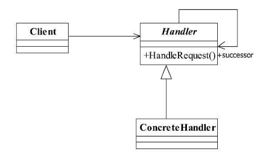

[TOC]


# 一、前言


# 二、基本概念
## 1.定义

使多个对象都有机会处理请求，从而避免了请求的发送者和接受者之间的耦合关系。将这些对象连成一条链，并沿着这条链传递该请求，直到有对象处理它为止。


>  Avoid coupling the sender of a request to its receiver by giving more than one object a chance to handle the request.Chain the receiving objects and pass the request along the chain until an object handles it.


> 责任链模式的重点是在“链”上，由一条链去处理相似的请求在链中决定谁来处理这个请求，并返回相应的结果.


> 责任链模式屏蔽了请求的处理过程，你发起一个请求到底是谁处理的，这个你不用关心，只要你把请求抛给责任链的第一个处理者，最终会返回一个处理结果（当然也可以不做任何处理），作为请求者可以不用知道到底是需要谁来处理的，这是责任链模式的核心，


## 2.适用场景


## 3.优劣

### 3.1 优点

- 将请求和处理分开。


### 3.2 缺点

- 性能问题

    每个请求都是从链头遍历到链尾，特别是在链比较长的时候，性能是一个非常大的问题。

- 不便于调试

    特别是链条比较长，环节比较多的时候，由于采用了类似递归的方式，调试的时候逻辑可能比较复杂。


## 4.登场角色




>  责任链模式的核心在“链”上，“链”是由多个处理者 ConcreteHandler 组成的


### 4.1 Handler（抽象处理者）

定义处理消息的接口，以及指定下一个节点。


### 4.2 ConcreteHandler（具体处理者）

完成具体的处理


## 5.通用源码

### 5.1 Handler

抽象的处理者实现三个职责：

- 一是定义一个请求的处理方法handleMessage，唯一对外开放的方法；
- 二是定义一个链的编排方法setNext，设置下一个处理者；
- 三是定义了具体的请求者必须实现的两个方法：定义自己能够处理的级别getHandlerLevel和具体的处理任务echo。


此处采用模板方法模式，同时请注意final关键字的作用。

```java
public abstract class Handler {
   private Handler nextHandler;
   
   //每个处理者都必须对请求做出处理
   public final Response handlerMessage(Request request){
      Response response = null;
      
      //判断是否是自己的处理级别
      if(this.getHandlerLevel().equals(request.getRequestLevel())){
         response = this.echo(request);
      }else{  //不属于自己的处理级别
         //判断是否有下一个处理者
         if(this.nextHandler != null){
            response = this.nextHandler.handlerMessage(request);
         }else{
            //没有适当的处理者，业务自行处理
         }
      }
      return response;
   }
   
   
   //设置下一个处理者是谁
   public void setNext(Handler _handler){
      this.nextHandler = _handler;
   }
   
   //每个处理者都有一个处理级别
   protected abstract Level getHandlerLevel();
   
   //每个处理者都必须实现处理任务
   protected abstract Response echo(Request request);
   
}
```


### 5.2 ConcreteHandler

在处理者中涉及三个类：

- Level类负责定义请求和处理级别
- Request类负责封装请求
- Response负责封装链中返回的结果

该三个类都需要根据业务产生，读者可以在实际应用中完成相关的业务填充，


- ConcreteHandler1


```java
public class ConcreteHandler1 extends Handler {
   //定义自己的处理逻辑
   protected Response echo(Request request) {
      //完成处理逻辑
      return null;
   }

   //设置自己的处理级别
   protected Level getHandlerLevel() {
      //设置自己的处理级别
      return null;
   }

}
```


- ConcreteHandler2

```java
public class ConcreteHandler2 extends Handler {
   //定义自己的处理逻辑
   protected Response echo(Request request) {
      //完成处理逻辑
      return null;
   }

   //设置自己的处理级别
   protected Level getHandlerLevel() {
      //设置自己的处理级别
      return null;
   }

}
```


- ConcreteHandler3

```java
public class ConcreteHandler3 extends Handler {
   //定义自己的处理逻辑
   protected Response echo(Request request) {
      //完成处理逻辑
      return null;
   }

   //设置自己的处理级别
   protected Level getHandlerLevel() {
      //设置自己的处理级别
      return null;
   }

}
```


- Level

```java
public class Level {
   //定义一个请求和处理等级
}
```


- Request

```java
public class Request {
   
   //请求的等级
   public Level getRequestLevel(){
      return null;
   }
}
```


- Response

```java
public class Response {
   //处理者返回的数据
}
```


### 5.3 Client

在实际应用中，一般会有一个封装类对责任模式进行封装，也就是替代Client类，直接返回链中的第一个处理者，具体链的设置不需要高层次模块关系，这样，更简化了高层次模块的调用，减少模块间的耦合，提高系统的灵活性。


```java
public class Client {

   public static void main(String[] args) {
      //声明出所有的处理节点
      Handler handler1 = new ConcreteHandler1();
      Handler handler2 = new ConcreteHandler2();
      Handler handler3 = new ConcreteHandler3();
      //设置链中的阶段顺序,1-->2-->3
      handler1.setNext(handler2);
      handler2.setNext(handler3);
      //提交请求，返回结果
      Response response = handler1.handlerMessage(new Request());
      System.out.println(response);
   }

}
```


## 6.最佳实践


# 三、代码实例


# 四、相关设计模式


# 五、源码分析


# 六、参考资料
1. [CyC2018/CS-Notes](https://github.com/CyC2018/CS-Notes/blob/master/notes/%E8%AE%BE%E8%AE%A1%E6%A8%A1%E5%BC%8F.md) 
2. [quanke/design-pattern-java-source-code](https://github.com/quanke/design-pattern-java-source-code)
3. [图说设计模式](https://design-patterns.readthedocs.io/zh_CN/latest/)
4. [图解设计模式-CSDN-wujunyucg](https://blog.csdn.net/wujunyucg/article/category/7301352/1)