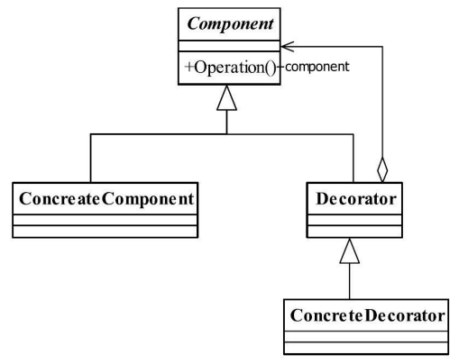

[TOC]


# 一、前言


# 二、基本概念
## 1.定义

动态地给一个对象添加一些额外的职责。就增加功能来说，装饰模式相比生成子类更为灵活。


> Attach additional responsibilities to an object dynamically keeping the same interface.Decorators provide a flexible alternative to subclassing for extending functionality.


## 2.适用场景

- **扩展性**

    需要扩展一个类的功能，或给一个类增加附加功能。


- **可拔插**

    需要动态地给一个对象增加功能，这些功能可以再动态地撤销。


- 需要为一批的兄弟类进行改装或加装功能，当然是首选装饰模式。


## 3.优劣

### 3.1 优点

- 装饰类和被装饰类解耦

装饰类和被装饰类可以独立发展，而不会相互耦合。换句话说，Component类无须知道Decorator类，Decorator类是从外部来扩展Component类的功能，而Decorator也不用知道具体的构件。


- 是继承关系的一个替代方案。


-  可以动态地扩展一个实现类的功能


### 3.2 缺点

- 多层的装饰是比较复杂的

    尽量减少装饰类的数量，以便降低系统的复杂度。


## 4.登场角色





### 4.1 Component（抽象组件）

Component 是一个接口或者是抽象类，就是定义我们最核心的对象，也就是最原始的对象。


### 4.2 ConcreteComponent（具体组件）

ConcreteComponent是最核心、最原始、最基本的接口或抽象类的实现，你要装饰的就是它。


### 4.3 Decorator（抽象装饰者）

> 组合组件

一般是一个抽象类，做什么用呢？实现接口或者抽象方法，它里面可不一定有抽象的方法呀，在它的属性里必然有一个private变量指向Component抽象构件。


### 4.4 ConcreteDecorator（具体装饰者）

完成具体装饰

## 5.通用源码

### 5.1 Component


```java
public abstract class Component {
   //抽象的方法
   public abstract void operate();
}
```


### 5.2 ConcreteComponent


```java
public class ConcreteComponent extends Component {

   //具体实现
   @Override
   public void operate() {
      System.out.println("do Something");
   }

}
```


### 5.3 Decorator


```java
public abstract class Decorator extends Component {
   private Component component = null;

   //通过构造函数传递被修饰者
   public Decorator(Component _component) {
      this.component = _component;
   }

   //委托给被修饰者执行
   @Override
   public void operate() {
      this.component.operate();
   }

}
```


### 5.4 ConcreteDecorator

原始方法和装饰方法的执行顺序在具体的装饰类是固定的，可以通过方法重载实现多种执行顺序。


- ConcreteDecorator1

```java
public class ConcreteDecorator1 extends Decorator {

   //定义被修饰者
   public ConcreteDecorator1(Component _component) {
      super(_component);
   }

   //定义自己的修饰方法
   private void method1() {
      System.out.println("method1 修饰");
   }

   //重写父类的Operation方法
   public void operate() {
      this.method1();
      super.operate();
   }
}
```


- ConcreteDecorator2

```java
public class ConcreteDecorator2 extends Decorator {

   //定义被修饰者
   public ConcreteDecorator2(Component _component) {
      super(_component);
   }

   //定义自己的修饰方法
   private void method2() {
      System.out.println("method2修饰");
   }

   //重写父类的Operation方法
   public void operate() {
      super.operate();
      this.method2();
   }
}
```


### 5.5 Client

```java
public class Client {
   
   public static void main(String[] args) {
      Component component = new ConcreteComponent();
      
      //第一次修饰
      component = new ConcreteDecorator1(component);
      
      //第二次修饰
      component = new ConcreteDecorator2(component);
      
      //修饰后运行
      component.operate();
      
   }

}
```


## 6.最佳实践

装饰模式是对继承的有力补充：继承是静态地给类增加功能，而装饰模式则是动态地增加功能，


# 四、相关设计模式


# 五、源码分析

# 六、参考资料
1. [CyC2018/CS-Notes](https://github.com/CyC2018/CS-Notes/blob/master/notes/%E8%AE%BE%E8%AE%A1%E6%A8%A1%E5%BC%8F.md) 
2. [quanke/design-pattern-java-source-code](https://github.com/quanke/design-pattern-java-source-code)
3. [图说设计模式](https://design-patterns.readthedocs.io/zh_CN/latest/)
4. [图解设计模式-CSDN-wujunyucg](https://blog.csdn.net/wujunyucg/article/category/7301352/1)